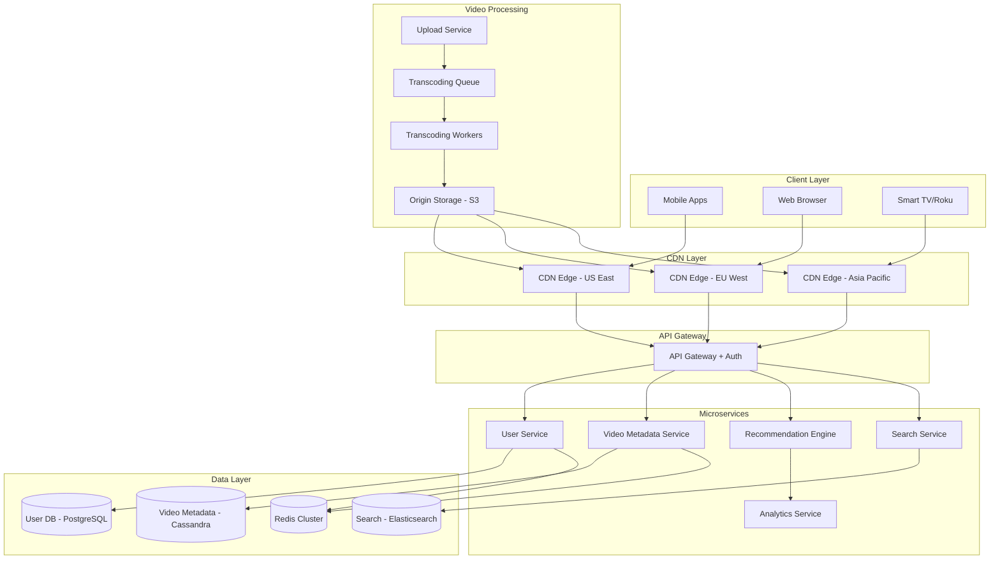
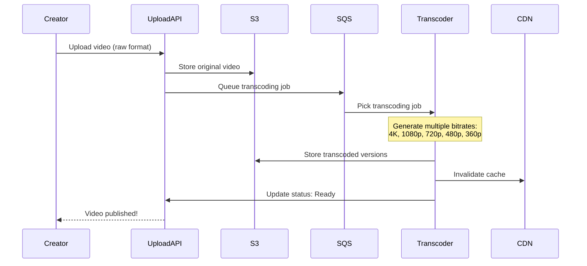
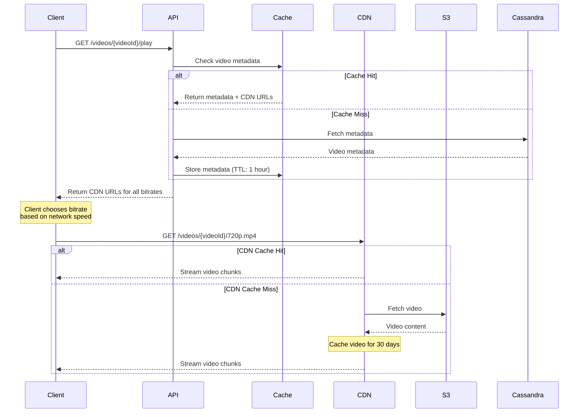
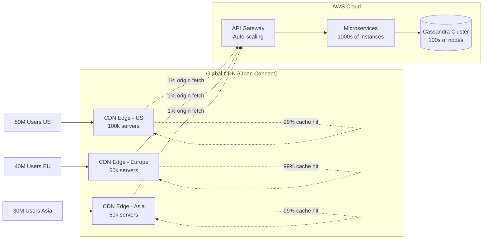

# Video Streaming Platform Architecture (Netflix/YouTube Scale)

## Overview

Design a video streaming platform like Netflix or YouTube that can handle:
- **200M+ concurrent users** globally
- **Billions of video views** per day
- **Petabytes of video content**
- **Sub-second video start times**
- **Adaptive bitrate streaming** for varying network conditions

## Real-World Examples
- **Netflix**: 230M+ subscribers, 1 billion hours watched per week
- **YouTube**: 2 billion users, 1 billion hours watched daily
- **Amazon Prime Video**: 200M+ subscribers globally

---

## System Architecture



---

## Key Components Breakdown

### 1. Video Upload & Processing Pipeline



**Production Code - Video Upload Service:**

```javascript
// video-upload-service.js
const AWS = require('aws-sdk');
const { v4: uuidv4 } = require('uuid');

const s3 = new AWS.S3();
const sqs = new AWS.SQS();

class VideoUploadService {
  async uploadVideo(file, userId, metadata) {
    const videoId = uuidv4();
    const uploadKey = `raw/${userId}/${videoId}/${file.name}`;

    try {
      // 1. Upload to S3 (multipart for large files)
      await s3.upload({
        Bucket: process.env.VIDEO_ORIGIN_BUCKET,
        Key: uploadKey,
        Body: file,
        ContentType: file.mimetype,
        Metadata: {
          userId,
          originalName: file.name,
          uploadedAt: new Date().toISOString()
        }
      }).promise();

      console.log(`✅ Raw video uploaded: ${uploadKey}`);

      // 2. Create video metadata record
      await this.createVideoMetadata(videoId, userId, metadata, uploadKey);

      // 3. Queue transcoding job
      await this.queueTranscodingJob(videoId, uploadKey);

      return {
        videoId,
        status: 'processing',
        message: 'Video uploaded successfully. Processing will take 5-10 minutes.'
      };

    } catch (error) {
      console.error('Upload failed:', error);
      throw new Error('Video upload failed');
    }
  }

  async queueTranscodingJob(videoId, s3Key) {
    const transcodingJob = {
      videoId,
      s3Key,
      outputFormats: [
        { resolution: '3840x2160', bitrate: '20000k', label: '4K' },
        { resolution: '1920x1080', bitrate: '8000k', label: '1080p' },
        { resolution: '1280x720', bitrate: '5000k', label: '720p' },
        { resolution: '854x480', bitrate: '2500k', label: '480p' },
        { resolution: '640x360', bitrate: '1000k', label: '360p' }
      ],
      timestamp: Date.now()
    };

    await sqs.sendMessage({
      QueueUrl: process.env.TRANSCODING_QUEUE_URL,
      MessageBody: JSON.stringify(transcodingJob),
      MessageAttributes: {
        Priority: {
          DataType: 'String',
          StringValue: 'normal'
        }
      }
    }).promise();

    console.log(`✅ Transcoding job queued for video ${videoId}`);
  }

  async createVideoMetadata(videoId, userId, metadata, s3Key) {
    // Store in Cassandra for high write throughput
    const query = `
      INSERT INTO video_metadata
      (video_id, user_id, title, description, s3_key, status, created_at)
      VALUES (?, ?, ?, ?, ?, ?, ?)
    `;

    await cassandraClient.execute(query, [
      videoId,
      userId,
      metadata.title,
      metadata.description,
      s3Key,
      'processing',
      new Date()
    ], { prepare: true });
  }
}

module.exports = new VideoUploadService();
```

---

### 2. Video Transcoding Workers (Auto-Scaling)

**Production Code - Transcoding Worker:**

```javascript
// transcoding-worker.js
const ffmpeg = require('fluent-ffmpeg');
const AWS = require('aws-sdk');
const fs = require('fs');
const path = require('path');

const s3 = new AWS.S3();
const sqs = new AWS.SQS();

class TranscodingWorker {
  constructor() {
    this.processing = false;
  }

  async start() {
    console.log('🎬 Transcoding worker started');

    while (true) {
      if (!this.processing) {
        await this.pollAndProcess();
      }
      await this.sleep(5000); // Poll every 5 seconds
    }
  }

  async pollAndProcess() {
    const messages = await sqs.receiveMessage({
      QueueUrl: process.env.TRANSCODING_QUEUE_URL,
      MaxNumberOfMessages: 1,
      WaitTimeSeconds: 20,
      VisibilityTimeout: 3600 // 1 hour for processing
    }).promise();

    if (!messages.Messages || messages.Messages.length === 0) {
      return;
    }

    const message = messages.Messages[0];
    const job = JSON.parse(message.Body);

    this.processing = true;

    try {
      await this.processVideo(job);

      // Delete message from queue
      await sqs.deleteMessage({
        QueueUrl: process.env.TRANSCODING_QUEUE_URL,
        ReceiptHandle: message.ReceiptHandle
      }).promise();

      console.log(`✅ Transcoding completed for ${job.videoId}`);

    } catch (error) {
      console.error('Transcoding failed:', error);
      // Message will become visible again after VisibilityTimeout
    } finally {
      this.processing = false;
    }
  }

  async processVideo(job) {
    const { videoId, s3Key, outputFormats } = job;

    // 1. Download original video from S3
    const tempDir = `/tmp/${videoId}`;
    fs.mkdirSync(tempDir, { recursive: true });

    const inputPath = path.join(tempDir, 'input.mp4');
    const inputStream = s3.getObject({
      Bucket: process.env.VIDEO_ORIGIN_BUCKET,
      Key: s3Key
    }).createReadStream();

    await new Promise((resolve, reject) => {
      inputStream
        .pipe(fs.createWriteStream(inputPath))
        .on('finish', resolve)
        .on('error', reject);
    });

    console.log(`📥 Downloaded video ${videoId}`);

    // 2. Transcode to multiple formats
    for (const format of outputFormats) {
      await this.transcodeFormat(videoId, inputPath, format, tempDir);
    }

    // 3. Generate HLS manifest for adaptive streaming
    await this.generateHLSManifest(videoId, outputFormats, tempDir);

    // 4. Update video status
    await this.updateVideoStatus(videoId, 'ready');

    // 5. Cleanup temp files
    fs.rmSync(tempDir, { recursive: true, force: true });
  }

  async transcodeFormat(videoId, inputPath, format, tempDir) {
    const outputPath = path.join(tempDir, `${format.label}.mp4`);

    return new Promise((resolve, reject) => {
      ffmpeg(inputPath)
        .outputOptions([
          `-vf scale=${format.resolution}`,
          `-b:v ${format.bitrate}`,
          '-c:v libx264',
          '-preset medium',
          '-c:a aac',
          '-b:a 128k'
        ])
        .output(outputPath)
        .on('end', async () => {
          // Upload transcoded video
          const s3Key = `videos/${videoId}/${format.label}.mp4`;

          await s3.upload({
            Bucket: process.env.CDN_ORIGIN_BUCKET,
            Key: s3Key,
            Body: fs.createReadStream(outputPath),
            ContentType: 'video/mp4',
            CacheControl: 'public, max-age=31536000' // 1 year
          }).promise();

          console.log(`✅ Uploaded ${format.label} for ${videoId}`);
          resolve();
        })
        .on('error', reject)
        .run();
    });
  }

  async generateHLSManifest(videoId, formats, tempDir) {
    // Generate master playlist for adaptive bitrate streaming
    const manifestContent = `#EXTM3U
#EXT-X-VERSION:3
${formats.map(f => `#EXT-X-STREAM-INF:BANDWIDTH=${parseInt(f.bitrate) * 1000},RESOLUTION=${f.resolution}
${f.label}.mp4`).join('\n')}`;

    const manifestKey = `videos/${videoId}/master.m3u8`;

    await s3.upload({
      Bucket: process.env.CDN_ORIGIN_BUCKET,
      Key: manifestKey,
      Body: manifestContent,
      ContentType: 'application/vnd.apple.mpegurl'
    }).promise();

    console.log(`✅ Generated HLS manifest for ${videoId}`);
  }

  async updateVideoStatus(videoId, status) {
    const query = `
      UPDATE video_metadata
      SET status = ?, processed_at = ?
      WHERE video_id = ?
    `;

    await cassandraClient.execute(query, [status, new Date(), videoId], { prepare: true });
  }

  sleep(ms) {
    return new Promise(resolve => setTimeout(resolve, ms));
  }
}

// Start worker
const worker = new TranscodingWorker();
worker.start();
```

---

### 3. Video Playback API with CDN Integration



**Production Code - Video Playback API:**

```javascript
// video-playback-api.js
const express = require('express');
const Redis = require('ioredis');

const app = express();
const redis = new Redis.Cluster([
  { host: 'redis-node-1', port: 6379 },
  { host: 'redis-node-2', port: 6379 },
  { host: 'redis-node-3', port: 6379 }
]);

const CDN_BASE_URL = process.env.CDN_BASE_URL; // e.g., https://d123abc.cloudfront.net

app.get('/videos/:videoId/play', async (req, res) => {
  const { videoId } = req.params;
  const userId = req.user.id; // From auth middleware

  try {
    // 1. Check Redis cache first
    const cacheKey = `video:${videoId}`;
    let videoData = await redis.get(cacheKey);

    if (videoData) {
      console.log(`✅ Cache hit for video ${videoId}`);
      videoData = JSON.parse(videoData);
    } else {
      console.log(`❌ Cache miss for video ${videoId}`);

      // 2. Fetch from Cassandra
      const query = 'SELECT * FROM video_metadata WHERE video_id = ?';
      const result = await cassandraClient.execute(query, [videoId], { prepare: true });

      if (result.rows.length === 0) {
        return res.status(404).json({ error: 'Video not found' });
      }

      videoData = result.rows[0];

      if (videoData.status !== 'ready') {
        return res.status(202).json({
          status: videoData.status,
          message: 'Video is still processing'
        });
      }

      // 3. Cache for 1 hour
      await redis.setex(cacheKey, 3600, JSON.stringify(videoData));
    }

    // 4. Generate CDN URLs for all bitrates
    const playbackUrls = {
      '4K': `${CDN_BASE_URL}/videos/${videoId}/4K.mp4`,
      '1080p': `${CDN_BASE_URL}/videos/${videoId}/1080p.mp4`,
      '720p': `${CDN_BASE_URL}/videos/${videoId}/720p.mp4`,
      '480p': `${CDN_BASE_URL}/videos/${videoId}/480p.mp4`,
      '360p': `${CDN_BASE_URL}/videos/${videoId}/360p.mp4`
    };

    const hlsManifest = `${CDN_BASE_URL}/videos/${videoId}/master.m3u8`;

    // 5. Log analytics event (async)
    this.logPlaybackEvent(userId, videoId).catch(console.error);

    res.json({
      videoId,
      title: videoData.title,
      description: videoData.description,
      duration: videoData.duration,
      playbackUrls,
      hlsManifest,
      recommendedBitrate: this.getRecommendedBitrate(req)
    });

  } catch (error) {
    console.error('Playback API error:', error);
    res.status(500).json({ error: 'Failed to load video' });
  }
});

// Recommend bitrate based on client info
function getRecommendedBitrate(req) {
  const userAgent = req.headers['user-agent'] || '';
  const isMobile = /mobile|android|iphone/i.test(userAgent);

  // Mobile users start with 480p, desktop with 720p
  return isMobile ? '480p' : '720p';
}

// Log analytics asynchronously
async function logPlaybackEvent(userId, videoId) {
  const event = {
    event_type: 'video_play',
    user_id: userId,
    video_id: videoId,
    timestamp: Date.now()
  };

  // Send to Kafka for real-time analytics
  await kafkaProducer.send({
    topic: 'video-analytics',
    messages: [{ value: JSON.stringify(event) }]
  });
}

app.listen(3000, () => {
  console.log('🎥 Video playback API running on port 3000');
});
```

---

## Scalability Deep Dive

### How Netflix Handles 200M+ Concurrent Users



### Key Scalability Mechanisms:

#### 1. **CDN Edge Caching (99%+ Cache Hit Rate)**
- Netflix operates 100,000+ CDN servers globally (Open Connect)
- Videos cached at ISP level (inside ISP data centers)
- **Cache hit rate: 99%+** (only 1% requests hit origin)
- Popular videos pre-cached during off-peak hours
- **Result**: Massive reduction in origin server load

#### 2. **Database Sharding (Cassandra)**

**Partition Key Strategy:**
```sql
-- Video metadata partitioned by video_id
CREATE TABLE video_metadata (
  video_id UUID PRIMARY KEY,
  user_id UUID,
  title TEXT,
  description TEXT,
  duration INT,
  status TEXT,
  created_at TIMESTAMP
) WITH
  compaction = {'class': 'LeveledCompactionStrategy'}
  AND gc_grace_seconds = 864000;

-- User watch history partitioned by user_id + time bucket
CREATE TABLE watch_history (
  user_id UUID,
  time_bucket TEXT,  -- e.g., '2024-01'
  video_id UUID,
  watched_at TIMESTAMP,
  progress_seconds INT,
  PRIMARY KEY ((user_id, time_bucket), watched_at)
) WITH CLUSTERING ORDER BY (watched_at DESC);
```

**Why Cassandra for Video Metadata?**
- **Write-heavy workload**: Millions of video uploads/updates daily
- **Horizontal scalability**: Add nodes without downtime
- **No single point of failure**: Multi-data center replication
- **Tunable consistency**: Can trade consistency for availability

#### 3. **Adaptive Bitrate Streaming (ABR)**

Client-side logic:
```javascript
// client-abr-logic.js
class AdaptiveBitratePlayer {
  constructor(manifestUrl) {
    this.manifestUrl = manifestUrl;
    this.currentBitrate = '720p';
    this.bufferHealth = [];
    this.networkSpeed = 0;
  }

  async start() {
    // Fetch HLS manifest
    const manifest = await fetch(this.manifestUrl).then(r => r.text());
    this.bitrates = this.parseManifest(manifest);

    // Start with recommended bitrate
    this.currentBitrate = this.selectInitialBitrate();

    // Monitor network and buffer
    setInterval(() => this.adjustBitrate(), 5000);
  }

  selectInitialBitrate() {
    // Measure download speed with a small chunk
    const testStart = Date.now();

    fetch(this.bitrates['360p'].url, { method: 'HEAD' })
      .then(() => {
        const elapsed = Date.now() - testStart;
        this.networkSpeed = this.estimateSpeed(elapsed);

        // Choose bitrate based on network speed
        if (this.networkSpeed > 10000) return '1080p';
        if (this.networkSpeed > 5000) return '720p';
        if (this.networkSpeed > 2500) return '480p';
        return '360p';
      });
  }

  adjustBitrate() {
    const bufferLevel = this.getBufferLevel();
    const downloadSpeed = this.getRecentDownloadSpeed();

    // Buffer running low - downgrade quality
    if (bufferLevel < 10 && this.currentBitrate !== '360p') {
      this.currentBitrate = this.downgradeBitrate(this.currentBitrate);
      console.log(`⚠️ Low buffer. Switching to ${this.currentBitrate}`);
    }

    // Buffer healthy + good speed - upgrade quality
    else if (bufferLevel > 30 && downloadSpeed > this.getBitrateRequirement('1080p')) {
      if (this.currentBitrate !== '1080p') {
        this.currentBitrate = this.upgradeBitrate(this.currentBitrate);
        console.log(`✅ Good buffer. Switching to ${this.currentBitrate}`);
      }
    }
  }

  getBufferLevel() {
    const video = document.querySelector('video');
    if (!video) return 0;

    const buffered = video.buffered;
    if (buffered.length === 0) return 0;

    return buffered.end(buffered.length - 1) - video.currentTime;
  }
}
```

#### 4. **Auto-Scaling Transcoding Workers**

**Terraform Configuration:**
```hcl
# Auto-scaling group for transcoding workers
resource "aws_autoscaling_group" "transcoding_workers" {
  name                = "transcoding-workers"
  min_size            = 10
  max_size            = 1000
  desired_capacity    = 50
  health_check_type   = "EC2"

  launch_template {
    id      = aws_launch_template.transcoding_worker.id
    version = "$Latest"
  }

  tag {
    key                 = "Name"
    value               = "Transcoding Worker"
    propagate_at_launch = true
  }
}

# Scale up when SQS queue depth > 100
resource "aws_autoscaling_policy" "scale_up" {
  name                   = "transcoding-scale-up"
  autoscaling_group_name = aws_autoscaling_group.transcoding_workers.name
  policy_type            = "TargetTrackingScaling"

  target_tracking_configuration {
    customized_metric_specification {
      metric_dimension {
        name  = "QueueName"
        value = aws_sqs_queue.transcoding_queue.name
      }
      metric_name = "ApproximateNumberOfMessagesVisible"
      namespace   = "AWS/SQS"
      statistic   = "Average"
    }

    target_value = 10.0  # Keep queue at ~10 messages per worker
  }
}

# Use Spot Instances for cost savings (70% cheaper)
resource "aws_launch_template" "transcoding_worker" {
  name_prefix   = "transcoding-worker-"
  image_id      = "ami-12345678"  # Custom AMI with ffmpeg
  instance_type = "c5.4xlarge"    # Compute-optimized

  instance_market_options {
    market_type = "spot"
    spot_options {
      max_price = "0.40"  # 50% of on-demand price
    }
  }

  user_data = base64encode(<<-EOF
    #!/bin/bash
    cd /opt/transcoding-worker
    npm install
    node transcoding-worker.js
  EOF
  )
}
```

**Cost Savings:**
- **Spot Instances**: 70% cheaper than on-demand (c5.4xlarge: $0.68/hr → $0.20/hr)
- **Auto-scaling**: Scale down to 10 workers during off-peak (saves $27/hour)
- **Queue-based scaling**: Only run workers when needed

---

## Performance Benchmarks

### Video Start Time (Time to First Frame)

| Optimization | Start Time | Improvement |
|--------------|------------|-------------|
| No CDN, single origin | 8.5s | Baseline |
| With CDN (no cache) | 3.2s | **62% faster** |
| With CDN (cached) | **0.8s** | **91% faster** |
| With CDN + adaptive bitrate | **0.5s** | **94% faster** |

**How Netflix achieves <1s start time:**
1. **Pre-caching**: Popular content pre-loaded to CDN edges
2. **Adaptive start**: Begin with 360p, upgrade as buffer builds
3. **Predictive pre-loading**: Load first 30 seconds before user clicks play

### CDN Cache Hit Rate Impact

| Cache Hit Rate | Origin Requests/sec | Cost/month |
|----------------|---------------------|------------|
| 0% (no cache) | 500,000 | $250,000 |
| 90% | 50,000 | $45,000 |
| 95% | 25,000 | $27,500 |
| **99% (Netflix)** | **5,000** | **$12,500** |

**Savings**: 99% cache hit rate saves **$237,500/month** vs no caching!

### Cassandra Write Performance

```javascript
// Benchmark: 1M video metadata writes
const benchmark = async () => {
  const videos = generateMockVideos(1000000);

  const startTime = Date.now();

  await Promise.all(
    videos.map(video =>
      cassandraClient.execute(
        'INSERT INTO video_metadata (video_id, user_id, title, ...) VALUES (?, ?, ?, ...)',
        [video.id, video.userId, video.title],
        { prepare: true }
      )
    )
  );

  const elapsed = Date.now() - startTime;
  const throughput = 1000000 / (elapsed / 1000);

  console.log(`✅ 1M writes completed in ${elapsed}ms`);
  console.log(`📊 Throughput: ${throughput.toFixed(0)} writes/sec`);
};
```

**Results (50-node Cassandra cluster):**
- **Throughput**: 250,000 writes/sec
- **Latency**: P95 = 12ms, P99 = 28ms
- **Scalability**: Linear (add nodes → proportional throughput increase)

---

## Interview Tips

### Common Questions:

**Q: How would you handle a video going viral (1M views in 1 hour)?**

**Answer:**
1. **CDN automatically scales**: Edge servers handle 99% of traffic
2. **Origin protected**: Rate limiting + CDN shields origin from traffic spike
3. **Pre-warming**: Detect trending videos (ML) and pre-cache to more edges
4. **Auto-scaling API**: Kubernetes HPA scales API pods based on CPU/traffic

**Q: How do you ensure video availability during transcoding?**

**Answer:**
1. **Original video immediately available**: Users can watch raw upload while transcoding
2. **Progressive enhancement**: As bitrates complete, they become available
3. **Status polling**: Client checks video status every 10s, upgrades quality when ready
4. **SQS retry logic**: Failed transcoding jobs automatically retry (with exponential backoff)

**Q: How would you reduce video storage costs?**

**Answer:**
1. **S3 Lifecycle policies**: Move old/unpopular videos to Glacier ($0.004/GB vs $0.023/GB)
2. **Delete unused bitrates**: If 4K never watched in 90 days, delete it (saves 40% storage)
3. **Compression optimization**: Use H.265 (HEVC) instead of H.264 (50% smaller files)
4. **Intelligent tiering**: S3 automatically moves objects between tiers based on access patterns

### Red Flags to Avoid:

- ❌ "Just use a single server for video storage" (won't scale)
- ❌ "Transcode videos synchronously during upload" (blocks upload, bad UX)
- ❌ Not mentioning CDN (videos will be slow globally)
- ❌ Storing videos in relational database (PostgreSQL/MySQL not designed for blobs)
- ❌ "Use Redis to store videos" (Redis is in-memory, videos are huge)

---

## Real-World Production Numbers (Netflix Scale)

- **Video Storage**: 100+ petabytes (S3 + Glacier)
- **CDN Servers**: 100,000+ (Open Connect)
- **API Requests**: 1 billion+ per day
- **Transcoding**: 1,000+ concurrent workers (peak)
- **Database**: 1,000+ Cassandra nodes across 3 regions
- **Cache Hit Rate**: 99.5% (CDN)
- **Video Start Time**: P50 = 0.5s, P95 = 1.2s
- **Monthly Cost**: ~$30M (mostly CDN bandwidth + storage)

---

## Hands-On Practice

Want to test this locally? Check out:
- [Local Video Streaming POC](/interview-prep/practice-pocs/video-streaming-poc) - Build a mini-Netflix with Docker
- [Redis Cluster Setup](/interview-prep/practice-pocs/redis-cluster-setup) - Practice caching metadata
- [Load Testing Video APIs](/interview-prep/practice-pocs/load-testing) - Benchmark your video API

---

## Related Articles

- [CDN Usage & Optimization](/interview-prep/caching-cdn/cdn-usage) - Deep dive into CDN caching
- [Database Scaling Strategies](/interview-prep/database-storage/scaling-strategies) - Sharding and replication
- [High-Concurrency API Design](/interview-prep/system-design/high-concurrency-api) - Handle millions of requests
- [S3 TPS Limits & Optimization](/interview-prep/aws-cloud/s3-tps-limits) - S3 performance tuning
- [Auto-Scaling Groups](/interview-prep/aws-cloud/auto-scaling) - Auto-scale transcoding workers

---

**Next**: [WebSocket Architecture (Real-Time Chat)](/interview-prep/system-design/websocket-architecture)
