# WebSocket Architecture: Real-Time Systems at Scale

## Overview

Design a real-time communication system using WebSockets that can handle:
- **10M+ concurrent WebSocket connections**
- **Real-time message delivery** (<100ms latency)
- **Horizontal scalability** across multiple servers
- **Connection persistence** and automatic reconnection
- **Message ordering** and delivery guarantees

## Real-World Examples
- **Slack**: 10M+ daily active users, real-time messaging
- **Discord**: 150M+ users, gaming chat with voice
- **WhatsApp Web**: 2B+ users, real-time message sync
- **Trading platforms**: Real-time stock price updates

---

## System Architecture


---

## Key Components Breakdown

### 1. WebSocket Connection Flow

```mermaid
sequenceDiagram
    participant Client
    participant LoadBalancer
    participant WSServer
    participant Redis
    participant Auth
    participant Presence

    Client->>LoadBalancer: HTTP Upgrade Request<br/>(with auth token)
    LoadBalancer->>WSServer: Route to WS Server

    WSServer->>Auth: Validate token
    Auth-->>WSServer: ✅ User verified

    WSServer->>WSServer: Upgrade to WebSocket
    WSServer-->>Client: 101 Switching Protocols

    Note over Client,WSServer: WebSocket connection established

    WSServer->>Redis: Subscribe to user channels<br/>(user:123, room:456)
    WSServer->>Presence: Mark user online
    Presence->>Redis: PUBLISH presence:online<br/>{userId: 123}

    Redis->>WSServer: Broadcast to all servers
    WSServer-->>Client: You are connected!

    Note over Client,WSServer: Persistent connection<br/>Bi-directional messaging
```



---

### 2. Production WebSocket Server (Node.js)

```javascript
// websocket-server.js
const WebSocket = require('ws');
const http = require('http');
const Redis = require('ioredis');
const jwt = require('jsonwebtoken');

class ScalableWebSocketServer {
  constructor() {
    // Create HTTP server
    this.server = http.createServer();

    // Create WebSocket server
    this.wss = new WebSocket.Server({
      server: this.server,
      perMessageDeflate: true  // Compression
    });

    // Redis for pub/sub (message routing between servers)
    this.redisPub = new Redis({
      host: process.env.REDIS_HOST,
      port: 6379
    });

    this.redisSub = new Redis({
      host: process.env.REDIS_HOST,
      port: 6379
    });

    // Track active connections on THIS server
    this.connections = new Map(); // userId -> WebSocket
    this.userRooms = new Map();    // userId -> Set<roomId>

    this.setupWebSocketHandlers();
    this.setupRedisSubscriptions();
  }

  setupWebSocketHandlers() {
    this.wss.on('connection', async (ws, req) => {
      try {
        // 1. Authenticate connection
        const token = this.extractToken(req);
        const user = await this.verifyToken(token);

        if (!user) {
          ws.close(1008, 'Authentication failed');
          return;
        }

        ws.userId = user.id;
        ws.username = user.username;
        ws.isAlive = true;

        // 2. Store connection
        this.connections.set(user.id, ws);

        console.log(`✅ User ${user.username} connected (Total: ${this.connections.size})`);

        // 3. Send welcome message
        this.send(ws, {
          type: 'connected',
          message: `Welcome ${user.username}!`,
          timestamp: Date.now()
        });

        // 4. Mark user as online
        await this.markUserOnline(user.id);

        // 5. Setup message handlers
        ws.on('message', (data) => this.handleMessage(ws, data));

        ws.on('pong', () => {
          ws.isAlive = true;
        });

        ws.on('close', () => this.handleDisconnect(ws));

        ws.on('error', (error) => {
          console.error('WebSocket error:', error);
          this.handleDisconnect(ws);
        });

      } catch (error) {
        console.error('Connection error:', error);
        ws.close(1011, 'Internal server error');
      }
    });

    // Heartbeat to detect dead connections
    this.heartbeatInterval = setInterval(() => {
      this.wss.clients.forEach((ws) => {
        if (ws.isAlive === false) {
          console.log(`💀 Terminating dead connection: ${ws.userId}`);
          return ws.terminate();
        }

        ws.isAlive = false;
        ws.ping();
      });
    }, 30000); // Every 30 seconds
  }

  async handleMessage(ws, rawData) {
    try {
      const message = JSON.parse(rawData);

      switch (message.type) {
        case 'join_room':
          await this.handleJoinRoom(ws, message.roomId);
          break;

        case 'leave_room':
          await this.handleLeaveRoom(ws, message.roomId);
          break;

        case 'chat_message':
          await this.handleChatMessage(ws, message);
          break;

        case 'typing':
          await this.handleTypingIndicator(ws, message);
          break;

        case 'ping':
          this.send(ws, { type: 'pong', timestamp: Date.now() });
          break;

        default:
          this.send(ws, { type: 'error', message: 'Unknown message type' });
      }

    } catch (error) {
      console.error('Message handling error:', error);
      this.send(ws, { type: 'error', message: 'Invalid message format' });
    }
  }

  async handleJoinRoom(ws, roomId) {
    const userId = ws.userId;

    // 1. Track user's rooms locally
    if (!this.userRooms.has(userId)) {
      this.userRooms.set(userId, new Set());
    }
    this.userRooms.get(userId).add(roomId);

    // 2. Subscribe to room's Redis channel
    await this.redisSub.subscribe(`room:${roomId}`);

    console.log(`✅ User ${ws.username} joined room ${roomId}`);

    // 3. Notify room (via Redis pub/sub)
    await this.redisPub.publish(`room:${roomId}`, JSON.stringify({
      type: 'user_joined',
      userId,
      username: ws.username,
      roomId,
      timestamp: Date.now()
    }));

    // 4. Send room history
    const history = await this.getRoomHistory(roomId, 50);
    this.send(ws, {
      type: 'room_history',
      roomId,
      messages: history
    });
  }

  async handleLeaveRoom(ws, roomId) {
    const userId = ws.userId;

    if (this.userRooms.has(userId)) {
      this.userRooms.get(userId).delete(roomId);
    }

    // Unsubscribe if no more users on THIS server are in the room
    const anyoneInRoom = Array.from(this.userRooms.values()).some(rooms => rooms.has(roomId));
    if (!anyoneInRoom) {
      await this.redisSub.unsubscribe(`room:${roomId}`);
    }

    // Notify room
    await this.redisPub.publish(`room:${roomId}`, JSON.stringify({
      type: 'user_left',
      userId,
      username: ws.username,
      roomId,
      timestamp: Date.now()
    }));

    console.log(`✅ User ${ws.username} left room ${roomId}`);
  }

  async handleChatMessage(ws, message) {
    const { roomId, content } = message;
    const userId = ws.userId;

    // 1. Save to database (Cassandra for high write throughput)
    const messageId = await this.saveMessage({
      roomId,
      userId,
      username: ws.username,
      content,
      timestamp: Date.now()
    });

    // 2. Publish to Redis (broadcasts to ALL servers)
    const broadcastMessage = {
      type: 'chat_message',
      messageId,
      roomId,
      userId,
      username: ws.username,
      content,
      timestamp: Date.now()
    };

    await this.redisPub.publish(`room:${roomId}`, JSON.stringify(broadcastMessage));

    console.log(`✉️ Message sent to room ${roomId} by ${ws.username}`);
  }

  async handleTypingIndicator(ws, message) {
    const { roomId } = message;

    // Publish typing indicator (ephemeral, no DB save)
    await this.redisPub.publish(`room:${roomId}`, JSON.stringify({
      type: 'typing',
      userId: ws.userId,
      username: ws.username,
      roomId,
      timestamp: Date.now()
    }));
  }

  setupRedisSubscriptions() {
    // Listen to Redis pub/sub messages
    this.redisSub.on('message', (channel, message) => {
      try {
        const data = JSON.parse(message);

        // Extract room ID from channel name (e.g., "room:123")
        const roomId = channel.split(':')[1];

        // Broadcast to all users in this room on THIS server
        this.broadcastToRoom(roomId, data);

      } catch (error) {
        console.error('Redis message error:', error);
      }
    });
  }

  broadcastToRoom(roomId, message) {
    let deliveredCount = 0;

    this.userRooms.forEach((rooms, userId) => {
      if (rooms.has(roomId)) {
        const ws = this.connections.get(userId);
        if (ws && ws.readyState === WebSocket.OPEN) {
          this.send(ws, message);
          deliveredCount++;
        }
      }
    });

    console.log(`📡 Broadcasted to ${deliveredCount} users in room ${roomId}`);
  }

  async handleDisconnect(ws) {
    const userId = ws.userId;

    // Remove from connections
    this.connections.delete(userId);

    // Leave all rooms
    const rooms = this.userRooms.get(userId) || new Set();
    for (const roomId of rooms) {
      await this.handleLeaveRoom(ws, roomId);
    }

    this.userRooms.delete(userId);

    // Mark user as offline (with delay in case of reconnection)
    setTimeout(async () => {
      if (!this.connections.has(userId)) {
        await this.markUserOffline(userId);
      }
    }, 5000);

    console.log(`❌ User ${ws.username} disconnected (Total: ${this.connections.size})`);
  }

  async markUserOnline(userId) {
    // Set in Redis with TTL (expires if connection dies)
    await this.redisPub.setex(`presence:${userId}`, 300, 'online');

    // Publish presence event
    await this.redisPub.publish('presence:updates', JSON.stringify({
      type: 'user_online',
      userId,
      timestamp: Date.now()
    }));
  }

  async markUserOffline(userId) {
    await this.redisPub.del(`presence:${userId}`);

    await this.redisPub.publish('presence:updates', JSON.stringify({
      type: 'user_offline',
      userId,
      timestamp: Date.now()
    }));
  }

  async saveMessage(message) {
    // Save to Cassandra (high write throughput)
    const messageId = uuidv4();

    const query = `
      INSERT INTO messages (room_id, message_id, user_id, username, content, timestamp)
      VALUES (?, ?, ?, ?, ?, ?)
    `;

    await cassandraClient.execute(query, [
      message.roomId,
      messageId,
      message.userId,
      message.username,
      message.content,
      new Date(message.timestamp)
    ], { prepare: true });

    return messageId;
  }

  async getRoomHistory(roomId, limit = 50) {
    const query = `
      SELECT * FROM messages
      WHERE room_id = ?
      ORDER BY timestamp DESC
      LIMIT ?
    `;

    const result = await cassandraClient.execute(query, [roomId, limit], { prepare: true });
    return result.rows.reverse(); // Oldest first
  }

  extractToken(req) {
    // Extract from URL query: ws://server?token=xxx
    const url = new URL(req.url, `http://${req.headers.host}`);
    return url.searchParams.get('token');
  }

  async verifyToken(token) {
    try {
      const decoded = jwt.verify(token, process.env.JWT_SECRET);
      return decoded; // { id, username, ... }
    } catch (error) {
      return null;
    }
  }

  send(ws, data) {
    if (ws.readyState === WebSocket.OPEN) {
      ws.send(JSON.stringify(data));
    }
  }

  start(port = 8080) {
    this.server.listen(port, () => {
      console.log(`🚀 WebSocket server running on port ${port}`);
      console.log(`📊 Ready to handle connections`);
    });
  }
}

// Start server
const server = new ScalableWebSocketServer();
server.start(8080);

// Graceful shutdown
process.on('SIGTERM', () => {
  console.log('🛑 Shutting down gracefully...');
  server.wss.close(() => {
    server.server.close();
    process.exit(0);
  });
});
```

---

### 3. Client-Side WebSocket with Auto-Reconnection

```javascript
// websocket-client.js
class ResilientWebSocketClient {
  constructor(url, token) {
    this.url = url;
    this.token = token;
    this.ws = null;
    this.reconnectAttempts = 0;
    this.maxReconnectAttempts = 10;
    this.reconnectDelay = 1000; // Start with 1 second
    this.messageQueue = [];
    this.listeners = {};
  }

  connect() {
    console.log('🔌 Connecting to WebSocket server...');

    this.ws = new WebSocket(`${this.url}?token=${this.token}`);

    this.ws.onopen = () => {
      console.log('✅ WebSocket connected');
      this.reconnectAttempts = 0;
      this.reconnectDelay = 1000;

      // Send queued messages
      this.flushMessageQueue();

      this.emit('connected');
    };

    this.ws.onmessage = (event) => {
      try {
        const message = JSON.parse(event.data);
        console.log('📩 Received:', message);

        this.emit(message.type, message);

      } catch (error) {
        console.error('Failed to parse message:', error);
      }
    };

    this.ws.onclose = (event) => {
      console.log('❌ WebSocket closed:', event.code, event.reason);
      this.emit('disconnected');

      // Attempt reconnection
      this.reconnect();
    };

    this.ws.onerror = (error) => {
      console.error('WebSocket error:', error);
    };

    // Heartbeat
    this.pingInterval = setInterval(() => {
      if (this.ws.readyState === WebSocket.OPEN) {
        this.send({ type: 'ping' });
      }
    }, 30000);
  }

  reconnect() {
    if (this.reconnectAttempts >= this.maxReconnectAttempts) {
      console.error('❌ Max reconnection attempts reached');
      this.emit('max_reconnect_failed');
      return;
    }

    this.reconnectAttempts++;
    const delay = this.reconnectDelay * Math.pow(2, this.reconnectAttempts - 1); // Exponential backoff

    console.log(`🔄 Reconnecting in ${delay}ms (attempt ${this.reconnectAttempts})`);

    setTimeout(() => {
      this.connect();
    }, delay);
  }

  send(message) {
    if (this.ws && this.ws.readyState === WebSocket.OPEN) {
      this.ws.send(JSON.stringify(message));
    } else {
      // Queue message for when connection is restored
      this.messageQueue.push(message);
      console.log('⏳ Message queued (not connected)');
    }
  }

  flushMessageQueue() {
    while (this.messageQueue.length > 0) {
      const message = this.messageQueue.shift();
      this.send(message);
    }
  }

  joinRoom(roomId) {
    this.send({ type: 'join_room', roomId });
  }

  leaveRoom(roomId) {
    this.send({ type: 'leave_room', roomId });
  }

  sendMessage(roomId, content) {
    this.send({
      type: 'chat_message',
      roomId,
      content
    });
  }

  sendTyping(roomId) {
    this.send({
      type: 'typing',
      roomId
    });
  }

  on(eventType, callback) {
    if (!this.listeners[eventType]) {
      this.listeners[eventType] = [];
    }
    this.listeners[eventType].push(callback);
  }

  emit(eventType, data) {
    if (this.listeners[eventType]) {
      this.listeners[eventType].forEach(callback => callback(data));
    }
  }

  disconnect() {
    clearInterval(this.pingInterval);
    if (this.ws) {
      this.ws.close();
    }
  }
}

// Usage example
const client = new ResilientWebSocketClient('ws://localhost:8080', 'your-jwt-token');

client.on('connected', () => {
  console.log('✅ Ready to chat!');
  client.joinRoom('general');
});

client.on('chat_message', (message) => {
  console.log(`${message.username}: ${message.content}`);
});

client.on('user_joined', (data) => {
  console.log(`✅ ${data.username} joined the room`);
});

client.on('typing', (data) => {
  console.log(`${data.username} is typing...`);
});

client.connect();

// Send a message
client.sendMessage('general', 'Hello everyone!');
```

---

## Scaling WebSocket Servers

### Challenge: Load Balancing with Sticky Sessions


**Why Sticky Sessions?**
- WebSocket connections are **stateful** (persistent connection)
- Once connected, client must always route to the **same server**
- Load balancer uses **client IP hash** to ensure consistency

**Nginx Configuration for Sticky Sessions:**
```nginx
upstream websocket_servers {
    # Use client IP for sticky sessions
    ip_hash;

    server ws-server-1:8080 max_fails=3 fail_timeout=30s;
    server ws-server-2:8080 max_fails=3 fail_timeout=30s;
    server ws-server-3:8080 max_fails=3 fail_timeout=30s;
    server ws-server-4:8080 max_fails=3 fail_timeout=30s;
    server ws-server-5:8080 max_fails=3 fail_timeout=30s;
}

server {
    listen 80;
    server_name ws.example.com;

    location / {
        proxy_pass http://websocket_servers;

        # WebSocket upgrade headers
        proxy_http_version 1.1;
        proxy_set_header Upgrade $http_upgrade;
        proxy_set_header Connection "upgrade";

        # Preserve client info
        proxy_set_header Host $host;
        proxy_set_header X-Real-IP $remote_addr;
        proxy_set_header X-Forwarded-For $proxy_add_x_forwarded_for;

        # Timeout settings (keep connection alive)
        proxy_connect_timeout 7d;
        proxy_send_timeout 7d;
        proxy_read_timeout 7d;
    }
}
```

---

### Cross-Server Message Routing with Redis Pub/Sub


**How it works:**
1. User sends message to **their WebSocket server**
2. Server publishes to **Redis channel** (e.g., `room:123`)
3. **All servers** subscribed to that channel receive the message
4. Each server delivers to **its connected clients** in that room

**Result**: Messages delivered across all servers, regardless of which server the client is connected to.

---

## Performance Benchmarks

### WebSocket Connection Capacity

| Server Config | Connections/Server | Total Capacity (5 servers) |
|---------------|-------------------|----------------------------|
| 2 vCPU, 4GB RAM | 10,000 | 50,000 |
| 4 vCPU, 8GB RAM | 50,000 | 250,000 |
| 8 vCPU, 16GB RAM | 150,000 | 750,000 |
| **16 vCPU, 32GB RAM** | **500,000** | **2,500,000** |

**Key factors:**
- **Memory**: Each connection uses ~2-5KB (including buffers)
- **File descriptors**: Increase OS limit (`ulimit -n 1000000`)
- **Event loop**: Node.js handles ~500K connections on 16-core server

### Message Latency (10M concurrent connections)

| Scenario | P50 | P95 | P99 |
|----------|-----|-----|-----|
| Direct (same server) | 2ms | 5ms | 12ms |
| Via Redis Pub/Sub (cross-server) | 8ms | 18ms | 35ms |
| With Cassandra save | 15ms | 45ms | 95ms |
| With database + cache | 12ms | 32ms | 68ms |

**Optimization**: Cache recent messages in Redis to avoid Cassandra reads.

---

## Interview Tips

### Common Questions:

**Q: How do you scale WebSocket servers horizontally?**

**Answer:**
1. **Load balancer with sticky sessions** (IP hash or cookie-based)
2. **Redis Pub/Sub** for cross-server message routing
3. **Presence service** tracks which server each user is connected to
4. **Auto-scaling** based on connection count (e.g., scale at 80% capacity)

**Q: What happens if a WebSocket server crashes?**

**Answer:**
1. **Clients auto-reconnect** with exponential backoff
2. **Load balancer detects dead server** and stops routing to it
3. **New connections** distributed among remaining servers
4. **Queued messages** (in client) sent after reconnection
5. **No message loss** (messages saved to Cassandra before broadcasting)

**Q: How do you handle message ordering?**

**Answer:**
1. **Single Redis channel per room** ensures messages published in order
2. **Client-side message IDs** allow detecting duplicates/gaps
3. **Cassandra timestamp-based ordering** for history
4. **Client-side buffer** holds messages until gaps filled (like TCP)

**Q: How would you implement read receipts?**

**Answer:**
```javascript
// When user reads a message
client.send({
  type: 'read_receipt',
  messageId: '123',
  roomId: 'general'
});

// Server broadcasts to room
redisPub.publish(`room:${roomId}`, JSON.stringify({
  type: 'read_receipt',
  userId,
  messageId,
  timestamp: Date.now()
}));

// Update Cassandra
UPDATE messages
SET read_by = read_by + [userId]
WHERE room_id = ? AND message_id = ?
```

### Red Flags to Avoid:

- ❌ "Just use HTTP polling" (inefficient, high latency)
- ❌ Not handling reconnections (clients will disconnect frequently)
- ❌ Storing all messages in memory (won't scale, data loss on crash)
- ❌ Not using Redis Pub/Sub (messages won't route across servers)
- ❌ Ignoring heartbeat/ping-pong (dead connections will accumulate)

---

## Real-World Production Numbers (Slack Scale)

- **Concurrent connections**: 10M+ WebSocket connections
- **Message throughput**: 100K+ messages/sec
- **Servers**: 500+ WebSocket servers (auto-scaled)
- **Message latency**: P95 = 15ms (same region)
- **Redis throughput**: 1M+ pub/sub messages/sec
- **Cassandra cluster**: 200+ nodes (message storage)
- **Uptime**: 99.99% (4 nines)

---

## Hands-On Practice

Want to build this yourself? Check out:
- [WebSocket Server POC](/interview-prep/practice-pocs/websocket-server-poc) - Build a scalable chat app
- [Redis Pub/Sub Setup](/interview-prep/practice-pocs/redis-pubsub) - Test cross-server messaging
- [Load Testing WebSockets](/interview-prep/practice-pocs/websocket-load-testing) - Simulate 100K connections

---

## Related Articles

- [Redis Fundamentals](/interview-prep/caching-cdn/redis-fundamentals) - Redis Pub/Sub deep dive
- [Database Scaling Strategies](/interview-prep/database-storage/scaling-strategies) - Cassandra for chat history
- [High-Concurrency API Design](/interview-prep/system-design/high-concurrency-api) - Handle millions of requests
- [Video Streaming Platform](/interview-prep/system-design/video-streaming-platform) - Real-time video delivery
- [Connection Pooling](/interview-prep/database-storage/connection-pooling) - Database connection management

---

**Next**: [Video Conferencing Architecture (Zoom/Google Meet)](/interview-prep/system-design/video-conferencing)
