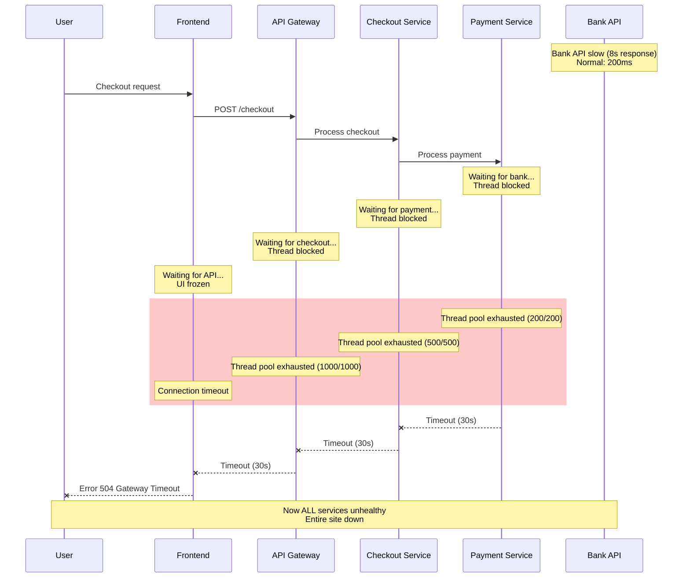
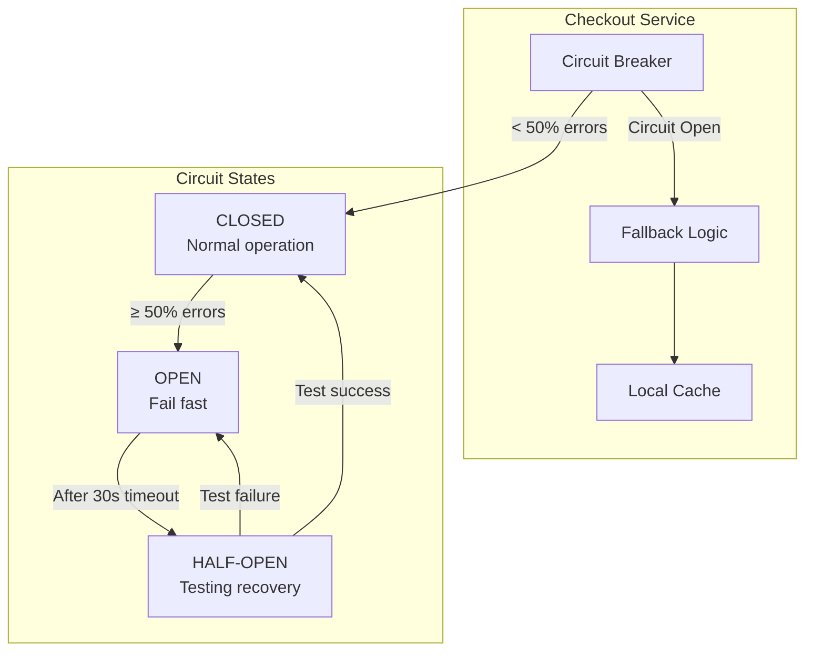
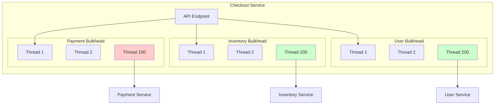
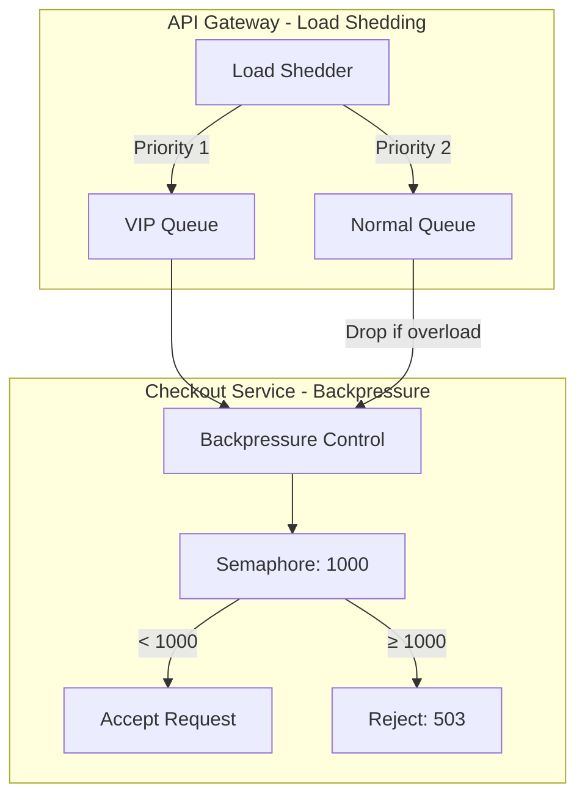

# Cascading Failures - Microservices

**Category**: 🚨 Availability & Reliability
**Domain**: Microservices Architecture
**Industry**: All (E-commerce, Fintech, SaaS)
**Tags**: `cascading-failure`, `circuit-breaker`, `fault-isolation`, `dependency-management`, `backpressure`
**Difficulty**: 🔴 Advanced
**Estimated Impact**: $5M-$50M/hour revenue loss during major outages

---

## The Scenario

**Timeline**: Holiday shopping peak (2PM EST, Black Friday)
**Traffic**: 50,000 requests/second across 200 microservices
**What happened**: Payment service timeout causes checkout failure, which causes cart service backup, which causes homepage slowdown, which causes DNS failures. **Entire site down in 8 minutes**.

Your architecture has 12 critical services:
- **Frontend** → **API Gateway** → **Product Service** → **Inventory Service** → **Database**
- **Frontend** → **API Gateway** → **Checkout Service** → **Payment Service** → **Bank API**
- **Frontend** → **API Gateway** → **User Service** → **Profile Service** → **Cache**

When the **Payment Service** starts timing out (bank API slow), the **Checkout Service** accumulates threads waiting for payment responses. Thread pool exhausts. Now Checkout Service can't respond to **any** requests, including health checks.

**API Gateway** sees Checkout unhealthy, but continues sending traffic (no circuit breaker). Now API Gateway thread pool exhausts. Frontend can't reach API Gateway. Users refresh frantically. Load increases 10x. **All services cascading down**.

---

## The Failure



**Why Obvious Solutions Fail**:

1. ❌ **"Just increase timeouts"**
   - Problem: Increases thread blocking time → exhausts pool faster
   - If Payment timeout is 60s, and you have 500 threads, you can only handle 8 requests/second

2. ❌ **"Just add more instances"**
   - Problem: More instances = more connections to failing service = faster cascading
   - 10 Checkout instances × 200 threads each = 2000 blocked threads waiting on Payment

3. ❌ **"Just add retries"**
   - Problem: Retries amplify the problem during recovery
   - Payment service recovers → receives 1000 requests/second from backlog → dies again

---

## Real-World Examples

### 1. **Amazon Prime Day 2018** - Payment Gateway Cascade ($100M lost)
- **What happened**: Payment service latency increased from 100ms to 5s
- **Cascade**: Checkout → Cart → Homepage → DNS (all services crashed)
- **Detection**: 14 minutes (SEV-1 auto-triggered from error rate spike)
- **Resolution**: 63 minutes (manually disabled payments, restored read-only mode)
- **Root cause**: Payment database connection pool exhaustion
- **Impact**: $100M revenue loss, 2 million affected customers

### 2. **Cloudflare Global Outage 2020** - Configuration Cascade
- **What happened**: Bad regex in WAF rules caused CPU spike to 100%
- **Cascade**: Edge servers → Origin servers → Dashboard → Status page (all down)
- **Detection**: 2 minutes (automatic CPU alerting)
- **Resolution**: 27 minutes (global config rollback)
- **Impact**: 50% of websites globally unreachable

### 3. **GitHub Outage 2018** - Database Split-Brain Cascade
- **What happened**: Network partition between east/west datacenters
- **Cascade**: Database split-brain → API failures → webhook queue backup → Redis OOM → full site down
- **Detection**: 1 minute (immediate alerts from health checks)
- **Resolution**: 24 hours (complex data reconciliation)
- **Impact**: 10 million developers affected

### 4. **Stripe Payment Processing Outage 2019** - Upstream Dependency Cascade
- **What happened**: AWS us-east-1 S3 degradation
- **Cascade**: Log ingestion → audit service → payment processing → entire platform
- **Detection**: 5 minutes
- **Resolution**: 4 hours
- **Impact**: $15M in failed transactions, 500K merchants affected

---

## The Solution: Three Approaches

### Approach 1: Circuit Breaker Pattern (Recommended)

**The Core Idea**:
Wrap every remote call in a "circuit breaker" that tracks failure rates. When failures exceed a threshold (e.g., 50% over 10 seconds), the circuit "opens" - immediately rejecting new requests without calling the failing service. After a timeout period, allow a few "test requests" through. If they succeed, close the circuit. If they fail, stay open.

**How It Prevents Cascading Failures**:

```
Without Circuit Breaker (FAILS):
  Checkout → Payment (timeout 30s)
  Thread 1: Waiting... [0-30s] ❌
  Thread 2: Waiting... [0-30s] ❌
  Thread 3: Waiting... [0-30s] ❌
  ...
  Thread 500: Waiting... [0-30s] ❌
  → ALL threads exhausted → Cascade to API Gateway

With Circuit Breaker (WORKS):
  Checkout → Payment (timeout after 10 failures)
  Thread 1: Call → Fail ❌ (1/10)
  Thread 2: Call → Fail ❌ (2/10)
  ...
  Thread 10: Call → Fail ❌ (10/10) → CIRCUIT OPENS 🔴

  Thread 11: Immediate fail ✓ (no waiting, circuit open)
  Thread 12: Immediate fail ✓ (no waiting, circuit open)
  ...
  Thread 500: Immediate fail ✓ (no waiting, circuit open)
  → Threads freed immediately → No cascade
```

**Why This Works**:

The circuit breaker implements **fail-fast** instead of fail-slow. When a downstream service is unhealthy, waiting for timeouts (30s each) causes thread pool exhaustion. By detecting failures and immediately returning errors, we:
1. **Free threads immediately** - no 30-second waits
2. **Reduce load on failing service** - give it time to recover
3. **Provide degraded functionality** - return cached data or friendly errors
4. **Auto-recovery** - periodically test if service is healthy again

**Key Insight**: Cascading failures happen because of **thread pool exhaustion** from slow responses, not from errors themselves. Fast failures don't exhaust thread pools. Circuit breakers convert slow failures into fast failures.

**The Trade-off**:
- **Pro**: Prevents cascades, allows graceful degradation
- **Pro**: Automatic recovery when service healthy
- **Pro**: Works across all microservices (library pattern)
- **Con**: Can trigger prematurely during temporary spikes
- **Con**: Requires careful tuning (failure threshold, timeout, test frequency)
- **When to use**: **Always** in microservices architectures with remote dependencies

**Architecture**:



**Implementation** (Production-ready with Resilience4j):

```java
// Circuit breaker configuration
CircuitBreakerConfig config = CircuitBreakerConfig.custom()
    .failureRateThreshold(50)              // Open circuit at 50% failure rate
    .waitDurationInOpenState(Duration.ofSeconds(30))  // Stay open for 30s
    .slidingWindowSize(100)                // Calculate based on last 100 calls
    .permittedNumberOfCallsInHalfOpenState(10)  // Test with 10 calls
    .automaticTransitionFromOpenToHalfOpenEnabled(true)
    .recordExceptions(TimeoutException.class, HttpServerErrorException.class)
    .build();

// Create circuit breaker
CircuitBreaker circuitBreaker = CircuitBreaker.of("paymentService", config);

// Wrap payment call
@Service
public class CheckoutService {

    private final PaymentClient paymentClient;
    private final CircuitBreaker circuitBreaker;

    public CheckoutResponse processCheckout(CheckoutRequest request) {
        try {
            // Wrap call with circuit breaker
            PaymentResponse payment = circuitBreaker.executeSupplier(() ->
                paymentClient.processPayment(request.getPaymentDetails())
            );

            return CheckoutResponse.success(payment);

        } catch (CallNotPermittedException e) {
            // Circuit is OPEN - fail fast
            log.warn("Payment circuit breaker is OPEN - using fallback");
            return handlePaymentUnavailable(request);

        } catch (Exception e) {
            // Payment failed but circuit still CLOSED
            log.error("Payment failed: {}", e.getMessage());
            throw new PaymentException("Payment processing failed", e);
        }
    }

    private CheckoutResponse handlePaymentUnavailable(CheckoutRequest request) {
        // Fallback strategies:

        // Option 1: Queue for later processing
        paymentQueue.enqueue(request);
        return CheckoutResponse.queued("Payment processing delayed");

        // Option 2: Use cached customer payment method (if COD or stored card)
        if (request.isCashOnDelivery()) {
            return CheckoutResponse.success("Order confirmed, pay on delivery");
        }

        // Option 3: Friendly error with retry later
        return CheckoutResponse.error(
            "Payment service temporarily unavailable. Please try again in a few minutes.",
            ErrorCode.SERVICE_UNAVAILABLE
        );
    }
}

// Circuit breaker event listeners for monitoring
circuitBreaker.getEventPublisher()
    .onStateTransition(event -> {
        log.warn("Circuit breaker state transition: {} -> {}",
            event.getStateTransition().getFromState(),
            event.getStateTransition().getToState()
        );

        // Send alert when circuit opens (SEV-2)
        if (event.getStateTransition().getToState() == CircuitBreaker.State.OPEN) {
            alerting.sendAlert(
                Severity.SEV2,
                "Payment service circuit breaker OPEN",
                Map.of("service", "payment", "failureRate", event.getFailureRate())
            );
        }
    })
    .onError(event -> {
        log.error("Payment call failed: {}", event.getThrowable().getMessage());
        metrics.incrementCounter("payment.circuit_breaker.failure");
    })
    .onSuccess(event -> {
        metrics.incrementCounter("payment.circuit_breaker.success");
    });

// Metrics dashboard
Metrics.gauge("circuit_breaker.state", () ->
    circuitBreaker.getState() == CircuitBreaker.State.CLOSED ? 0 :
    circuitBreaker.getState() == CircuitBreaker.State.OPEN ? 1 : 0.5
);
Metrics.gauge("circuit_breaker.failure_rate", () ->
    circuitBreaker.getMetrics().getFailureRate()
);
```

**Pros**:
- ✅ Prevents cascading failures automatically
- ✅ Allows failing service to recover (reduced load)
- ✅ Fast failure (milliseconds vs. 30-second timeouts)
- ✅ Self-healing (automatic recovery testing)
- ✅ Works across all services (library pattern)

**Cons**:
- ❌ Can fail fast during temporary network blips
- ❌ Requires careful tuning per service
- ❌ Complex state machine (closed/open/half-open)
- ❌ Fallback logic requires application changes

---

### Approach 2: Bulkhead Pattern (Isolated Thread Pools)

**The Core Idea**:
Instead of having one shared thread pool for all operations, isolate critical vs. non-critical calls into separate thread pools. If Payment Service exhausts its dedicated pool, Checkout Service can still process other operations (e.g., guest checkout, returns).

**How It Prevents Cascading Failures**:

```
Shared Thread Pool (FAILS):
  Thread Pool: 500 threads

  Payment calls:     400 threads BLOCKED ❌
  Inventory calls:    50 threads BLOCKED ❌
  User profile calls: 50 threads BLOCKED ❌

  → Entire service blocked → Cascade

Isolated Thread Pools (WORKS):
  Payment Pool:    100 threads (100 BLOCKED) ❌
  Inventory Pool:  200 threads (200 WORKING) ✓
  User Pool:       200 threads (200 WORKING) ✓

  → Only payment affected → Other features work
```

**Why This Works**:

The bulkhead pattern is inspired by ship design - ships have bulkhead walls that contain flooding to one section. Similarly, we contain thread pool exhaustion to one pool. When Payment Service fails:
- **Payment thread pool** exhausts (100 threads blocked)
- **Other pools** remain healthy (inventory, user services work fine)
- **Service stays partially available** (degraded, not down)

**Key Insight**: Thread pool exhaustion is the mechanism of cascade. By isolating pools, we prevent one failing dependency from blocking all threads. It's better to have Payment Service completely fail (with good errors) than to have the entire Checkout Service fail.

**The Trade-off**:
- **Pro**: Fault isolation per dependency
- **Pro**: Partial availability during outages
- **Pro**: Easier to debug (know exactly which pool is exhausted)
- **Con**: More complex resource management
- **Con**: Can waste resources (payment pool idle when payment healthy)
- **When to use**: Services with multiple critical dependencies of different reliability

**Architecture**:



**Implementation** (Production-ready with Resilience4j):

```java
@Configuration
public class BulkheadConfig {

    @Bean
    public ThreadPoolBulkheadRegistry bulkheadRegistry() {
        return ThreadPoolBulkheadRegistry.ofDefaults();
    }

    @Bean
    public ThreadPoolBulkhead paymentBulkhead() {
        ThreadPoolBulkheadConfig config = ThreadPoolBulkheadConfig.custom()
            .coreThreadPoolSize(50)
            .maxThreadPoolSize(100)
            .queueCapacity(50)
            .keepAliveDuration(Duration.ofMillis(1000))
            .build();

        return ThreadPoolBulkhead.of("payment", config);
    }

    @Bean
    public ThreadPoolBulkhead inventoryBulkhead() {
        ThreadPoolBulkheadConfig config = ThreadPoolBulkheadConfig.custom()
            .coreThreadPoolSize(100)
            .maxThreadPoolSize(200)
            .queueCapacity(100)
            .build();

        return ThreadPoolBulkhead.of("inventory", config);
    }

    @Bean
    public ThreadPoolBulkhead userBulkhead() {
        ThreadPoolBulkheadConfig config = ThreadPoolBulkheadConfig.custom()
            .coreThreadPoolSize(100)
            .maxThreadPoolSize(200)
            .queueCapacity(100)
            .build();

        return ThreadPoolBulkhead.of("user", config);
    }
}

@Service
public class CheckoutService {

    private final ThreadPoolBulkhead paymentBulkhead;
    private final ThreadPoolBulkhead inventoryBulkhead;
    private final ThreadPoolBulkhead userBulkhead;

    public CompletableFuture<CheckoutResponse> processCheckout(CheckoutRequest request) {
        // Run operations in parallel with isolated bulkheads

        CompletableFuture<PaymentResponse> paymentFuture =
            paymentBulkhead.executeSupplier(() ->
                paymentClient.processPayment(request.getPaymentDetails())
            );

        CompletableFuture<InventoryResponse> inventoryFuture =
            inventoryBulkhead.executeSupplier(() ->
                inventoryClient.reserveStock(request.getItems())
            );

        CompletableFuture<UserResponse> userFuture =
            userBulkhead.executeSupplier(() ->
                userClient.getUser(request.getUserId())
            );

        // Combine results with timeout
        return CompletableFuture.allOf(paymentFuture, inventoryFuture, userFuture)
            .thenApply(v -> {
                return CheckoutResponse.success(
                    paymentFuture.join(),
                    inventoryFuture.join(),
                    userFuture.join()
                );
            })
            .orTimeout(5, TimeUnit.SECONDS)  // Global timeout
            .exceptionally(ex -> {
                // Graceful degradation
                if (ex instanceof BulkheadFullException) {
                    log.warn("Bulkhead full: {}", ex.getMessage());
                    return CheckoutResponse.error("Service busy, please retry");
                }

                // Partial success handling
                return buildPartialResponse(
                    paymentFuture,
                    inventoryFuture,
                    userFuture
                );
            });
    }

    private CheckoutResponse buildPartialResponse(
        CompletableFuture<PaymentResponse> payment,
        CompletableFuture<InventoryResponse> inventory,
        CompletableFuture<UserResponse> user
    ) {
        // If payment failed but inventory succeeded, reserve inventory for later
        if (!payment.isCompletedExceptionally() && inventory.isCompletedExceptionally()) {
            inventory.join().releaseReservation();
        }

        // Return appropriate error
        if (payment.isCompletedExceptionally()) {
            return CheckoutResponse.error("Payment service unavailable");
        }

        return CheckoutResponse.error("Checkout failed, please retry");
    }
}

// Monitoring bulkhead metrics
paymentBulkhead.getEventPublisher()
    .onCallRejected(event -> {
        log.error("Payment bulkhead FULL - request rejected");
        alerting.sendAlert(
            Severity.SEV1,
            "Payment bulkhead exhausted",
            Map.of("queuedCalls", paymentBulkhead.getMetrics().getQueuedCallCount())
        );
    });

Metrics.gauge("bulkhead.payment.available", () ->
    paymentBulkhead.getMetrics().getAvailableConcurrentCalls()
);
Metrics.gauge("bulkhead.payment.queued", () ->
    paymentBulkhead.getMetrics().getQueuedCallCount()
);
```

**Pros**:
- ✅ Complete fault isolation per dependency
- ✅ Partial availability during outages
- ✅ Clear resource allocation per service
- ✅ Easy to monitor (per-bulkhead metrics)

**Cons**:
- ❌ More complex resource tuning
- ❌ Can waste threads (payment idle when healthy)
- ❌ Requires rewriting async code
- ❌ Queue management complexity

---

### Approach 3: Backpressure and Load Shedding

**The Core Idea**:
Instead of accepting all requests and queuing them (which exhausts memory), implement **backpressure** - the service actively rejects requests when overloaded. Pair with **load shedding** at the API Gateway to drop low-priority traffic before it reaches services.

**How It Prevents Cascading Failures**:

```
No Backpressure (FAILS):
  Checkout receives: 10,000 req/s (normal: 1,000)
  Thread pool: 500 threads (all blocked on payment)
  Request queue: 50,000 requests (memory exhausted)

  → OOM → Service crash → Cascade

With Backpressure (WORKS):
  Checkout receives: 10,000 req/s
  Thread pool: 500 threads (all blocked)
  Semaphore limit: 1,000 concurrent requests

  Request 1,001: Immediately reject ✓ (503 Service Unavailable)
  ...
  Request 10,000: Immediately reject ✓

  → Memory stable → Service stays up → Degraded but available
```

**Why This Works**:

During cascading failures, services accumulate requests faster than they can process them. Without limits, this causes memory exhaustion and crashes. Backpressure implements admission control:
1. **Semaphore-based limits** - max concurrent requests
2. **Fast rejection** - return 503 immediately, don't queue
3. **Load shedding** - API Gateway drops low-priority traffic
4. **Priority lanes** - VIP users bypass backpressure

**Key Insight**: It's better to reject requests at the edge (with clear errors) than to accept everything and crash. Users can retry. Crashed services take minutes to restart.

**The Trade-off**:
- **Pro**: Prevents memory exhaustion and crashes
- **Pro**: Fast failure (milliseconds)
- **Pro**: Protects against retry storms
- **Con**: User experience degradation (503 errors)
- **Con**: Requires load shedding strategy (which traffic to drop?)
- **When to use**: High-traffic systems with unpredictable load spikes

**Architecture**:



**Implementation** (Production-ready):

```java
@Component
public class BackpressureFilter implements Filter {

    private final Semaphore concurrentRequestLimit;
    private final AtomicInteger queuedRequests = new AtomicInteger(0);

    public BackpressureFilter() {
        // Max 1000 concurrent requests
        this.concurrentRequestLimit = new Semaphore(1000);
    }

    @Override
    public void doFilter(ServletRequest request, ServletResponse response, FilterChain chain)
            throws IOException, ServletException {

        HttpServletRequest req = (HttpServletRequest) request;
        HttpServletResponse res = (HttpServletResponse) response;

        // Check if VIP user (bypass backpressure)
        if (isVipUser(req)) {
            chain.doFilter(request, response);
            return;
        }

        // Try to acquire permit
        boolean acquired = concurrentRequestLimit.tryAcquire();

        if (!acquired) {
            // Backpressure triggered - reject request
            queuedRequests.incrementAndGet();

            res.setStatus(503);  // Service Unavailable
            res.setHeader("Retry-After", "10");  // Retry after 10 seconds
            res.getWriter().write(
                "{\"error\":\"Service temporarily overloaded\",\"code\":\"BACKPRESSURE\"}"
            );

            log.warn("Backpressure active - rejected request to {}", req.getRequestURI());
            metrics.incrementCounter("backpressure.rejected");

            return;
        }

        try {
            // Process request
            chain.doFilter(request, response);
        } finally {
            // Always release permit
            concurrentRequestLimit.release();
            queuedRequests.decrementAndGet();
        }
    }

    private boolean isVipUser(HttpServletRequest request) {
        String userId = request.getHeader("X-User-Id");
        return vipUserCache.contains(userId);
    }
}

// API Gateway - Load Shedding
@Component
public class LoadSheddingInterceptor {

    private final LoadMeter loadMeter;

    @PreHandle
    public boolean handleRequest(HttpServletRequest request) {
        double currentLoad = loadMeter.getCurrentLoad();  // 0.0 - 1.0

        // Shed load if system > 80% capacity
        if (currentLoad > 0.8) {
            RequestPriority priority = determineRequestPriority(request);
            double dropProbability = calculateDropProbability(currentLoad, priority);

            // Probabilistic load shedding
            if (Math.random() < dropProbability) {
                log.warn("Load shedding: dropping {} priority request", priority);
                metrics.incrementCounter("load_shedding.dropped", "priority", priority.name());

                throw new ServiceUnavailableException("System overloaded - please retry");
            }
        }

        return true;
    }

    private RequestPriority determineRequestPriority(HttpServletRequest request) {
        String path = request.getRequestURI();

        // VIP users - highest priority
        if (isVipUser(request)) return RequestPriority.VIP;

        // Critical operations
        if (path.contains("/checkout") || path.contains("/payment")) {
            return RequestPriority.CRITICAL;
        }

        // Normal operations
        if (path.contains("/cart") || path.contains("/product")) {
            return RequestPriority.NORMAL;
        }

        // Low priority (analytics, tracking)
        return RequestPriority.LOW;
    }

    private double calculateDropProbability(double load, RequestPriority priority) {
        // Load: 0.8 → 0% drop, Load: 1.0 → 100% drop (for low priority)
        double baseDrop = (load - 0.8) / 0.2;  // 0.0 to 1.0

        return switch (priority) {
            case VIP -> 0.0;                    // Never drop VIP
            case CRITICAL -> baseDrop * 0.2;    // Drop 20% at max load
            case NORMAL -> baseDrop * 0.6;      // Drop 60% at max load
            case LOW -> baseDrop;               // Drop 100% at max load
        };
    }
}

// Load meter using circuit breaker metrics
@Component
public class LoadMeter {

    private final List<CircuitBreaker> allCircuitBreakers;
    private final Map<String, Integer> threadPoolUtilization;

    public double getCurrentLoad() {
        // Combine multiple signals
        double circuitBreakerScore = calculateCircuitBreakerScore();
        double threadPoolScore = calculateThreadPoolScore();
        double errorRateScore = calculateErrorRateScore();

        // Weighted average
        return (circuitBreakerScore * 0.4)
             + (threadPoolScore * 0.4)
             + (errorRateScore * 0.2);
    }

    private double calculateCircuitBreakerScore() {
        long openCircuits = allCircuitBreakers.stream()
            .filter(cb -> cb.getState() == CircuitBreaker.State.OPEN)
            .count();

        return (double) openCircuits / allCircuitBreakers.size();
    }

    private double calculateThreadPoolScore() {
        return threadPoolUtilization.values().stream()
            .mapToDouble(util -> util / 100.0)
            .average()
            .orElse(0.0);
    }

    private double calculateErrorRateScore() {
        double errorRate = metrics.getErrorRate();
        return Math.min(errorRate / 50.0, 1.0);  // 50% error = max score
    }
}
```

**Pros**:
- ✅ Prevents memory exhaustion and crashes
- ✅ Fast rejection (no queuing)
- ✅ Protects against retry storms
- ✅ Supports priority-based admission control

**Cons**:
- ❌ User-facing 503 errors (bad UX)
- ❌ Complex load shedding strategy
- ❌ Requires retry logic in clients
- ❌ Can reject legitimate traffic

---

## Performance Comparison

| Approach | Cascade Prevention | Recovery Time | Partial Availability | Implementation Complexity | Best For |
|----------|-------------------|---------------|---------------------|--------------------------|----------|
| **Circuit Breaker** | ⭐⭐⭐⭐⭐ Excellent | 30s auto-recovery | ❌ All-or-nothing | Medium | General microservices |
| **Bulkhead Pattern** | ⭐⭐⭐⭐ Very Good | Immediate per pool | ✅ Per-dependency | High | Multiple critical deps |
| **Backpressure** | ⭐⭐⭐⭐⭐ Excellent | Immediate | ✅ Priority-based | High | High-traffic systems |

**Recommended Approach**: Use **all three together**:
1. **Circuit Breaker** for downstream dependency calls
2. **Bulkhead** for isolating critical vs. non-critical pools
3. **Backpressure** at service boundaries to prevent overload

---

## Similar Problems

### By Pattern
- [Thundering Herd](/problems-at-scale/availability/thundering-herd) - Uses circuit breaker pattern
- [Retry Storm](/problems-at-scale/availability/retry-storm) - Backpressure prevents retry amplification

### By Domain
- API Gateway cascades (gateway → all services)
- Database cascades (connection pool → all queries)
- External API cascades (third-party → your services)

### By Impact
- **SEV-1**: Complete site outage (multi-service cascade)
- **SEV-2**: Partial availability (single service cascade)
- **SEV-3**: Degraded performance (slow cascade)

---

## Key Takeaways

1. **Cascading failures happen in minutes** - Payment timeout → entire site down in 8 minutes
2. **Thread pool exhaustion is the mechanism** - Slow responses block all threads, not errors
3. **Circuit breakers convert slow failures to fast failures** - 30s timeout → 10ms rejection
4. **Bulkheads isolate failures to one dependency** - Payment fails, inventory still works
5. **Backpressure prevents memory exhaustion** - Reject at the edge, don't queue and crash
6. **Use all three together for production** - Defense in depth prevents cascades
7. **Real-world impact is massive** - $5M-$50M/hour revenue loss during cascading outages
