# Circuit Breaker Stuck Open/Closed - Microservices

**Category**: 🚨 Availability & Reliability
**Domain**: Microservices Architecture
**Industry**: All (E-commerce, SaaS, Fintech)
**Tags**: `circuit-breaker`, `resilience`, `half-open`, `false-positive`, `dependency-management`
**Difficulty**: 🟡 Intermediate
**Estimated Impact**: $500K-$5M/hour revenue loss

---

## The Scenario

**Timeline**: Sunday morning, 3AM (low traffic period)
**Traffic**: 100 requests/second (normal: 5,000/second)
**What happened**: Payment service had a brief 30-second outage during database maintenance. Circuit breaker opened correctly. But now payment service is healthy, and **circuit breaker is stuck OPEN** - rejecting all payment requests for 2 hours until manual intervention.

Alternatively: Circuit breaker is **stuck CLOSED** during an actual outage - continuing to send traffic to a failing service, causing cascading failures.

Your payment circuit breaker configuration:
- Failure threshold: 50% over 10 requests
- Open state duration: 60 seconds
- Half-open test requests: 3 requests

**The Bug**: At 3AM with only 10 requests/minute, it takes 60 seconds to collect 10 requests. By the time you have 10 requests for testing, the circuit breaker timeout hasn't expired. Circuit stays OPEN indefinitely.

---

## The Failure

```mermaid
sequenceDiagram
    participant Client
    participant CB as Circuit Breaker
    participant PS as Payment Service
    participant DB as Database

    Note over DB: Maintenance started (3:00 AM)
    Note over PS: Database unreachable

    Client->>CB: Request 1
    CB->>PS: Forward
    PS--xCB: Timeout ❌ (1/10 failures)

    Client->>CB: Request 5
    CB->>PS: Forward
    PS--xCB: Timeout ❌ (5/10 failures)

    Client->>CB: Request 6
    CB->>PS: Forward
    PS--xCB: Timeout ❌ (6/10 failures)

    rect rgb(255, 200, 200)
        Note over CB: Circuit OPENS (≥50% failure)<br/>State: OPEN
    end

    Note over DB: Maintenance complete (3:02 AM)
    Note over PS: Healthy again ✓

    Client->>CB: Request 7 (3:03 AM)
    CB--xClient: Rejected (circuit OPEN) ❌

    Note over CB: Waiting for timeout (60s)<br/>But only 10 requests/min at 3AM<br/>→ Timeout expires before<br/>10 requests arrive<br/>→ Circuit stays OPEN

    Client->>CB: Request 8 (3:04 AM)
    CB--xClient: Rejected (circuit OPEN) ❌

    Client->>CB: Request 9 (3:10 AM)
    CB--xClient: Rejected (circuit OPEN) ❌

    Note over CB: 🔴 Circuit stuck OPEN<br/>Payment service healthy<br/>but all requests rejected
```



**Why Obvious Solutions Fail**:

1. ❌ **"Just reduce the open state duration to 5 seconds"**
   - Problem: Causes thrashing during actual outages
   - Service needs time to recover; 5-second retries keep it overwhelmed

2. ❌ **"Just increase the half-open test request count to 100"**
   - Problem: If service is still failing, sends 100 bad requests
   - Amplifies load on already-struggling service

3. ❌ **"Remove circuit breakers entirely"**
   - Problem: No protection against cascading failures
   - Original problem (thread pool exhaustion) returns

---

## Real-World Examples

### 1. **Netflix API Gateway 2016** - Stuck Open Circuit Breaker ($2M/hour)
- **What happened**: Circuit breaker opened during database backup
- **Stuck state**: Circuit remained open after database recovered
- **Detection**: 15 minutes (user reports of "service unavailable")
- **Resolution**: Manual circuit breaker reset via admin dashboard
- **Root cause**: Low nighttime traffic + aggressive failure threshold
- **Impact**: $500K lost revenue, 50K users affected

### 2. **Uber Rides Service 2019** - Circuit Breaker False Positive
- **What happened**: Network blip caused 5 request failures in 10 seconds
- **Stuck state**: Circuit opened, stayed open for 8 minutes
- **Detection**: Immediate (real-time dashboard alerts)
- **Resolution**: Automatic recovery after timeout adjustment
- **Root cause**: Sliding window too small (10 requests) + aggressive 50% threshold
- **Impact**: $300K lost bookings

### 3. **Shopify Payments 2020** - Stuck Closed Circuit Breaker
- **What happened**: Payment processor outage, circuit breaker never opened
- **Stuck state**: Circuit stayed closed, sending traffic to failing processor
- **Detection**: 5 minutes (cascading to checkout service)
- **Resolution**: Emergency circuit breaker force-open
- **Root cause**: Misconfigured exception whitelist (payment timeout not counted as failure)
- **Impact**: 10K failed transactions, $1M in refunds

### 4. **DoorDash Restaurant Orders 2021** - Half-Open Thrashing
- **What happened**: Circuit kept transitioning Open → Half-Open → Open
- **Stuck state**: Thrashing between states for 30 minutes
- **Detection**: 2 minutes (monitoring alerts)
- **Resolution**: Increased half-open request count from 3 to 20
- **Root cause**: 3 test requests not enough to determine health
- **Impact**: $200K lost orders

---

## The Solution: Three Approaches

### Approach 1: Adaptive Thresholds Based on Traffic (Recommended)

**The Core Idea**:
Instead of fixed thresholds (50% failure over 10 requests), use **time-based windows** (50% failure over 10 seconds). This ensures circuit breaker behavior is consistent regardless of traffic volume. Also use **percentile-based thresholds** (p95 latency) instead of absolute failure counts.

**How It Prevents Stuck Circuit Breakers**:

```
Fixed Threshold (FAILS):
  3AM traffic: 10 requests/minute
  Failure threshold: 50% over 10 requests

  02:59: 5 failures in 60 seconds → Circuit OPEN ✓
  03:00: Service healthy
  03:01: Only 10 requests in 60 seconds → Can't test (need 10 failures first)
  03:05: Still OPEN → Stuck ❌

Time-Based Window (WORKS):
  3AM traffic: 10 requests/minute
  Failure threshold: 50% over 10-second window

  02:59: 5 failures in 10 seconds → Circuit OPEN ✓
  03:00: Wait 60 seconds
  03:01: Transition to HALF-OPEN
  03:01: Next request tests service → SUCCESS ✓
  03:01: Circuit CLOSED ✓ (recovered)
```

**Why This Works**:

Fixed request counts (e.g., "10 requests") behave differently at different traffic levels:
- **High traffic (1000 req/s)**: 10 requests = 10ms → Very responsive
- **Low traffic (1 req/s)**: 10 requests = 10 seconds → Sluggish

Time-based windows (e.g., "10 seconds") are consistent:
- **High traffic**: Evaluate 10,000 requests in 10 seconds
- **Low traffic**: Evaluate 10 requests in 10 seconds
- Both: Make decision within 10 seconds

**Key Insight**: Traffic volume shouldn't determine circuit breaker behavior. Use **time-based sliding windows** to ensure consistent behavior at any scale. This prevents low-traffic periods from causing stuck states.

**The Trade-off**:
- **Pro**: Consistent behavior at all traffic levels
- **Pro**: Prevents stuck states during low-traffic
- **Pro**: More intuitive configuration (time vs. request counts)
- **Con**: Requires more sophisticated metrics collection
- **Con**: More memory usage (time-series data)
- **When to use**: **Always** - this should be the default implementation

**Architecture**:


**Implementation** (Production-ready with Resilience4j):

```java
@Configuration
public class AdaptiveCircuitBreakerConfig {

    @Bean
    public CircuitBreakerConfig paymentCircuitBreakerConfig() {
        return CircuitBreakerConfig.custom()
            // TIME-BASED sliding window (not count-based)
            .slidingWindowType(CircuitBreakerConfig.SlidingWindowType.TIME_BASED)
            .slidingWindowSize(10)  // 10 seconds (not 10 requests!)

            // Minimum request threshold (prevent false positives)
            .minimumNumberOfCalls(5)  // Need at least 5 requests in window

            // Failure rate threshold
            .failureRateThreshold(50.0)  // 50% failure rate

            // Slow call detection (treat slow calls as failures)
            .slowCallRateThreshold(50.0)  // 50% of calls slow
            .slowCallDurationThreshold(Duration.ofSeconds(5))  // > 5s is "slow"

            // Open state duration
            .waitDurationInOpenState(Duration.ofSeconds(60))

            // Half-open state configuration
            .permittedNumberOfCallsInHalfOpenState(10)  // Test with 10 calls
            .automaticTransitionFromOpenToHalfOpenEnabled(true)

            // Record these as failures
            .recordExceptions(
                TimeoutException.class,
                HttpServerErrorException.class,
                ConnectException.class
            )

            // Ignore these (don't count as failures)
            .ignoreExceptions(
                HttpClientErrorException.BadRequest.class,  // 400 is client error
                HttpClientErrorException.Unauthorized.class  // 401 is auth issue
            )

            .build();
    }

    @Bean
    public CircuitBreaker paymentCircuitBreaker(CircuitBreakerConfig config) {
        CircuitBreaker circuitBreaker = CircuitBreaker.of("payment", config);

        // Add event listeners for monitoring
        circuitBreaker.getEventPublisher()
            .onStateTransition(event -> {
                log.info("Circuit breaker state transition: {} -> {} (failure rate: {}%)",
                    event.getStateTransition().getFromState(),
                    event.getStateTransition().getToState(),
                    circuitBreaker.getMetrics().getFailureRate()
                );

                // Alert on state changes
                if (event.getStateTransition().getToState() == CircuitBreaker.State.OPEN) {
                    alerting.sendAlert(
                        Severity.SEV2,
                        "Payment circuit breaker OPEN",
                        Map.of(
                            "failureRate", circuitBreaker.getMetrics().getFailureRate(),
                            "slowCallRate", circuitBreaker.getMetrics().getSlowCallRate(),
                            "numberOfCalls", circuitBreaker.getMetrics().getNumberOfBufferedCalls()
                        )
                    );
                } else if (event.getStateTransition().getToState() == CircuitBreaker.State.CLOSED) {
                    alerting.sendAlert(
                        Severity.INFO,
                        "Payment circuit breaker CLOSED (recovered)",
                        Map.of("previousState", event.getStateTransition().getFromState())
                    );
                }
            })
            .onSlowCallRateExceeded(event -> {
                log.warn("Slow call rate exceeded: {}% (threshold: {}%)",
                    event.getSlowCallRate(),
                    config.getSlowCallRateThreshold()
                );
            });

        return circuitBreaker;
    }
}

// Usage in service
@Service
public class CheckoutService {

    private final CircuitBreaker paymentCircuitBreaker;
    private final PaymentClient paymentClient;

    public CheckoutResponse processCheckout(CheckoutRequest request) {
        try {
            PaymentResponse payment = paymentCircuitBreaker.executeSupplier(() ->
                paymentClient.processPayment(request.getPaymentDetails())
            );

            return CheckoutResponse.success(payment);

        } catch (CallNotPermittedException e) {
            // Circuit is OPEN
            log.warn("Payment circuit breaker is OPEN - using fallback");
            metrics.incrementCounter("circuit_breaker.rejected", "service", "payment");

            return handlePaymentUnavailable(request);
        }
    }

    private CheckoutResponse handlePaymentUnavailable(CheckoutRequest request) {
        // Fallback: queue for later processing
        paymentQueue.enqueue(request);
        return CheckoutResponse.queued(
            "Payment service temporarily unavailable. Order queued for processing."
        );
    }
}

// Dashboard metrics
Metrics.gauge("circuit_breaker.state", Tags.of("service", "payment"), () ->
    switch (paymentCircuitBreaker.getState()) {
        case CLOSED -> 0;
        case HALF_OPEN -> 0.5;
        case OPEN -> 1;
        default -> -1;
    }
);

Metrics.gauge("circuit_breaker.failure_rate", Tags.of("service", "payment"), () ->
    paymentCircuitBreaker.getMetrics().getFailureRate()
);

Metrics.gauge("circuit_breaker.slow_call_rate", Tags.of("service", "payment"), () ->
    paymentCircuitBreaker.getMetrics().getSlowCallRate()
);

Metrics.gauge("circuit_breaker.buffered_calls", Tags.of("service", "payment"), () ->
    paymentCircuitBreaker.getMetrics().getNumberOfBufferedCalls()
);
```

**Pros**:
- ✅ Consistent behavior at all traffic levels
- ✅ Prevents stuck states during low traffic
- ✅ Detects slow calls (not just failures)
- ✅ Automatic recovery testing

**Cons**:
- ❌ More complex metrics collection
- ❌ Higher memory usage (time-series data)
- ❌ Requires understanding of time windows

---

### Approach 2: Health Check-Based Circuit Breaker

**The Core Idea**:
Instead of relying solely on request failures to determine health, add **active health checks** that run independently. Circuit breaker transitions to HALF-OPEN when health checks pass, regardless of timeout.

**How It Prevents Stuck Circuit Breakers**:

```
Request-Only Circuit Breaker (FAILS):
  03:00: Circuit OPEN (payment failures)
  03:02: Payment service healthy (but no one knows)
  03:10: Still OPEN (no requests to test)
  03:20: Still OPEN... Stuck ❌

Health Check Circuit Breaker (WORKS):
  03:00: Circuit OPEN (payment failures)
  03:01: Health check runs → Payment healthy ✓
  03:01: Circuit → HALF-OPEN
  03:01: Next request tests → SUCCESS ✓
  03:01: Circuit → CLOSED ✓
```

**Why This Works**:

Traditional circuit breakers are **passive** - they wait for requests to determine health. This creates stuck states when:
- Low traffic (no requests to test with)
- Complete failures (all requests rejected, no testing)

Active health checks are **proactive**:
1. Run every 10 seconds (configurable)
2. Call `/health` endpoint on downstream service
3. Transition to HALF-OPEN when health check succeeds
4. No dependency on user traffic

**Key Insight**: Decouple circuit breaker state transitions from user traffic. Use background health checks to actively monitor service health. This ensures recovery even during low-traffic periods or complete outages.

**The Trade-off**:
- **Pro**: Fast recovery (don't wait for user traffic)
- **Pro**: Works during zero-traffic periods
- **Pro**: Can detect service health before users are affected
- **Con**: Requires health check endpoints on all services
- **Con**: Additional network overhead (health check requests)
- **When to use**: Critical services with variable traffic patterns

**Architecture**:


**Implementation** (Production-ready):

```java
@Service
public class HealthCheckCircuitBreaker {

    private final CircuitBreaker circuitBreaker;
    private final HealthCheckClient healthCheckClient;
    private final ScheduledExecutorService healthCheckExecutor;

    public HealthCheckCircuitBreaker(CircuitBreaker circuitBreaker) {
        this.circuitBreaker = circuitBreaker;
        this.healthCheckClient = new HealthCheckClient();
        this.healthCheckExecutor = Executors.newScheduledThreadPool(1);

        // Start health check background task
        startHealthCheckMonitoring();
    }

    private void startHealthCheckMonitoring() {
        healthCheckExecutor.scheduleAtFixedRate(
            this::performHealthCheck,
            0,  // Initial delay
            10,  // Period
            TimeUnit.SECONDS
        );
    }

    private void performHealthCheck() {
        // Only run health checks when circuit is OPEN
        if (circuitBreaker.getState() != CircuitBreaker.State.OPEN) {
            return;
        }

        try {
            // Call health endpoint on payment service
            HealthCheckResponse response = healthCheckClient.checkHealth("payment-service");

            if (response.isHealthy()) {
                log.info("Health check passed for payment-service - transitioning to HALF-OPEN");

                // Manually transition to HALF-OPEN
                circuitBreaker.transitionToHalfOpenState();

                metrics.incrementCounter("circuit_breaker.health_check.success");
            } else {
                log.warn("Health check failed for payment-service: {}", response.getReason());
                metrics.incrementCounter("circuit_breaker.health_check.failed");
            }

        } catch (Exception e) {
            log.error("Health check exception: {}", e.getMessage());
            metrics.incrementCounter("circuit_breaker.health_check.exception");
        }
    }

    @PreDestroy
    public void shutdown() {
        healthCheckExecutor.shutdown();
    }
}

// Health check client
@Component
public class HealthCheckClient {

    private final RestTemplate restTemplate;

    public HealthCheckResponse checkHealth(String serviceName) {
        String healthUrl = serviceRegistry.getHealthUrl(serviceName);

        try {
            ResponseEntity<HealthCheckResponse> response = restTemplate.exchange(
                healthUrl + "/health",
                HttpMethod.GET,
                null,
                HealthCheckResponse.class
            );

            if (response.getStatusCode().is2xxSuccessful() && response.getBody() != null) {
                return response.getBody();
            }

            return HealthCheckResponse.unhealthy("Non-2xx status: " + response.getStatusCode());

        } catch (RestClientException e) {
            return HealthCheckResponse.unhealthy("Request failed: " + e.getMessage());
        }
    }
}

// Health endpoint on payment service
@RestController
@RequestMapping("/health")
public class HealthController {

    private final DataSource dataSource;
    private final BankApiClient bankApiClient;

    @GetMapping
    public ResponseEntity<HealthCheckResponse> health() {
        List<String> issues = new ArrayList<>();

        // Check database connection
        try {
            dataSource.getConnection().close();
        } catch (SQLException e) {
            issues.add("Database unreachable: " + e.getMessage());
        }

        // Check bank API (with short timeout)
        try {
            bankApiClient.ping();  // Lightweight ping endpoint
        } catch (Exception e) {
            issues.add("Bank API unreachable: " + e.getMessage());
        }

        if (issues.isEmpty()) {
            return ResponseEntity.ok(HealthCheckResponse.healthy());
        } else {
            return ResponseEntity.status(503).body(
                HealthCheckResponse.unhealthy(String.join(", ", issues))
            );
        }
    }
}

@Data
public class HealthCheckResponse {
    private boolean healthy;
    private String reason;
    private Map<String, Object> details;

    public static HealthCheckResponse healthy() {
        HealthCheckResponse response = new HealthCheckResponse();
        response.setHealthy(true);
        return response;
    }

    public static HealthCheckResponse unhealthy(String reason) {
        HealthCheckResponse response = new HealthCheckResponse();
        response.setHealthy(false);
        response.setReason(reason);
        return response;
    }
}
```

**Pros**:
- ✅ Fast recovery (don't wait for user traffic)
- ✅ Works during zero-traffic periods
- ✅ Proactive health monitoring
- ✅ Can detect issues before users affected

**Cons**:
- ❌ Requires health endpoints on all services
- ❌ Additional network overhead
- ❌ Health check might not reflect real request health
- ❌ More complex implementation

---

### Approach 3: Manual Override Dashboard

**The Core Idea**:
Add an **admin dashboard** that allows operators to manually control circuit breaker states. Useful for planned maintenance, emergency overrides, or stuck states that automated logic can't handle.

**How It Prevents Stuck Circuit Breakers**:

```
Automated Only (FAILS):
  03:00: Circuit OPEN (payment failures)
  03:05: Service healthy but circuit stuck
  03:10: Still stuck, users reporting errors
  03:20: Engineering team woken up
  03:30: Debug, can't figure out why stuck
  04:00: Finally restart service (clears circuit) ❌

With Manual Override (WORKS):
  03:00: Circuit OPEN (payment failures)
  03:05: Service healthy but circuit stuck
  03:06: On-call checks dashboard
  03:07: Manually transitions circuit → HALF-OPEN
  03:07: Circuit tests service → CLOSED ✓
  03:08: Resolved in 8 minutes ✓
```

**Why This Works**:

Circuit breakers are state machines with complex logic. Sometimes they get into edge cases that automated logic can't handle:
- Configuration bugs (wrong thresholds)
- Timing issues (race conditions)
- Dependency conflicts (health check endpoint also broken)

Manual overrides provide an **escape hatch**:
1. View real-time circuit breaker state
2. See detailed metrics (failure rates, request counts)
3. Manually force state transitions
4. Useful during planned maintenance

**Key Insight**: Automation is great, but always provide manual overrides for production systems. Circuit breakers are too critical to leave without manual control. The dashboard serves as both monitoring and emergency tooling.

**The Trade-off**:
- **Pro**: Escape hatch for stuck states
- **Pro**: Useful during planned maintenance
- **Pro**: Great debugging tool (see real-time state)
- **Con**: Requires building dashboard UI
- **Con**: Potential for human error (wrong manual transition)
- **When to use**: All production systems with circuit breakers

**Architecture**:


**Implementation** (Production-ready dashboard):

```java
@RestController
@RequestMapping("/admin/circuit-breakers")
public class CircuitBreakerAdminController {

    private final CircuitBreakerRegistry circuitBreakerRegistry;
    private final AuditLogger auditLogger;

    @GetMapping
    public List<CircuitBreakerStatus> listAll() {
        return circuitBreakerRegistry.getAllCircuitBreakers().stream()
            .map(this::toStatus)
            .collect(Collectors.toList());
    }

    @GetMapping("/{name}")
    public CircuitBreakerStatus getStatus(@PathVariable String name) {
        CircuitBreaker cb = circuitBreakerRegistry.circuitBreaker(name);

        return toStatus(cb);
    }

    @PostMapping("/{name}/transition")
    public CircuitBreakerStatus forceTransition(
        @PathVariable String name,
        @RequestBody TransitionRequest request,
        @RequestHeader("X-User-Id") String userId
    ) {
        CircuitBreaker cb = circuitBreakerRegistry.circuitBreaker(name);
        CircuitBreaker.State currentState = cb.getState();
        CircuitBreaker.State targetState = request.getTargetState();

        // Audit log for compliance
        auditLogger.log(
            "CIRCUIT_BREAKER_MANUAL_TRANSITION",
            Map.of(
                "circuitBreaker", name,
                "fromState", currentState,
                "toState", targetState,
                "userId", userId,
                "reason", request.getReason()
            )
        );

        // Force transition
        switch (targetState) {
            case CLOSED:
                cb.transitionToClosedState();
                break;
            case OPEN:
                cb.transitionToOpenState();
                break;
            case HALF_OPEN:
                cb.transitionToHalfOpenState();
                break;
        }

        // Alert team
        alerting.sendAlert(
            Severity.INFO,
            String.format("Circuit breaker %s manually transitioned: %s -> %s",
                name, currentState, targetState),
            Map.of("userId", userId, "reason", request.getReason())
        );

        return toStatus(cb);
    }

    @PostMapping("/{name}/disable")
    public void disableCircuitBreaker(@PathVariable String name) {
        CircuitBreaker cb = circuitBreakerRegistry.circuitBreaker(name);
        cb.transitionToDisabledState();

        alerting.sendAlert(
            Severity.SEV2,
            String.format("Circuit breaker %s DISABLED", name),
            Map.of("note", "All requests will be forwarded without protection")
        );
    }

    @PostMapping("/{name}/reset")
    public void resetCircuitBreaker(@PathVariable String name) {
        CircuitBreaker cb = circuitBreakerRegistry.circuitBreaker(name);
        cb.reset();  // Clear metrics and transition to CLOSED

        alerting.sendAlert(
            Severity.INFO,
            String.format("Circuit breaker %s RESET", name),
            Map.of()
        );
    }

    private CircuitBreakerStatus toStatus(CircuitBreaker cb) {
        CircuitBreaker.Metrics metrics = cb.getMetrics();

        return CircuitBreakerStatus.builder()
            .name(cb.getName())
            .state(cb.getState())
            .failureRate(metrics.getFailureRate())
            .slowCallRate(metrics.getSlowCallRate())
            .bufferedCalls(metrics.getNumberOfBufferedCalls())
            .failedCalls(metrics.getNumberOfFailedCalls())
            .successfulCalls(metrics.getNumberOfSuccessfulCalls())
            .notPermittedCalls(metrics.getNumberOfNotPermittedCalls())
            .build();
    }
}

@Data
@Builder
class CircuitBreakerStatus {
    private String name;
    private CircuitBreaker.State state;
    private float failureRate;
    private float slowCallRate;
    private int bufferedCalls;
    private long failedCalls;
    private long successfulCalls;
    private long notPermittedCalls;
}

@Data
class TransitionRequest {
    private CircuitBreaker.State targetState;
    private String reason;  // Required for audit log
}
```

**Dashboard UI** (React example):

```typescript
// CircuitBreakerDashboard.tsx
import React, { useState, useEffect } from 'react';

interface CircuitBreaker {
  name: string;
  state: 'CLOSED' | 'OPEN' | 'HALF_OPEN';
  failureRate: number;
  slowCallRate: number;
  bufferedCalls: number;
}

export function CircuitBreakerDashboard() {
  const [circuitBreakers, setCircuitBreakers] = useState<CircuitBreaker[]>([]);

  useEffect(() => {
    // Poll every 5 seconds
    const interval = setInterval(fetchCircuitBreakers, 5000);
    fetchCircuitBreakers();
    return () => clearInterval(interval);
  }, []);

  const fetchCircuitBreakers = async () => {
    const response = await fetch('/admin/circuit-breakers');
    const data = await response.json();
    setCircuitBreakers(data);
  };

  const forceTransition = async (name: string, targetState: string) => {
    const reason = prompt(`Reason for transitioning ${name} to ${targetState}:`);
    if (!reason) return;

    await fetch(`/admin/circuit-breakers/${name}/transition`, {
      method: 'POST',
      headers: { 'Content-Type': 'application/json' },
      body: JSON.stringify({ targetState, reason }),
    });

    fetchCircuitBreakers();
  };

  return (
    <div className="dashboard">
      <h1>Circuit Breaker Dashboard</h1>

      <table>
        <thead>
          <tr>
            <th>Service</th>
            <th>State</th>
            <th>Failure Rate</th>
            <th>Slow Call Rate</th>
            <th>Buffered Calls</th>
            <th>Actions</th>
          </tr>
        </thead>
        <tbody>
          {circuitBreakers.map((cb) => (
            <tr key={cb.name}>
              <td>{cb.name}</td>
              <td>
                <span className={`state-badge state-${cb.state.toLowerCase()}`}>
                  {cb.state}
                </span>
              </td>
              <td>{cb.failureRate.toFixed(1)}%</td>
              <td>{cb.slowCallRate.toFixed(1)}%</td>
              <td>{cb.bufferedCalls}</td>
              <td>
                <button onClick={() => forceTransition(cb.name, 'CLOSED')}>
                  Force Close
                </button>
                <button onClick={() => forceTransition(cb.name, 'OPEN')}>
                  Force Open
                </button>
                <button onClick={() => forceTransition(cb.name, 'HALF_OPEN')}>
                  Half-Open
                </button>
              </td>
            </tr>
          ))}
        </tbody>
      </table>
    </div>
  );
}
```

**Pros**:
- ✅ Escape hatch for stuck states
- ✅ Great debugging tool
- ✅ Useful for planned maintenance
- ✅ Provides visibility into circuit breaker state

**Cons**:
- ❌ Requires building dashboard UI
- ❌ Potential for human error
- ❌ Requires authentication/authorization
- ❌ Manual process (not automated)

---

## Performance Comparison

| Approach | Stuck Prevention | Recovery Time | Complexity | Best For |
|----------|-----------------|---------------|------------|----------|
| **Adaptive Thresholds** | ⭐⭐⭐⭐⭐ Excellent | 60s (automatic) | Medium | All production systems (default) |
| **Health Check-Based** | ⭐⭐⭐⭐ Very Good | 10s (proactive) | High | Critical services with variable traffic |
| **Manual Override** | ⭐⭐⭐ Good | Minutes (human) | Low | Emergency escape hatch |

**Recommended Approach**: Use **all three together**:
1. **Adaptive Thresholds** as the primary mechanism (time-based windows)
2. **Health Check-Based** for faster recovery on critical services
3. **Manual Override Dashboard** as emergency escape hatch

---

## Key Takeaways

1. **Fixed request thresholds cause stuck states** - Use time-based windows, not count-based
2. **Slow calls should count as failures** - 5-second response is a failure, not a success
3. **Health checks enable proactive recovery** - Don't wait for user traffic to test
4. **Always provide manual overrides** - Circuit breakers need emergency escape hatches
5. **Low traffic exposes configuration bugs** - Test circuit breakers at 3AM traffic levels
6. **Stuck OPEN is worse than no circuit breaker** - Service is healthy but rejected
7. **Monitor circuit breaker state transitions** - Alert when circuit opens/closes
