```mermaid
graph TB
    subgraph "Exponential Backoff with Jitter"
        Request[Request Fails]
        Retry[Retry Logic]

        Request --> Retry

        subgraph "Retry Schedule"
            R1[Retry 1<br/>1s ± 0.5s<br/>0.5s - 1.5s]
            R2[Retry 2<br/>2s ± 1s<br/>1s - 3s]
            R3[Retry 3<br/>4s ± 2s<br/>2s - 6s]
            R4[Retry 4<br/>8s ± 4s<br/>4s - 12s]
            Max[Max Retry 5<br/>30s ± 15s<br/>15s - 45s]
        end

        Retry --> R1
        R1 --> |Fail| R2
        R2 --> |Fail| R3
        R3 --> |Fail| R4
        R4 --> |Fail| Max

        R1 --> |Success| Success[Return Response]
        R2 --> |Success| Success
        R3 --> |Success| Success
        R4 --> |Success| Success
        Max --> |Fail| Error[Return Error]
    end

    style Success fill:#ccffcc
    style Error fill:#ffcccc
```

# Retry Storm - Overwhelming Recovering Services

**Category**: 🚨 Availability & Reliability
**Domain**: Microservices, API Integration
**Industry**: All (E-commerce, SaaS, Fintech)
**Tags**: `retry-storm`, `backpressure`, `exponential-backoff`, `jitter`, `circuit-breaker`
**Difficulty**: 🟡 Intermediate
**Estimated Impact**: $1M-$10M/hour revenue loss, prolonged outages

---

## The Scenario

**Timeline**: Thursday 2PM EST (peak shopping time)
**Traffic**: 10,000 requests/second
**What happened**: Payment database had a 30-second connectivity issue and recovered. But now it's receiving **200,000 requests/second** from accumulated retries. Database overwhelmed again. **Recovery impossible - stuck in retry loop for 4 hours**.

Your architecture:
- 50 Checkout Service instances
- Each retries failed payments 3 times with 1-second delay
- Payment service recovered at 2:00:30 PM
- But receives 30 seconds × 10,000 req/s × 3 retries = **900,000 queued retry requests**

**The Amplification**:
```
Normal: 10,000 req/s
Outage accumulation (30s): 300,000 queued requests
With 3 retries each: 900,000 retry requests
Duration to clear: 90 seconds at 10,000 req/s capacity

But during those 90 seconds:
- New requests: 90s × 10,000 = 900,000 more requests
- Failed retries: 900,000 × 3 = 2,700,000 more retries
Total: 3,600,000 requests

Service never recovers. Stuck in retry storm.
```

---

## The Failure


**Why Obvious Solutions Fail**:

1. ❌ **"Just remove retries"**
   - Problem: Retries are necessary for transient failures (network blips)
   - Without retries, users see errors for every network hiccup

2. ❌ **"Just increase service capacity 10x"**
   - Problem: Retry amplification scales with capacity
   - 10x capacity → 10x traffic → 10x retry storm (same problem)

3. ❌ **"Just add rate limiting"**
   - Problem: Rate limiting at what level? Per-service? Per-user?
   - Doesn't prevent retry accumulation during outages

---

## Real-World Examples

### 1. **AWS DynamoDB Outage 2015** - Retry Storm ($10M impact)
- **What happened**: DynamoDB had 15-minute network partition
- **Retry storm**: Clients accumulated 900 million retry requests
- **Impact**: Recovery delayed by 4 hours due to retry storm
- **Detection**: Immediate (monitoring alerts)
- **Resolution**: Emergency rate limiting + manual retry queue flush
- **Root cause**: No exponential backoff in client libraries
- **Impact**: $10M+ revenue loss across AWS customers

### 2. **Stripe Payment Processing 2019** - Thundering Herd Retries
- **What happened**: Database backup caused 30-second slowdown
- **Retry storm**: 50K merchants × 3 retries × 1000 transactions = 150M retries
- **Impact**: 4-hour degraded service (should have been 30s)
- **Detection**: 2 minutes (error rate alerts)
- **Resolution**: Deployed exponential backoff + jitter
- **Impact**: $5M in SLA credits

### 3. **GitHub API 2018** - Retry Loop from CI/CD Systems
- **What happened**: API had 5-minute outage
- **Retry storm**: CI/CD pipelines retrying builds every 10 seconds
- **Impact**: 40-minute recovery (8x longer than outage)
- **Detection**: Immediate
- **Resolution**: Rate limiting + client updates
- **Root cause**: Aggressive CI/CD retry logic without backoff
- **Impact**: 2M+ failed API requests

### 4. **Slack Messaging 2020** - Mobile App Retry Storm
- **What happened**: Message delivery service hiccup (2 minutes)
- **Retry storm**: 10M mobile apps retrying message send
- **Impact**: 30-minute cascading failure
- **Detection**: 1 minute
- **Resolution**: Emergency circuit breaker deployment
- **Impact**: 100K+ businesses affected

---

## The Solution: Three Approaches

### Approach 1: Exponential Backoff with Jitter (Recommended)

**The Core Idea**:
Instead of retrying at fixed intervals (1s, 1s, 1s), use **exponential backoff** (1s, 2s, 4s, 8s) with added **random jitter** (±50%). This spreads retries over time and prevents synchronized retry storms.

**How It Prevents Retry Storms**:

```
Fixed Delay Retries (FAILS):
  Request fails at T=0
  50 instances × 1000 requests each = 50,000 requests

  T=1s: 50,000 retry attempts (synchronized) ❌
  T=2s: 50,000 retry attempts (synchronized) ❌
  T=3s: 50,000 retry attempts (synchronized) ❌

  → All retries hit at same time → Thundering herd

Exponential Backoff with Jitter (WORKS):
  Request fails at T=0

  Retry 1: Wait 1s ± 0.5s (range: 0.5s - 1.5s)
    → 50,000 requests spread over 1-second window ✓

  Retry 2: Wait 2s ± 1s (range: 1s - 3s)
    → 50,000 requests spread over 2-second window ✓

  Retry 3: Wait 4s ± 2s (range: 2s - 6s)
    → 50,000 requests spread over 4-second window ✓

  → Retries distributed over time → No thundering herd
```

**Why This Works**:

Fixed delays cause **temporal synchronization** - all clients retry at the exact same moment. Exponential backoff with jitter solves two problems:

1. **Exponential backoff**: Delay increases with each retry (1s → 2s → 4s → 8s)
   - Gives service more time to recover
   - Reduces retry rate (fewer retries per second)

2. **Jitter (randomness)**: Adds random variance to delay
   - Breaks synchronization across clients
   - Spreads load over time window
   - Prevents thundering herd

**Key Insight**: Retry storms happen because of **synchronized retries**. Break synchronization with randomness (jitter). Exponential backoff reduces retry rate, jitter distributes retries temporally. Together, they prevent retry storms.

**The Trade-off**:
- **Pro**: Prevents retry storms completely
- **Pro**: Simple to implement (just math)
- **Pro**: No coordination required (client-side only)
- **Con**: Longer retry delays (user waits longer)
- **Con**: Max backoff can be too long (need cap at 30-60s)
- **When to use**: **Always** - this should be default for all retries

**Architecture**:



**Implementation** (Production-ready):

```java
@Component
public class ExponentialBackoffRetry {

    private static final int MAX_RETRIES = 5;
    private static final long BASE_DELAY_MS = 1000;  // 1 second
    private static final long MAX_DELAY_MS = 30000;  // 30 seconds
    private static final Random random = new Random();

    public <T> T executeWithRetry(Supplier<T> operation, String operationName) {
        int attempt = 0;
        Exception lastException = null;

        while (attempt <= MAX_RETRIES) {
            try {
                // Attempt operation
                T result = operation.get();

                // Log success if not first attempt
                if (attempt > 0) {
                    log.info("{} succeeded on attempt {}", operationName, attempt + 1);
                    metrics.incrementCounter("retry.success",
                        "operation", operationName,
                        "attempt", String.valueOf(attempt + 1)
                    );
                }

                return result;

            } catch (Exception e) {
                lastException = e;
                attempt++;

                if (attempt > MAX_RETRIES) {
                    // Max retries exceeded
                    log.error("{} failed after {} attempts", operationName, MAX_RETRIES, e);
                    metrics.incrementCounter("retry.exhausted",
                        "operation", operationName
                    );
                    throw new RetryExhaustedException(
                        String.format("%s failed after %d attempts", operationName, MAX_RETRIES),
                        e
                    );
                }

                // Calculate exponential backoff with jitter
                long delay = calculateBackoffWithJitter(attempt);

                log.warn("{} failed on attempt {}, retrying in {}ms: {}",
                    operationName, attempt, delay, e.getMessage()
                );

                metrics.incrementCounter("retry.attempt",
                    "operation", operationName,
                    "attempt", String.valueOf(attempt)
                );

                // Sleep before retry
                try {
                    Thread.sleep(delay);
                } catch (InterruptedException ie) {
                    Thread.currentThread().interrupt();
                    throw new RuntimeException("Retry interrupted", ie);
                }
            }
        }

        // Should never reach here
        throw new RetryExhaustedException("Unexpected retry exhaustion", lastException);
    }

    /**
     * Full jitter: delay = random(0, min(cap, base * 2^attempt))
     *
     * This is the AWS-recommended "Full Jitter" algorithm that provides
     * the best distribution of retries.
     */
    private long calculateBackoffWithJitter(int attempt) {
        // Exponential: base * 2^attempt
        long exponentialDelay = BASE_DELAY_MS * (1L << attempt);

        // Cap at max delay
        long cappedDelay = Math.min(exponentialDelay, MAX_DELAY_MS);

        // Full jitter: random(0, cappedDelay)
        return random.nextLong(cappedDelay + 1);
    }

    /**
     * Alternative: Equal jitter
     * delay = (base * 2^attempt) / 2 + random(0, (base * 2^attempt) / 2)
     *
     * This ensures at least 50% of the exponential delay, with random addition.
     */
    private long calculateBackoffWithEqualJitter(int attempt) {
        long exponentialDelay = BASE_DELAY_MS * (1L << attempt);
        long cappedDelay = Math.min(exponentialDelay, MAX_DELAY_MS);

        long half = cappedDelay / 2;
        return half + random.nextLong(half + 1);
    }

    /**
     * Alternative: Decorrelated jitter (AWS DynamoDB style)
     * delay = random(base, prevDelay * 3)
     *
     * This creates a random walk that's still generally increasing.
     */
    private long calculateBackoffWithDecorrelatedJitter(int attempt, long prevDelay) {
        long min = BASE_DELAY_MS;
        long max = Math.min(prevDelay * 3, MAX_DELAY_MS);

        return min + random.nextLong(max - min + 1);
    }
}

// Usage in service
@Service
public class CheckoutService {

    private final ExponentialBackoffRetry retryHelper;
    private final PaymentClient paymentClient;

    public CheckoutResponse processCheckout(CheckoutRequest request) {
        try {
            // Wrap payment call with retry logic
            PaymentResponse payment = retryHelper.executeWithRetry(
                () -> paymentClient.processPayment(request.getPaymentDetails()),
                "payment-processing"
            );

            return CheckoutResponse.success(payment);

        } catch (RetryExhaustedException e) {
            // All retries failed
            log.error("Payment processing failed after all retries", e);
            return CheckoutResponse.error("Payment service unavailable");
        }
    }
}

// Metrics dashboard
Metrics.gauge("retry.active_retries", () ->
    retryMetrics.getActiveRetryCount()
);

Metrics.distribution("retry.delay_ms", () ->
    retryMetrics.getAverageRetryDelay()
);
```

**Visualizing Jitter Strategies**:

```
Full Jitter (Recommended):
Retry 1: [0ms ========================================= 1000ms]
Retry 2: [0ms ================================================== 2000ms]
Retry 3: [0ms ============================================================ 4000ms]

Equal Jitter:
Retry 1: [500ms ==================== 1000ms]
Retry 2: [1000ms ==================== 2000ms]
Retry 3: [2000ms ==================== 4000ms]

No Jitter (BAD):
Retry 1: [1000ms]  ← All clients retry at exactly 1000ms
Retry 2: [2000ms]  ← All clients retry at exactly 2000ms
Retry 3: [4000ms]  ← All clients retry at exactly 4000ms
```

**Pros**:
- ✅ Completely prevents retry storms
- ✅ Simple to implement (client-side only)
- ✅ No coordination required
- ✅ Works across all failure types

**Cons**:
- ❌ Longer retry delays (worse user experience)
- ❌ Need to configure max delay carefully
- ❌ Doesn't prevent retry accumulation during long outages

---

### Approach 2: Token Bucket Rate Limiting

**The Core Idea**:
Implement **server-side rate limiting** using a token bucket algorithm. Service maintains a bucket with tokens (capacity: 10,000). Each request consumes 1 token. Tokens refill at a fixed rate (1,000 tokens/second). When bucket empty, reject requests with 429 Too Many Requests.

**How It Prevents Retry Storms**:

```
No Rate Limiting (FAILS):
  Service recovers at T=30s
  Receives 900,000 queued retries
  → Service overwhelmed → Crashes ❌

With Token Bucket (WORKS):
  Service recovers at T=30s
  Token bucket: 10,000 tokens available
  Refill rate: 1,000 tokens/second

  T=30s: Accept 10,000 requests, reject 890,000 (429 error) ✓
  T=31s: Accept 1,000 requests, reject remaining ✓
  T=32s: Accept 1,000 requests, reject remaining ✓
  ...
  T=1020s (17 minutes): All retries processed ✓

  → Controlled processing rate → No overwhelm
```

**Why This Works**:

Rate limiting provides **admission control** - the service decides how many requests to accept based on current capacity. Token bucket algorithm ensures:
1. **Burst handling**: Initial token capacity (10,000) handles burst traffic
2. **Sustained rate**: Refill rate (1,000/s) matches processing capacity
3. **Backpressure**: Rejected requests (429) signal clients to slow down
4. **Guaranteed QoS**: Accepted requests get full service quality

**Key Insight**: You can't prevent retry accumulation during outages, but you can control the processing rate during recovery. Token bucket provides elastic rate limiting - accepts bursts up to capacity, then throttles to sustainable rate.

**The Trade-off**:
- **Pro**: Protects service from overload
- **Pro**: Guaranteed processing rate
- **Pro**: Works for any traffic pattern
- **Con**: Requires server-side state (distributed)
- **Con**: Clients must handle 429 responses
- **When to use**: High-traffic services with unpredictable load

**Architecture**:


**Implementation** (Production-ready with Redis):

```java
@Component
public class TokenBucketRateLimiter {

    private final RedisTemplate<String, String> redisTemplate;

    private static final int BUCKET_CAPACITY = 10000;  // Max tokens
    private static final int REFILL_RATE = 1000;  // Tokens per second
    private static final int REFILL_INTERVAL_MS = 100;  // Refill every 100ms
    private static final int TOKENS_PER_REFILL = REFILL_RATE * REFILL_INTERVAL_MS / 1000;

    /**
     * Try to consume tokens from bucket. Returns true if allowed, false if rate limited.
     */
    public boolean tryConsume(String serviceKey, int tokens) {
        String bucketKey = "rate_limit:token_bucket:" + serviceKey;
        String lastRefillKey = "rate_limit:last_refill:" + serviceKey;

        // Lua script for atomic token bucket operations
        String luaScript = """
            local bucket_key = KEYS[1]
            local last_refill_key = KEYS[2]
            local capacity = tonumber(ARGV[1])
            local tokens_to_consume = tonumber(ARGV[2])
            local refill_rate = tonumber(ARGV[3])
            local now = tonumber(ARGV[4])

            -- Get current tokens and last refill time
            local tokens = tonumber(redis.call('get', bucket_key)) or capacity
            local last_refill = tonumber(redis.call('get', last_refill_key)) or now

            -- Calculate tokens to add based on time elapsed
            local elapsed_ms = now - last_refill
            local tokens_to_add = math.floor(elapsed_ms * refill_rate / 1000)

            if tokens_to_add > 0 then
                tokens = math.min(capacity, tokens + tokens_to_add)
                redis.call('set', last_refill_key, now)
            end

            -- Try to consume tokens
            if tokens >= tokens_to_consume then
                tokens = tokens - tokens_to_consume
                redis.call('set', bucket_key, tokens)
                redis.call('expire', bucket_key, 60)
                redis.call('expire', last_refill_key, 60)
                return 1  -- Success
            else
                return 0  -- Rate limited
            end
            """;

        // Execute Lua script
        Long result = (Long) redisTemplate.execute(
            (RedisCallback<Long>) connection -> {
                return connection.eval(
                    luaScript.getBytes(),
                    ReturnType.INTEGER,
                    2,  // Number of keys
                    bucketKey.getBytes(),
                    lastRefillKey.getBytes(),
                    String.valueOf(BUCKET_CAPACITY).getBytes(),
                    String.valueOf(tokens).getBytes(),
                    String.valueOf(REFILL_RATE).getBytes(),
                    String.valueOf(System.currentTimeMillis()).getBytes()
                );
            }
        );

        boolean allowed = result != null && result == 1;

        // Metrics
        if (allowed) {
            metrics.incrementCounter("rate_limit.allowed", "service", serviceKey);
        } else {
            metrics.incrementCounter("rate_limit.rejected", "service", serviceKey);
        }

        return allowed;
    }

    /**
     * Get current bucket state (for monitoring)
     */
    public RateLimitStatus getStatus(String serviceKey) {
        String bucketKey = "rate_limit:token_bucket:" + serviceKey;
        String tokens = redisTemplate.opsForValue().get(bucketKey);

        int currentTokens = tokens != null ? Integer.parseInt(tokens) : BUCKET_CAPACITY;

        return new RateLimitStatus(
            serviceKey,
            currentTokens,
            BUCKET_CAPACITY,
            REFILL_RATE
        );
    }
}

// Rate limiting filter
@Component
@Order(Ordered.HIGHEST_PRECEDENCE)
public class RateLimitingFilter implements Filter {

    private final TokenBucketRateLimiter rateLimiter;

    @Override
    public void doFilter(ServletRequest request, ServletResponse response, FilterChain chain)
            throws IOException, ServletException {

        HttpServletRequest req = (HttpServletRequest) request;
        HttpServletResponse res = (HttpServletResponse) response;

        // Rate limit per service (could also be per-user, per-IP, etc.)
        String serviceKey = "payment-service";

        if (!rateLimiter.tryConsume(serviceKey, 1)) {
            // Rate limited
            res.setStatus(429);  // Too Many Requests
            res.setHeader("Retry-After", "1");  // Retry after 1 second
            res.setHeader("X-RateLimit-Limit", String.valueOf(TokenBucketRateLimiter.BUCKET_CAPACITY));
            res.setHeader("X-RateLimit-Remaining", "0");
            res.setHeader("X-RateLimit-Reset", String.valueOf(System.currentTimeMillis() / 1000 + 1));

            res.getWriter().write(
                "{\"error\":\"Rate limit exceeded\",\"code\":\"RATE_LIMITED\"}"
            );

            log.warn("Rate limited request to {}", req.getRequestURI());
            return;
        }

        // Allowed - forward request
        chain.doFilter(request, response);
    }
}

@Data
@AllArgsConstructor
class RateLimitStatus {
    private String serviceKey;
    private int currentTokens;
    private int capacity;
    private int refillRate;
}
```

**Pros**:
- ✅ Protects service from overload
- ✅ Elastic (handles bursts)
- ✅ Guaranteed processing rate
- ✅ Works for any traffic pattern

**Cons**:
- ❌ Requires distributed state (Redis)
- ❌ Clients must handle 429 responses gracefully
- ❌ Adds latency (Redis call per request)
- ❌ Can reject legitimate traffic during storms

---

### Approach 3: Retry Budget (Adaptive Retry Limiting)

**The Core Idea**:
Implement a **retry budget** - limit total retries to a percentage of successful requests (e.g., 10% retry budget = max 100 retries per 1000 successful requests). When retry budget exhausted, stop retrying and return errors immediately.

**How It Prevents Retry Storms**:

```
Unlimited Retries (FAILS):
  1,000 requests succeed
  10,000 requests fail
  Each fails 3 times → 30,000 retries
  → 30x retry amplification ❌

10% Retry Budget (WORKS):
  1,000 requests succeed
  10,000 requests fail

  Retry budget: 1,000 × 0.1 = 100 retries allowed
  First 100 failures: retry ✓
  Remaining 9,900 failures: return error immediately ✓
  → Only 100 retries → 0.1x amplification ✓
```

**Why This Works**:

Retry budget implements **adaptive retry limiting** based on recent success rate. When service is healthy (high success rate), retry budget is large. When service is failing (low success rate), retry budget shrinks.

This creates a feedback loop:
1. Service healthy → High success rate → Large retry budget → Retries allowed
2. Service failing → Low success rate → Small retry budget → Retries blocked
3. Fewer retries → Service recovers faster → Success rate increases → Budget grows

**Key Insight**: Retry amplification is the problem, not retries themselves. Limit total retry volume based on recent success rate. This creates a self-regulating system that automatically backs off during outages.

**The Trade-off**:
- **Pro**: Self-regulating (adapts to service health)
- **Pro**: Prevents retry amplification automatically
- **Pro**: No manual tuning needed (budget adjusts)
- **Con**: Complex to implement (needs metrics tracking)
- **Con**: Can be too aggressive (blocks legitimate retries)
- **When to use**: Services with highly variable success rates

**Architecture**:


**Implementation** (Production-ready):

```java
@Component
public class RetryBudgetManager {

    private static final double RETRY_BUDGET_PERCENTAGE = 0.1;  // 10% of successful requests
    private static final Duration WINDOW_DURATION = Duration.ofSeconds(10);

    private final AtomicLong successfulRequests = new AtomicLong(0);
    private final AtomicLong retryBudget = new AtomicLong(0);
    private final ScheduledExecutorService scheduler = Executors.newScheduledThreadPool(1);

    public RetryBudgetManager() {
        // Recalculate budget every second
        scheduler.scheduleAtFixedRate(
            this::recalculateBudget,
            0,
            1,
            TimeUnit.SECONDS
        );
    }

    /**
     * Record a successful request
     */
    public void recordSuccess() {
        successfulRequests.incrementAndGet();
        metrics.incrementCounter("retry_budget.success");
    }

    /**
     * Try to consume from retry budget. Returns true if retry allowed.
     */
    public boolean tryConsumeBudget() {
        long current = retryBudget.get();

        if (current > 0) {
            // Try to decrement atomically
            if (retryBudget.compareAndSet(current, current - 1)) {
                metrics.incrementCounter("retry_budget.consumed");
                return true;
            }
            // Race condition - retry CAS
            return tryConsumeBudget();
        }

        // Budget exhausted
        metrics.incrementCounter("retry_budget.exhausted");
        return false;
    }

    /**
     * Recalculate retry budget based on recent success rate
     */
    private void recalculateBudget() {
        long recentSuccesses = successfulRequests.getAndSet(0);

        // Calculate new budget: 10% of successful requests
        long newBudget = (long) (recentSuccesses * RETRY_BUDGET_PERCENTAGE);

        // Add to existing budget (carry over unused budget, up to a cap)
        long current = retryBudget.get();
        long maxBudget = (long) (recentSuccesses * RETRY_BUDGET_PERCENTAGE * 5);  // 5x cap
        long updated = Math.min(current + newBudget, maxBudget);

        retryBudget.set(updated);

        log.debug("Retry budget recalculated: successes={}, budget={}",
            recentSuccesses, updated);

        metrics.gauge("retry_budget.current", updated);
        metrics.gauge("retry_budget.success_rate", recentSuccesses);
    }

    @PreDestroy
    public void shutdown() {
        scheduler.shutdown();
    }
}

// Integration with retry logic
@Component
public class AdaptiveRetryExecutor {

    private final RetryBudgetManager retryBudgetManager;
    private final ExponentialBackoffRetry backoffRetry;

    public <T> T executeWithAdaptiveRetry(Supplier<T> operation, String operationName) {
        try {
            // Execute operation
            T result = operation.get();

            // Record success
            retryBudgetManager.recordSuccess();

            return result;

        } catch (Exception e) {
            // Check if retry budget available
            if (!retryBudgetManager.tryConsumeBudget()) {
                log.warn("{} failed, but retry budget exhausted - failing immediately",
                    operationName);

                metrics.incrementCounter("adaptive_retry.budget_exhausted",
                    "operation", operationName);

                throw new RetryBudgetExhaustedException(
                    "Retry budget exhausted for " + operationName,
                    e
                );
            }

            // Budget available - perform retry with exponential backoff
            return backoffRetry.executeWithRetry(operation, operationName);
        }
    }
}

// Usage
@Service
public class CheckoutService {

    private final AdaptiveRetryExecutor retryExecutor;
    private final PaymentClient paymentClient;

    public CheckoutResponse processCheckout(CheckoutRequest request) {
        try {
            PaymentResponse payment = retryExecutor.executeWithAdaptiveRetry(
                () -> paymentClient.processPayment(request.getPaymentDetails()),
                "payment-processing"
            );

            return CheckoutResponse.success(payment);

        } catch (RetryBudgetExhaustedException e) {
            // Retry budget exhausted - service likely unhealthy
            log.error("Payment service unhealthy (retry budget exhausted)", e);
            return CheckoutResponse.error(
                "Payment service temporarily unavailable. Please try again later."
            );
        }
    }
}
```

**Pros**:
- ✅ Self-regulating (adapts automatically)
- ✅ Prevents retry amplification
- ✅ No manual tuning needed
- ✅ Creates backpressure during outages

**Cons**:
- ❌ Complex implementation
- ❌ Can be too aggressive (blocks legit retries)
- ❌ Requires distributed coordination (for multi-instance)
- ❌ Harder to reason about behavior

---

## Performance Comparison

| Approach | Retry Storm Prevention | User Experience | Complexity | Best For |
|----------|----------------------|-----------------|------------|----------|
| **Exponential Backoff + Jitter** | ⭐⭐⭐⭐⭐ Excellent | ⭐⭐⭐ Good (longer waits) | Low | All systems (default) |
| **Token Bucket Rate Limiting** | ⭐⭐⭐⭐ Very Good | ⭐⭐⭐⭐ Very Good (fast rejection) | Medium | High-traffic APIs |
| **Retry Budget** | ⭐⭐⭐⭐⭐ Excellent | ⭐⭐⭐ Good (some requests fail fast) | High | Variable traffic patterns |

**Recommended Approach**: Use **all three together**:
1. **Exponential Backoff + Jitter** on all client retries (prevents synchronization)
2. **Token Bucket** on server (admission control during recovery)
3. **Retry Budget** on client (adaptive retry limiting)

---

## Key Takeaways

1. **Retries amplify load during outages** - 30s outage → 900K retries at recovery
2. **Synchronized retries create thundering herds** - All clients retry at same time
3. **Exponential backoff + jitter breaks synchronization** - Randomness distributes retries
4. **Rate limiting provides admission control** - Service controls processing rate during recovery
5. **Retry budgets create self-regulating systems** - Automatically backs off when service unhealthy
6. **Always implement max retry delays** - Cap at 30-60 seconds to prevent indefinite waits
7. **Real-world impact is severe** - 30-second outage can become 4-hour outage due to retry storms
