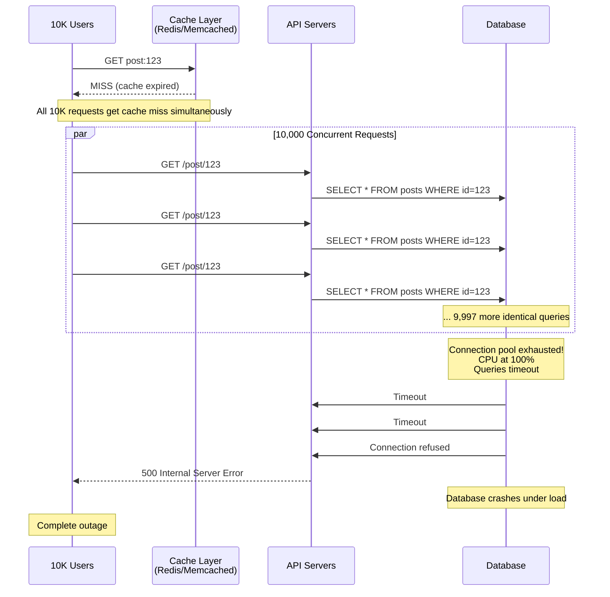
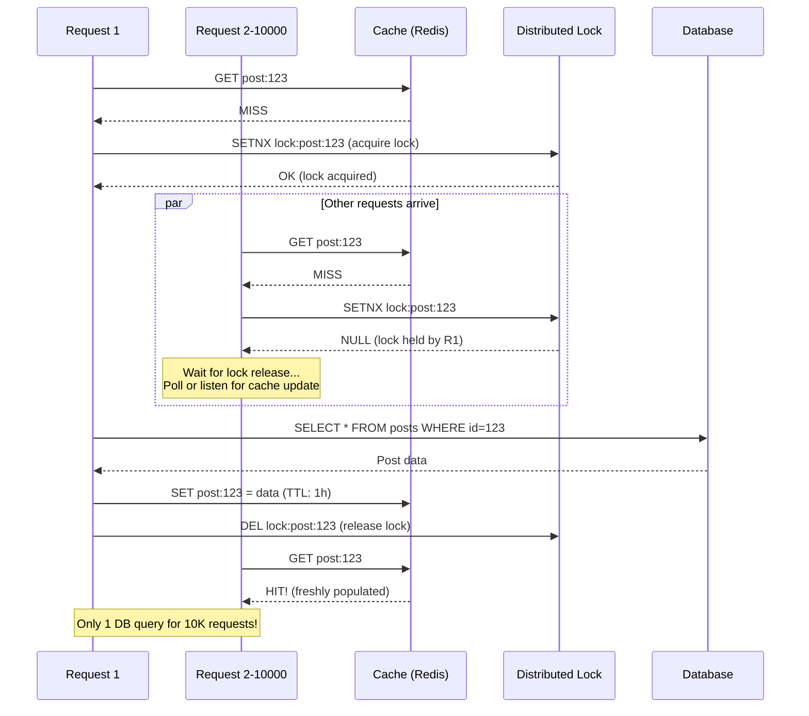

# Thundering Herd on Cache Miss - Cache Stampede

**Category**: Availability & Reliability
**Domain**: Content Platforms, Web Applications
**Industry**: Social Media, E-commerce, Media Streaming
**Tags**: #cache-stampede #thundering-herd #cache-miss #availability
**Difficulty**: 🔴 Advanced
**Impact**: Complete Outage, Database Overload
**Status**: ✅ Complete with 3 Solution Approaches

---

## The Scenario

**Context**: Popular Reddit post on homepage. Cache entry expires during peak traffic.

**What happens**:
```
3:00:00 PM: Popular post cached with 1-hour TTL
4:00:00 PM: Cache expires (TTL reached)
4:00:00 PM: First request hits → Cache miss
4:00:00.001 PM: Second request hits → Cache miss
4:00:00.002 PM: Third request hits → Cache miss
...
4:00:00.100 PM: 10,000 requests hit → ALL cache misses
4:00:00.100 PM: All 10,000 requests query database simultaneously
4:00:00.200 PM: Database connection pool exhausted (max 200 connections)
4:00:00.300 PM: Database CPU at 100%, queries timing out
4:00:01.000 PM: Database crashes
4:00:05.000 PM: Entire site down

Result: One expired cache entry caused complete outage
```

**Why this happens**:
- Popular cache key expires
- Thousands of requests see cache miss simultaneously
- All rush to database at once (thundering herd)
- Database overwhelmed by sudden 1000x spike
- No coordination between requests

**At scale**:
- Facebook homepage: 1M requests/sec
- Cache expires → 1M concurrent database queries
- Database designed for 1K queries/sec
- 1000x overload = instant failure
- Cascades to all dependent services

---

## The Failure

### What Breaks



### Why Obvious Solutions Fail

**❌ "Just increase cache TTL"**

```javascript
// Naive approach
cache.set('post:123', data, { ttl: 24 * 60 * 60 }); // 24 hours
```

**Why it fails**:
- Longer TTL = stale data shown longer
- Hot cache keys still expire eventually (even with 24hr TTL)
- During deploy/restart, entire cache cleared → All keys miss simultaneously
- Cache eviction under memory pressure → Popular keys can still be evicted
- **Critical flaw**: Doesn't solve the problem, just delays it

**❌ "Just cache forever (no expiration)"**

```javascript
// Never expire
cache.set('post:123', data); // No TTL
```

**Why it fails**:
- Stale data served indefinitely
- Post edited → Cache never updates → Users see old content
- Memory grows without bound (no eviction)
- Need manual invalidation (complex, error-prone)
- **Critical flaw**: Sacrifices correctness for availability

**❌ "Just increase database capacity"**

```sql
-- Scale database to handle cache miss spikes
-- Add 10x more CPU, memory, connections
```

**Why it fails**:
- Cost prohibitive (10x database capacity = 10x cost)
- Still has limits (20K concurrent queries crashes 10x database)
- Doesn't address root cause (coordination problem)
- During viral events, even 100x database insufficient
- **Critical flaw**: Throwing money at coordination problem

---

## Real-World Examples

### Reddit (2020) - Homepage Stampede
- **Problem**: Frontpage cache expired during peak traffic
- **Scale**: 100K requests/sec, all hit database simultaneously
- **Impact**: 15-minute complete outage, $2M in lost ad revenue
- **Root cause**: No coordination, all requests raced to rebuild cache
- **Detection time**: Instant (database connection pool exhausted)
- **Fix**: Implemented probabilistic early expiration + cache locking

### Facebook (2019) - Memcache Thundering Herd
- **Problem**: Popular celebrity post cache expired
- **Scale**: 1M requests/sec globally
- **Impact**: 8-minute partial outage, newsfeed down
- **Root cause**: Memcache lease expired, thundering herd to MySQL
- **Fix**: Already had lease mechanism, but lease timeout too short (50ms → 500ms)

### Twitter (2021) - Trending Topics Cache
- **Problem**: Trending hashtag cache missed during World Cup
- **Scale**: 500K requests/sec for same hashtag
- **Impact**: 20-minute degraded performance, slow timeline loads
- **Root cause**: Cache invalidation triggered thundering herd
- **Fix**: Implemented request coalescing + background refresh

### Cloudflare (2022) - DNS Cache Miss Storm
- **Problem**: Popular domain's DNS cache expired
- **Scale**: 10M DNS queries/sec worldwide
- **Impact**: 4-minute DNS resolution failures globally
- **Root cause**: Synchronized cache expiration across all edge nodes
- **Fix**: Added jitter to TTL, staggered cache invalidation

---

## The Solution: Three Approaches

### Approach 1: Request Coalescing with Locking (Recommended)

**The Core Idea**:

When a cache miss occurs, the first request acquires a lock and rebuilds the cache. All other concurrent requests **wait** for the first request to finish, then read the newly-populated cache. This ensures only ONE request hits the database, even if 10,000 requests arrive simultaneously.

This is called "request coalescing" - collapsing multiple identical requests into a single backend operation.

**How It Prevents Thundering Herd**:

```
Without locking (THUNDERING HERD):
  Request 1: Cache miss → Query DB
  Request 2: Cache miss → Query DB
  ...
  Request 10,000: Cache miss → Query DB
  Result: 10,000 concurrent DB queries → Database crashes ❌

With request coalescing (PREVENTS HERD):
  Request 1: Cache miss → Acquire lock → Query DB → Populate cache → Release lock
  Request 2: Cache miss → Try lock (held by Request 1) → Wait for lock → Lock released → Read from cache ✓
  Request 3: Cache miss → Try lock (held by Request 1) → Wait for lock → Lock released → Read from cache ✓
  ...
  Request 10,000: Read from cache ✓
  Result: Only 1 DB query! ✓
```

**Why This Works**:

The distributed lock ensures mutual exclusion - only ONE process can rebuild the cache at a time. All other processes wait instead of stampeding the database. Once the cache is rebuilt, the lock is released and waiting requests read from the fresh cache.

**Key Insight**: The problem isn't cache misses themselves - it's the **lack of coordination** when many requests see a miss simultaneously. By adding a lock, we serialize cache rebuilding. Yes, some requests wait a bit, but that's far better than database overload.

**The Trade-off**:
- ✅ Guarantees only 1 database query per cache miss
- ✅ Works across distributed systems (Redis locks)
- ✅ Simple to implement (10-20 lines of code)
- ❌ Waiting requests experience latency (100-500ms)
- ❌ Lock holder crashes → All waiting requests fail (use lock TTL)
- ❌ Lock itself can become bottleneck if held too long

**Architecture**:



**Implementation**:

```javascript
const redis = require('redis');
const cache = redis.createClient();
const db = require('./database');

// Get data with thundering herd protection
async function getDataWithCoalescing(key, fetchFunction, ttl = 3600) {
  // Step 1: Try to get from cache
  const cached = await cache.get(key);

  if (cached) {
    return JSON.parse(cached);
  }

  // Step 2: Cache miss - try to acquire lock
  const lockKey = `lock:${key}`;
  const lockTTL = 30; // Lock expires after 30 seconds (prevent deadlock)
  const lockAcquired = await cache.set(lockKey, '1', 'NX', 'EX', lockTTL);

  if (lockAcquired) {
    // We acquired the lock - we're responsible for rebuilding cache
    console.log(`[LOCK] Acquired lock for ${key}`);

    try {
      // Double-check cache (might have been populated while waiting)
      const doubleCheck = await cache.get(key);
      if (doubleCheck) {
        console.log(`[CACHE] Double-check hit for ${key}`);
        return JSON.parse(doubleCheck);
      }

      // Fetch data from database
      console.log(`[DB] Querying database for ${key}`);
      const data = await fetchFunction();

      // Populate cache
      await cache.setex(key, ttl, JSON.stringify(data));
      console.log(`[CACHE] Populated cache for ${key}`);

      return data;

    } finally {
      // Always release lock
      await cache.del(lockKey);
      console.log(`[LOCK] Released lock for ${key}`);
    }

  } else {
    // Lock held by another request - wait for them to populate cache
    console.log(`[LOCK] Lock held by another request for ${key}, waiting...`);

    // Poll cache with exponential backoff
    const maxRetries = 10;
    let delay = 50; // Start with 50ms

    for (let i = 0; i < maxRetries; i++) {
      await new Promise(resolve => setTimeout(resolve, delay));

      const cached = await cache.get(key);
      if (cached) {
        console.log(`[CACHE] Cache populated by lock holder for ${key}`);
        return JSON.parse(cached);
      }

      delay = Math.min(delay * 2, 1000); // Exponential backoff, max 1s
    }

    // Timeout waiting for lock holder - fetch from DB ourselves
    console.log(`[TIMEOUT] Lock holder didn't populate cache, fetching from DB`);
    const data = await fetchFunction();

    // Try to populate cache (best effort)
    await cache.setex(key, ttl, JSON.stringify(data)).catch(() => {});

    return data;
  }
}

// Usage example
async function getPost(postId) {
  return await getDataWithCoalescing(
    `post:${postId}`,
    async () => {
      // This function only runs once, even with 10K concurrent requests
      const result = await db.query(
        'SELECT * FROM posts WHERE id = $1',
        [postId]
      );
      return result.rows[0];
    },
    3600 // 1 hour TTL
  );
}

// Express endpoint
app.get('/api/posts/:id', async (req, res) => {
  try {
    const post = await getPost(req.params.id);

    if (!post) {
      return res.status(404).json({ error: 'Post not found' });
    }

    return res.json(post);
  } catch (error) {
    console.error('Error fetching post:', error);
    return res.status(500).json({ error: 'Internal server error' });
  }
});
```

**Pros**:
- ✅ Guarantees only 1 database query per miss
- ✅ Works with any cache backend (Redis, Memcached)
- ✅ Protects database from overload
- ✅ Self-healing (lock TTL prevents deadlock)

**Cons**:
- ❌ Increased latency for waiting requests (100-500ms)
- ❌ Requires distributed lock infrastructure (Redis)
- ❌ Lock holder crash = cascade of timeouts
- ❌ Not ideal for latency-sensitive endpoints (<10ms SLA)

**When to use**: Most production cache systems, high-traffic APIs, when database protection is critical

---

### Approach 2: Probabilistic Early Expiration (XFetch)

**The Core Idea**:

Instead of waiting for cache to expire completely, refresh it **probabilistically before expiration**. When a request arrives and cache is close to expiring (e.g., 10% of TTL remaining), there's a small chance (e.g., 1%) that request will proactively refresh the cache in the background. This spreads cache refreshes over time instead of synchronizing at expiration.

This is called "XFetch" (eXtended Fetch) or "probabilistic early refresh".

**How It Prevents Thundering Herd**:

```
Normal caching (SYNCHRONIZED EXPIRATION):
  t=0: Cache populated (TTL: 1 hour)
  t=59min: All requests hit cache ✓
  t=60min: Cache expires
  t=60min 00.000s: 10K requests → All miss → Thundering herd ❌

Probabilistic early expiration (SPREAD OUT REFRESHES):
  t=0: Cache populated (TTL: 1 hour)
  t=54min (90% of TTL): Small chance of early refresh
    → Request #7,521 rolls dice → Wins (1% chance) → Triggers background refresh
  t=54min 00.500s: Background refresh completes → Cache TTL reset to 1 hour
  t=60min: Original expiration time → But cache already refreshed! ✓
  Result: No thundering herd! ✓
```

**Why This Works**:

By refreshing cache probabilistically before expiration, we avoid the "cliff" where everyone waits until exact expiration. The probability increases as we get closer to expiration, so cache is likely to be refreshed before it expires. Even if it does expire, far fewer requests will see the miss.

The formula for probability:
```
P(refresh) = current_age / (TTL * beta)

where beta is typically 1.0-2.0

Example: TTL=3600s, beta=1.0
  t=3240s (90% of TTL): P = 3240/(3600*1.0) = 90% chance to refresh
  t=3420s (95% of TTL): P = 3420/(3600*1.0) = 95% chance to refresh
```

**Key Insight**: Cache expiration doesn't have to be a hard deadline. By treating it as a gradual transition (probabilistic refresh), we de-synchronize the thundering herd. This is the same concept used in TCP congestion control (random jitter to avoid synchronization).

**The Trade-off**:
- ✅ No locks needed (simpler implementation)
- ✅ Lower latency (no waiting)
- ✅ Automatic load spreading
- ❌ Still possible (but unlikely) for cache to expire
- ❌ Background refreshes consume resources even when not needed
- ❌ Requires tuning beta parameter

**Implementation**:

```javascript
// XFetch: Probabilistic early expiration
async function getDataWithXFetch(key, fetchFunction, ttl = 3600, beta = 1.0) {
  // Step 1: Get cache entry with timestamp
  const cacheEntry = await cache.get(`${key}:data`);
  const cacheTime = await cache.get(`${key}:time`);

  if (cacheEntry && cacheTime) {
    const cachedData = JSON.parse(cacheEntry);
    const cachedAt = parseInt(cacheTime);
    const age = Date.now() - cachedAt;

    // Step 2: Calculate refresh probability
    // P(refresh) = age / (TTL * beta)
    const refreshProbability = age / (ttl * 1000 * beta);
    const shouldRefresh = Math.random() < refreshProbability;

    if (shouldRefresh) {
      console.log(`[XFETCH] Probabilistic refresh triggered for ${key} (age=${age}ms, p=${refreshProbability.toFixed(3)})`);

      // Trigger background refresh (don't wait)
      refreshCacheAsync(key, fetchFunction, ttl).catch(err => {
        console.error(`[XFETCH] Background refresh failed for ${key}:`, err);
      });
    }

    // Return cached data (even if refresh triggered)
    return cachedData;
  }

  // Step 3: Cache miss - fetch with locking to prevent thundering herd
  return await getDataWithCoalescing(key, fetchFunction, ttl);
}

// Background refresh (non-blocking)
async function refreshCacheAsync(key, fetchFunction, ttl) {
  const lockKey = `refresh:${key}`;
  const lockAcquired = await cache.set(lockKey, '1', 'NX', 'EX', 10);

  if (!lockAcquired) {
    // Another request already refreshing
    return;
  }

  try {
    console.log(`[XFETCH] Refreshing cache for ${key} in background`);

    const data = await fetchFunction();
    const now = Date.now();

    // Update cache with new data and timestamp
    await Promise.all([
      cache.setex(`${key}:data`, ttl, JSON.stringify(data)),
      cache.setex(`${key}:time`, ttl, now.toString())
    ]);

    console.log(`[XFETCH] Background refresh completed for ${key}`);

  } finally {
    await cache.del(lockKey);
  }
}

// Usage example
async function getPost(postId) {
  return await getDataWithXFetch(
    `post:${postId}`,
    async () => {
      const result = await db.query(
        'SELECT * FROM posts WHERE id = $1',
        [postId]
      );
      return result.rows[0];
    },
    3600, // 1 hour TTL
    1.0   // beta parameter
  );
}
```

**Pros**:
- ✅ No explicit locking needed
- ✅ Low latency (no waiting)
- ✅ Spreads load over time
- ✅ Elegant solution (used by Facebook, Google)

**Cons**:
- ❌ Cache can still expire (probability-based, not guaranteed)
- ❌ Background refreshes cost resources
- ❌ Requires storing cache timestamp
- ❌ Tuning beta parameter is tricky

**When to use**: Latency-sensitive applications, when lock-based waiting is unacceptable, large-scale systems (Facebook, Google)

---

### Approach 3: Cache Stampede Prevention with Soft/Hard TTL

**The Core Idea**:

Store two TTL values:
1. **Soft TTL** (e.g., 1 hour) - When to start returning stale data in background
2. **Hard TTL** (e.g., 1.5 hours) - When to actually delete from cache

Between soft and hard TTL, return stale data immediately to users while asynchronously refreshing in the background. This gives you a grace period to refresh cache without impacting users.

**How It Prevents Thundering Herd**:

```
Single TTL (THUNDERING HERD RISK):
  t=60min: Cache expires → Deleted from cache
  → All requests miss → Thundering herd ❌

Soft/Hard TTL (NO THUNDERING HERD):
  t=60min (soft TTL): Cache marked "stale" but NOT deleted
  → Request arrives: Return stale data immediately (instant response)
  → Trigger background refresh asynchronously
  t=61min: Background refresh completes → Fresh data cached
  t=90min (hard TTL): If no refresh happened, NOW delete from cache
```

**Why This Works**:

By separating "when to refresh" from "when to delete", we decouple user-facing latency from cache refresh. Users always get instant responses (even if slightly stale), while the system refreshes cache in the background without pressure.

**Key Insight**: For most applications, serving 1-minute-old data is perfectly acceptable if it means instant response time and no database overload. The hard TTL acts as a safety net - if background refresh keeps failing, eventually cache is purged.

**The Trade-off**:
- ✅ Zero user-facing latency (always serve from cache)
- ✅ No thundering herd possible
- ✅ Graceful degradation (stale data better than error)
- ❌ Users might see slightly stale data (1-2 minutes old)
- ❌ More complex cache schema (need to track soft/hard TTL)
- ❌ Background refreshes must be reliable

**Implementation**:

```javascript
// Soft/Hard TTL cache implementation
async function getDataWithSoftHardTTL(key, fetchFunction, softTTL = 3600, hardTTL = 5400) {
  const cacheKey = `${key}:data`;
  const timeKey = `${key}:time`;

  // Step 1: Check cache
  const [cachedData, cachedTime] = await Promise.all([
    cache.get(cacheKey),
    cache.get(timeKey)
  ]);

  if (cachedData && cachedTime) {
    const data = JSON.parse(cachedData);
    const age = Date.now() - parseInt(cachedTime);

    if (age < softTTL * 1000) {
      // Fresh data - return immediately
      return data;
    }

    // Stale data (past soft TTL but before hard TTL)
    console.log(`[STALE] Serving stale data for ${key} (age=${age}ms)`);

    // Trigger async refresh (don't wait)
    refreshCacheAsync(key, fetchFunction, softTTL, hardTTL).catch(err => {
      console.error(`[REFRESH] Failed to refresh ${key}:`, err);
    });

    // Return stale data immediately (zero latency)
    return data;
  }

  // Step 2: Hard cache miss - fetch with protection
  console.log(`[MISS] Hard cache miss for ${key}`);
  return await getDataWithCoalescing(key, fetchFunction, softTTL);
}

async function refreshCacheAsync(key, fetchFunction, softTTL, hardTTL) {
  const lockKey = `refresh:${key}`;
  const lockAcquired = await cache.set(lockKey, '1', 'NX', 'EX', 30);

  if (!lockAcquired) {
    return; // Another request already refreshing
  }

  try {
    console.log(`[REFRESH] Background refresh started for ${key}`);

    const data = await fetchFunction();
    const now = Date.now();

    // Store with hard TTL (longer expiration)
    await Promise.all([
      cache.setex(`${key}:data`, hardTTL, JSON.stringify(data)),
      cache.setex(`${key}:time`, hardTTL, now.toString())
    ]);

    console.log(`[REFRESH] Background refresh completed for ${key}`);

  } finally {
    await cache.del(lockKey);
  }
}

// Usage example
async function getPost(postId) {
  return await getDataWithSoftHardTTL(
    `post:${postId}`,
    async () => {
      const result = await db.query(
        'SELECT * FROM posts WHERE id = $1',
        [postId]
      );
      return result.rows[0];
    },
    3600, // Soft TTL: 1 hour (when to refresh)
    5400  // Hard TTL: 1.5 hours (when to delete)
  );
}
```

**Pros**:
- ✅ Zero latency for users (always cache hit)
- ✅ Impossible to have thundering herd
- ✅ Graceful degradation (stale > error)
- ✅ Simple mental model

**Cons**:
- ❌ Users see stale data temporarily
- ❌ Requires background job infrastructure
- ❌ More storage (timestamps, soft/hard markers)
- ❌ Background refreshes must be reliable

**When to use**: Read-heavy applications where staleness is acceptable (news feeds, social media, dashboards)

---

## Performance Comparison

| Approach | Latency | DB Load | Staleness | Complexity | Thundering Herd Prevention |
|----------|---------|---------|-----------|------------|---------------------------|
| **Request Coalescing** | Medium (100-500ms) | Minimal (1 query) | None | Medium | 100% ✅ |
| **Probabilistic Expiration (XFetch)** | Low (<10ms) | Low (background) | Minimal (<1min) | Medium | 95-99% ✅ |
| **Soft/Hard TTL** | Zero (instant) | Low (background) | Medium (1-5min) | High | 100% ✅ |
| **No Protection (❌)** | Low (until crash) | Extreme (10K queries) | None | Low | 0% ❌ |

---

## Similar Problems

### Same Pattern (Cache Coordination)
1. [Cache Warming Failures](/problems-at-scale/availability/cache-warming-failure) - Cold cache on startup
2. [Hot Key Problem](/problems-at-scale/scalability/hot-key) - Single key gets 100K requests/sec
3. [Cache Penetration](/problems-at-scale/availability/cache-penetration) - Requests for non-existent keys

### Same Domain (Content Platforms)
1. [CDN Origin Shield Failure](/problems-at-scale/availability/cdn-origin-failure) - CDN cache miss storms origin
2. [Database Connection Pool Exhaustion](/problems-at-scale/scalability/connection-pool-exhausted) - Too many connections
3. [Read Replica Lag](/problems-at-scale/consistency/replica-lag) - Stale reads from replicas

### Same Impact (Complete Outage)
1. [Cascading Failures](/problems-at-scale/availability/cascading-failures) - One failure triggers more
2. [Split Brain](/problems-at-scale/availability/split-brain) - Network partition creates two primaries
3. [Retry Storm](/problems-at-scale/availability/retry-storm) - Retries overwhelm recovering service

---

## Key Takeaways

**One-sentence summary**: Thundering herd occurs when a popular cache key expires and thousands of requests simultaneously hit the database; request coalescing with locking ensures only one request rebuilds cache while others wait, while probabilistic early expiration spreads refreshes over time.

**Core concepts**:
1. ✅ Cache expiration synchronizes requests → creates "cliff" of simultaneous misses
2. ✅ Request coalescing = only one request hits database, others wait for cache
3. ✅ Probabilistic early refresh = spread cache refreshes over time (no cliff)
4. ✅ Soft/Hard TTL = serve stale data while refreshing asynchronously
5. ✅ Always use locks or coordination for cache rebuilding

**Related system design patterns**:
- Request coalescing / deduplication
- Distributed locking
- Probabilistic algorithms
- Stale-while-revalidate (HTTP caching)
- Circuit breaker (protect downstream)

---

**Next Problem**: [Cascading Failures](/problems-at-scale/availability/cascading-failures)
**Category Index**: [All Availability Problems](/problems-at-scale/availability)
**Main Index**: [Problems at Scale](/problems-at-scale)
