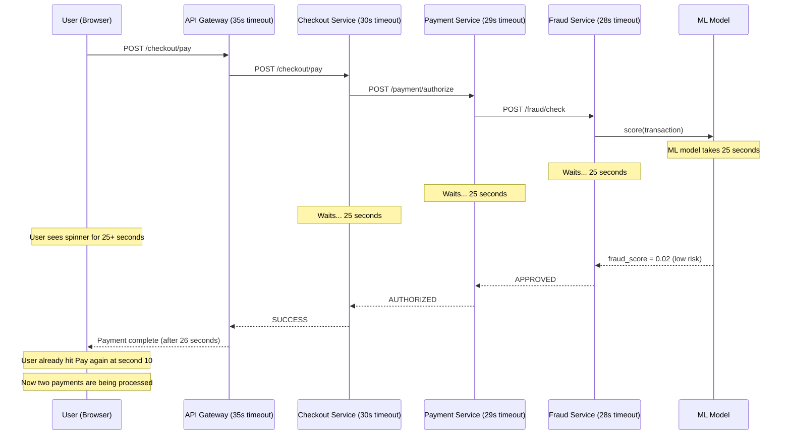
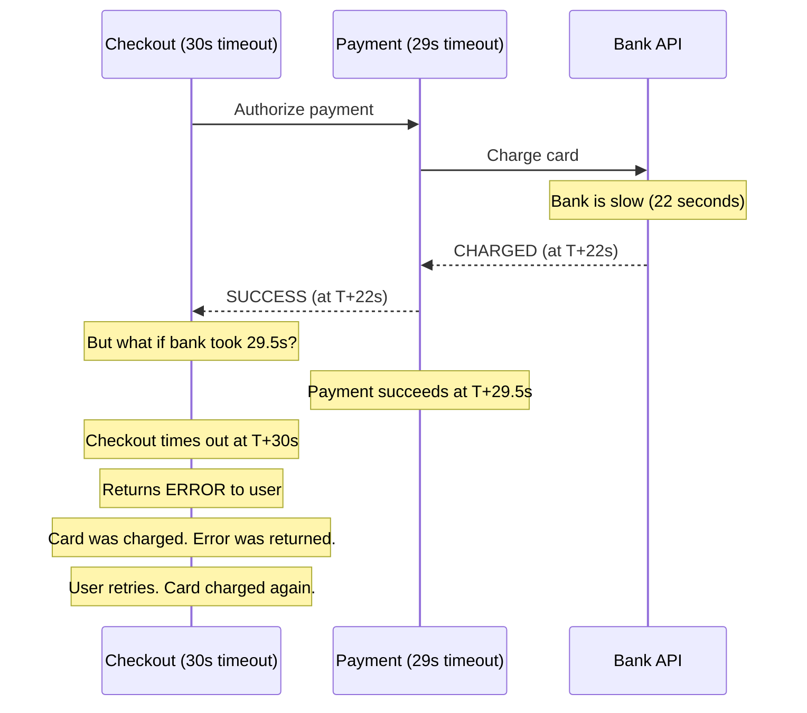

# Timeout Domino Effect: You've Built a Latency Amplifier

**The checkout service has a 30-second timeout. The payment service it calls has a 29-second timeout. The fraud service it calls has a 28-second timeout. When fraud service takes 25 seconds (due to a slow ML model), every request through this stack takes 25+ seconds. Users see the spinner. They hit 'Pay' again. Thread pools fill. The checkout service times out after 30 seconds. Payments are retried. Fraud is called again. The 25-second model call is now called 3× per original request. You've built a timeout amplifier.**

---

## The Problem Class `[Availability — Severity: High]`

Timeouts are supposed to be the first line of defense against slow dependencies. But timeouts in distributed systems don't compose safely. Without explicit deadline propagation, nested timeouts create a waterfall of maximum-duration waits at every layer, compounding latency rather than bounding it. Worse, when a timeout occurs at the top layer while downstream work is still in progress, you waste resources on requests whose responses will never be consumed.

---

## Why This Happens

### The Nested Timeout Problem

Each service in a call chain configures its own timeout independently. Without coordination, each picks a "safe" value that's slightly less than the layer above it. The result: timeouts don't add protection — they add latency.



The timeout values (35s, 30s, 29s, 28s) never trigger — the request succeeds in 25 seconds. But from the user's perspective, 25 seconds is unacceptable. The timeouts are set to protect against the pathological case, but they've done nothing to *enforce* an acceptable user experience latency.

### Why Timeouts Don't Compose

If you add the timeout budgets naively: 30s + 29s + 28s = 87 seconds total possible worst case (if each layer reaches its limit sequentially). This is obviously absurd for a payment flow. But engineers set each timeout in isolation without thinking about the cascade.

More insidiously: if Checkout has a 30-second timeout and calls Payment with a 29-second timeout, then Payment completes in 29.5 seconds — Payment succeeds but Checkout times out. **You've charged the user's card but returned an error to them.**



### The Ghost Work Problem

When a parent service times out, it stops waiting for the response. But downstream services don't know the parent has given up — they continue processing. An ML fraud check that takes 25 seconds continues running even after Checkout has returned an error to the user. This "ghost work" consumes database connections, CPU, and memory for requests whose results will never be used.

At scale, ghost work can consume 30-50% of total compute capacity during degradation events.

---

## Real-World Impact

**Google's "Dapper" distributed tracing paper** specifically documents this problem as a motivation for deadline propagation in their RPC framework. Google's internal systems propagate a `deadline` with every RPC call, and services cancel their downstream work when the deadline passes.

**gRPC deadline propagation**: gRPC was designed with this problem in mind. Every gRPC call carries a `deadline` in its metadata — absolute timestamp by which the caller expects a response. Every hop in the call chain uses the same deadline. When the deadline passes, all services in the chain cancel their pending work simultaneously.

**Stripe's payment flow**: Stripe's engineering team has written about the danger of timeout mismatches in payment flows specifically — where a charge can succeed downstream while an error is returned upstream, causing duplicate charges. Their solution combines idempotency keys with tight deadline tracking.

---

## The Wrong Fix

### "Just Reduce All Timeouts to 5 Seconds"

Aggressively reducing timeouts causes false failures. The P99 latency of your ML fraud model is 8 seconds — a 5-second timeout would fail 1% of legitimate payments. That's not an acceptable trade-off.

Reducing timeouts doesn't solve the fundamental problem: each layer still makes independent timeout decisions without knowledge of how much time has already been spent upstream.

### "Add More Caching"

Caching the fraud score helps with throughput but doesn't solve the timeout composition problem for cache misses or first-time transactions.

---

## The Right Solutions

### Solution 1: Deadline Propagation — Pass the Remaining Time Budget

Instead of each service having its own timeout, the *original requestor's deadline* is propagated through the entire call chain. Each service computes how much time remains and uses that as its downstream timeout.

```javascript
// deadline-context.js
function createDeadlineContext(totalBudgetMs) {
  const deadline = Date.now() + totalBudgetMs;
  return {
    deadline,
    getRemainingMs: () => Math.max(0, deadline - Date.now()),
    isExpired: () => Date.now() >= deadline,
  };
}

// In Checkout Service — entry point creates the deadline
app.post('/checkout/pay', async (req, res) => {
  const ctx = createDeadlineContext(5000); // 5 second total budget for the entire flow

  try {
    const result = await processPayment(req.body, ctx);
    res.json(result);
  } catch (err) {
    if (ctx.isExpired()) {
      res.status(504).json({ error: 'Request timed out' });
    } else {
      res.status(500).json({ error: err.message });
    }
  }
});

// In Checkout — passes deadline to Payment
async function processPayment(payload, ctx) {
  const remaining = ctx.getRemainingMs();
  if (remaining < 100) { // Not enough time to make a call
    throw new Error('Insufficient time budget remaining');
  }

  // Pass remaining budget as timeout to downstream call
  const response = await axios.post(
    'http://payment-service/authorize',
    {
      ...payload,
      deadline: ctx.deadline, // Pass absolute deadline to downstream
    },
    {
      timeout: remaining, // Axios timeout = remaining budget
      headers: {
        'X-Request-Deadline': ctx.deadline, // Also in header for middleware
      }
    }
  );

  return response.data;
}
```

```javascript
// In Payment Service — reads deadline from incoming request
app.post('/authorize', async (req, res) => {
  // Reconstruct deadline context from incoming request
  const incomingDeadline = req.headers['x-request-deadline']
    ? parseInt(req.headers['x-request-deadline'])
    : Date.now() + 29000; // Fallback if no deadline propagated (legacy clients)

  const ctx = {
    deadline: incomingDeadline,
    getRemainingMs: () => Math.max(0, incomingDeadline - Date.now()),
    isExpired: () => Date.now() >= incomingDeadline,
  };

  if (ctx.isExpired()) {
    return res.status(504).json({ error: 'Deadline already exceeded' });
  }

  // Call fraud service with remaining budget
  const remaining = ctx.getRemainingMs();
  const fraudCheck = await axios.post(
    'http://fraud-service/check',
    req.body,
    {
      timeout: Math.min(remaining, 10000), // Cap at 10s for fraud check
      headers: { 'X-Request-Deadline': ctx.deadline }
    }
  );

  // ... rest of payment processing
});
```

### Solution 2: Context Cancellation with AbortController

When a parent request times out or is cancelled, propagate cancellation to all in-flight downstream calls. This prevents ghost work from consuming resources.

```javascript
// abort-controller-propagation.js
async function processCheckoutWithCancellation(payload, totalBudgetMs = 5000) {
  // Create a root AbortController for this request
  const controller = new AbortController();
  const { signal } = controller;

  // Automatically cancel after budget
  const timeoutId = setTimeout(() => {
    controller.abort(new Error('Request deadline exceeded'));
  }, totalBudgetMs);

  try {
    const result = await executeCheckoutFlow(payload, signal);
    clearTimeout(timeoutId);
    return result;
  } catch (err) {
    if (err.name === 'AbortError' || signal.aborted) {
      throw new Error('Checkout timed out after ' + totalBudgetMs + 'ms');
    }
    throw err;
  } finally {
    clearTimeout(timeoutId);
    controller.abort(); // Cancel any remaining downstream work
  }
}

async function executeCheckoutFlow(payload, signal) {
  // Pass signal to all downstream calls
  const paymentResult = await callPaymentService(payload, signal);
  const inventoryResult = await updateInventory(payload, signal);
  return { paymentResult, inventoryResult };
}

async function callPaymentService(payload, signal) {
  // Pass AbortController signal to fetch
  const response = await fetch('http://payment-service/authorize', {
    method: 'POST',
    body: JSON.stringify(payload),
    signal, // fetch respects AbortController signal
    headers: { 'Content-Type': 'application/json' }
  });

  if (!response.ok) throw new Error(`Payment failed: ${response.status}`);
  return response.json();
}

// Payment Service receives the abort and propagates it
async function handlePaymentRequest(req, res) {
  const { signal } = req; // Express 5+ provides this; or use custom middleware

  // When client disconnects or times out, req.signal is aborted
  signal?.addEventListener('abort', () => {
    console.log('Client cancelled — stopping downstream fraud check');
    fraudController.abort(); // Propagate to fraud service
  });

  const fraudController = new AbortController();
  const fraudResult = await callFraudService(req.body, fraudController.signal);
  // ...
}
```

### Solution 3: Budget-Based Timeout Allocation

Explicitly allocate portions of the total deadline to each layer. Each service knows what fraction of the overall budget it's allowed to spend.

```javascript
// timeout-budget.js
class TimeoutBudget {
  constructor(totalMs) {
    this.startTime = Date.now();
    this.totalMs = totalMs;
    this.allocations = new Map(); // track how each service was allocated
  }

  // Allocate a percentage of total budget to a downstream call
  allocate(service, percentageOfTotal) {
    const allocated = this.totalMs * percentageOfTotal;
    const remaining = this.totalMs - (Date.now() - this.startTime);
    const actual = Math.min(allocated, remaining - 50); // Keep 50ms buffer

    this.allocations.set(service, actual);

    if (actual <= 0) {
      throw new Error(`No time budget remaining for ${service}`);
    }

    return actual;
  }

  remaining() {
    return Math.max(0, this.totalMs - (Date.now() - this.startTime));
  }
}

// Usage in checkout flow with explicit budget allocation
async function processCheckoutBudgeted(payload) {
  const budget = new TimeoutBudget(5000); // 5 second total budget

  // Budget allocation:
  // 20% (1s)  — fraud check (most time-sensitive, run first)
  // 40% (2s)  — payment authorization (core operation)
  // 20% (1s)  — inventory reservation
  // 20% (1s)  — buffer for checkout service own work + network overhead

  const fraudTimeout = budget.allocate('fraud', 0.20);
  const fraudResult = await callWithTimeout(
    () => fraudService.check(payload),
    fraudTimeout
  );

  if (fraudResult.score > 0.8) {
    throw new Error('Transaction declined by fraud detection');
  }

  const paymentTimeout = budget.allocate('payment', 0.40);
  const paymentResult = await callWithTimeout(
    () => paymentService.authorize(payload),
    paymentTimeout
  );

  const inventoryTimeout = budget.allocate('inventory', 0.20);
  await callWithTimeout(
    () => inventoryService.reserve(payload),
    inventoryTimeout
  );

  return { fraudResult, paymentResult };
}

async function callWithTimeout(fn, timeoutMs) {
  return Promise.race([
    fn(),
    new Promise((_, reject) =>
      setTimeout(() => reject(new Error(`Operation timed out after ${timeoutMs}ms`)), timeoutMs)
    )
  ]);
}
```

### Solution 4: Async Decoupling for Non-Critical Paths

Not every step in a flow needs to be synchronous. Payment confirmation emails, analytics events, recommendation updates — these can all be published to a queue and processed asynchronously, removing them from the synchronous deadline budget entirely.

```javascript
// Before: synchronous chain — every step adds to the critical path
async function processCheckout(payload) {
  const payment = await paymentService.authorize(payload);  // 2s — CRITICAL
  const inventory = await inventoryService.reserve(payload); // 1s — CRITICAL
  await emailService.sendConfirmation(payload);              // 3s — NOT CRITICAL
  await analyticsService.recordPurchase(payload);            // 1s — NOT CRITICAL
  await recommendationService.updateHistory(payload);        // 2s — NOT CRITICAL
  // Total: 9 seconds
}

// After: synchronous only for critical path, async for the rest
async function processCheckoutOptimized(payload) {
  // Critical path — must complete synchronously
  const [payment, inventory] = await Promise.all([
    paymentService.authorize(payload),    // 2s (parallel)
    inventoryService.reserve(payload),    // 1s (parallel)
  ]);
  // Total critical path: 2 seconds (parallel execution)

  // Non-critical: fire-and-forget via message queue
  await messageQueue.publish('checkout.completed', {
    payload,
    payment,
    inventory,
  });
  // Email, analytics, recommendations are consumers of this event
  // They run asynchronously — their latency doesn't affect the user

  return { payment, inventory };
}
```

**gRPC deadlines in practice**: gRPC automatically propagates the deadline through the metadata of every RPC call. When a deadline is exceeded, gRPC cancels the RPC on both client and server sides, freeing server resources immediately. This is why Google recommends gRPC for internal service communication — deadline propagation is built-in, not bolted-on.

---

## Detection: How to Know You Have This Problem

**Request duration histogram with long tail**: If P50 latency is 200ms but P99 is 28 seconds, you have requests hitting near-timeout values. These are the ones going through the full timeout waterfall.

**Correlated timeouts across service tiers**: If Checkout, Payment, and Fraud all show timeout spikes at the same time with similar durations, they're waiting for the same underlying slow operation — not independently failing.

**Ghost work metric**: Compare `requests_received` vs `responses_sent` per service. If `requests_received` consistently exceeds `responses_sent` (i.e., requests are arriving but not completing), you have ghost work accumulating.

```javascript
// Metric: track request lifecycle
const activeRequests = new Map();

app.use((req, res, next) => {
  const requestId = req.headers['x-request-id'];
  activeRequests.set(requestId, Date.now());
  metrics.gauge('active_requests', activeRequests.size);

  res.on('finish', () => {
    const duration = Date.now() - activeRequests.get(requestId);
    activeRequests.delete(requestId);
    metrics.histogram('request_duration_ms', duration);
    metrics.gauge('active_requests', activeRequests.size);
  });

  next();
});
```

**Alert**: If `active_requests` grows monotonically over 2+ minutes, ghost work is accumulating.

---

## Prevention Patterns Checklist

- [ ] All entry points define a total request deadline (not per-hop timeout)
- [ ] Deadline is propagated via HTTP header (`X-Request-Deadline`) or gRPC metadata through all service calls
- [ ] Each service computes downstream timeout as: `min(remaining_budget, service_max_timeout)`
- [ ] AbortController signals are passed to all async downstream calls so cancellation propagates
- [ ] Non-critical operations (email, analytics, recommendations) are decoupled to async queues
- [ ] Request duration histogram is monitored — alert on P99 > acceptable threshold
- [ ] "Ghost work" metric: active requests gauge; alert if it grows without bound
- [ ] Timeout values per service are documented and their sum compared to overall SLA
- [ ] Payment and other side-effect operations use idempotency keys to handle timeout/retry safely
- [ ] Load test includes "one slow downstream" scenario to verify deadline propagation

---

## Related Problems

- [Cascading Failures](./cascading-failures) — Timeout waterfall fills thread pools in the same way as cascading failures
- [Retry Storm](./retry-storm) — Timeouts trigger retries; without deadline propagation, retries amplify the problem
- [Split-Brain](./split-brain) — Timeout waiting for consensus can cause split-brain in distributed systems
