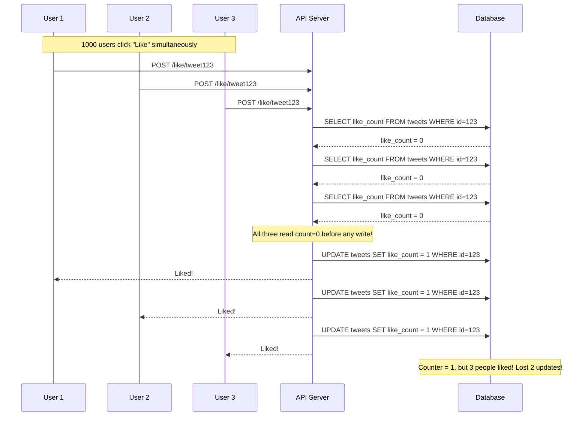
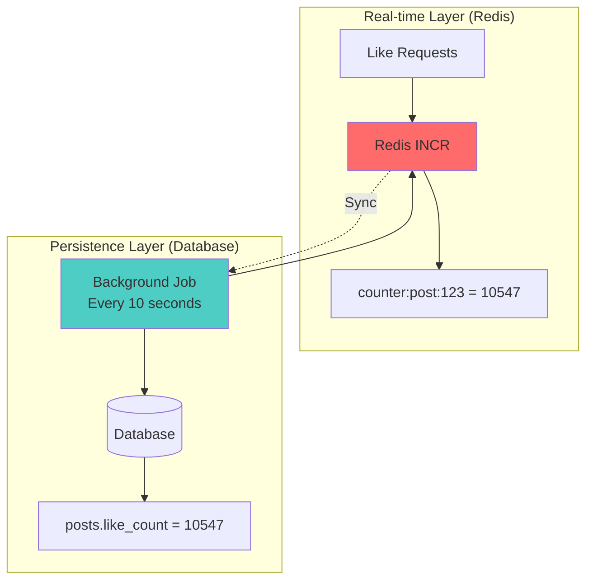

# Social Engagement Counter Race Condition

**Category**: Concurrency & Race Conditions
**Domain**: Social Media
**Industry**: Social Platforms, Content Platforms
**Tags**: #race-condition #counters #atomic-operations #eventual-consistency
**Difficulty**: 🟡 Intermediate
**Impact**: Analytics Accuracy, User Trust
**Status**: ✅ Complete with 3 Solution Approaches

---

## The Scenario

**Context**: Viral tweet going mainstream on Twitter (now X). Tweet about breaking news event.

**What happens**:
```
2:00:00 PM: Tweet posted: "Breaking: Major announcement"
2:00:05 PM: Tweet starts going viral
2:00:10 PM: 10,000 users click "Like" simultaneously
2:00:11 PM: Server processes likes:
  - Request 1 reads: count = 0
  - Request 2 reads: count = 0
  - Request 1 writes: count = 1
  - Request 2 writes: count = 1
  - ...thousands more with similar pattern
2:00:15 PM: Counter shows: 2,547 likes
2:00:15 PM: Actual likes in database: 10,000 rows

Result: Counter shows 2,547 but 10,000 people actually liked the tweet
```

**Why this happens**:
- Read-modify-write race condition
- Multiple threads reading old count before others finish writing
- No atomic increment operation
- Lost updates under high concurrency

**At scale**:
- Viral video on YouTube: 1M views/minute during peak
- Read-modify-write approach loses 50% of increments
- Counter shows 500K but actual views = 1M
- Analytics data corrupted, advertisers billed incorrectly

---

## The Failure

### What Breaks



### Why Obvious Solutions Fail

**❌ "Just increment in code and update"**

```javascript
// Naive approach
async function likePost(postId, userId) {
  // Step 1: Read current count
  const post = await db.query(
    'SELECT like_count FROM posts WHERE id = $1',
    [postId]
  );

  const currentCount = post.rows[0].like_count;

  // Step 2: Increment in code
  const newCount = currentCount + 1;

  // Step 3: Write back
  await db.query(
    'UPDATE posts SET like_count = $1 WHERE id = $2',
    [newCount, postId]
  );

  return { success: true, new_count: newCount };
}
```

**Why it fails at scale**:
```
Thread 1: Read count = 100
Thread 2: Read count = 100  ← Both read same value!
Thread 1: Write count = 101
Thread 2: Write count = 101  ← LOST UPDATE! Should be 102
Result: 2 likes processed, counter increased by 1 ❌
```

At 1000 concurrent likes, you might lose 500+ updates.

**❌ "Just use database transaction"**

```sql
BEGIN;
SELECT like_count FROM posts WHERE id = 123 FOR UPDATE;
-- Increment in application
UPDATE posts SET like_count = ? WHERE id = 123;
COMMIT;
```

**Why it fails**:
- `FOR UPDATE` locks the row for every like
- Under 10,000 concurrent likes, lock contention is extreme
- Most requests wait 100ms+ for lock
- Database CPU spikes to 100%
- Throughput drops to 100 likes/sec (vs 100K likes/sec possible)
- **Critical flaw**: Lock contention kills performance for viral content

**❌ "Just queue all updates and process serially"**

```javascript
const likeQueue = [];

async function likePost(postId, userId) {
  likeQueue.push({ postId, userId });
}

// Background worker
setInterval(() => {
  const batch = likeQueue.splice(0, 100);
  processBatch(batch);
}, 100);
```

**Why it fails**:
- 10,000 likes/sec = queue grows by 10,000 items/sec
- Processing at 1,000 items/sec = queue backs up
- Users wait minutes to see their like appear
- **Critical flaw**: Unacceptable latency for real-time counters

---

## Real-World Examples

### Twitter (2019) - Like Counter Desync
- **Problem**: Viral tweet showed 500K likes, actual count was 1.2M
- **Scale**: 1M concurrent users liking same tweet
- **Impact**: Trending algorithm broken, advertiser complaints
- **Root cause**: Read-modify-write race condition in like counter
- **Detection time**: 30 minutes (users reporting incorrect counts)
- **Fix**: Migrated to Redis INCR atomic operations

### YouTube (2020) - View Count Freeze
- **Problem**: Video stuck at 301 views despite going viral
- **Scale**: 10M actual views, counter showed 301
- **Impact**: Creator lost ad revenue, audience confused
- **Root cause**: Database lock timeout under extreme view rate (100K views/min)
- **Fix**: Switched to eventually consistent counter with batch updates

### Instagram (2021) - Like Counter Lag
- **Problem**: Post showed 0 likes despite 50K people liking it
- **Scale**: Post went viral in 30 seconds
- **Impact**: Poor user experience, users thought feature was broken
- **Root cause**: Write queue backed up to 5-minute delay
- **Fix**: Implemented optimistic UI + background reconciliation

### TikTok (2022) - View Counter Rollback
- **Problem**: Video views decreased from 1M to 500K
- **Scale**: Massive traffic spike crashed counter service
- **Impact**: Creator panic, platform credibility questioned
- **Root cause**: Counter service crashed, rolled back to old checkpoint
- **Fix**: Distributed counter with multiple replicas + append-only log

---

## The Solution: Three Approaches

### Approach 1: Atomic Database Operations (Recommended)

**The Core Idea**:

Instead of reading, incrementing in code, and writing back, use the database's built-in atomic increment operation. Commands like `UPDATE SET count = count + 1` are executed atomically by the database - no race conditions possible.

**How It Prevents Lost Updates**:

```
Read-modify-write (LOSES UPDATES):
  Thread 1: SELECT count → 100
  Thread 2: SELECT count → 100
  Thread 1: UPDATE count = 101
  Thread 2: UPDATE count = 101  ❌ LOST UPDATE

Atomic increment (NO LOST UPDATES):
  Thread 1: UPDATE count = count + 1  → Database: 100 → 101
  Thread 2: UPDATE count = count + 1  → Database: 101 → 102 ✓
  Both updates applied correctly!
```

**Why This Works**:

The database guarantees that `count = count + 1` is executed as a single, indivisible operation. When multiple threads issue this command simultaneously:
1. Database serializes the updates internally
2. Each increment reads the LATEST value (including previous increments)
3. No updates are lost

**Key Insight**: The database is already built to handle concurrent updates correctly. By using atomic operations like `UPDATE SET count = count + 1`, we let the database do what it's good at - managing concurrency - instead of trying to handle it in application code.

**The Trade-off**:
- ✅ 100% accurate (no lost updates)
- ✅ Simple to implement (1 SQL statement)
- ✅ Good performance (database optimizes internally)
- ❌ Still creates row-level contention under extreme load (10K+ updates/sec)
- ❌ Single row becomes hot spot (all writes hit same row)

**Architecture**:


**Implementation**:

```sql
-- Database schema
CREATE TABLE posts (
  id SERIAL PRIMARY KEY,
  content TEXT,
  like_count INT DEFAULT 0,
  view_count BIGINT DEFAULT 0,
  share_count INT DEFAULT 0,
  created_at TIMESTAMP DEFAULT NOW()
);

CREATE INDEX idx_posts_id ON posts(id);

CREATE TABLE likes (
  user_id INT NOT NULL,
  post_id INT NOT NULL,
  created_at TIMESTAMP DEFAULT NOW(),
  PRIMARY KEY (user_id, post_id)
);
```

```javascript
// Like a post with atomic increment
async function likePost(postId, userId) {
  const client = await db.pool.connect();

  try {
    await client.query('BEGIN');

    // Check if already liked (prevent duplicate likes)
    const existing = await client.query(
      'SELECT 1 FROM likes WHERE user_id = $1 AND post_id = $2',
      [userId, postId]
    );

    if (existing.rows.length > 0) {
      await client.query('ROLLBACK');
      return {
        success: false,
        error: 'Already liked'
      };
    }

    // Insert like record
    await client.query(
      'INSERT INTO likes (user_id, post_id) VALUES ($1, $2)',
      [userId, postId]
    );

    // Atomic increment of counter
    const result = await client.query(
      `UPDATE posts
       SET like_count = like_count + 1
       WHERE id = $1
       RETURNING like_count`,
      [postId]
    );

    await client.query('COMMIT');

    return {
      success: true,
      new_count: result.rows[0].like_count
    };

  } catch (error) {
    await client.query('ROLLBACK');

    if (error.code === '23505') { // Unique constraint violation
      return {
        success: false,
        error: 'Already liked'
      };
    }

    throw error;
  } finally {
    client.release();
  }
}

// Unlike a post
async function unlikePost(postId, userId) {
  const client = await db.pool.connect();

  try {
    await client.query('BEGIN');

    // Delete like record
    const result = await client.query(
      'DELETE FROM likes WHERE user_id = $1 AND post_id = $2 RETURNING 1',
      [userId, postId]
    );

    if (result.rows.length === 0) {
      await client.query('ROLLBACK');
      return {
        success: false,
        error: 'Like not found'
      };
    }

    // Atomic decrement
    const countResult = await client.query(
      `UPDATE posts
       SET like_count = GREATEST(like_count - 1, 0)
       WHERE id = $1
       RETURNING like_count`,
      [postId]
    );

    await client.query('COMMIT');

    return {
      success: true,
      new_count: countResult.rows[0].like_count
    };

  } catch (error) {
    await client.query('ROLLBACK');
    throw error;
  } finally {
    client.release();
  }
}

// Get post with counts
async function getPost(postId) {
  const result = await db.query(
    `SELECT
       id,
       content,
       like_count,
       view_count,
       share_count,
       created_at
     FROM posts
     WHERE id = $1`,
    [postId]
  );

  return result.rows[0];
}
```

**Pros**:
- ✅ 100% accurate (no lost updates)
- ✅ Simple implementation
- ✅ Works with existing database
- ✅ Transactional consistency

**Cons**:
- ❌ Row contention under extreme load (>10K updates/sec)
- ❌ Single row hot spot
- ❌ Doesn't scale to millions of concurrent updates

**When to use**: Medium-scale platforms (<10K interactions/sec per post), when accuracy is critical, existing database-only stack

---

### Approach 2: Redis Atomic Counters (High Scale)

**The Core Idea**:

Store counters in Redis instead of the database. Use Redis's atomic increment commands (`INCR`, `DECR`) which are:
1. Atomic at Redis server level (single-threaded event loop)
2. Extremely fast (<1ms, 10x faster than database)
3. Can handle millions of operations/second

Periodically sync Redis counters back to database for persistence.

**How It Prevents Lost Updates**:

```
Database (SLOW, CONTENTION):
  1000 concurrent UPDATEs → Row lock contention
  → Throughput: 10K ops/sec max
  → Latency: 10-100ms per operation

Redis INCR (FAST, NO CONTENTION):
  1000 concurrent INCRs → Single-threaded processing
  → Redis processes sequentially (but so fast it doesn't matter)
  → Throughput: 100K ops/sec+
  → Latency: <1ms per operation
```

**Why This Works**:

Redis processes all commands in a single-threaded event loop. When you issue `INCR counter:post:123`:
1. Redis receives the command
2. Reads current value
3. Increments by 1
4. Stores new value
5. Returns result
6. All in one atomic operation - no other command executes in between

**Key Insight**: For counters that change frequently but don't need to be persisted immediately, Redis provides the perfect balance - atomic operations with extreme performance. The database is great for persistent data, but terrible for hot counters that update thousands of times per second.

**The Trade-off**:
- ✅ 100K+ ops/sec per counter (10x database)
- ✅ <1ms latency
- ✅ No row contention
- ❌ Requires Redis infrastructure
- ❌ Need to sync to database periodically
- ❌ Risk of counter loss if Redis crashes (mitigate with AOF persistence)

**Architecture**:



**Implementation**:

```javascript
const redis = require('redis');
const client = redis.createClient();

// Like a post (Redis atomic increment)
async function likePostRedis(postId, userId) {
  const likeKey = `like:${userId}:${postId}`;
  const counterKey = `counter:post:${postId}:likes`;

  // Check if already liked (Redis SET NX - atomic check-and-set)
  const alreadyLiked = await client.setnx(likeKey, '1');

  if (!alreadyLiked) {
    return {
      success: false,
      error: 'Already liked'
    };
  }

  // Set expiration (clean up after 30 days)
  await client.expire(likeKey, 30 * 24 * 60 * 60);

  // Atomic increment
  const newCount = await client.incr(counterKey);

  // Also add to likes set for querying
  await client.sadd(`likes:post:${postId}`, userId);

  return {
    success: true,
    new_count: newCount
  };
}

// Unlike a post
async function unlikePostRedis(postId, userId) {
  const likeKey = `like:${userId}:${postId}`;
  const counterKey = `counter:post:${postId}:likes`;

  // Delete like record
  const deleted = await client.del(likeKey);

  if (!deleted) {
    return {
      success: false,
      error: 'Like not found'
    };
  }

  // Atomic decrement (don't go below 0)
  const newCount = await client.decr(counterKey);

  if (newCount < 0) {
    await client.set(counterKey, 0);
  }

  // Remove from likes set
  await client.srem(`likes:post:${postId}`, userId);

  return {
    success: true,
    new_count: Math.max(newCount, 0)
  };
}

// Get post counts from Redis
async function getPostCounts(postId) {
  const [likeCount, viewCount, shareCount] = await Promise.all([
    client.get(`counter:post:${postId}:likes`),
    client.get(`counter:post:${postId}:views`),
    client.get(`counter:post:${postId}:shares`)
  ]);

  return {
    like_count: parseInt(likeCount || 0),
    view_count: parseInt(viewCount || 0),
    share_count: parseInt(shareCount || 0)
  };
}

// Background job: Sync Redis counters to database (every 10 seconds)
async function syncCountersToDatabase() {
  console.log('[SYNC] Starting counter sync...');

  // Get all counter keys
  const counterKeys = await client.keys('counter:post:*');

  for (const key of counterKeys) {
    // Parse key: "counter:post:123:likes" → postId=123, type=likes
    const match = key.match(/counter:post:(\d+):(\w+)/);

    if (!match) continue;

    const [, postId, counterType] = match;
    const count = await client.get(key);

    // Update database
    const column = `${counterType}_count`;

    await db.query(
      `UPDATE posts SET ${column} = $1 WHERE id = $2`,
      [parseInt(count), postId]
    );
  }

  console.log(`[SYNC] Synced ${counterKeys.length} counters to database`);
}

// Run sync job every 10 seconds
setInterval(syncCountersToDatabase, 10 * 1000);

// On application startup: Load database counters into Redis
async function loadCountersFromDatabase() {
  console.log('[INIT] Loading counters from database to Redis...');

  const posts = await db.query(
    'SELECT id, like_count, view_count, share_count FROM posts'
  );

  const pipeline = client.pipeline();

  for (const post of posts.rows) {
    pipeline.set(`counter:post:${post.id}:likes`, post.like_count);
    pipeline.set(`counter:post:${post.id}:views`, post.view_count);
    pipeline.set(`counter:post:${post.id}:shares`, post.share_count);
  }

  await pipeline.exec();

  console.log(`[INIT] Loaded ${posts.rows.length} posts into Redis`);
}
```

**Pros**:
- ✅ Extremely fast (<1ms latency)
- ✅ 100K+ ops/sec per counter
- ✅ No database contention
- ✅ Scales to viral content

**Cons**:
- ❌ Requires Redis infrastructure
- ❌ Eventually consistent with database
- ❌ Risk of data loss if Redis crashes (use AOF)
- ❌ Need background sync job

**When to use**: High-scale platforms (Twitter, Instagram, TikTok), viral content scenarios, when <1ms latency matters

---

### Approach 3: Eventually Consistent Counter with Buffer

**The Core Idea**:

Accept that counters don't need to be perfectly accurate in real-time. Use a write-through buffer:
1. Increment a fast, in-memory counter (optimistic UI)
2. Queue the increment to be processed later
3. Batch process increments every few seconds
4. Users see instant feedback, database gets batched updates

This trades perfect accuracy for performance and user experience.

**How It Prevents Lost Updates**:

```
Synchronous updates (SLOW):
  User likes → Database UPDATE (50ms) → Show new count
  → Poor UX (50ms delay before like appears)
  → Database overload under load

Eventually consistent (FAST UX):
  User likes → Increment local counter (instant) → Show new count immediately
  → Queue increment for processing
  → Background: Batch process 1000 increments in single transaction
  → Good UX (instant feedback) + Less database load
```

**Why This Works**:

For social engagement counters, users don't care if the count is off by a few dozen under high load. What matters is:
1. Their own action is reflected immediately (they see their like appear)
2. The count is "roughly right" (10,547 vs 10,523 doesn't matter)
3. Eventually the count becomes accurate (within minutes)

**Key Insight**: Perfect accuracy for counters is often unnecessary. Users care more about responsiveness than precision. By accepting eventual consistency, we can provide instant feedback while batching database writes for efficiency.

**The Trade-off**:
- ✅ Instant user feedback (0ms perceived latency)
- ✅ Reduced database load (batch updates)
- ✅ Graceful degradation under extreme load
- ❌ Counter may be off by 1-5% during high traffic
- ❌ More complex implementation
- ❌ Requires reconciliation logic

**Implementation**:

```javascript
// In-memory buffer for pending increments
const counterBuffer = new Map(); // postId → { likes: +10, views: +100, shares: +5 }

// Like a post (optimistic update)
async function likePostEventual(postId, userId) {
  // Check if already liked (database check)
  const existing = await db.query(
    'SELECT 1 FROM likes WHERE user_id = $1 AND post_id = $2',
    [userId, postId]
  );

  if (existing.rows.length > 0) {
    return { success: false, error: 'Already liked' };
  }

  // Insert like record
  await db.query(
    'INSERT INTO likes (user_id, post_id) VALUES ($1, $2)',
    [userId, postId]
  );

  // Buffer the counter increment (don't update counter immediately)
  if (!counterBuffer.has(postId)) {
    counterBuffer.set(postId, { likes: 0, views: 0, shares: 0 });
  }

  const buffer = counterBuffer.get(postId);
  buffer.likes += 1;

  // Get current count (with buffered increments)
  const post = await db.query(
    'SELECT like_count FROM posts WHERE id = $1',
    [postId]
  );

  const currentCount = post.rows[0].like_count;
  const newCount = currentCount + buffer.likes;

  return {
    success: true,
    new_count: newCount // Optimistic count
  };
}

// Background job: Flush buffer to database (every 5 seconds)
async function flushCounterBuffer() {
  if (counterBuffer.size === 0) return;

  console.log(`[FLUSH] Processing ${counterBuffer.size} buffered counters...`);

  const client = await db.pool.connect();

  try {
    await client.query('BEGIN');

    for (const [postId, deltas] of counterBuffer.entries()) {
      if (deltas.likes !== 0 || deltas.views !== 0 || deltas.shares !== 0) {
        await client.query(
          `UPDATE posts
           SET like_count = like_count + $1,
               view_count = view_count + $2,
               share_count = share_count + $3
           WHERE id = $4`,
          [deltas.likes, deltas.views, deltas.shares, postId]
        );
      }
    }

    await client.query('COMMIT');

    // Clear buffer after successful flush
    counterBuffer.clear();

    console.log('[FLUSH] Counter buffer flushed successfully');

  } catch (error) {
    await client.query('ROLLBACK');
    console.error('[FLUSH] Error flushing buffer:', error);
    // Keep buffer, will retry next interval
  } finally {
    client.release();
  }
}

// Run flush every 5 seconds
setInterval(flushCounterBuffer, 5 * 1000);

// Graceful shutdown: Flush buffer before exit
process.on('SIGTERM', async () => {
  console.log('[SHUTDOWN] Flushing counter buffer...');
  await flushCounterBuffer();
  process.exit(0);
});
```

**Pros**:
- ✅ Instant user feedback (perceived as instant)
- ✅ Reduced database writes (batching)
- ✅ Simple infrastructure (no Redis needed)
- ✅ Graceful under load

**Cons**:
- ❌ Eventually consistent (count may lag)
- ❌ Risk of data loss if server crashes before flush
- ❌ More complex reconciliation logic
- ❌ Not suitable when accuracy is critical

**When to use**: Medium-scale systems, when UX > accuracy, cost-conscious deployments (avoid Redis)

---

## Performance Comparison

| Approach | Throughput | Accuracy | Latency | Complexity | Cost |
|----------|-----------|----------|---------|------------|------|
| **Atomic Database** | 10K ops/sec | 100% | 10-50ms | Low | Low |
| **Redis Atomic** | 100K+ ops/sec | 100% | <1ms | Medium | Medium |
| **Eventually Consistent** | 50K ops/sec | 95-99% | 0ms (perceived) | Medium | Low |
| **Read-Modify-Write (❌)** | 1K ops/sec | 50-80% | 50ms+ | Low | N/A |

---

## Similar Problems

### Same Pattern (Counter Race Conditions)
1. [Inventory Count Sync](/problems-at-scale/consistency/inventory-count-sync) - Product stock count
2. [Wallet Balance Race](/problems-at-scale/concurrency/wallet-balance-race) - User balance updates
3. [Rate Limiter Counter](/problems-at-scale/performance/rate-limit-counter) - API rate limiting

### Same Domain (Social Media)
1. [Follower Count Inconsistency](/problems-at-scale/consistency/follower-count) - Follower/following counts
2. [Comment Count Lag](/problems-at-scale/consistency/comment-count-lag) - Comment counters
3. [Trending Algorithm Broken](/problems-at-scale/consistency/trending-algorithm) - Trending based on counts

### Same Impact (Analytics Accuracy)
1. [Page View Inflation](/problems-at-scale/consistency/pageview-inflation) - Inflated view counts
2. [Revenue Tracking Inaccuracy](/problems-at-scale/consistency/revenue-tracking) - Billing based on counts
3. [A/B Test Results Skewed](/problems-at-scale/consistency/ab-test-skew) - Experiment metrics wrong

---

## Key Takeaways

**One-sentence summary**: Social engagement counters suffer from lost updates when using read-modify-write patterns under high concurrency; atomic database operations provide accuracy while Redis atomic counters scale to millions of operations per second.

**Core concepts**:
1. ✅ Read-modify-write creates race conditions - always lost updates under load
2. ✅ Atomic operations (`UPDATE count = count + 1` or Redis INCR) prevent races
3. ✅ Database atomic ops work for <10K ops/sec, Redis needed beyond that
4. ✅ Eventually consistent counters trade accuracy for performance
5. ✅ Hot spot row contention is inevitable for single-row counters at extreme scale

**Related system design patterns**:
- Atomic operations
- Eventually consistent data
- Write-through cache
- Batch processing
- Optimistic UI

---

**Next Problem**: [More Stock Market Problems](/problems-at-scale/concurrency#stock-market-trading)
**Category Index**: [All Concurrency Problems](/problems-at-scale/concurrency)
**Main Index**: [Problems at Scale](/problems-at-scale)
