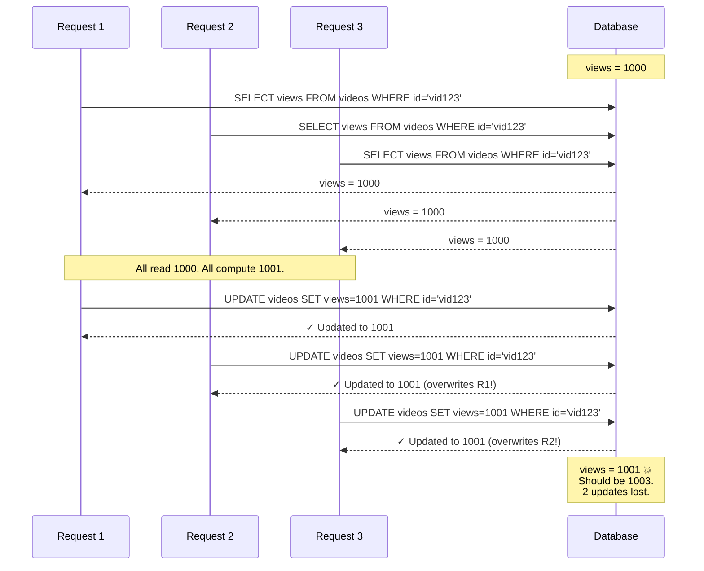
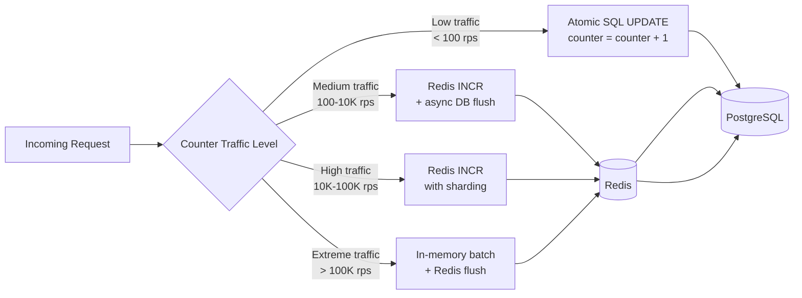

# Lost Counter Updates: The Race Condition Silently Eating Your Analytics

**A YouTube video goes viral. 50,000 concurrent viewers are watching. Your view counter shows 12,847. The real count should be 50,000. Where did 37,153 views go?** They were lost in a race condition that's been silently eating your analytics for months. Every spike in traffic makes it worse. The more popular your content, the more inaccurate your data. And because the counter is just wrong — not broken, not erroring — nobody noticed.

This is the lost update problem on shared counters. It's one of the most pervasive silent bugs in production systems.

---

## The Problem Class `[Mid-level]`

A counter is conceptually simple: read the current value, add 1, write the new value. At concurrency, this three-step read-modify-write operation is not atomic. Two concurrent requests both read the same value, both compute `value + 1`, and both write back. One write overwrites the other. Net result: one increment survives out of two.

Scale this to 1,000 concurrent requests and you might keep only 10-50 of them. The counter under-reports by 95%.


```mermaid
sequenceDiagram
    participant R1 as Request 1
    participant R2 as Request 2
    participant R3 as Request 3
    participant DB as Database
    Note over DB: views = 1000

    R1->>DB: SELECT views FROM videos WHERE id='vid123'
    R2->>DB: SELECT views FROM videos WHERE id='vid123'
    R3->>DB: SELECT views FROM videos WHERE id='vid123'

    DB-->>R1: views = 1000
    DB-->>R2: views = 1000
    DB-->>R3: views = 1000

    Note over R1,R3: All read 1000. All compute 1001.

    R1->>DB: UPDATE videos SET views=1001 WHERE id='vid123'
    DB-->>R1: ✓ Updated to 1001

    R2->>DB: UPDATE videos SET views=1001 WHERE id='vid123'
    DB-->>R2: ✓ Updated to 1001 (overwrites R1!)

    R3->>DB: UPDATE videos SET views=1001 WHERE id='vid123'
    DB-->>R3: ✓ Updated to 1001 (overwrites R2!)

    Note over DB: views = 1001 💥<br/>Should be 1003.<br/>2 updates lost.
```

At 50,000 concurrent requests, the race window is long enough that thousands of requests all read the same value, compute the same `+1`, and all write back the same new value. You might end up with 1001 instead of 51,000.

---

## Why This Happens Even With Transactions

The first reaction is "wrap it in a transaction." This doesn't help for the reason that transactions don't make your application code atomic.

```javascript
// WRONG — transaction doesn't prevent the race
async function incrementViewCount(videoId) {
  const client = await pool.connect();
  try {
    await client.query('BEGIN');

    // Both transactions read the same value here
    const result = await client.query(
      'SELECT views FROM videos WHERE id=$1',
      [videoId]
    );
    const currentViews = result.rows[0].views;

    // Both transactions compute the same value here
    const newViews = currentViews + 1;

    // Both transactions write the same value here
    // One overwrites the other
    await client.query(
      'UPDATE videos SET views=$1 WHERE id=$2',
      [newViews, videoId]
    );

    await client.query('COMMIT');
    return newViews;
  } finally {
    client.release();
  }
}
```

At `READ COMMITTED` isolation (the default), Transaction 2's SELECT reads the committed state as of when that SELECT executes. If Transaction 1 hasn't committed yet, Transaction 2 reads the pre-increment value. Both compute the same `views + 1`. Both write back the same value. One update is lost.

At `REPEATABLE READ`, it's worse in a different way: Transaction 2 will read a consistent snapshot from transaction start, but both transactions can still write the same value to different rows without conflict detection (since they're not modifying each other's *rows*).

The only isolation level that would catch this is `SERIALIZABLE`, but full serializable isolation at scale is prohibitively expensive — it serializes all transactions touching the same rows, destroying throughput.

---

## Real-World Impact

**YouTube** doesn't show real-time view counts. For viral videos, YouTube deliberately delays and batches view count updates. Their engineering team discovered that real-time increments under viral load caused counter inaccuracy so severe it was unmeasurable. The solution: approximate counters, batch flushing, and eventual consistency on view counts.

**Reddit** vote counts are famously "fuzzy." Reddit deliberately introduces randomness in displayed vote counts to prevent brigading, but even without that, the underlying race condition on concurrent upvotes means the displayed count is always an approximation. Reddit's engineering documented that their vote counters use a combination of Redis INCR and async DB flushing.

**Twitter likes and retweet counts** use an eventually consistent architecture. The count you see may lag real-time by several seconds under high load. Twitter's storage team has written about using Redis for the hot counter path with async persistence.

**Slack message counts** in busy channels use a similar approach — Redis INCR for the realtime path, with periodic DB reconciliation. Pure DB increment on Slack's busiest channels would require serializing thousands of increments per minute per channel.

**The silent nature of this bug** is what makes it dangerous. Your application doesn't throw errors. Users don't see failures. The counter just quietly under-counts. You only discover it when someone runs an audit comparing analytics systems and finds a 60% discrepancy.

---

## The Wrong Fix (and Why It Fails)

**Wrong Fix: SELECT FOR UPDATE on every counter increment**

```javascript
// WRONG for high throughput — kills performance
async function incrementViewCountLocked(videoId) {
  const client = await pool.connect();
  try {
    await client.query('BEGIN');

    // This acquires an exclusive row lock — serializes all increments
    await client.query(
      'SELECT views FROM videos WHERE id=$1 FOR UPDATE',
      [videoId]
    );

    await client.query(
      'UPDATE videos SET views=views+1 WHERE id=$1',
      [videoId]
    );

    await client.query('COMMIT');
  } finally {
    client.release();
  }
}
```

This is *correct* but unusable at scale. `SELECT FOR UPDATE` serializes all requests. For a viral video with 10,000 concurrent viewers, all 10,000 view count increments queue behind the row lock. Your database transaction queue grows unboundedly. Latency spikes from milliseconds to seconds. This fix turns a data accuracy problem into an availability problem.

---

## The Right Solutions

### Solution 1: Atomic SQL Increment

The simplest correct fix. `UPDATE ... SET count = count + 1` is a single SQL statement. Within a single statement, PostgreSQL handles the read-modify-write atomically using its internal row-level locking. You never see the intermediate state.

```javascript
// CORRECT — single atomic statement
async function incrementViewCount(videoId) {
  const result = await pool.query(
    `UPDATE videos
     SET views = views + 1,
         updated_at = NOW()
     WHERE id = $1
     RETURNING views`,
    [videoId]
  );

  return result.rows[0]?.views;
}

// Multiple counters atomically
async function recordVideoEngagement(videoId, userId) {
  await pool.query(
    `UPDATE videos
     SET
       views = views + 1,
       watch_seconds = watch_seconds + $2,
       updated_at = NOW()
     WHERE id = $1`,
    [videoId, watchDurationSeconds]
  );

  // Track unique viewers separately (UPSERT to count each viewer once)
  await pool.query(
    `INSERT INTO video_viewers (video_id, user_id, first_viewed_at)
     VALUES ($1, $2, NOW())
     ON CONFLICT (video_id, user_id) DO NOTHING`,
    [videoId, userId]
  );
}
```

**When to use**: Any counter that's not under extreme hot-path traffic. Works perfectly for most counters — blog post views, product review counts, profile visits, etc.

**Throughput limit**: ~5,000-10,000 increments/second per row before you hit lock contention. Fine for most use cases. Not enough for YouTube-viral traffic.

---

### Solution 2: Redis INCR — Atomic, In-Memory, Microseconds

Redis is single-threaded. Every command executes one at a time. `INCR` is a single command — it's atomic by definition. No race condition possible.

```javascript
const Redis = require('ioredis');
const redis = new Redis(process.env.REDIS_URL);

async function incrementViewCountRedis(videoId) {
  const key = `views:${videoId}`;

  // INCR is atomic — guaranteed no lost updates
  // Returns the new value after increment
  const newCount = await redis.incr(key);

  // Set TTL on first creation to prevent key leak
  if (newCount === 1) {
    await redis.expire(key, 86400 * 7); // 7-day TTL
  }

  return newCount;
}

// Read the current count (serves from Redis cache)
async function getViewCount(videoId) {
  const key = `views:${videoId}`;
  const count = await redis.get(key);

  if (count !== null) {
    return parseInt(count, 10);
  }

  // Cache miss — load from DB and set in Redis
  const result = await pool.query(
    'SELECT views FROM videos WHERE id=$1',
    [videoId]
  );

  const dbCount = result.rows[0]?.views ?? 0;
  await redis.setex(key, 3600, dbCount);

  return dbCount;
}

// Async flush to DB — run periodically to persist Redis counts to PostgreSQL
async function flushViewCountsToDB() {
  const pattern = 'views:*';
  const keys = await redis.keys(pattern);

  if (keys.length === 0) return;

  const pipeline = redis.pipeline();
  keys.forEach(key => pipeline.get(key));
  const counts = await pipeline.exec();

  const updates = keys.map((key, i) => ({
    videoId: key.replace('views:', ''),
    count: parseInt(counts[i][1], 10)
  }));

  // Batch update to DB using unnest for performance
  await pool.query(
    `UPDATE videos AS v
     SET views = u.count::bigint
     FROM unnest($1::text[], $2::bigint[]) AS u(id, count)
     WHERE v.id = u.id::uuid`,
    [
      updates.map(u => u.videoId),
      updates.map(u => u.count)
    ]
  );

  console.log(`Flushed ${updates.length} view counts to DB`);
}

setInterval(flushViewCountsToDB, 30000); // Flush every 30 seconds
```

**Throughput**: Redis handles ~100,000 INCR operations per second on a single instance. For most applications, this is effectively unlimited.

---

### Solution 3: Counter Sharding

When even Redis INCR becomes a bottleneck (or you want redundancy), shard the counter across N virtual counters. Each request increments one shard. The aggregate count is the sum of all shards. This is YouTube's documented approach for viral content.

```javascript
const SHARD_COUNT = 16; // Tune based on write throughput requirements

function getShardKey(videoId) {
  // Distribute writes across shards using hash
  const shardIndex = Math.abs(hashCode(videoId)) % SHARD_COUNT;
  return `views:${videoId}:shard:${shardIndex}`;
}

function hashCode(str) {
  let hash = 0;
  for (let i = 0; i < str.length; i++) {
    const char = str.charCodeAt(i);
    hash = ((hash << 5) - hash) + char;
    hash = hash & hash;
  }
  return hash;
}

async function incrementViewCountSharded(videoId) {
  // Each request hits a different shard — no contention between shards
  const shardKey = getShardKey(videoId);
  return await redis.incr(shardKey);
}

async function getViewCountSharded(videoId) {
  // Aggregate all shards for the total count
  const shardKeys = Array.from(
    { length: SHARD_COUNT },
    (_, i) => `views:${videoId}:shard:${i}`
  );

  const pipeline = redis.pipeline();
  shardKeys.forEach(key => pipeline.get(key));
  const results = await pipeline.exec();

  const total = results.reduce((sum, [err, val]) => {
    if (err) return sum;
    return sum + parseInt(val || '0', 10);
  }, 0);

  return total;
}

// Example: viral video with 1M concurrent viewers
// Without sharding: 1M concurrent INCRs → Redis queues them serially → latency
// With 16 shards: each shard gets ~62,500 INCRs → 16x throughput increase
```

**Read vs write tradeoff**: Writes are fast (hit one shard). Reads require summing N shards (N pipeline calls). For write-heavy, read-occasional counters (view tracking), this is excellent.

---

### Solution 4: HyperLogLog for Unique Counts

Counting unique visitors is harder than counting total events — you need deduplication. A naive approach stores every user ID and counts distinct values. HyperLogLog (HLL) gives you an approximate distinct count using constant memory (12KB per counter regardless of cardinality).

```javascript
async function trackUniqueViewer(videoId, userId) {
  const key = `unique_viewers:${videoId}`;

  // PFADD adds an element to the HyperLogLog structure.
  // Returns 1 if the set changed (new unique element), 0 if already seen.
  // Uses only 12KB of memory regardless of how many unique viewers you track.
  const isNew = await redis.pfadd(key, userId);

  if (isNew) {
    // Only increment unique view count if this is a new viewer
    await redis.incr(`unique_view_count:${videoId}`);
  }

  return isNew === 1;
}

async function getUniqueViewerCount(videoId) {
  // PFCOUNT gives approximate cardinality with < 1% error rate
  return await redis.pfcount(`unique_viewers:${videoId}`);
}

// Merge HyperLogLogs for aggregate stats (e.g., total unique viewers across a channel)
async function getUniqueViewersForChannel(channelId) {
  const videoIds = await getChannelVideoIds(channelId);
  const keys = videoIds.map(id => `unique_viewers:${id}`);

  // PFMERGE combines multiple HLLs without double-counting
  const mergedKey = `channel_unique_viewers:${channelId}:temp`;
  await redis.pfmerge(mergedKey, ...keys);
  await redis.expire(mergedKey, 3600);

  return await redis.pfcount(mergedKey);
}
```

**Error rate**: HyperLogLog has ~0.81% standard error. For a video with 1,000,000 unique viewers, the count will be between 991,900 and 1,008,100. For analytics, this is perfectly acceptable.

**Memory**: Traditional approach (store all user IDs) = ~8 bytes × viewers. At 10M unique viewers = 80MB per video. HyperLogLog = 12KB per video, regardless of cardinality.

---

### Solution 5: Batch Flushing — Buffer in Memory, Flush Periodically

For extremely high-throughput counters, even Redis can become a bottleneck or introduces unacceptable latency. Buffer increments in application memory, flush to Redis/DB on a schedule.

```javascript
class BatchCounter {
  constructor(flushIntervalMs = 5000) {
    this.pendingIncrements = new Map(); // videoId -> increment count
    this.flushInterval = setInterval(() => this.flush(), flushIntervalMs);

    // Flush on process shutdown
    process.on('SIGTERM', () => this.flushAndClose());
    process.on('SIGINT', () => this.flushAndClose());
  }

  increment(videoId, amount = 1) {
    const current = this.pendingIncrements.get(videoId) || 0;
    this.pendingIncrements.set(videoId, current + amount);
  }

  async flush() {
    if (this.pendingIncrements.size === 0) return;

    // Swap the map atomically (Node.js is single-threaded in V8 event loop)
    const toFlush = this.pendingIncrements;
    this.pendingIncrements = new Map();

    console.log(`Flushing ${toFlush.size} counters...`);

    try {
      const pipeline = redis.pipeline();

      toFlush.forEach((amount, videoId) => {
        pipeline.incrby(`views:${videoId}`, amount);
      });

      await pipeline.exec();

    } catch (err) {
      // On failure: add back to pending (don't lose the counts)
      toFlush.forEach((amount, videoId) => {
        const current = this.pendingIncrements.get(videoId) || 0;
        this.pendingIncrements.set(videoId, current + amount);
      });
      console.error('Counter flush failed, will retry:', err);
    }
  }

  async flushAndClose() {
    clearInterval(this.flushInterval);
    await this.flush();
    process.exit(0);
  }
}

// Usage
const viewCounter = new BatchCounter(5000); // Flush every 5 seconds

app.post('/videos/:id/view', async (req, res) => {
  // In-memory increment — microseconds, no I/O
  viewCounter.increment(req.params.id);

  // Respond immediately — don't wait for DB/Redis write
  res.json({ success: true });
});
```

**Tradeoff**: If the server crashes between flushes, you lose up to 5 seconds of increments. For view counts, this is acceptable. For billing counters or financial totals, it is not.

---

## Putting It All Together: A Tiered Counter Architecture

Real systems use multiple tiers based on the counter's traffic profile:


```mermaid
graph LR
    A[Incoming Request] --> B{Counter Traffic Level}

    B -->|Low traffic\n< 100 rps| C[Atomic SQL UPDATE\ncounter = counter + 1]
    B -->|Medium traffic\n100-10K rps| D[Redis INCR\n+ async DB flush]
    B -->|High traffic\n10K-100K rps| E[Redis INCR\nwith sharding]
    B -->|Extreme traffic\n> 100K rps| F[In-memory batch\n+ Redis flush]

    C --> G[(PostgreSQL)]
    D --> H[(Redis)] --> G
    E --> H
    F --> H --> G
```

```javascript
class SmartCounter {
  constructor() {
    this.redis = new Redis(process.env.REDIS_URL);
    this.batchCounter = new BatchCounter(5000);
    this.hotCounters = new Set(); // Track which counters are "hot"
  }

  async increment(entityType, entityId, amount = 1) {
    const key = `${entityType}:${entityId}`;
    const rpsKey = `rps:${key}`;

    // Track requests per second for this counter
    const rps = await this.redis.incr(rpsKey);
    if (rps === 1) await this.redis.expire(rpsKey, 1);

    if (rps > 10000) {
      // Extreme traffic: in-memory batch
      this.hotCounters.add(key);
      this.batchCounter.increment(key, amount);
    } else if (rps > 100) {
      // Medium traffic: Redis INCR
      await this.redis.incrby(`counter:${key}`, amount);
    } else {
      // Low traffic: atomic SQL
      await pool.query(
        `UPDATE ${entityType}s SET count = count + $1 WHERE id = $2`,
        [amount, entityId]
      );
    }
  }
}
```

---

## Prevention Patterns

**Never use the pattern `SELECT count → count+1 → UPDATE count`** for shared counters. It is always wrong under concurrency.

**Use SQL atomic increments** for any counter that's not on the hot path:
```sql
UPDATE articles SET view_count = view_count + 1 WHERE id = ?;
```

**Use Redis INCR for all high-traffic counters**. Set up async flushing to the primary database for persistence.

**Design read-path vs write-path separately**. The write path (increment) should be decoupled from the read path (display count). Displaying a count doesn't need perfect real-time accuracy. Increment fast, read eventually.

**Monitor for counter drift**. Periodically compare Redis counters to DB counters. Alert if they diverge by more than acceptable threshold.

---

## Checklist: Am I Safe?

- [ ] No code uses the pattern: SELECT count → compute count+1 → UPDATE with new value
- [ ] All counter increments use either atomic SQL (`count = count + 1`) or Redis INCR
- [ ] High-traffic counters (> 100 rps per key) use Redis rather than the database
- [ ] Redis counters are periodically flushed to the primary database
- [ ] Counter flush handles failure gracefully (doesn't lose increments on Redis error)
- [ ] In-memory batch counters flush on process shutdown (SIGTERM handler)
- [ ] Unique visitor counting uses HyperLogLog (not a full SET of user IDs)
- [ ] Counter drift monitoring compares Redis vs DB periodically
- [ ] Counter sharding is in place for any counter expected to exceed 100K rps

---

## Related Problems

- **Double Booking** (`double-booking.md`) — race on a single-unit resource
- **Inventory Overselling** (`race-condition-inventory.md`) — concurrent decrements going below zero
- **Double Charge** (`double-charge-payment.md`) — payment idempotency failures
- **Duplicate Orders** (`duplicate-orders.md`) — network retries creating multiple records
