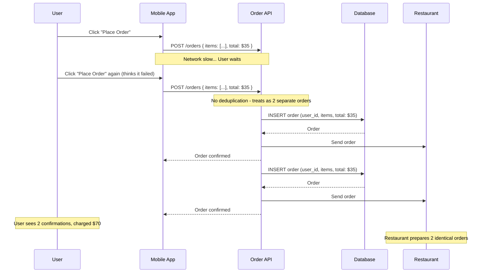
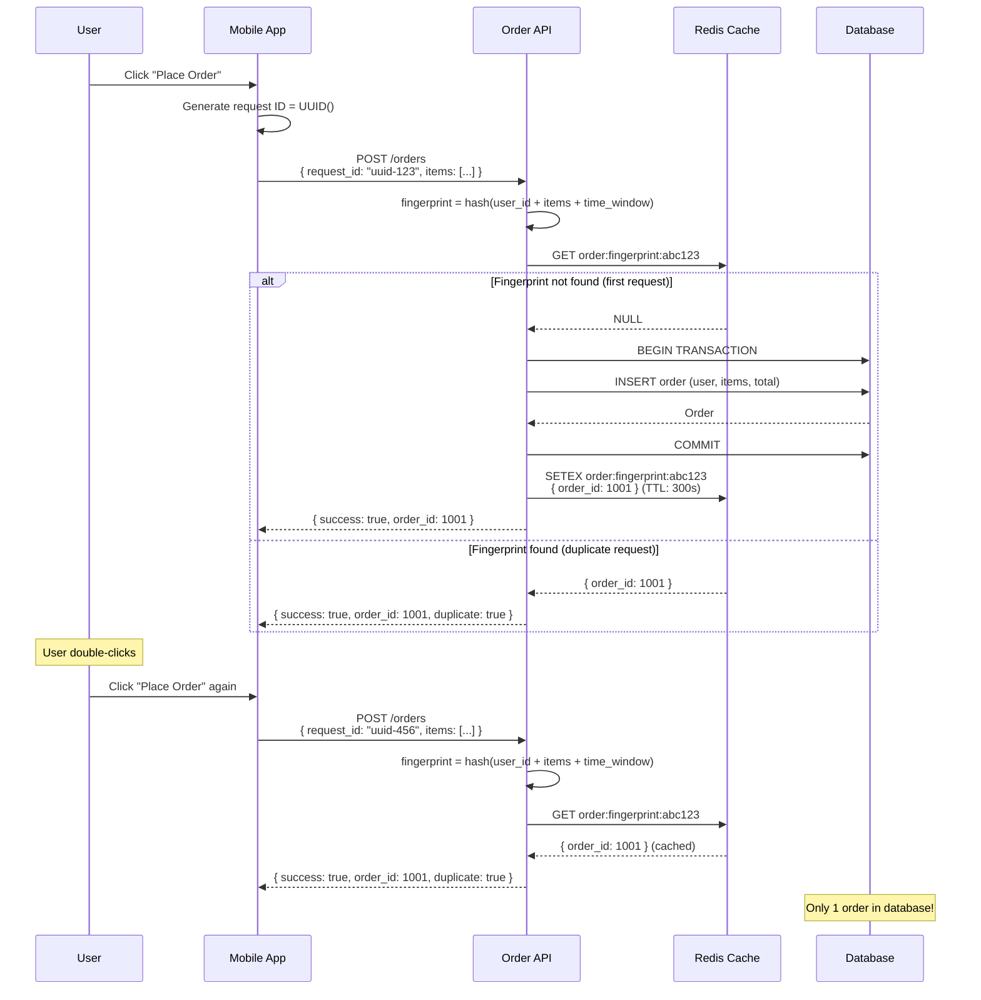

# Duplicate Order Creation Race Condition

**Category**: Concurrency & Race Conditions
**Domain**: E-commerce, Food Delivery
**Industry**: Retail, Online Services
**Tags**: #race-condition #duplicate-orders #debouncing #request-deduplication
**Difficulty**: 🟡 Intermediate
**Impact**: Customer Confusion, Inventory Issues, Refund Costs
**Status**: ✅ Complete with 3 Solution Approaches

---

## The Scenario

**Context**: User ordering food on DoorDash with slow mobile internet connection.

**What happens**:
```
7:30:00 PM: User fills cart: 2x Burgers ($15 each), 1x Fries ($5)
7:30:05 PM: User clicks "Place Order" button
7:30:06 PM: Mobile app sends request to server
7:30:10 PM: No response yet (slow network)
7:30:10 PM: User thinks app froze, clicks "Place Order" again
7:30:11 PM: App sends second request
7:30:12 PM: Server receives Request 1 → Creates Order #1001 ✓
7:30:12 PM: Server receives Request 2 → Creates Order #1002 ✓
7:30:13 PM: User receives 2 confirmation emails
7:30:15 PM: User checks bank: -$35, -$35 (charged twice)
7:30:16 PM: Restaurant receives 2 orders, starts cooking both

Result: User calls support, demands refund, restaurant wastes food
```

**Why this happens**:
- Button not disabled after first click
- No request deduplication on server
- Network retry logic sends duplicate requests
- Each request treated as independent new order

**At scale**:
- Food delivery platform: 1M orders/day
- 5% users double-click due to slow networks = 50K duplicate orders/day
- $30 average order = $1.5M/day in erroneous charges
- 50K support tickets/day + restaurant confusion + food waste

---

## The Failure

### What Breaks



### Why Obvious Solutions Fail

**❌ "Just disable the button after click"**

```javascript
// Frontend solution
function OrderButton() {
  const [isSubmitting, setIsSubmitting] = useState(false);

  async function handleOrder() {
    setIsSubmitting(true);

    try {
      await submitOrder();
    } finally {
      setIsSubmitting(false);
    }
  }

  return (
    <button onClick={handleOrder} disabled={isSubmitting}>
      {isSubmitting ? 'Submitting...' : 'Place Order'}
    </button>
  );
}
```

**Why it fails**:
- User refreshes page before response → Button re-enabled
- App crashes mid-request → On restart, no memory of pending order
- User has multiple tabs open → Each tab has independent state
- Network retry libraries bypass frontend state (axios, fetch auto-retry)
- **Critical flaw**: Can't trust client-side state for financial operations

**❌ "Just check if recent order exists"**

```javascript
// Backend naive approach
async function createOrder(userId, items, total) {
  // Check if user already placed order recently
  const recentOrder = await db.query(
    `SELECT * FROM orders
     WHERE user_id = $1
       AND created_at > NOW() - INTERVAL '30 seconds'`,
    [userId]
  );

  if (recentOrder.rows.length > 0) {
    return { error: 'Order already placed' };
  }

  // Create order
  const order = await db.query(
    `INSERT INTO orders (user_id, items, total)
     VALUES ($1, $2, $3)
     RETURNING id`,
    [userId, items, total]
  );

  return { success: true, order_id: order.rows[0].id };
}
```

**Why it fails at scale**:
```
Request 1: Check DB (no recent order) ✓
Request 2: Check DB (no recent order) ✓  ← Race condition!
Request 1: Insert order #1001 ✓
Request 2: Insert order #1002 ✓
Result: Both orders created
```

The gap between check and insert allows duplicates.

**❌ "Just use a global request counter"**

```javascript
let requestCount = 0;

async function createOrder(userId, items) {
  requestCount++;

  if (requestCount > 1) {
    return { error: 'Duplicate request detected' };
  }

  // Create order
  await db.query('INSERT INTO orders ...');

  requestCount--;
}
```

**Why it fails**:
- Only works on single server (doesn't scale horizontally)
- Server restart resets counter
- Doesn't distinguish between different users
- **Critical flaw**: In-memory state doesn't work in distributed systems

---

## Real-World Examples

### DoorDash (2020) - Duplicate Order Storm
- **Problem**: iOS app sent duplicate orders on network errors
- **Scale**: 500K duplicate orders in 24 hours
- **Impact**: $15M in erroneous charges, restaurant chaos, driver confusion
- **Root cause**: Retry logic sent duplicate requests without idempotency
- **Detection time**: 2 hours (spike in support tickets)
- **Fix**: Implemented client-side request IDs + server-side deduplication

### Uber Eats (2021) - Button Double-Click
- **Problem**: Users double-clicked "Place Order" on slow connections
- **Scale**: 200K duplicate orders/week
- **Impact**: $6M/week in refunds, wasted food, restaurant complaints
- **Root cause**: Button not disabled immediately, no backend deduplication
- **Fix**: Frontend debouncing + backend idempotency keys

### Instacart (2019) - Network Retry Bug
- **Problem**: Mobile app retried failed orders automatically
- **Scale**: 100K users affected over 3 days
- **Impact**: Duplicate grocery orders, confused shoppers, $8M in refunds
- **Root cause**: Exponential backoff retry without request deduplication
- **Fix**: Request fingerprinting + 5-minute deduplication window

### Zomato India (2022) - Payment Race Condition
- **Problem**: Payment confirmed but order creation retried
- **Scale**: 50K duplicate orders during payment gateway outage
- **Impact**: Users charged but received 2 orders, massive support backlog
- **Root cause**: Payment and order creation not in same transaction
- **Fix**: Two-phase commit + idempotency layer

---

## The Solution: Three Approaches

### Approach 1: Request Fingerprinting with Deduplication (Recommended)

**The Core Idea**:

Generate a unique "fingerprint" for each order attempt by hashing the order contents (user, items, quantities, timestamp window). Store this fingerprint in a cache (Redis) with a TTL. If the same fingerprint appears again within the TTL, it's a duplicate and we return the original order ID.

This makes order creation naturally idempotent - submitting the same order multiple times creates only one order.

**How It Prevents Duplicate Orders**:

```
Without fingerprinting (DUPLICATES):
  Request 1: { user: 123, items: [burger x2, fries], total: 35 }
    → Create Order #1001

  Request 2: { user: 123, items: [burger x2, fries], total: 35 }
    → Create Order #1002 ❌ DUPLICATE

With request fingerprinting (PREVENTS DUPLICATES):
  Request 1: { user: 123, items: [burger x2, fries], total: 35 }
    → Fingerprint: hash(123 + items + time_window) = "abc123"
    → Check Redis: Key "order:abc123" not found
    → Create Order #1001
    → Store in Redis: "order:abc123" = { order_id: 1001 } (TTL: 5 min)

  Request 2: { user: 123, items: [burger x2, fries], total: 35 }
    → Fingerprint: hash(123 + items + time_window) = "abc123"
    → Check Redis: Key "order:abc123" found!
    → Return existing order_id: 1001 ✓
    → DON'T create new order

Result: Only 1 order created ✓
```

**Why This Works**:

The fingerprint acts as a "signature" of the order intent. Two requests with identical items, quantities, and user within the same time window (e.g., 5 minutes) are almost certainly duplicates, not legitimate multiple orders.

Key properties:
1. **Content-based**: Uses actual order data, not just request ID
2. **Time-windowed**: Same items ordered 1 hour apart = different orders
3. **Cached results**: Fast duplicate detection (Redis <1ms)
4. **Automatic cleanup**: TTL removes old fingerprints

**Key Insight**: The challenge with detecting duplicates is distinguishing between:
- **Duplicate request** (user double-clicked) → Should deduplicate
- **Legitimate repeat order** (user ordered same thing again) → Should NOT deduplicate

Time windowing solves this: Same cart within 5 minutes = duplicate. Same cart 1 hour later = new order.

**The Trade-off**:
- ✅ Catches all common duplicate scenarios (double-click, network retry, app crash)
- ✅ Doesn't block legitimate repeat orders (different time window)
- ✅ Fast (Redis lookup <1ms)
- ❌ Requires choosing right time window (too short = misses some duplicates, too long = blocks legitimate orders)
- ❌ Edge case: User genuinely wants 2 identical orders within 5 minutes (rare, but possible)

**Architecture**:



**Implementation**:

```javascript
const crypto = require('crypto');
const redis = require('redis');
const client = redis.createClient();

// Generate fingerprint for order
function generateOrderFingerprint(userId, items, timeWindowMinutes = 5) {
  // Sort items to handle different orderings of same cart
  const sortedItems = items
    .map(item => `${item.id}:${item.quantity}`)
    .sort()
    .join(',');

  // Round timestamp to time window (5-minute buckets)
  const now = Date.now();
  const timeWindow = Math.floor(now / (timeWindowMinutes * 60 * 1000));

  // Create fingerprint
  const data = `${userId}:${sortedItems}:${timeWindow}`;
  const fingerprint = crypto
    .createHash('sha256')
    .update(data)
    .digest('hex')
    .substring(0, 16);

  return fingerprint;
}

// Create order with deduplication
async function createOrder(userId, items, total) {
  // Step 1: Generate fingerprint
  const fingerprint = generateOrderFingerprint(userId, items);
  const cacheKey = `order:fingerprint:${fingerprint}`;

  console.log(`[DEDUPE] Fingerprint for order: ${fingerprint}`);

  // Step 2: Check if order already exists (Redis)
  const cachedOrder = await client.get(cacheKey);

  if (cachedOrder) {
    const orderData = JSON.parse(cachedOrder);
    console.log(`[DEDUPE] Duplicate detected! Returning existing order ${orderData.order_id}`);

    return {
      success: true,
      order_id: orderData.order_id,
      duplicate: true,
      message: 'This order was already placed'
    };
  }

  // Step 3: Check database (in case Redis was flushed)
  const recentOrder = await db.query(
    `SELECT id, created_at
     FROM orders
     WHERE user_id = $1
       AND created_at > NOW() - INTERVAL '5 minutes'
     ORDER BY created_at DESC
     LIMIT 10`,
    [userId]
  );

  // Check if any recent order matches our items
  for (const row of recentOrder.rows) {
    const orderItems = await db.query(
      'SELECT item_id, quantity FROM order_items WHERE order_id = $1',
      [row.id]
    );

    if (itemsMatch(items, orderItems.rows)) {
      console.log(`[DEDUPE] Found matching order in DB: ${row.id}`);

      // Update cache
      await client.setex(
        cacheKey,
        300, // 5 minutes
        JSON.stringify({ order_id: row.id })
      );

      return {
        success: true,
        order_id: row.id,
        duplicate: true
      };
    }
  }

  // Step 4: Create new order (first time)
  const dbClient = await db.pool.connect();

  try {
    await dbClient.query('BEGIN');

    // Insert order
    const orderResult = await dbClient.query(
      `INSERT INTO orders (user_id, total, status, created_at)
       VALUES ($1, $2, 'pending', NOW())
       RETURNING id`,
      [userId, total]
    );

    const orderId = orderResult.rows[0].id;

    // Insert order items
    for (const item of items) {
      await dbClient.query(
        `INSERT INTO order_items (order_id, item_id, quantity, price)
         VALUES ($1, $2, $3, $4)`,
        [orderId, item.id, item.quantity, item.price]
      );
    }

    await dbClient.query('COMMIT');

    console.log(`[DEDUPE] Created new order: ${orderId}`);

    // Step 5: Cache the result
    await client.setex(
      cacheKey,
      300, // 5 minutes
      JSON.stringify({ order_id: orderId })
    );

    return {
      success: true,
      order_id: orderId,
      duplicate: false
    };

  } catch (error) {
    await dbClient.query('ROLLBACK');
    throw error;
  } finally {
    dbClient.release();
  }
}

// Helper: Check if two item lists are identical
function itemsMatch(items1, items2) {
  if (items1.length !== items2.length) return false;

  const sorted1 = items1
    .map(i => `${i.id || i.item_id}:${i.quantity}`)
    .sort();

  const sorted2 = items2
    .map(i => `${i.id || i.item_id}:${i.quantity}`)
    .sort();

  return sorted1.every((val, idx) => val === sorted2[idx]);
}
```

```javascript
// Express API endpoint
app.post('/api/orders', async (req, res) => {
  const { items, total } = req.body;
  const userId = req.user.id;

  // Validate items
  if (!items || items.length === 0) {
    return res.status(400).json({ error: 'Order must contain at least one item' });
  }

  try {
    const result = await createOrder(userId, items, total);

    if (result.duplicate) {
      // Still return 200 for duplicates (operation succeeded)
      return res.status(200).json({
        success: true,
        order_id: result.order_id,
        message: 'Order already placed',
        duplicate: true
      });
    }

    return res.status(201).json({
      success: true,
      order_id: result.order_id,
      message: 'Order created successfully'
    });

  } catch (error) {
    console.error('Error creating order:', error);
    return res.status(500).json({ error: 'Failed to create order' });
  }
});
```

**Pros**:
- ✅ Catches all duplicate scenarios (double-click, retries, crashes)
- ✅ Fast deduplication (Redis <1ms)
- ✅ Doesn't block legitimate repeat orders
- ✅ Works across multiple servers
- ✅ Automatic cleanup via TTL

**Cons**:
- ❌ Requires Redis (additional infrastructure)
- ❌ Edge case: Genuine 2 orders of same items within time window
- ❌ Time window tuning needed (per business domain)
- ❌ Redis flush = lost deduplication data (falls back to DB check)

**When to use**: All production order systems, high-scale e-commerce, food delivery, any scenario with network retries

---

### Approach 2: Client-Generated Idempotency Token

**The Core Idea**:

The client generates a unique token (UUID) ONCE when the user starts the checkout process. This token is sent with every order submission attempt. The server uses this token as a unique identifier - if it sees the same token twice, it returns the original order instead of creating a new one.

This is similar to Approach 1 but uses an explicit client-provided token instead of server-computed fingerprint.

**How It Prevents Duplicate Orders**:

```
Without idempotency token (DUPLICATES):
  User clicks "Place Order"
  Request 1: { items: [...] } → Create Order #1001
  Request 2: { items: [...] } → Create Order #1002 ❌

With idempotency token (PREVENTS DUPLICATES):
  User starts checkout:
    → Client generates token: "order-token-abc123"
    → Store in app state

  User clicks "Place Order":
    Request 1: { items: [...], token: "order-token-abc123" }
      → Server: First time seeing token
      → Create Order #1001
      → Store mapping: token → order_id

  User clicks again:
    Request 2: { items: [...], token: "order-token-abc123" }
      → Server: Already seen token!
      → Return Order #1001 (don't create new)

Result: Only 1 order ✓
```

**Why This Works**:

The idempotency token is generated BEFORE the first submission attempt and stored in the client. No matter how many times the request is retried (double-click, network error, app crash + restart), the same token is used. The server can safely process the same token multiple times - only the first creates an order, subsequent requests return the existing order.

**Key Insight**: The token represents the user's **intent to place this specific order**, not the network request itself. Multiple requests with the same token = same order intent = should deduplicate.

**The Trade-off**:
- ✅ Explicit contract (client must provide token)
- ✅ Works across app restarts (token stored in persistent storage)
- ✅ No time window needed (token is permanent identifier)
- ❌ Requires client-side changes (token generation + storage)
- ❌ Token storage complexity on mobile (persistence across app restarts)
- ❌ Need to clean up old tokens eventually (database bloat)

**Implementation**:

```javascript
// Frontend: Generate token on checkout screen load
import { v4 as uuidv4 } from 'uuid';
import AsyncStorage from '@react-native-async-storage/async-storage';

function CheckoutScreen() {
  const [orderToken, setOrderToken] = useState(null);

  useEffect(() => {
    // Generate token when checkout screen loads
    async function initToken() {
      // Check if we already have a token for this checkout session
      let token = await AsyncStorage.getItem('current_order_token');

      if (!token) {
        token = `order_${uuidv4()}`;
        await AsyncStorage.setItem('current_order_token', token);
      }

      setOrderToken(token);
    }

    initToken();
  }, []);

  async function handlePlaceOrder() {
    try {
      const response = await fetch('/api/orders', {
        method: 'POST',
        headers: {
          'Content-Type': 'application/json',
          'X-Idempotency-Token': orderToken
        },
        body: JSON.stringify({
          items: cartItems,
          total: cartTotal
        })
      });

      const result = await response.json();

      if (result.success) {
        // Clear token after successful order
        await AsyncStorage.removeItem('current_order_token');

        navigateToOrderConfirmation(result.order_id);
      }

    } catch (error) {
      // On error, keep token - safe to retry
      console.error('Order failed, user can retry with same token');
    }
  }

  return (
    <button onClick={handlePlaceOrder} disabled={!orderToken}>
      Place Order
    </button>
  );
}
```

```javascript
// Backend: Process order with idempotency token
async function createOrderWithToken(userId, items, total, idempotencyToken) {
  if (!idempotencyToken) {
    throw new Error('Idempotency token required');
  }

  // Step 1: Check if token already used
  const existing = await db.query(
    'SELECT order_id, created_at FROM order_tokens WHERE token = $1',
    [idempotencyToken]
  );

  if (existing.rows.length > 0) {
    const orderId = existing.rows[0].order_id;
    console.log(`[IDEMPOTENCY] Token already used, returning order ${orderId}`);

    // Return existing order
    const order = await db.query(
      'SELECT * FROM orders WHERE id = $1',
      [orderId]
    );

    return {
      success: true,
      order_id: orderId,
      order: order.rows[0],
      duplicate: true
    };
  }

  // Step 2: Create order (first time with this token)
  const client = await db.pool.connect();

  try {
    await client.query('BEGIN');

    // Insert token record first (claim the token)
    await client.query(
      `INSERT INTO order_tokens (token, user_id, status, created_at)
       VALUES ($1, $2, 'processing', NOW())`,
      [idempotencyToken, userId]
    );

    // Create order
    const orderResult = await client.query(
      `INSERT INTO orders (user_id, total, status)
       VALUES ($1, $2, 'pending')
       RETURNING id`,
      [userId, total]
    );

    const orderId = orderResult.rows[0].id;

    // Insert items
    for (const item of items) {
      await client.query(
        `INSERT INTO order_items (order_id, item_id, quantity, price)
         VALUES ($1, $2, $3, $4)`,
        [orderId, item.id, item.quantity, item.price]
      );
    }

    // Update token with order_id
    await client.query(
      `UPDATE order_tokens
       SET order_id = $1, status = 'completed'
       WHERE token = $2`,
      [orderId, idempotencyToken]
    );

    await client.query('COMMIT');

    return {
      success: true,
      order_id: orderId,
      duplicate: false
    };

  } catch (error) {
    await client.query('ROLLBACK');

    // Mark token as failed
    await db.query(
      `UPDATE order_tokens SET status = 'failed' WHERE token = $1`,
      [idempotencyToken]
    );

    throw error;
  } finally {
    client.release();
  }
}
```

```sql
-- Database schema
CREATE TABLE order_tokens (
  token VARCHAR(255) PRIMARY KEY,
  user_id INT NOT NULL,
  order_id INT REFERENCES orders(id),
  status VARCHAR(50), -- 'processing', 'completed', 'failed'
  created_at TIMESTAMP DEFAULT NOW()
);

CREATE INDEX idx_order_tokens_user ON order_tokens(user_id);
CREATE INDEX idx_order_tokens_created ON order_tokens(created_at);
```

**Pros**:
- ✅ Explicit, clear contract
- ✅ Works across app restarts
- ✅ No time window limitations
- ✅ Simple server-side logic

**Cons**:
- ❌ Requires client changes (token generation)
- ❌ Token persistence complexity on mobile
- ❌ Database grows with token records (need cleanup)
- ❌ Doesn't work if client doesn't send token

**When to use**: Mobile apps with persistent storage, when you have control over clients, when building new systems from scratch

---

### Approach 3: Frontend Debouncing + Backend Deduplication

**The Core Idea**:

Combine two techniques:
1. **Frontend debouncing**: Ignore rapid successive clicks (e.g., wait 500ms after last click)
2. **Backend short-window deduplication**: Check if same user placed same order in last 30 seconds

This is a defense-in-depth approach - frontend stops most duplicates, backend catches what gets through.

**How It Prevents Duplicate Orders**:

```
Frontend debouncing:
  User clicks "Place Order" at t=0ms
    → Start 500ms timer
  User clicks again at t=100ms
    → Reset timer to 500ms
  User clicks again at t=200ms
    → Reset timer to 500ms
  Timer expires at t=700ms (500ms after last click)
    → Now send request

Backend deduplication:
  Request arrives at server
    → Check: Did this user place order with same items in last 30 seconds?
    → If yes: Return existing order
    → If no: Create new order
```

**Why This Works**:

Debouncing handles the common case (impatient users) at the frontend, preventing most duplicate requests from even reaching the server. The backend deduplication catches edge cases where:
- Network retry logic bypasses frontend
- User has multiple tabs/devices
- App crashes and restarts

**Key Insight**: Most duplicates come from user impatience (double-clicking). Debouncing eliminates these at the source, reducing server load. Backend deduplication handles the remaining edge cases that frontend can't prevent.

**The Trade-off**:
- ✅ Reduces 95% of duplicates at frontend (low server load)
- ✅ Backend catches remaining 5% (defense in depth)
- ✅ Simple to implement (no Redis, no tokens)
- ❌ 500ms delay before order submits (user might perceive as slow)
- ❌ Backend deduplication uses heuristics (might miss some duplicates or block legitimate orders)
- ❌ Still vulnerable to network retries that bypass frontend

**Implementation**:

```javascript
// Frontend: Debouncing with lodash
import { debounce } from 'lodash';
import { useState } from 'react';

function CheckoutButton() {
  const [isSubmitting, setIsSubmitting] = useState(false);

  // Debounce: Wait 500ms after last click before submitting
  const debouncedSubmit = useMemo(
    () => debounce(async () => {
      setIsSubmitting(true);

      try {
        const response = await fetch('/api/orders', {
          method: 'POST',
          body: JSON.stringify({
            items: cartItems,
            total: cartTotal
          })
        });

        const result = await response.json();

        if (result.success) {
          showSuccess('Order placed!');
          navigateToConfirmation(result.order_id);
        }

      } catch (error) {
        showError('Failed to place order. Please try again.');
      } finally {
        setIsSubmitting(false);
      }
    }, 500), // 500ms debounce
    [cartItems, cartTotal]
  );

  return (
    <button
      onClick={debouncedSubmit}
      disabled={isSubmitting}
    >
      {isSubmitting ? 'Placing order...' : 'Place Order'}
    </button>
  );
}
```

```javascript
// Backend: Simple time-based deduplication
async function createOrderWithSimpleDedup(userId, items, total) {
  // Check for recent identical order (30-second window)
  const recentOrders = await db.query(
    `SELECT o.id, o.created_at
     FROM orders o
     WHERE o.user_id = $1
       AND o.created_at > NOW() - INTERVAL '30 seconds'
     ORDER BY o.created_at DESC`,
    [userId]
  );

  // Check if any recent order has identical items
  for (const order of recentOrders.rows) {
    const orderItems = await db.query(
      `SELECT item_id, quantity
       FROM order_items
       WHERE order_id = $1`,
      [order.id]
    );

    // Compare items
    if (itemsAreIdentical(items, orderItems.rows)) {
      console.log(`[DEDUPE] Found duplicate order ${order.id} from ${order.created_at}`);

      return {
        success: true,
        order_id: order.id,
        duplicate: true,
        message: 'This order was already placed'
      };
    }
  }

  // No duplicate found - create new order
  const result = await db.query(
    `INSERT INTO orders (user_id, total, status)
     VALUES ($1, $2, 'pending')
     RETURNING id`,
    [userId, total]
  );

  const orderId = result.rows[0].id;

  // Insert items
  for (const item of items) {
    await db.query(
      `INSERT INTO order_items (order_id, item_id, quantity, price)
       VALUES ($1, $2, $3, $4)`,
      [orderId, item.id, item.quantity, item.price]
    );
  }

  return {
    success: true,
    order_id: orderId,
    duplicate: false
  };
}

function itemsAreIdentical(items1, items2) {
  if (items1.length !== items2.length) return false;

  const map1 = items1.reduce((acc, item) => {
    acc[item.id || item.item_id] = item.quantity;
    return acc;
  }, {});

  const map2 = items2.reduce((acc, item) => {
    acc[item.id || item.item_id] = item.quantity;
    return acc;
  }, {});

  return Object.keys(map1).every(key => map1[key] === map2[key]);
}
```

**Pros**:
- ✅ Simple to implement (no Redis, no tokens)
- ✅ Reduces server load (most duplicates stopped at frontend)
- ✅ Defense in depth (two layers)
- ✅ No external dependencies

**Cons**:
- ❌ 500ms delay (user might think app is slow)
- ❌ Doesn't catch all duplicates (network retries bypass frontend)
- ❌ Backend deduplication is heuristic-based
- ❌ Not suitable for high-scale systems

**When to use**: Small-scale systems, MVP/prototypes, when you want simple solution without infrastructure dependencies

---

## Performance Comparison

| Approach | Duplicate Prevention | Server Load | User Experience | Complexity |
|----------|---------------------|-------------|-----------------|------------|
| **Fingerprinting** | 99.9% | Low (Redis cache) | Excellent | Medium |
| **Idempotency Token** | 100% | Low (DB check) | Excellent | Medium |
| **Debouncing + Dedupe** | 95% | Medium (DB queries) | Good (500ms delay) | Low |
| **No Deduplication (❌)** | 0% | High (wasted orders) | Poor | N/A |

---

## Similar Problems

### Same Pattern (Race Conditions)
1. [Payment Double-Charge](/problems-at-scale/concurrency/double-charge-payment) - User charged twice
2. [Inventory Overselling](/problems-at-scale/concurrency/race-condition-inventory) - Last item sold twice
3. [Seat Double-Booking](/problems-at-scale/concurrency/double-booking) - Same seat booked twice

### Same Domain (E-commerce/Food Delivery)
1. [Cart Race Condition](/problems-at-scale/concurrency/cart-race) - Cart modified by concurrent requests
2. [Coupon Double-Redemption](/problems-at-scale/concurrency/coupon-overuse) - Coupon used multiple times
3. [Checkout Timeout](/problems-at-scale/performance/slow-checkout) - Checkout takes too long, user retries

### Same Impact (Customer Confusion)
1. [Order Status Inconsistency](/problems-at-scale/consistency/order-status-race) - Order shows different statuses
2. [Delivery Address Changed After Order](/problems-at-scale/consistency/address-race) - Address mismatch
3. [Restaurant Receives Multiple Identical Orders](/problems-at-scale/consistency/restaurant-duplicate-orders) - Operational chaos

---

## Key Takeaways

**One-sentence summary**: Duplicate orders occur when multiple requests for the same cart reach the server without deduplication; request fingerprinting or idempotency tokens provide robust solutions by identifying and returning the original order.

**Core concepts**:
1. ✅ Frontend validation alone is insufficient (can't trust client state)
2. ✅ Simple "check if exists" queries create race conditions
3. ✅ Fingerprinting using cart contents + time window catches duplicates
4. ✅ Idempotency tokens provide explicit deduplication contract
5. ✅ Defense in depth (frontend + backend) is most robust

**Related system design patterns**:
- Idempotency (safe retries)
- Request deduplication
- Content-addressable storage (fingerprinting)
- Debouncing and throttling
- Two-phase commit (order + payment)

---

**Next Problem**: [Counter Race Condition](/problems-at-scale/concurrency/counter-race)
**Category Index**: [All Concurrency Problems](/problems-at-scale/concurrency)
**Main Index**: [Problems at Scale](/problems-at-scale)
