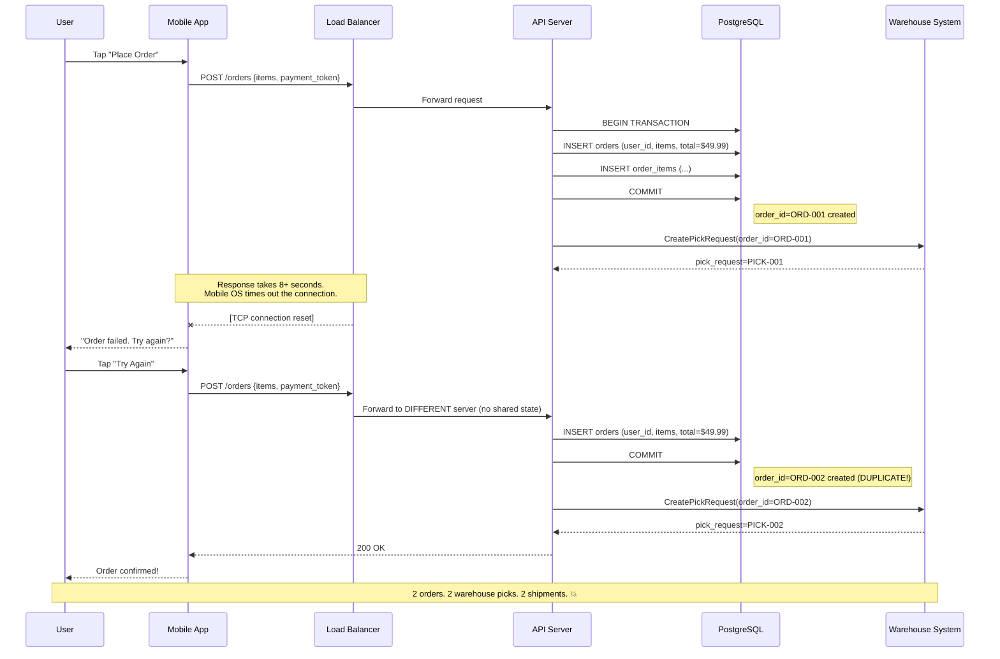
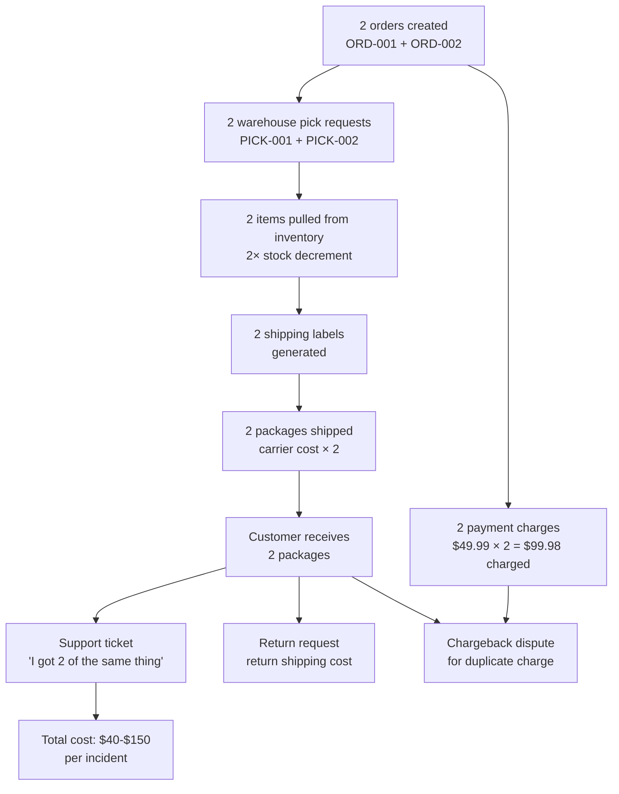

# Duplicate Orders on Retry: When the Network Lies to You

**A mobile app user taps "Place Order" on a flaky 4G connection. The order is created on the server, payment is charged, the fulfillment warehouse gets a pick request. The response takes 8 seconds — the mobile OS kills the connection. The app shows an error: "Order failed. Please try again." The user taps again.** Now there are 2 orders, 2 warehouse pick tickets, and Stripe shows 2 charges. Your warehouse ships 2 packages. The customer gets 2 of the same item. One they want to return, but you're already paying for the return shipping on a mistake that was your system's fault.

This is the duplicate order problem — the specific flavor of network retry hazard that hits hardest in e-commerce, food delivery, and any system where "order" is the core unit of work.

---

## The Problem Class `[Senior]`

Every network request can fail in three ways:
1. The server never received it (safe to retry — nothing happened)
2. The server received it but failed processing (depends on what failed)
3. The server received it, processed it, and the *response* was lost (dangerous to retry — work already done)

Your client cannot distinguish case 1 from case 3. The user sees "request failed" in both situations. If you don't retry: you lose case 1 (legitimate failures go unrecovered). If you retry without idempotency: case 3 causes duplicates.


```mermaid
sequenceDiagram
    participant User
    participant App as Mobile App
    participant LB as Load Balancer
    participant API as API Server
    participant DB as PostgreSQL
    participant WH as Warehouse System

    User->>App: Tap "Place Order"
    App->>LB: POST /orders {items, payment_token}
    LB->>API: Forward request

    API->>DB: BEGIN TRANSACTION
    API->>DB: INSERT orders (user_id, items, total=$49.99)
    API->>DB: INSERT order_items (...)
    API->>DB: COMMIT
    Note right of DB: order_id=ORD-001 created

    API->>WH: CreatePickRequest(order_id=ORD-001)
    WH-->>API: pick_request=PICK-001

    Note over LB,App: Response takes 8+ seconds.<br/>Mobile OS times out the connection.

    LB--xApp: [TCP connection reset]
    App-->>User: "Order failed. Try again?"

    User->>App: Tap "Try Again"
    App->>LB: POST /orders {items, payment_token}
    LB->>API: Forward to DIFFERENT server (no shared state)

    API->>DB: INSERT orders (user_id, items, total=$49.99)
    API->>DB: COMMIT
    Note right of DB: order_id=ORD-002 created (DUPLICATE!)

    API->>WH: CreatePickRequest(order_id=ORD-002)
    WH-->>API: pick_request=PICK-002

    API-->>App: 200 OK
    App-->>User: Order confirmed!

    Note over User,WH: 2 orders. 2 warehouse picks. 2 shipments. 💥
```

---

## Why This Is Especially Bad for Orders

Every domain has consequences unique to duplicate records. For orders, duplicates cascade:


```mermaid
graph TD
    A["2 orders created\nORD-001 + ORD-002"] --> B["2 payment charges\n$49.99 × 2 = $99.98 charged"]
    A --> C["2 warehouse pick requests\nPICK-001 + PICK-002"]
    C --> D["2 items pulled from inventory\n2× stock decrement"]
    D --> E["2 shipping labels\ngenerated"]
    E --> F["2 packages shipped\ncarrier cost × 2"]
    F --> G["Customer receives\n2 packages"]
    G --> H1["Support ticket\n'I got 2 of the same thing'"]
    G --> H2["Return request\nreturn shipping cost"]
    G --> H3["Chargeback dispute\nfor duplicate charge"]
    B --> H3
    H1 --> I["Total cost: $40-$150\nper incident"]
```

Each step in the order pipeline is a side effect. Duplicates at the order level multiply through every downstream system.

**Real numbers**: DoorDash estimates that without deduplication, ~0.3% of high-traffic orders during peak periods would be duplicated due to network retries and mobile app behaviors. At 2 million daily orders, that's 6,000 duplicate orders per day without mitigation.

---

## Real-World Impact

**Amazon's order system** is built on idempotency at every layer. Every API call, every queue message, every Lambda invocation is designed to be safely retried. Amazon's order processing documentation states: "An operation must be idempotent. A client must be able to retry any operation without concern for side effects."

**Shopify** handles millions of checkout sessions daily. During flash sales, their CDN and load balancers automatically retry failed requests. Without order-level idempotency, these retries would create duplicate orders. Shopify's checkout flow uses a `checkout_token` as a natural idempotency key — the same token cannot be checked out twice.

**DoorDash** published that their checkout service uses a combination of client-side idempotency keys and server-side deduplication tables to handle the "tap and retry" pattern common on mobile apps with unreliable data connections. Their approach: generate a UUID at checkout start, persist it, retry with the same UUID, deduplicate on the server.

**Uber Eats** sees high duplicate submission rates specifically from users in areas with poor connectivity. A user in a cellular dead zone taps "Order," gets a spinner, moves to better coverage, and taps again. Both requests eventually reach the server. Without idempotency, both orders are created.

---

## The Wrong Fixes (and Why They Fail)

**Wrong Fix 1: Check for "similar recent orders"**

```javascript
// WRONG — too broad, too narrow, race-prone
async function createOrderWithCheck(userId, items) {
  const recent = await db.query(
    `SELECT id FROM orders
     WHERE user_id = $1
     AND created_at > NOW() - INTERVAL '30 seconds'
     AND status = 'pending'`,
    [userId]
  );

  if (recent.rows.length > 0) {
    // "Probably a duplicate"
    return recent.rows[0];
  }

  return createOrder(userId, items);
}
```

Problems:
- A user legitimately ordering twice within 30 seconds is blocked
- Two concurrent retries both pass the check (check is not atomic with create)
- "Recent order" doesn't mean "same order" — item sets may differ

**Wrong Fix 2: Unique constraint on (user_id, total)**

```sql
-- WRONG — too fragile, catches too many false positives
ALTER TABLE orders ADD CONSTRAINT uniq_user_order UNIQUE (user_id, total);
```

A user ordering multiple items at $49.99 can never order the same total again. This breaks legitimate repeat orders.

**Wrong Fix 3: Frontend-only deduplication**

```javascript
// WRONG — client can't enforce server-side deduplication
let orderSubmitting = false;

submitButton.addEventListener('click', async () => {
  if (orderSubmitting) return; // Disable button
  orderSubmitting = true;
  await placeOrder();
  orderSubmitting = false;
});
```

The button double-tap protection is useful UX, but it doesn't prevent retries from:
- Automatic retry logic in HTTP clients
- Load balancer retries
- Push notification re-deliveries
- Background app reconnection after network restore
- Two browser tabs

---

## The Right Solutions

### Solution 1: Client-Generated Idempotency Key

The client generates a UUID when the checkout begins. Every retry of the same checkout attempt sends the same UUID. The server uses this to deduplicate.

```javascript
// CLIENT SIDE — React Native / mobile app
class CheckoutManager {
  constructor() {
    this.storage = AsyncStorage; // React Native persistent storage
  }

  async startCheckout(cartId) {
    // Generate idempotency key when user begins checkout
    // (not when they tap "place order" — that happens multiple times)
    const existingKey = await this.storage.getItem(`checkout_key:${cartId}`);
    if (existingKey) return existingKey;

    const key = `checkout-${cartId}-${generateUUID()}`;
    await this.storage.setItem(`checkout_key:${cartId}`, key);
    return key;
  }

  async placeOrder(cartId, paymentToken) {
    const idempotencyKey = await this.startCheckout(cartId);

    try {
      const response = await fetch('/orders', {
        method: 'POST',
        headers: {
          'Content-Type': 'application/json',
          'Idempotency-Key': idempotencyKey,
        },
        body: JSON.stringify({ cartId, paymentToken }),
        // Retry automatically on network errors
        retries: 3,
        retryDelay: (attempt) => Math.pow(2, attempt) * 1000, // 1s, 2s, 4s
      });

      if (response.ok) {
        // Success — clear the stored key (this checkout is done)
        await this.storage.removeItem(`checkout_key:${cartId}`);
      }

      return response.json();
    } catch (err) {
      // Key persists in storage — next retry will use the same key
      throw err;
    }
  }

  // User explicitly starts a new checkout after a failure
  async resetCheckout(cartId) {
    await this.storage.removeItem(`checkout_key:${cartId}`);
  }
}
```

---

### Solution 2: Server-Side Deduplication Table

The server stores the idempotency key alongside the result. Any request with a seen key gets the original response. The key table has a TTL after which old keys are purged.

```javascript
// EXPRESS IDEMPOTENCY MIDDLEWARE
const Redis = require('ioredis');
const redis = new Redis(process.env.REDIS_URL);

const orderIdempotencyMiddleware = async (req, res, next) => {
  const idempotencyKey = req.headers['idempotency-key'];

  if (!idempotencyKey) {
    return res.status(400).json({
      error: 'Idempotency-Key header is required',
      message: 'Include a UUID in the Idempotency-Key header to safely retry this request'
    });
  }

  // Validate format
  const UUID_REGEX = /^[0-9a-f]{8}-[0-9a-f]{4}-[0-9a-f]{4}-[0-9a-f]{4}-[0-9a-f]{12}$/i;
  if (!UUID_REGEX.test(idempotencyKey)) {
    return res.status(400).json({ error: 'Idempotency-Key must be a valid UUID' });
  }

  const cacheKey = `idempotency:orders:${idempotencyKey}`;

  // Check if this key has been seen
  const existing = await redis.get(cacheKey);

  if (existing) {
    const stored = JSON.parse(existing);

    if (stored.status === 'processing') {
      // In-flight — tell client to wait and retry
      return res.status(409).json({
        error: 'Request is already being processed',
        retryAfter: 5
      });
    }

    // Completed — replay the original response
    console.log(`Idempotent replay: ${idempotencyKey} → order ${stored.body.orderId}`);
    return res.status(stored.httpStatus).json(stored.body);
  }

  // Mark as in-progress with a short TTL (protects against concurrent requests with same key)
  await redis.setex(cacheKey, 30, JSON.stringify({ status: 'processing' }));

  // Override res.json to capture the response
  const originalJson = res.json.bind(res);
  res.json = async (body) => {
    // Store for 24 hours
    await redis.setex(
      cacheKey,
      86400,
      JSON.stringify({ status: 'completed', httpStatus: res.statusCode, body })
    );
    return originalJson(body);
  };

  next();
};

// ORDER HANDLER
app.post('/orders', orderIdempotencyMiddleware, async (req, res) => {
  const { cartId, paymentToken } = req.body;
  const userId = req.user.id;

  const client = await pool.connect();
  try {
    await client.query('BEGIN');

    // Get cart items
    const cart = await client.query(
      'SELECT * FROM cart_items WHERE cart_id = $1 AND user_id = $2',
      [cartId, userId]
    );

    if (cart.rows.length === 0) {
      return res.status(404).json({ error: 'Cart not found or empty' });
    }

    const total = cart.rows.reduce((sum, item) => sum + item.price * item.quantity, 0);

    // Create order
    const order = await client.query(
      `INSERT INTO orders (user_id, cart_id, total, status, idempotency_key)
       VALUES ($1, $2, $3, 'pending', $4)
       RETURNING id, created_at`,
      [userId, cartId, total, req.headers['idempotency-key']]
    );

    // Create order items
    for (const item of cart.rows) {
      await client.query(
        `INSERT INTO order_items (order_id, product_id, quantity, unit_price)
         VALUES ($1, $2, $3, $4)`,
        [order.rows[0].id, item.product_id, item.quantity, item.price]
      );
    }

    // Decrement inventory (atomic)
    for (const item of cart.rows) {
      const update = await client.query(
        `UPDATE inventory SET stock = stock - $1
         WHERE product_id = $2 AND stock >= $1`,
        [item.quantity, item.product_id]
      );
      if (update.rowCount === 0) {
        await client.query('ROLLBACK');
        return res.status(409).json({
          error: 'Item out of stock',
          product_id: item.product_id
        });
      }
    }

    await client.query('COMMIT');

    res.status(201).json({
      orderId: order.rows[0].id,
      total,
      status: 'pending',
      createdAt: order.rows[0].created_at
    });

  } catch (err) {
    await client.query('ROLLBACK');
    throw err;
  } finally {
    client.release();
  }
});
```

**Schema**:
```sql
CREATE TABLE orders (
  id               UUID PRIMARY KEY DEFAULT gen_random_uuid(),
  user_id          UUID NOT NULL,
  cart_id          UUID NOT NULL,
  total            DECIMAL(10,2) NOT NULL,
  status           VARCHAR(20) NOT NULL DEFAULT 'pending',
  idempotency_key  UUID UNIQUE,
  created_at       TIMESTAMPTZ NOT NULL DEFAULT NOW()
);

-- Unique constraint on idempotency_key catches any race condition
-- that slips past the Redis check (belt and suspenders)
CREATE UNIQUE INDEX idx_orders_idempotency_key
  ON orders(idempotency_key)
  WHERE idempotency_key IS NOT NULL;
```

---

### Solution 3: Natural Deduplication with Composite Unique Constraint

For systems where you control the data model fully, use a natural composite key that makes a duplicate *structurally impossible*.

```sql
-- Approach: one active order per (user, cart_snapshot_hash) within a time window
ALTER TABLE orders ADD COLUMN cart_hash VARCHAR(64);

CREATE UNIQUE INDEX idx_orders_natural_dedup
  ON orders(user_id, cart_hash)
  WHERE status IN ('pending', 'confirmed')
    AND created_at > NOW() - INTERVAL '10 minutes';
```

```javascript
const crypto = require('crypto');

function hashCart(items) {
  // Create a deterministic hash of the cart contents
  const sorted = [...items].sort((a, b) =>
    a.product_id.localeCompare(b.product_id)
  );
  const canonical = JSON.stringify(sorted.map(i => ({
    id: i.product_id,
    qty: i.quantity
  })));
  return crypto.createHash('sha256').update(canonical).digest('hex');
}

async function createOrderNaturalDedup(userId, items) {
  const cartHash = hashCart(items);

  const result = await pool.query(
    `INSERT INTO orders (user_id, cart_hash, status, total, created_at)
     VALUES ($1, $2, 'pending', $3, NOW())
     ON CONFLICT (user_id, cart_hash) WHERE status IN ('pending', 'confirmed')
     DO UPDATE SET updated_at = NOW()
     RETURNING id, (xmax = 0) AS is_new`,
    [userId, cartHash, calculateTotal(items)]
  );

  const row = result.rows[0];
  return {
    orderId: row.id,
    created: row.is_new,
    message: row.is_new ? 'Order created' : 'Existing order returned'
  };
}
```

**Limitation**: If the user legitimately wants to order the same items twice in 10 minutes (restocking a pantry, buying gifts), this blocks them. Idempotency keys are more precise.

---

### Solution 4: Exactly-Once Message Processing for Order Events

When order creation triggers downstream systems (warehouse, payment, notifications) via a message queue, those consumers must also be idempotent. A Kafka consumer that restarts after an offset commit failure will reprocess messages.

```javascript
const { Kafka } = require('kafkajs');
const kafka = new Kafka({ clientId: 'order-processor', brokers: [process.env.KAFKA_BROKER] });

const consumer = kafka.consumer({ groupId: 'warehouse-fulfillment' });

await consumer.connect();
await consumer.subscribe({ topic: 'orders.confirmed', fromBeginning: false });

await consumer.run({
  // eachMessage ensures exactly-one processing per partition
  eachMessage: async ({ topic, partition, message }) => {
    const order = JSON.parse(message.value.toString());
    const messageId = `${topic}:${partition}:${message.offset}`;

    // Check if already processed using the message offset as deduplication key
    const alreadyProcessed = await redis.exists(`processed:${messageId}`);
    if (alreadyProcessed) {
      console.log(`Skipping already-processed message: ${messageId}`);
      return; // Commit the offset without re-processing
    }

    const client = await pool.connect();
    try {
      await client.query('BEGIN');

      // Check at DB level as well (belt and suspenders for Redis failure)
      const existing = await client.query(
        'SELECT id FROM warehouse_picks WHERE order_id = $1',
        [order.id]
      );

      if (existing.rows.length === 0) {
        // Create pick request
        await client.query(
          `INSERT INTO warehouse_picks (order_id, status, created_at)
           VALUES ($1, 'pending', NOW())`,
          [order.id]
        );

        // Notify warehouse management system
        await notifyWarehouseSystem(order);
      }

      await client.query('COMMIT');

      // Mark as processed in Redis with 7-day TTL
      await redis.setex(`processed:${messageId}`, 604800, '1');

    } catch (err) {
      await client.query('ROLLBACK');
      throw err; // Re-throw — Kafka will retry by not committing offset
    } finally {
      client.release();
    }
  }
});
```

**Kafka offset management**: By default, `kafkajs` commits the offset after the message is processed. If your handler throws, the offset is not committed, and the message is reprocessed on restart. This means your handler must be idempotent — it will be called at least once, potentially more.

---

## Complete Solution: Express Idempotency Middleware with PostgreSQL Fallback

A production-grade implementation that uses Redis as the primary store and PostgreSQL as the fallback (for Redis failures):

```javascript
class IdempotencyService {
  constructor(redis, pool) {
    this.redis = redis;
    this.pool = pool;
  }

  async check(key) {
    // Primary: Redis (fast path)
    try {
      const cached = await this.redis.get(`idempotency:${key}`);
      if (cached) return JSON.parse(cached);
    } catch (redisErr) {
      console.warn('Redis unavailable, falling back to DB:', redisErr.message);
    }

    // Fallback: PostgreSQL
    const result = await this.pool.query(
      'SELECT response_status, response_body FROM idempotency_records WHERE key = $1 AND expires_at > NOW()',
      [key]
    );

    if (result.rows.length > 0) {
      const row = result.rows[0];
      return { httpStatus: row.response_status, body: row.response_body, status: 'completed' };
    }

    return null;
  }

  async store(key, httpStatus, body, ttlSeconds = 86400) {
    const data = { status: 'completed', httpStatus, body };

    // Write to Redis
    try {
      await this.redis.setex(`idempotency:${key}`, ttlSeconds, JSON.stringify(data));
    } catch (redisErr) {
      console.warn('Redis write failed, writing to DB only:', redisErr.message);
    }

    // Write to PostgreSQL (durable fallback)
    await this.pool.query(
      `INSERT INTO idempotency_records (key, response_status, response_body, expires_at)
       VALUES ($1, $2, $3, NOW() + $4 * INTERVAL '1 second')
       ON CONFLICT (key) DO UPDATE
       SET response_status = EXCLUDED.response_status,
           response_body = EXCLUDED.response_body`,
      [key, httpStatus, JSON.stringify(body), ttlSeconds]
    );
  }

  async markInProgress(key) {
    const luaScript = `
      if redis.call('EXISTS', KEYS[1]) == 0 then
        redis.call('SETEX', KEYS[1], 30, '{"status":"processing"}')
        return 1
      else
        return 0
      end
    `;
    const acquired = await this.redis.eval(luaScript, 1, `idempotency:${key}`);
    return acquired === 1;
  }
}

// Middleware factory
function createIdempotencyMiddleware(service) {
  return async (req, res, next) => {
    const key = req.headers['idempotency-key'];
    if (!key) return next(); // Idempotency optional for this endpoint

    const existing = await service.check(key);

    if (existing?.status === 'processing') {
      return res.status(409).json({ error: 'Request in progress' });
    }

    if (existing?.status === 'completed') {
      return res.status(existing.httpStatus).json(existing.body);
    }

    const acquired = await service.markInProgress(key);
    if (!acquired) {
      return res.status(409).json({ error: 'Concurrent request detected' });
    }

    const originalJson = res.json.bind(res);
    res.json = async (body) => {
      await service.store(key, res.statusCode, body);
      return originalJson(body);
    };

    next();
  };
}

// PostgreSQL schema for durable idempotency records
/*
CREATE TABLE idempotency_records (
  key              UUID PRIMARY KEY,
  response_status  INT NOT NULL,
  response_body    JSONB NOT NULL,
  created_at       TIMESTAMPTZ NOT NULL DEFAULT NOW(),
  expires_at       TIMESTAMPTZ NOT NULL
);

CREATE INDEX idx_idempotency_records_expires_at ON idempotency_records(expires_at);

-- Cleanup job: DELETE FROM idempotency_records WHERE expires_at < NOW();
*/
```

---

## Prevention Patterns

**Idempotency as a first-class design concern**. Every mutation endpoint in your API should support idempotency keys. Make it a company-wide standard, not an afterthought.

**Document the idempotency contract** in your API docs:
- Which endpoints are idempotent
- How long idempotency keys are stored (TTL)
- What constitutes a "new" request vs a retry

**Test retry behavior explicitly**:
```javascript
// Integration test: verify retry returns same order
it('returns existing order on retry with same idempotency key', async () => {
  const key = generateUUID();

  const first = await request(app)
    .post('/orders')
    .set('Idempotency-Key', key)
    .send({ cartId: 'cart-123', paymentToken: 'tok_visa' });

  expect(first.status).toBe(201);
  const firstOrderId = first.body.orderId;

  const second = await request(app)
    .post('/orders')
    .set('Idempotency-Key', key)
    .send({ cartId: 'cart-123', paymentToken: 'tok_visa' });

  expect(second.status).toBe(201);
  expect(second.body.orderId).toBe(firstOrderId); // Same order returned
  expect(second.body.idempotent).toBe(true);

  // Verify only one order in DB
  const orders = await pool.query('SELECT id FROM orders WHERE user_id=$1', [userId]);
  expect(orders.rows).toHaveLength(1);
});
```

**Monitor idempotency key hit rates**. A high hit rate (> 5%) on order endpoints indicates widespread retry behavior, which could signal latency issues:
```javascript
metrics.increment('idempotency.cache_hit', { endpoint: 'POST /orders' });
metrics.increment('idempotency.new_request', { endpoint: 'POST /orders' });
```

---

## Checklist: Am I Safe?

- [ ] All order creation endpoints require an `Idempotency-Key` header
- [ ] Idempotency keys are stored with the order record (unique index)
- [ ] Server returns the original response on duplicate key, not a new order
- [ ] Redis used as primary idempotency store (fast path)
- [ ] PostgreSQL used as durable fallback for idempotency records
- [ ] In-progress markers prevent concurrent requests with the same key
- [ ] Client generates one UUID per checkout session (not per HTTP call)
- [ ] Client persists idempotency key in durable storage (survives app crash)
- [ ] Kafka consumers check for processed message offsets before processing
- [ ] Integration tests verify that retries return the same order
- [ ] Monitoring alerts on abnormal duplicate order rates
- [ ] Idempotency records are cleaned up after TTL (prevent table bloat)

---

## Related Problems

- **Double Charge** (`double-charge-payment.md`) — payment idempotency and retries causing double billing
- **Double Booking** (`double-booking.md`) — concurrent requests both confirming the same resource
- **Inventory Overselling** (`race-condition-inventory.md`) — concurrent requests depleting stock below zero
- **Counter Race** (`counter-race.md`) — lost updates on shared counters from concurrent increments
