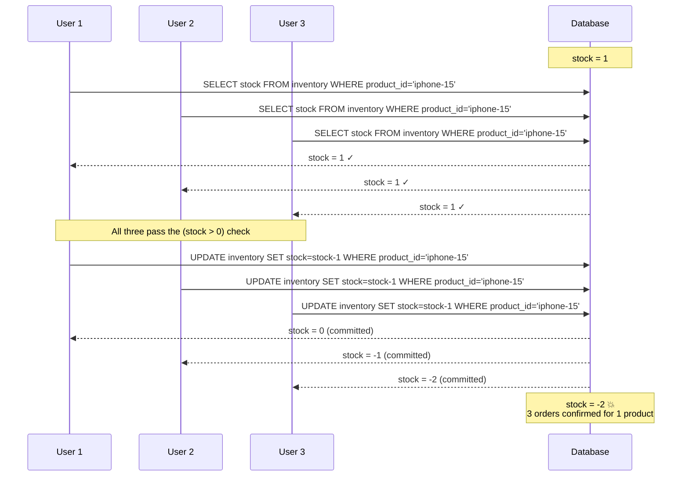
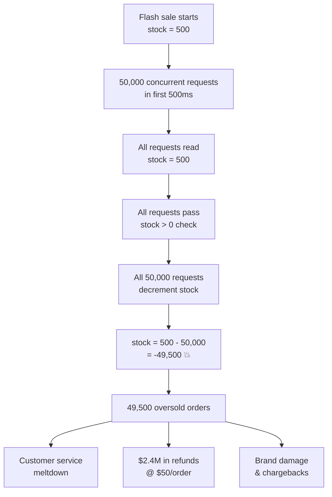
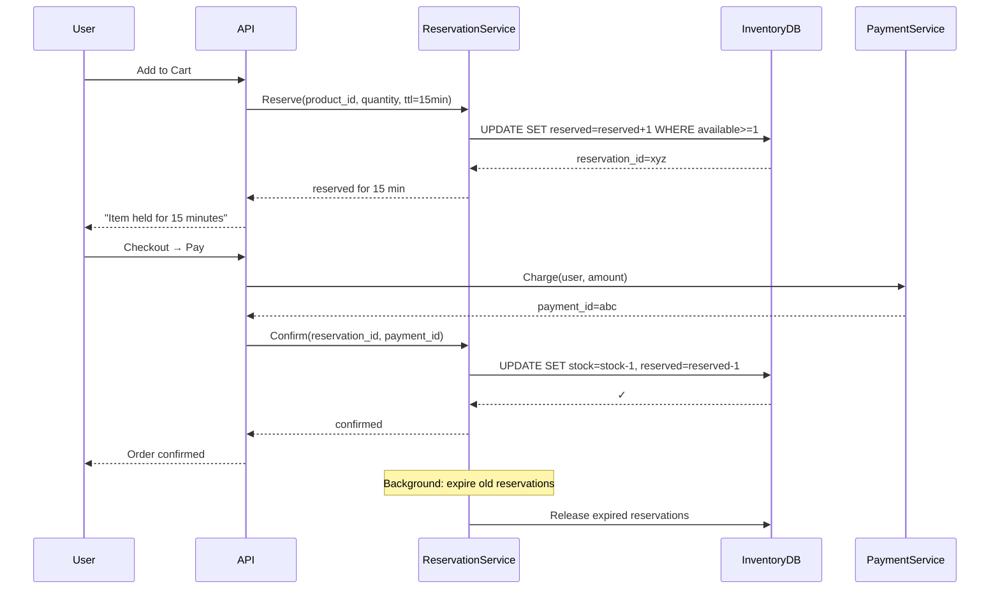

# Inventory Overselling: How Flash Sales Break Your Warehouse

**You have 1 iPhone left in stock. 500 users hit "Add to Cart" simultaneously during a product drop. 47 of them get order confirmations. Your warehouse has 1 phone.** Your fulfillment team discovers the problem when they go to pick the orders. 46 customers have already received shipping notifications. Your customer service queue fills up overnight, and tomorrow morning you're authorizing $50,000 in cancellation refunds.

This is inventory overselling. It's one of the most financially damaging race conditions in e-commerce, and it scales in severity with your traffic — the more popular the product, the worse the damage.

---

## The Problem Class `[Senior]`

E-commerce inventory follows a simple pattern: read the stock level, check it's > 0, decrement it, create an order. This is correct for one request. Under concurrent load, it falls apart completely.

Every request reads the same stock value. Every request passes the check. Every request decrements. The decrements pile on top of each other. Stock goes negative. Orders exceed physical inventory.


```mermaid
sequenceDiagram
    participant U1 as User 1
    participant U2 as User 2
    participant U3 as User 3
    participant DB as Database
    Note over DB: stock = 1

    U1->>DB: SELECT stock FROM inventory WHERE product_id='iphone-15'
    U2->>DB: SELECT stock FROM inventory WHERE product_id='iphone-15'
    U3->>DB: SELECT stock FROM inventory WHERE product_id='iphone-15'

    DB-->>U1: stock = 1 ✓
    DB-->>U2: stock = 1 ✓
    DB-->>U3: stock = 1 ✓

    Note over U1,U3: All three pass the (stock > 0) check

    U1->>DB: UPDATE inventory SET stock=stock-1 WHERE product_id='iphone-15'
    U2->>DB: UPDATE inventory SET stock=stock-1 WHERE product_id='iphone-15'
    U3->>DB: UPDATE inventory SET stock=stock-1 WHERE product_id='iphone-15'

    DB-->>U1: stock = 0 (committed)
    DB-->>U2: stock = -1 (committed)
    DB-->>U3: stock = -2 (committed)

    Note over DB: stock = -2 💥<br/>3 orders confirmed for 1 product
```

---

## Why This Is Catastrophic at Flash Sale Scale

Consider what happens at real Black Friday traffic. Nike drops limited Air Jordans at noon. 200,000 users are waiting on the product page. At exactly 12:00:00, they all click "Add to Cart."

Your application servers process maybe 5,000 requests per second each. You have 10 servers. That's 50,000 requests in the first second hitting the inventory table for the same product_id.

The race window between each request's SELECT and UPDATE is ~10ms. In those 10ms on a loaded system, thousands of other requests have also read `stock = 500` (if that's what you stocked) and are also about to decrement. By the time your database processes all the commits, stock = -49,500.

You just sold 50,000 pairs of shoes that don't exist.


```mermaid
graph TD
    A["Flash sale starts\nstock = 500"] --> B["50,000 concurrent requests\nin first 500ms"]
    B --> C["All requests read\nstock = 500"]
    C --> D["All requests pass\nstock > 0 check"]
    D --> E["All 50,000 requests\ndecrement stock"]
    E --> F["stock = 500 - 50,000\n= -49,500 💥"]
    F --> G["49,500 oversold orders"]
    G --> H1["Customer service\nmeltdown"]
    G --> H2["$2.4M in refunds\n@ $50/order"]
    G --> H3["Brand damage\n& chargebacks"]
```

---

## Real-World Impact

**Nike SNKRS App** has experienced high-profile failures during limited sneaker drops. While Nike doesn't publish post-mortems, the pattern is well-known: demand overwhelms inventory controls, some users receive purchase confirmations that are later cancelled, causing massive user backlash. The SNKRS community documents these failures extensively.

**Amazon's** inventory system processes billions of items with concurrent traffic. Their 2018 Prime Day technical challenges included inventory inconsistencies under extreme load. Amazon's solution involves a distributed reservation system — inventory is "soft reserved" before payment, held for a TTL, and permanently decremented only after successful payment.

**Shopify** has published research on flash sale infrastructure. They identified that the naive SELECT + UPDATE pattern fails at ~500 concurrent requests per product. Their solution involves Redis-based atomic counters for the hot path, with async reconciliation to the primary database.

**The financial cost pattern** is consistent: overselling by 10% on a $1M flash sale = $100K in refund processing costs, customer service overhead, and reputational damage. For digital goods (software licenses, event tickets), overselling means customers are told their purchase was invalid after they've already made plans.

---

## The Wrong Fix (and Why It Fails)

The instinctive fix is to add a check inside a transaction:

```javascript
// WRONG — still a race condition
async function addToCartWrong(productId, userId, quantity) {
  const client = await pool.connect();

  try {
    await client.query('BEGIN');

    const result = await client.query(
      'SELECT stock FROM inventory WHERE product_id = $1',
      [productId]
    );

    const stock = result.rows[0].stock;

    // This check happens INSIDE a transaction — but READ COMMITTED
    // isolation means another transaction's committed decrement
    // may not be visible yet at the time of this SELECT
    if (stock < quantity) {
      await client.query('ROLLBACK');
      throw new Error('Out of stock');
    }

    await client.query(
      'UPDATE inventory SET stock = stock - $1 WHERE product_id = $2',
      [quantity, productId]
    );

    await client.query('COMMIT');

  } finally {
    client.release();
  }
}
```

This is exactly the same race. The `BEGIN` does not prevent another transaction from reading the same `stock` value between your SELECT and your UPDATE. You need either:

1. A lock that prevents concurrent reads-for-modification
2. A conditional update that fails atomically if stock is insufficient
3. A system where the decrement and the check are a single atomic operation

---

## The Right Solutions

### Solution 1: Atomic UPDATE with WHERE Clause

The most reliable, simplest fix. Combine the check and the decrement into a single `UPDATE` statement. Check `rowCount` to know if it succeeded.

```javascript
const { Pool } = require('pg');
const pool = new Pool({ connectionString: process.env.DATABASE_URL });

async function reserveInventory(productId, userId, quantity) {
  // Single atomic operation: decrement only if enough stock exists.
  // The WHERE clause is evaluated with a row-level lock during the UPDATE.
  // Two concurrent transactions CANNOT both satisfy (stock >= quantity)
  // and both commit a decrement — one will find rowCount = 0.
  const result = await pool.query(
    `UPDATE inventory
     SET stock = stock - $1,
         reserved_count = reserved_count + 1,
         updated_at = NOW()
     WHERE product_id = $2
       AND stock >= $1`,
    [quantity, productId]
  );

  if (result.rowCount === 0) {
    throw new Error('Insufficient stock');
  }

  // Stock successfully decremented — now create the order record
  const order = await pool.query(
    `INSERT INTO orders (user_id, product_id, quantity, status, created_at)
     VALUES ($1, $2, $3, 'confirmed', NOW())
     RETURNING id`,
    [userId, productId, quantity]
  );

  return {
    success: true,
    orderId: order.rows[0].id,
    message: 'Order confirmed'
  };
}
```

**Why this works**: A single `UPDATE` statement acquires a row-level lock, evaluates the `WHERE` clause, and applies the change atomically. Two concurrent `UPDATE` statements on the same row serialize — one executes first and commits, the second then evaluates the (now-decremented) stock and finds `stock < quantity`, updating 0 rows.

**Add a CHECK constraint** as a hard backstop:

```sql
ALTER TABLE inventory
  ADD CONSTRAINT stock_non_negative CHECK (stock >= 0);
```

If any bug or direct SQL write tries to go negative, the database rejects it.

---

### Solution 2: Redis DECRBY + Lua Script (High-Throughput Path)

For flash sales with thousands of requests per second on the same product, even the database atomic UPDATE creates contention at the storage engine level. Redis is single-threaded and operates in microseconds — it's the right tool for the hot path.

```javascript
const Redis = require('ioredis');
const redis = new Redis(process.env.REDIS_URL);

// Lua script for atomic check-and-decrement
// Lua scripts in Redis execute atomically — no other commands run between lines
const DECREMENT_IF_AVAILABLE = `
  local current = tonumber(redis.call('GET', KEYS[1]))
  if current == nil then
    return -2  -- Key doesn't exist (cache miss)
  end
  if current < tonumber(ARGV[1]) then
    return -1  -- Insufficient stock
  end
  return redis.call('DECRBY', KEYS[1], ARGV[1])
`;

async function initializeProductStock(productId, stock) {
  const key = `inventory:${productId}`;
  await redis.set(key, stock);
  await redis.expire(key, 86400); // 24h TTL
}

async function reserveInventoryRedis(productId, userId, quantity) {
  const key = `inventory:${productId}`;

  // Execute atomic Lua script
  const result = await redis.eval(
    DECREMENT_IF_AVAILABLE,
    1,          // number of keys
    key,        // KEYS[1]
    quantity    // ARGV[1]
  );

  if (result === -2) {
    // Cache miss — fall back to database path
    return reserveInventoryDatabase(productId, userId, quantity);
  }

  if (result === -1) {
    throw new Error('Out of stock');
  }

  // Redis decrement succeeded. result = new stock level.
  // Enqueue DB write asynchronously — don't make the user wait for it.
  await orderQueue.add('create-order', {
    userId,
    productId,
    quantity,
    redisStockAfter: result
  });

  return {
    success: true,
    message: 'Order confirmed',
    stockRemaining: result
  };
}

// Background worker processes the queue and writes to DB
orderQueue.process('create-order', async (job) => {
  const { userId, productId, quantity } = job.data;

  // Use atomic UPDATE in DB as well (belt and suspenders)
  const result = await pool.query(
    `UPDATE inventory SET stock = stock - $1 WHERE product_id = $2 AND stock >= $1`,
    [quantity, productId]
  );

  if (result.rowCount === 0) {
    // Redis said OK but DB said no — inconsistency.
    // Log, alert, and trigger reconciliation.
    logger.error('INVENTORY_INCONSISTENCY', { productId, userId, quantity });
    await compensate(userId, productId, quantity);
    return;
  }

  await pool.query(
    `INSERT INTO orders (user_id, product_id, quantity, status) VALUES ($1, $2, $3, 'confirmed')`,
    [userId, productId, quantity]
  );
});
```

**Throughput characteristics**:
- Database atomic UPDATE: ~5,000 operations/second per product (serialized row lock)
- Redis Lua script: ~100,000 operations/second per product (single-threaded, in-memory)

---

### Solution 3: Distributed Reservation System (Reserve → Confirm → Release)

For complex inventory (e.g., Amazon's multi-warehouse model where fulfillment requires physically locating stock), a two-phase reservation pattern decouples the "claiming" of inventory from the "committing" of it.


```mermaid
sequenceDiagram
    participant User
    participant API
    participant ReservationService
    participant InventoryDB
    participant PaymentService

    User->>API: Add to Cart
    API->>ReservationService: Reserve(product_id, quantity, ttl=15min)
    ReservationService->>InventoryDB: UPDATE SET reserved=reserved+1 WHERE available>=1
    InventoryDB-->>ReservationService: reservation_id=xyz
    ReservationService-->>API: reserved for 15 min
    API-->>User: "Item held for 15 minutes"

    User->>API: Checkout → Pay
    API->>PaymentService: Charge(user, amount)
    PaymentService-->>API: payment_id=abc
    API->>ReservationService: Confirm(reservation_id, payment_id)
    ReservationService->>InventoryDB: UPDATE SET stock=stock-1, reserved=reserved-1
    InventoryDB-->>ReservationService: ✓
    ReservationService-->>API: confirmed
    API-->>User: Order confirmed

    Note over ReservationService: Background: expire old reservations
    ReservationService->>InventoryDB: Release expired reservations
```

```javascript
async function createReservation(productId, quantity, userId, ttlSeconds = 900) {
  const client = await pool.connect();

  try {
    await client.query('BEGIN');

    // Atomically reserve: subtract from available, add to reserved
    const result = await client.query(
      `UPDATE inventory
       SET available = available - $1,
           reserved = reserved + $1
       WHERE product_id = $2
         AND available >= $1
       RETURNING available, reserved`,
      [quantity, productId]
    );

    if (result.rowCount === 0) {
      throw new Error('Insufficient available inventory');
    }

    const expiresAt = new Date(Date.now() + ttlSeconds * 1000);

    const reservation = await client.query(
      `INSERT INTO reservations
         (product_id, user_id, quantity, status, expires_at)
       VALUES ($1, $2, $3, 'pending', $4)
       RETURNING id`,
      [productId, userId, quantity, expiresAt]
    );

    await client.query('COMMIT');

    return {
      reservationId: reservation.rows[0].id,
      expiresAt,
      availableAfter: result.rows[0].available
    };

  } catch (err) {
    await client.query('ROLLBACK');
    throw err;
  } finally {
    client.release();
  }
}

async function confirmReservation(reservationId, paymentId) {
  const client = await pool.connect();

  try {
    await client.query('BEGIN');

    const res = await client.query(
      `UPDATE reservations
       SET status = 'confirmed', payment_id = $1
       WHERE id = $2 AND status = 'pending' AND expires_at > NOW()
       RETURNING product_id, quantity, user_id`,
      [paymentId, reservationId]
    );

    if (res.rowCount === 0) {
      throw new Error('Reservation expired or already processed');
    }

    const { product_id, quantity, user_id } = res.rows[0];

    // Release the reservation hold, decrement actual stock
    await client.query(
      `UPDATE inventory
       SET stock = stock - $1,
           reserved = reserved - $1
       WHERE product_id = $2`,
      [quantity, product_id]
    );

    await client.query(
      `INSERT INTO orders (user_id, product_id, quantity, reservation_id, status)
       VALUES ($1, $2, $3, $4, 'confirmed')`,
      [user_id, product_id, quantity, reservationId]
    );

    await client.query('COMMIT');
    return { success: true };

  } catch (err) {
    await client.query('ROLLBACK');
    throw err;
  } finally {
    client.release();
  }
}

// Background job: release expired reservations every 60 seconds
setInterval(async () => {
  await pool.query(`
    WITH expired AS (
      UPDATE reservations
      SET status = 'expired'
      WHERE status = 'pending' AND expires_at < NOW()
      RETURNING product_id, quantity
    )
    UPDATE inventory i
    SET available = available + e.quantity,
        reserved = reserved - e.quantity
    FROM expired e
    WHERE i.product_id = e.product_id
  `);
}, 60000);
```

---

### Solution 4: Idempotency Key on Order Creation

Even with atomic decrements, network retries can cause the same order to be submitted twice. An idempotency key on the order endpoint prevents double-decrement on retry.

```javascript
async function createOrderIdempotent(productId, userId, quantity, idempotencyKey) {
  // Check if we've already processed this exact request
  const existing = await pool.query(
    'SELECT id, status FROM orders WHERE idempotency_key = $1',
    [idempotencyKey]
  );

  if (existing.rows.length > 0) {
    // Return the same response as the original request — do NOT decrement again
    return {
      success: true,
      orderId: existing.rows[0].id,
      idempotent: true,
      message: 'Order already processed'
    };
  }

  // Not seen before — proceed with atomic inventory decrement
  const client = await pool.connect();

  try {
    await client.query('BEGIN');

    const update = await client.query(
      `UPDATE inventory SET stock = stock - $1
       WHERE product_id = $2 AND stock >= $1`,
      [quantity, productId]
    );

    if (update.rowCount === 0) {
      await client.query('ROLLBACK');
      throw new Error('Out of stock');
    }

    const order = await client.query(
      `INSERT INTO orders (user_id, product_id, quantity, idempotency_key, status)
       VALUES ($1, $2, $3, $4, 'confirmed')
       RETURNING id`,
      [userId, productId, quantity, idempotencyKey]
    );

    await client.query('COMMIT');

    return {
      success: true,
      orderId: order.rows[0].id,
      idempotent: false
    };

  } catch (err) {
    await client.query('ROLLBACK');
    throw err;
  } finally {
    client.release();
  }
}
```

Add a unique index on `idempotency_key`:
```sql
CREATE UNIQUE INDEX idx_orders_idempotency_key ON orders(idempotency_key)
  WHERE idempotency_key IS NOT NULL;
```

---

## Metrics to Detect Overselling

Before you fix it, you need to know it's happening. Add these metrics:

```javascript
// Track failed decrements — high rate means contention or actual stockout
metrics.increment('inventory.decrement.failed', {
  product_id: productId,
  reason: error.message
});

// Track successful decrements
metrics.increment('inventory.decrement.success', {
  product_id: productId
});

// CRITICAL ALERT: stock should never go negative
setInterval(async () => {
  const result = await pool.query(
    'SELECT product_id, stock FROM inventory WHERE stock < 0'
  );

  if (result.rows.length > 0) {
    result.rows.forEach(row => {
      alerting.critical('OVERSELL_DETECTED', {
        productId: row.product_id,
        stock: row.stock,
        message: `Stock went negative: ${row.stock}`
      });
    });
  }
}, 30000); // Check every 30 seconds

// Track reservation vs confirmed ratio — divergence indicates expired holds piling up
setInterval(async () => {
  const result = await pool.query(`
    SELECT
      product_id,
      stock,
      reserved,
      available,
      (reserved::float / NULLIF(stock, 0) * 100) as reservation_ratio
    FROM inventory
    WHERE reserved > 0
  `);

  result.rows.forEach(row => {
    metrics.gauge('inventory.reservation_ratio', row.reservation_ratio, {
      product_id: row.product_id
    });
  });
}, 60000);
```

---

## Architecture Comparison

| Approach | Throughput | Consistency | Complexity | Best For |
|----------|-----------|-------------|------------|---------|
| Naive SELECT + UPDATE | Any | Broken | Low | Never use |
| Atomic UPDATE + WHERE | ~5K rps/product | Strong | Low | Most e-commerce |
| SELECT FOR UPDATE | ~5K rps/product | Strong | Low | When you need read value |
| Redis Lua script | ~100K rps/product | Eventual (async DB sync) | Medium | Flash sales |
| Reservation system | ~20K rps/product | Strong (2-phase) | High | Carts, holds, TTL releases |
| Pre-loaded Redis list | ~500K rps/product | Strong (LPOP atomic) | Medium | Limited drops, NFT mints |

---

## Prevention Patterns

**Always use atomic operations for inventory changes**. Never read-then-write stock in separate statements unless inside a `SELECT FOR UPDATE`.

**Set stock minimum constraints** at the database level. Stock below zero is always a bug:
```sql
ALTER TABLE inventory ADD CONSTRAINT stock_floor CHECK (stock >= 0);
```

**Pre-warm Redis cache before flash sales**. Don't let the first request be a cache miss that falls through to an already-overloaded database.

**Implement circuit breakers** for the inventory service. If the decrement failure rate exceeds 5%, shed load rather than pile on:
```javascript
const inventoryBreaker = new CircuitBreaker(reserveInventory, {
  threshold: 5,     // 5% failure rate triggers open
  timeout: 10000,   // 10s before attempting reset
  resetTimeout: 30000
});
```

---

## Checklist: Am I Safe?

- [ ] All inventory decrements use `UPDATE ... WHERE stock >= quantity` (never separate SELECT + UPDATE)
- [ ] `rowCount === 1` is checked after every decrement
- [ ] Database has `CHECK (stock >= 0)` constraint
- [ ] High-traffic products use Redis atomic counter in front of the database
- [ ] Idempotency keys prevent double-decrement on retry
- [ ] Monitoring alerts fire when stock goes negative
- [ ] Expired reservations are released by a background job
- [ ] Load tested the inventory endpoint at flash-sale traffic levels
- [ ] Circuit breaker protects the inventory service under extreme load

---

## Related Problems

- **Double Booking** (`double-booking.md`) — same race on a single-unit resource (hotel rooms, seats)
- **Double Charge** (`double-charge-payment.md`) — payment retries causing duplicate charges
- **Duplicate Orders** (`duplicate-orders.md`) — network retries creating duplicate order records
- **Counter Race** (`counter-race.md`) — lost updates on analytics counters
