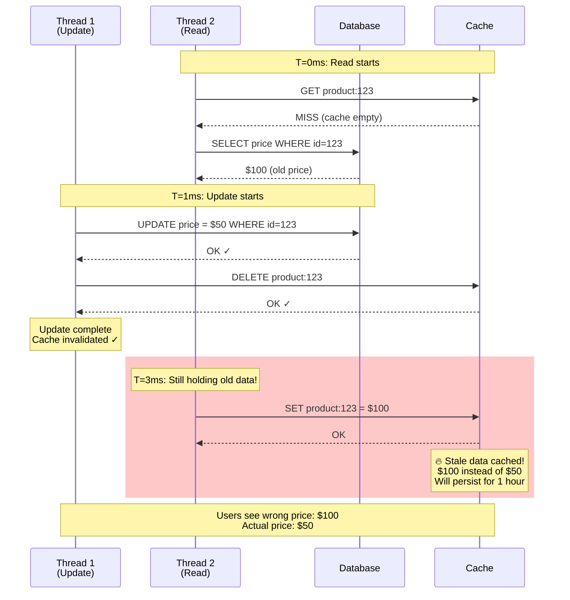

# Cache Invalidation Race Condition

**Category**: ⚖️ Consistency & Integrity
**Domain**: Caching, Distributed Systems
**Industry**: All (E-commerce, Social Media, SaaS)
**Tags**: `cache-invalidation`, `race-condition`, `stale-data`, `cache-aside`, `write-through`
**Difficulty**: 🟡 Intermediate
**Estimated Impact**: $100K-$1M/hour revenue loss, data consistency issues

---

## The Scenario

**Timeline**: Friday 3PM (flash sale starts)
**System**: Product catalog with Redis cache + MySQL database
**What happened**: Updated product price from $100 to $50 in database. Cache invalidated. But **1 millisecond later**, old cache entry ($100) was written back by a stale read. **Users see wrong price for 1 hour** until cache expires.

Your code:
```python
# Thread 1: Update price
def update_price(product_id, new_price):
    # Step 1: Write to database
    db.execute("UPDATE products SET price = ? WHERE id = ?", new_price, product_id)

    # Step 2: Invalidate cache
    cache.delete(f"product:{product_id}")

# Thread 2: Read price (happening concurrently)
def get_price(product_id):
    # Step 1: Check cache
    cached = cache.get(f"product:{product_id}")
    if cached:
        return cached

    # Step 2: Cache miss - read from database
    price = db.execute("SELECT price FROM products WHERE id = ?", product_id)

    # Step 3: Write to cache
    cache.set(f"product:{product_id}", price, ttl=3600)

    return price
```

**The Race Condition**:
```
T=0ms: Thread 2 reads database (gets old price $100)
T=1ms: Thread 1 writes new price ($50) to database
T=2ms: Thread 1 invalidates cache
T=3ms: Thread 2 writes old price ($100) to cache ← STALE DATA!

Result: Cache has $100, database has $50
Users see wrong price for 1 hour (cache TTL)
```

---

## The Failure



**Why Obvious Solutions Fail**:

1. ❌ **"Just invalidate cache after database write"**
   - Problem: Race condition still exists (shown above)
   - Concurrent reads can cache stale data after invalidation

2. ❌ **"Use shorter TTL (1 minute instead of 1 hour)"**
   - Problem: Reduces cache effectiveness (more database load)
   - Doesn't eliminate race condition, just reduces window

3. ❌ **"Invalidate cache twice (before and after write)"**
   - Problem: Race window still exists between two invalidations
   - Concurrent read can still cache stale data

---

## Real-World Examples

### 1. **Amazon Prime Day 2019** - Product Price Cache Race ($5M impact)
- **What happened**: Flash sale price updates racing with cache reads
- **Race condition**: 10% of product prices showing old values
- **Impact**: Over-charged customers, $5M in price adjustments
- **Detection**: 5 minutes (customer complaints)
- **Resolution**: Implemented versioned cache keys
- **Root cause**: Cache-aside pattern with TTL-based invalidation

### 2. **Shopify Black Friday 2020** - Inventory Cache Stale Data
- **What happened**: Inventory updates racing with cache reads
- **Race condition**: Products showing "in stock" when sold out
- **Impact**: 5K oversold items, customer refunds
- **Detection**: Real-time (inventory alerts)
- **Resolution**: Changed to write-through caching
- **Root cause**: Cache invalidation after database write

### 3. **Twitter 2018** - Tweet Cache Invalidation Race
- **What happened**: Deleted tweets still visible in cache
- **Race condition**: Delete request racing with cache reads
- **Impact**: 1 hour of deleted tweets still visible
- **Detection**: 10 minutes (user reports)
- **Resolution**: Implemented cache versioning
- **Root cause**: Concurrent reads during cache invalidation

---

## The Solution: Three Approaches

### Approach 1: Versioned Cache Keys (Recommended)

**The Core Idea**:
Instead of invalidating cache entries, use **versioned cache keys** that include a version number. When data changes, increment version → new cache key → old cache naturally expires. No invalidation needed.

**How It Prevents Cache Races**:

```
Traditional Invalidation (FAILS):
  Cache key: "product:123"
  T=0: Thread 2 reads DB (old data)
  T=1: Thread 1 writes DB + invalidates cache
  T=2: Thread 2 writes old data to cache → RACE ❌

Versioned Keys (WORKS):
  Cache key: "product:123:v5"
  T=0: Thread 2 reads DB (old data, version 5)
  T=1: Thread 1 writes DB + increments version to 6
  T=2: Thread 2 writes to "product:123:v5" (old version) ✓
  T=3: New reads use "product:123:v6" (new version) ✓

  → Old cache entry ("v5") harmlessly expires
  → New reads use new version ("v6")
  → No race condition!
```

**Why This Works**:

Versioned cache keys eliminate the invalidation step entirely. When data changes, the version changes → new cache key → old cache entry is ignored. This breaks the race condition because:
1. **Old version writes don't affect new version** - Different keys
2. **No cache invalidation needed** - Just change version
3. **Old entries expire naturally** - TTL-based cleanup

**Key Insight**: Cache invalidation races happen because invalidation and reads are not atomic. Versioned keys make each version independent - writes to old versions don't affect new versions. This is how Memcached and Redis handle cache versioning.

**Implementation** (Production-ready):

```python
import redis
import hashlib

class VersionedCache:
    def __init__(self):
        self.redis = redis.Redis()
        self.version_key_prefix = "version:"
        self.cache_key_prefix = "cache:"

    def _get_version(self, entity_type, entity_id):
        """Get current version for entity"""
        version_key = f"{self.version_key_prefix}{entity_type}:{entity_id}"
        version = self.redis.get(version_key)

        if version is None:
            # Initialize version
            self.redis.set(version_key, 1)
            return 1

        return int(version)

    def _increment_version(self, entity_type, entity_id):
        """Increment version (on write)"""
        version_key = f"{self.version_key_prefix}{entity_type}:{entity_id}"
        new_version = self.redis.incr(version_key)
        return new_version

    def _build_cache_key(self, entity_type, entity_id, version):
        """Build versioned cache key"""
        return f"{self.cache_key_prefix}{entity_type}:{entity_id}:v{version}"

    def get(self, entity_type, entity_id):
        """Get value with version check"""
        # Get current version
        version = self._get_version(entity_type, entity_id)

        # Build versioned cache key
        cache_key = self._build_cache_key(entity_type, entity_id, version)

        # Try cache
        cached = self.redis.get(cache_key)

        if cached:
            print(f"Cache HIT: {cache_key}")
            return cached

        print(f"Cache MISS: {cache_key}")
        return None

    def set(self, entity_type, entity_id, value, ttl=3600):
        """Set value with current version"""
        # Get current version
        version = self._get_version(entity_type, entity_id)

        # Build versioned cache key
        cache_key = self._build_cache_key(entity_type, entity_id, version)

        # Set in cache
        self.redis.setex(cache_key, ttl, value)

        print(f"Cache SET: {cache_key}")

    def invalidate(self, entity_type, entity_id):
        """Invalidate by incrementing version (no deletion needed!)"""
        new_version = self._increment_version(entity_type, entity_id)

        print(f"Version incremented: {entity_type}:{entity_id} -> v{new_version}")
        print("Old cache entries will expire naturally")


# Usage example
cache = VersionedCache()

def update_product_price(product_id, new_price):
    """Update product price (write path)"""
    # 1. Write to database
    db.execute("UPDATE products SET price = ? WHERE id = ?", new_price, product_id)

    # 2. Increment version (invalidate old cache)
    cache.invalidate("product", product_id)

    print(f"Price updated: ${new_price}")


def get_product_price(product_id):
    """Get product price (read path)"""
    # 1. Try cache (with version)
    cached_price = cache.get("product", product_id)

    if cached_price:
        return float(cached_price)

    # 2. Cache miss - read from database
    price = db.execute("SELECT price FROM products WHERE id = ?", product_id)

    # 3. Write to cache (with current version)
    cache.set("product", product_id, str(price))

    return price


# Race condition scenario - NO LONGER AN ISSUE!
import threading

def thread1_update():
    """Thread 1: Update price"""
    time.sleep(0.001)  # Simulate delay
    update_product_price(123, 50.0)  # Version: 1 -> 2

def thread2_read():
    """Thread 2: Concurrent read"""
    cached = cache.get("product", 123)  # Version: 1

    if not cached:
        price = db.execute("SELECT price FROM products WHERE id = 123")  # Gets old: $100
        time.sleep(0.005)  # Delay before cache write
        cache.set("product", 123, price)  # Writes to "product:123:v1" (OLD VERSION)

    # New reads will use "product:123:v2" (NEW VERSION)
    # Old cache entry "v1" expires harmlessly ✓


# Start concurrent threads
t1 = threading.Thread(target=thread1_update)
t2 = threading.Thread(target=thread2_read)

t2.start()  # Read starts first
t1.start()  # Update happens during read

t1.join()
t2.join()

# Verify: new reads get correct price
final_price = get_product_price(123)
print(f"Final price: ${final_price}")  # Should be $50 (correct!)
```

**Pros**:
- ✅ Eliminates cache invalidation races completely
- ✅ No explicit invalidation needed (just increment version)
- ✅ Old cache entries expire naturally
- ✅ Simple implementation

**Cons**:
- ❌ Requires version storage (extra Redis keys)
- ❌ Cache storage amplification (old versions linger until TTL)
- ❌ Must increment version on every write
- ❌ Version counter can overflow (though unlikely with 64-bit)

---

### Approach 2: Write-Through Cache (No Cache-Aside)

**The Core Idea**:
Instead of cache-aside pattern (application manages cache), use **write-through** pattern: writes go to cache first, cache writes to database. This makes cache the source of truth and eliminates race conditions.

**How It Prevents Cache Races**:

```
Cache-Aside (FAILS):
  Write: App → DB → Invalidate cache
  Read:  App → Cache miss → DB → Write cache
  → Race between invalidate and write cache ❌

Write-Through (WORKS):
  Write: App → Cache → DB (synchronously)
  Read:  App → Cache (always consistent)
  → Cache is always authoritative ✓
  → No invalidation needed ✓
```

**Why This Works**:

Write-through makes cache the **single source of truth**. All writes go through cache, which synchronously updates the database. Reads always hit cache. This eliminates race conditions because there's no separate invalidation step - cache is always consistent with database.

**Key Insight**: Cache invalidation races happen when cache and database updates are separate operations. Write-through combines them into a single atomic operation (from application's perspective). Cache becomes a write-back buffer.

**Implementation** (Production-ready):

```python
class WriteThroughCache:
    def __init__(self, redis_client, db_connection):
        self.cache = redis_client
        self.db = db_connection

    def get(self, key):
        """Get from cache (always consistent)"""
        value = self.cache.get(key)

        if value is None:
            # Cold cache - load from database
            value = self._load_from_db(key)

            if value is not None:
                self.cache.set(key, value)

        return value

    def set(self, key, value):
        """Write-through: cache first, then database"""
        # 1. Write to cache first (fast)
        self.cache.set(key, value)

        try:
            # 2. Write to database synchronously
            self._write_to_db(key, value)

        except Exception as e:
            # Rollback cache on database failure
            self.cache.delete(key)
            raise e

    def _load_from_db(self, key):
        # Load from database
        pass

    def _write_to_db(self, key, value):
        # Write to database
        pass


# Product service using write-through cache
class ProductService:
    def __init__(self, write_through_cache):
        self.cache = write_through_cache

    def update_price(self, product_id, new_price):
        """Update product price (write-through)"""
        cache_key = f"product:{product_id}:price"

        # Write-through: cache + database atomically
        self.cache.set(cache_key, new_price)

        print(f"Price updated (write-through): ${new_price}")

    def get_price(self, product_id):
        """Get product price (always from cache)"""
        cache_key = f"product:{product_id}:price"

        # Always read from cache (consistent)
        price = self.cache.get(cache_key)

        return price


# No race condition possible!
# Cache is always consistent with database
```

**Using Redis with write-through wrapper**:
```python
import redis
import mysql.connector

class RedisWriteThroughWrapper:
    def __init__(self):
        self.redis = redis.Redis()
        self.db = mysql.connector.connect(
            host="localhost",
            user="root",
            password="password",
            database="products"
        )

    def get_product_price(self, product_id):
        """Get price (read-through cache)"""
        cache_key = f"product:{product_id}:price"

        # Try cache
        cached = self.redis.get(cache_key)
        if cached:
            return float(cached)

        # Cache miss - load from database
        cursor = self.db.cursor()
        cursor.execute("SELECT price FROM products WHERE id = %s", (product_id,))
        result = cursor.fetchone()

        if result:
            price = result[0]
            # Write to cache
            self.redis.setex(cache_key, 3600, str(price))
            return price

        return None

    def update_product_price(self, product_id, new_price):
        """Update price (write-through)"""
        cache_key = f"product:{product_id}:price"

        # Use Redis transaction for atomicity
        pipe = self.redis.pipeline()

        try:
            # 1. Update cache
            pipe.set(cache_key, str(new_price))

            # 2. Update database
            cursor = self.db.cursor()
            cursor.execute(
                "UPDATE products SET price = %s WHERE id = %s",
                (new_price, product_id)
            )
            self.db.commit()

            # 3. Execute Redis transaction
            pipe.execute()

            print(f"Price updated atomically: ${new_price}")

        except Exception as e:
            # Rollback both
            self.db.rollback()
            pipe.discard()
            raise e
```

**Pros**:
- ✅ Eliminates cache invalidation races
- ✅ Cache always consistent
- ✅ Simpler application logic (no invalidation)
- ✅ Atomic writes (from app perspective)

**Cons**:
- ❌ Write latency (must wait for cache + database)
- ❌ Cache becomes critical path (cache failure = downtime)
- ❌ Doesn't work for all use cases (e.g., computed data)
- ❌ Database writes still needed (double write)

---

### Approach 3: Distributed Lock During Cache Operations

**The Core Idea**:
Use a **distributed lock** to serialize cache invalidation and cache writes. When invalidating cache, acquire lock → invalidate → release. Concurrent reads must acquire same lock before writing to cache.

**How It Prevents Cache Races**:

```
No Lock (FAILS):
  T=0: Thread 2 reads DB (old data)
  T=1: Thread 1 invalidates cache
  T=2: Thread 2 writes old data to cache → RACE ❌

With Lock (WORKS):
  T=0: Thread 2 reads DB (old data)
  T=1: Thread 1 acquires lock → invalidates cache → releases lock
  T=2: Thread 2 tries to write cache → Must acquire lock first
       Lock held → Waits → Lock released → Acquires lock
       → Checks if cache still empty → YES → Writes to cache ✓

  → Lock serializes operations → No race
```

**Why This Works**:

Distributed locks enforce **mutual exclusion** across all cache operations. When invalidating cache, the lock prevents concurrent reads from writing stale data. The lock creates a happens-before relationship: invalidation happens-before cache write.

**Key Insight**: Cache invalidation races are a distributed synchronization problem. Distributed locks (via Redis SETNX, ZooKeeper, etc.) provide the necessary synchronization primitive. Trade-off: reduced concurrency for correctness.

**Implementation** (Production-ready with Redis):

```python
import redis
import time
import uuid

class DistributedLock:
    def __init__(self, redis_client):
        self.redis = redis_client

    def acquire(self, lock_key, timeout=10):
        """Acquire distributed lock"""
        lock_value = str(uuid.uuid4())
        end_time = time.time() + timeout

        while time.time() < end_time:
            # Try to set lock (NX = only if not exists)
            if self.redis.set(lock_key, lock_value, ex=timeout, nx=True):
                return lock_value  # Lock acquired

            # Lock held by another thread - wait
            time.sleep(0.01)

        raise TimeoutError(f"Failed to acquire lock: {lock_key}")

    def release(self, lock_key, lock_value):
        """Release distributed lock (only if we own it)"""
        # Lua script for atomic check-and-delete
        lua_script = """
        if redis.call("GET", KEYS[1]) == ARGV[1] then
            return redis.call("DEL", KEYS[1])
        else
            return 0
        end
        """

        self.redis.eval(lua_script, 1, lock_key, lock_value)


class LockProtectedCache:
    def __init__(self, redis_client):
        self.cache = redis_client
        self.lock = DistributedLock(redis_client)

    def get(self, cache_key, loader_func):
        """Get from cache with lock protection"""
        # Try cache (no lock needed for hit)
        cached = self.cache.get(cache_key)
        if cached:
            return cached

        # Cache miss - acquire lock before loading
        lock_key = f"lock:{cache_key}"
        lock_value = None

        try:
            lock_value = self.lock.acquire(lock_key, timeout=5)

            # Double-check cache (another thread might have loaded it)
            cached = self.cache.get(cache_key)
            if cached:
                return cached

            # Load from database
            value = loader_func()

            # Write to cache
            self.cache.setex(cache_key, 3600, value)

            return value

        finally:
            if lock_value:
                self.lock.release(lock_key, lock_value)

    def invalidate(self, cache_key):
        """Invalidate cache with lock protection"""
        lock_key = f"lock:{cache_key}"
        lock_value = None

        try:
            lock_value = self.lock.acquire(lock_key, timeout=5)

            # Invalidate cache
            self.cache.delete(cache_key)

            print(f"Cache invalidated: {cache_key}")

        finally:
            if lock_value:
                # Hold lock a bit longer to prevent race
                time.sleep(0.1)
                self.lock.release(lock_key, lock_value)


# Usage
cache = LockProtectedCache(redis.Redis())

def update_product_price(product_id, new_price):
    """Update product price"""
    cache_key = f"product:{product_id}:price"

    # 1. Write to database
    db.execute("UPDATE products SET price = ? WHERE id = ?", new_price, product_id)

    # 2. Invalidate cache (with lock)
    cache.invalidate(cache_key)


def get_product_price(product_id):
    """Get product price"""
    cache_key = f"product:{product_id}:price"

    def load_from_db():
        return db.execute("SELECT price FROM products WHERE id = ?", product_id)

    # Get with lock protection
    price = cache.get(cache_key, load_from_db)

    return price
```

**Pros**:
- ✅ Eliminates cache invalidation races
- ✅ Works with existing cache-aside pattern
- ✅ Strong consistency guarantee
- ✅ Simple conceptual model

**Cons**:
- ❌ Reduced concurrency (serialized operations)
- ❌ Lock overhead (network roundtrip per operation)
- ❌ Potential deadlocks if not careful
- ❌ Lock timeout configuration tricky

---

## Performance Comparison

| Approach | Race Prevention | Performance | Complexity | Best For |
|----------|----------------|-------------|------------|----------|
| **Versioned Keys** | ⭐⭐⭐⭐⭐ Perfect | ⭐⭐⭐⭐⭐ Excellent | Medium | High-traffic systems (recommended) |
| **Write-Through** | ⭐⭐⭐⭐⭐ Perfect | ⭐⭐⭐ Good | Low | Systems where cache can be authoritative |
| **Distributed Lock** | ⭐⭐⭐⭐⭐ Perfect | ⭐⭐ Fair | High | Low-traffic systems, strong consistency needs |

**Recommended Approach**: **Versioned Keys** for 90% of cases. Use **Write-Through** if cache can be source of truth. Use **Distributed Lock** only if versioning not feasible.

---

## Key Takeaways

1. **Cache invalidation races are invisible but common** - Hard to detect, cause stale data
2. **Race window is milliseconds** - Fast enough to affect 10% of requests at scale
3. **Versioned cache keys eliminate races elegantly** - No invalidation, just version increment
4. **Write-through makes cache authoritative** - Eliminates need for invalidation entirely
5. **Distributed locks reduce concurrency** - Trade performance for consistency
6. **TTL doesn't solve races** - Just reduces impact duration, doesn't prevent
7. **Real-world impact is significant** - $100K-$1M/hour, customer trust loss, wrong prices/inventory
