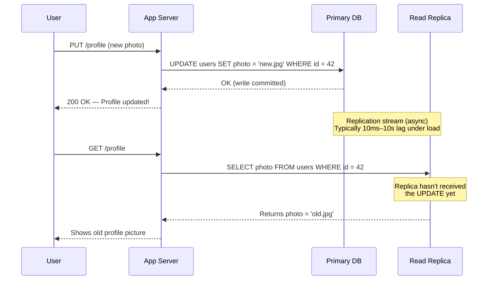

# Stale Read After Write: When Your Own Updates Disappear

**A user updates their profile picture. They refresh the page. They see their old picture. They update it again. Refresh. Old picture again. They try a third time — still the old photo. They file a support ticket: "Your app is broken and keeps deleting my changes." Your support engineer opens the database admin panel and sees the new picture. It's been there the whole time. The app isn't broken. The user is reading from a replica that's 3 seconds behind the primary. But from their perspective, their writes are being silently ignored. You've created an experience that feels like data loss, even though no data was lost.**

---

## The Problem Class `[Senior]`

Read-after-write inconsistency is one of the most user-visible consistency problems in distributed systems. It happens when:

1. A user writes data to the primary database
2. The application immediately routes their next read to a replica
3. The replica hasn't yet received that write (replication lag)
4. The user sees their old data, thinking the write failed

The write didn't fail. The read was just routed to a stale replica. To the database engineers, everything is working correctly. To the user, the system is broken.

This problem is particularly insidious because it's intermittent. When lag is low (10ms), users never notice. When lag spikes to 3–10 seconds during high write load, users can see stale data multiple times in succession. Support tickets spike. Engineers can't reproduce it (because by the time they investigate, the replica has caught up). The root cause is invisible in your standard monitoring.

---

## Why This Happens

### Asynchronous Replication Has Inherent Lag

Primary-replica replication in PostgreSQL and MySQL is asynchronous by default. The write path looks like this:



The primary commits and acknowledges the write immediately. The replication to replicas happens asynchronously, after the acknowledgement. Under normal load, this is 10–100ms. During a write spike or replica catch-up, it can be seconds or even minutes.

### Why Applications Route to Replicas

The reason we have read replicas is to distribute read load. A well-architected system might have 1 primary (all writes) and 3–5 replicas (all reads). This multiplies read capacity. The routing logic typically looks like:

```javascript
function getDbConnection(operation) {
  if (operation === 'write') return primaryPool;
  return replicaPool; // All reads go to replicas
}
```

This logic is correct 99.9% of the time. It fails specifically for reads that immediately follow a write from the same user, in the window between the write and the replica catching up.

### When Lag Is Worst

Replication lag spikes during:
- **Bulk writes**: Migrations, batch jobs, backups — these flood the replication stream
- **Large transactions**: A transaction that writes 10,000 rows takes seconds to replicate; any read during that window sees pre-transaction state
- **Replica catch-up**: After a replica restarts or network blip, it replays a backlog of changes — all reads during this period see old data
- **Cross-region replicas**: Network latency between regions means lag is always at least the RTT (50–200ms+)

---

## Real-World Impact

The domains where this burns hardest:

- **Profile/account settings**: Users update their name, avatar, notification preferences — then see the old values
- **E-commerce**: User changes their shipping address before placing an order — order confirmation shows old address
- **Payment status**: User pays for an item — refreshes — sees "payment pending" (reads from replica that hasn't seen the payment commit)
- **Access control**: Admin revokes a user's permissions — user can still access the resource for several seconds (read from stale replica still grants access)
- **Subscription gating**: User upgrades their plan — still sees "free tier" content restrictions for 5–10 seconds
- **Social features**: User posts a comment — immediately scrolls to find it — it's not there yet

Facebook's TAO (The Associations and Objects system) was specifically engineered to handle read-after-write consistency at Facebook's scale, where write-committed data needs to be immediately readable by the writer even across geographically distributed replicas.

Banks universally read account balances from the primary — never from a replica — because even 1 second of stale balance data is unacceptable for financial decisions.

---

## The Wrong Fix

### Add a Sleep/Delay After Writes

```javascript
// You will find this in production codebases. Don't do this.
async function updateProfile(userId, data) {
  await db.primary.update(users, data, { where: { id: userId } });
  await sleep(2000); // Wait 2 seconds for replica to "catch up"
  return getProfile(userId); // Hope the replica is ready now
}
```

This is wrong on every level:
- 2 seconds of artificial latency on every write
- No guarantee the replica has caught up — under high load, lag can exceed 2 seconds
- Every user pays the penalty, not just those who read immediately after writing
- Doesn't work at all for subsequent reads (user refreshes 1 second later — still hits replica)

---

## The Right Solutions

### Solution 1: Read Your Own Writes — Sticky Primary Routing

After a user writes, route that user's subsequent reads to the primary for a short window (e.g., 10–30 seconds). After the window expires, normal replica routing resumes.

```javascript
const redis = require('redis');
const PRIMARY_READ_WINDOW_SECONDS = 30;

async function handleWrite(userId, writeOperation) {
  await writeOperation(); // Execute the write

  // Mark this user as "recently wrote" — subsequent reads go to primary
  await redis.setex(
    `read_primary:${userId}`,
    PRIMARY_READ_WINDOW_SECONDS,
    '1'
  );
}

async function getDbForRead(userId) {
  const recentlyWrote = await redis.get(`read_primary:${userId}`);
  if (recentlyWrote) {
    return primaryPool; // Send to primary — user just wrote
  }
  return replicaPool; // Normal case — read from replica
}

// Middleware to apply this transparently
app.use(async (req, res, next) => {
  req.getDb = () => getDbForRead(req.userId);
  next();
});

// In your route handler
app.put('/profile', async (req, res) => {
  await handleWrite(req.userId, () =>
    db.primary.query('UPDATE users SET photo = $1 WHERE id = $2', [req.body.photo, req.userId])
  );
  res.json({ success: true });
});

app.get('/profile', async (req, res) => {
  const db = await getDbForRead(req.userId);
  const user = await db.query('SELECT * FROM users WHERE id = $1', [req.userId]);
  res.json(user.rows[0]);
});
```

**Trade-offs**: Slightly increases primary load (but only for recent writers — a small fraction of users). Requires Redis or another fast shared store for the "recently wrote" flag. The 30-second window should cover all realistic replication lag scenarios.

### Solution 2: Version Token (Read-After-Write with Replica Readiness Check)

The server returns a version/LSN (Log Sequence Number) after every write. The client sends this version on subsequent reads. The server only routes to a replica if that replica has reached the required version.

```javascript
// After a write, return the current WAL LSN
async function handleWrite(userId, data) {
  const client = await primaryPool.connect();
  try {
    await client.query('UPDATE users SET photo = $1 WHERE id = $2', [data.photo, userId]);

    // Get current WAL position after this write
    const { rows } = await client.query("SELECT pg_current_wal_lsn()::text AS lsn");
    const lsn = rows[0].lsn;

    return { success: true, version: lsn }; // Return version token to client
  } finally {
    client.release();
  }
}

// Client stores the version token (in cookie, localStorage, or header)
// Subsequent requests include it: X-Read-After-Version: 0/ABC1234

// On read: check if replica is at or past the required version
async function handleRead(userId, requiredVersion) {
  if (requiredVersion) {
    // Check each replica's current LSN
    for (const replica of replicaPool) {
      const { rows } = await replica.query(
        "SELECT pg_last_wal_replay_lsn() >= $1::pg_lsn AS is_ready",
        [requiredVersion]
      );
      if (rows[0].is_ready) {
        return replica.query('SELECT * FROM users WHERE id = $1', [userId]);
      }
    }
    // No replica is caught up — fall through to primary
  }

  return primaryPool.query('SELECT * FROM users WHERE id = $1', [userId]);
}
```

This is more precise than a time window — reads go to replica as soon as the replica is actually ready, not after an arbitrary timeout. Used by Facebook's TAO and described in the "Cassandra: A Decentralized Structured Storage System" paper.

### Solution 3: Synchronous Replication for Critical Paths

For operations where stale reads are unacceptable (payment status, access control, account balance), use synchronous replication — the primary waits for at least one replica to acknowledge the write before returning to the application.

```sql
-- PostgreSQL: session-level synchronous commit for critical writes
SET synchronous_commit = 'on'; -- Wait for local WAL flush + one replica to confirm

-- Or at the transaction level
BEGIN;
SET LOCAL synchronous_commit = 'on';
UPDATE accounts SET balance = balance - 100 WHERE id = $1;
COMMIT; -- Only returns after replica confirms receipt
```

```javascript
async function processPayment(userId, amount) {
  const client = await primaryPool.connect();
  try {
    await client.query('BEGIN');
    await client.query('SET LOCAL synchronous_commit = on');  // This txn is sync

    await client.query(
      'UPDATE accounts SET balance = balance - $1 WHERE user_id = $2',
      [amount, userId]
    );
    await client.query('INSERT INTO payments (user_id, amount, status) VALUES ($1, $2, $3)',
      [userId, amount, 'completed']
    );

    await client.query('COMMIT');
    // By here, at least one replica has confirmed receipt — safe to read from replica
  } catch (err) {
    await client.query('ROLLBACK');
    throw err;
  } finally {
    client.release();
  }
}
```

**Trade-offs**: Write latency increases by the replica RTT (typically 1–20ms for same-region replicas). Acceptable for critical paths. Not appropriate for high-throughput, non-critical writes.

### Solution 4: Monotonic Reads — Session Affinity to One Replica

Each user session is pinned to the same replica for the duration of their session. They might see stale data from the primary, but they'll never see data go *backwards*. At minimum, time moves forward in their view of the database.

```javascript
const crypto = require('crypto');

function getReplicaForUser(userId, replicas) {
  // Consistent hash: same user always gets same replica
  const hash = crypto
    .createHash('md5')
    .update(userId.toString())
    .digest('hex');
  const index = parseInt(hash.slice(0, 8), 16) % replicas.length;
  return replicas[index];
}

// User always reads from the same replica
// If that replica is behind, they consistently see a slightly old view
// But they'll never see their data go backward
app.get('/profile', async (req, res) => {
  const replica = getReplicaForUser(req.userId, replicaPool.replicas);
  const user = await replica.query('SELECT * FROM users WHERE id = $1', [req.userId]);
  res.json(user.rows[0]);
});
```

**When to use**: Weaker than read-your-own-writes but useful when the session affinity is naturally maintained (e.g., all requests from one user hit the same app server, which always uses the same DB connection).

### Solution 5: Event-Driven Cache Invalidation

After a write, publish an event. All caches and replicas subscribe to the event and invalidate their local view of that record.

```javascript
const { Kafka } = require('kafkajs');

// On write: publish invalidation event
async function updateProfile(userId, data) {
  await db.primary.query('UPDATE users SET photo = $1 WHERE id = $2', [data.photo, userId]);

  await producer.send({
    topic: 'cache-invalidation',
    messages: [{
      key: `user:${userId}`,
      value: JSON.stringify({ entity: 'user', id: userId, timestamp: Date.now() }),
    }],
  });
}

// On each app server: subscribe and invalidate local cache
consumer.run({
  eachMessage: async ({ message }) => {
    const { entity, id } = JSON.parse(message.value);
    await localCache.del(`${entity}:${id}`);
    // Subsequent reads will re-fetch from DB (could be either replica)
    // But since replica should have the event by now, lag is typically acceptable
  },
});
```

---

## Detection

Stale read after write is almost always invisible in standard monitoring. You need to specifically instrument for it.

```javascript
// Instrument reads to detect stale data
app.get('/profile', async (req, res) => {
  const startTime = Date.now();
  const user = await db.query('SELECT * FROM users WHERE id = $1', [req.userId]);

  // If client sent version token and we can check it
  const clientVersion = req.headers['x-last-write-version'];
  if (clientVersion && user.rows[0].version < clientVersion) {
    metrics.increment('stale_read_detected', { endpoint: '/profile' });
    logger.warn('Stale read detected', {
      userId: req.userId,
      clientVersion,
      dbVersion: user.rows[0].version,
    });
  }

  res.json(user.rows[0]);
});
```

```sql
-- Monitor replication lag in PostgreSQL
SELECT
  client_addr,
  state,
  sent_lsn,
  write_lsn,
  flush_lsn,
  replay_lsn,
  write_lag,
  flush_lag,
  replay_lag
FROM pg_stat_replication;

-- Alert if any replica is more than 5 seconds behind
SELECT
  client_addr,
  EXTRACT(EPOCH FROM replay_lag) AS lag_seconds
FROM pg_stat_replication
WHERE replay_lag > interval '5 seconds';
```

---

## Prevention Patterns

1. **Default to reading from primary for writes that the user will immediately see**. Only move to replica reads after profiling shows primary is a bottleneck.
2. **Route all reads for user-owned data to primary**: Profile, settings, payment status. Route aggregate/discovery reads to replicas: product search, category listings.
3. **Measure replication lag continuously and alert at > 1 second** for same-region replicas.
4. **Use version tokens for the most user-visible write paths** — profile, settings, critical status updates.
5. **Test for stale reads** in your integration tests: write, immediately read, assert you see the written value.

---

## Checklist

- [ ] Replication lag monitored and alerted (> 1s warning, > 5s critical for same-region)
- [ ] Read-your-own-writes implemented for user profile, settings, payment status pages
- [ ] Critical writes (payments, access control) use synchronous replication
- [ ] Support team has tooling to distinguish "write didn't work" from "read is stale"
- [ ] Integration tests assert read-after-write consistency for key user flows
- [ ] Version token or "recently wrote" flag implemented if replication lag regularly exceeds 1 second
- [ ] Cross-region reads for user-owned data reviewed — replica lag is always at least the RTT

---

## Key Takeaways

Stale read after write is not a database bug. It's an expected behavior of asynchronous replication that your application layer must handle explicitly. The database is doing exactly what it was designed to do: replicate asynchronously for performance.

The user-visible impact is severe: it looks like data loss. "I updated my profile and my changes disappeared" is one of the most alarming support tickets you can receive, and it's almost impossible to reproduce after the replica has caught up.

The fix requires you to know, per request, whether the user recently wrote. If they did, route their reads to the primary (or to a replica that has confirmed receipt) until replication has caught up. This is the read-your-own-writes consistency guarantee, and it's the minimum consistency bar for any user-facing application with read replicas.
