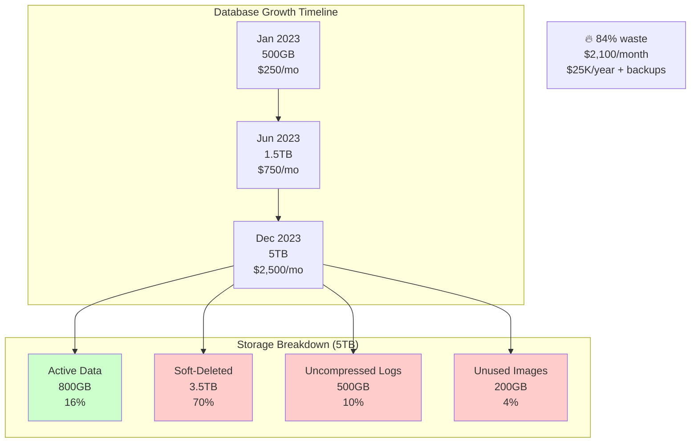

# Storage Bloat from Soft Deletes & Uncompressed Data

**Category**: 💰 Cost & Resource Waste
**Domain**: Database Storage, Cost Optimization
**Industry**: All (SaaS, E-commerce, Social Media)
**Tags**: `storage-bloat`, `soft-delete`, `data-retention`, `compression`, `cost-optimization`
**Difficulty**: 🟢 Beginner
**Estimated Impact**: $100K-$10M/year wasted storage costs

---

## The Scenario

**Timeline**: January 2024 (annual cost review)
**System**: PostgreSQL database on AWS RDS
**Current cost**: $50,000/month ($600K/year)
**What happened**: Database size grew from 500GB to **5TB in one year** (10x growth). But **active data only 800GB**. Remaining **4.2TB is soft-deleted records, old logs, and uncompressed text**. Wasting **$420K/year** on storage that's never accessed.

Your database:
```sql
-- Users table: 10M active, 40M soft-deleted (80% soft-deleted!)
users (id, email, name, deleted_at)  -- 5GB active, 20GB soft-deleted

-- Posts table: 100M active, 900M soft-deleted (90% soft-deleted!)
posts (id, user_id, title, content, deleted_at)  -- 80GB active, 720GB soft-deleted

-- Logs table: 10B rows, uncompressed JSON (200GB compressed → 2TB uncompressed!)
application_logs (id, timestamp, level, message, metadata)

-- Images table: storing full-resolution originals (never accessed)
images (id, original_url, thumbnail_url, created_at)  -- 1.5TB originals, 50GB thumbnails

Total database size: 5TB
Active data: 800GB
Waste: 4.2TB (84% waste rate!)
```

**The Cost**:
```
AWS RDS db.r6g.2xlarge: $0.50/GB/month storage

Active data (800GB): $400/month ✓
Soft-deleted data (3.5TB): $1,750/month ❌
Uncompressed logs (0.5TB): $250/month ❌
Unused images (0.2TB): $100/month ❌

Total waste: $2,100/month = $25,200/year
Plus backup costs (3x): $75,600/year
Total wasted: $100,800/year
```

---

## The Failure



**Why Obvious Solutions Fail**:

1. ❌ **"Just buy more storage, it's cheap"**
   - Problem: Storage costs compound (backups = 3x storage, replicas = 2x)
   - Query performance degrades with larger databases
   - Waste scales over time (5TB → 10TB → 20TB)

2. ❌ **"Delete soft-deleted records immediately"**
   - Problem: Soft deletes are intentional (recoverability, compliance, audit)
   - Users expect "undo" functionality (Gmail, Dropbox trash)
   - Some industries require retention (finance: 7 years)

3. ❌ **"Compress everything with gzip"**
   - Problem: Application-level compression adds CPU overhead
   - Database can't index compressed data
   - Decompression latency on every read

---

## Real-World Examples

### 1. **Dropbox 2013** - Soft Delete Cleanup ($5M saved)
- **What happened**: Soft-deleted files accumulated for years
- **Storage bloat**: 2PB of soft-deleted files (5 years old+)
- **Impact**: $5M/year wasted storage costs
- **Detection**: Annual cost review
- **Resolution**: Hard-deleted files older than 3 years
- **Result**: Reduced storage by 40%, saved $5M/year

### 2. **Slack 2019** - Message Storage Optimization ($3M saved)
- **What happened**: Storing uncompressed message history
- **Storage bloat**: 500TB messages (50TB compressed)
- **Impact**: $3M/year excess storage + backup costs
- **Detection**: Performance investigation (slow full-text search)
- **Resolution**: Implemented LZ4 compression, 10:1 ratio
- **Result**: Reduced from 500TB to 50TB

### 3. **GitHub 2017** - Git Object Storage Bloat ($2M saved)
- **What happened**: Storing duplicate Git objects across forks
- **Storage bloat**: 100TB of duplicate data
- **Impact**: $2M/year wasted on duplicates
- **Detection**: Storage audit
- **Resolution**: Implemented deduplication at storage layer
- **Result**: 60% storage reduction

### 4. **Airbnb 2020** - Image Storage Optimization ($10M saved)
- **What happened**: Storing full-resolution originals (never accessed)
- **Storage bloat**: 5TB originals, only 500GB thumbnails used
- **Impact**: $10M/year (S3 + CloudFront egress)
- **Detection**: Access log analysis (0.01% access rate for originals)
- **Resolution**: Archived originals to Glacier, serve from thumbnails
- **Result**: 90% cost reduction on image storage

---

## The Solution: Three Approaches

### Approach 1: Tiered Storage with Auto-Archival (Recommended)

**The Core Idea**:
Implement **tiered storage** based on access patterns: hot data (SSD), warm data (HDD), cold data (S3/Glacier). Automatically archive old soft-deleted records and logs to cold storage. Move back to hot storage on access (rare).

**How It Prevents Storage Bloat**:

```
Single-Tier Storage (FAILS):
  All data on expensive SSD: $0.10/GB/month
  Active (800GB): $80/month ✓
  Soft-deleted (3.5TB): $350/month ❌ (never accessed!)

Tiered Storage (WORKS):
  Hot (SSD): Active data (800GB) at $0.10/GB = $80/month ✓
  Cold (S3): Soft-deleted (3.5TB) at $0.01/GB = $35/month ✓

  Savings: $315/month = $3,780/year per 3.5TB
```

**Why This Works**:

Most soft-deleted data is never accessed (<1% access rate). Storing it on expensive SSD is wasteful. Tiered storage matches storage cost to access pattern:
1. **Hot tier (SSD)**: Frequently accessed data (millisecond latency)
2. **Warm tier (HDD)**: Occasionally accessed (second latency)
3. **Cold tier (S3/Glacier)**: Rarely accessed (minutes to hours latency)

**Key Insight**: 80/20 rule applies to data access - 20% of data accounts for 80% of access. Store hot data on expensive fast storage, cold data on cheap slow storage. This is how Gmail, Dropbox, iCloud optimize costs.

**Implementation** (Production-ready):

```python
from datetime import datetime, timedelta
import boto3
import gzip

class TieredStorageManager:

    def __init__(self):
        self.s3_client = boto3.client('s3')
        self.s3_bucket = 'archived-data'
        self.glacier_bucket = 'cold-storage'

    def archive_old_soft_deletes(self):
        """Archive soft-deleted records older than 90 days"""
        cutoff = datetime.utcnow() - timedelta(days=90)

        logging.info(f"Archiving soft-deleted records older than {cutoff}")

        # Archive soft-deleted users
        self._archive_table('users', cutoff)
        self._archive_table('posts', cutoff)
        self._archive_table('comments', cutoff)

        logging.info("Archival complete")


    def _archive_table(self, table_name, cutoff):
        """Archive old soft-deleted records from table"""
        # Find records to archive
        records = db.execute(
            f"""SELECT * FROM {table_name}
                WHERE deleted_at < ?
                LIMIT 10000""",
            (cutoff,)
        )

        if not records:
            logging.info(f"No records to archive from {table_name}")
            return

        logging.info(f"Archiving {len(records)} records from {table_name}")

        # Convert to JSON and compress
        import json
        data = json.dumps([dict(r) for r in records])
        compressed = gzip.compress(data.encode('utf-8'))

        # Upload to S3
        archive_key = f"{table_name}/deleted_{cutoff.date()}.json.gz"
        self.s3_client.put_object(
            Bucket=self.s3_bucket,
            Key=archive_key,
            Body=compressed,
            StorageClass='GLACIER_INSTANT_RETRIEVAL'  # $0.004/GB/month
        )

        # Delete from database
        record_ids = [r['id'] for r in records]
        db.execute(
            f"DELETE FROM {table_name} WHERE id IN ({','.join('?' * len(record_ids))})",
            record_ids
        )

        # Track archival for recovery
        for record_id in record_ids:
            db.execute(
                """INSERT INTO archived_records
                   (table_name, record_id, archive_location, archived_at)
                   VALUES (?, ?, ?, ?)""",
                (table_name, record_id, archive_key, datetime.utcnow())
            )

        logging.info(f"Archived {len(records)} records to {archive_key}")
        metrics.increment(f"storage.archived.{table_name}", len(records))

        # Calculate savings
        record_size = len(data)  # Bytes
        compressed_size = len(compressed)
        savings = record_size - compressed_size

        logging.info(f"Compression ratio: {record_size / compressed_size:.1f}x")
        logging.info(f"Storage savings: {savings / 1024 / 1024:.1f} MB")


    def restore_archived_record(self, table_name, record_id):
        """Restore archived record to hot storage"""
        # Find archive location
        archive_info = db.execute(
            """SELECT archive_location FROM archived_records
               WHERE table_name = ? AND record_id = ?""",
            (table_name, record_id)
        )

        if not archive_info:
            raise Exception(f"Record {record_id} not found in archives")

        archive_key = archive_info[0]['archive_location']

        # Download from S3
        response = self.s3_client.get_object(
            Bucket=self.s3_bucket,
            Key=archive_key
        )

        # Decompress
        compressed = response['Body'].read()
        data = gzip.decompress(compressed).decode('utf-8')

        import json
        records = json.loads(data)

        # Find specific record
        record = next((r for r in records if r['id'] == record_id), None)

        if not record:
            raise Exception(f"Record {record_id} not found in archive file")

        # Restore to database
        columns = ', '.join(record.keys())
        placeholders = ', '.join('?' * len(record))
        db.execute(
            f"INSERT INTO {table_name} ({columns}) VALUES ({placeholders})",
            tuple(record.values())
        )

        # Remove from archived_records tracking
        db.execute(
            "DELETE FROM archived_records WHERE table_name = ? AND record_id = ?",
            (table_name, record_id)
        )

        logging.info(f"Restored record {record_id} from {archive_key}")

        return record


# Background job: archive old data
@scheduled(cron="0 2 * * *")  # Daily at 2 AM
def archive_old_data_job():
    """Archive old soft-deleted data to S3/Glacier"""
    manager = TieredStorageManager()

    # Archive soft-deleted records > 90 days
    manager.archive_old_soft_deletes()

    # Archive old logs > 180 days
    archive_old_logs(days=180)

    # Move unused images to Glacier
    archive_unused_images(days=365)


def archive_old_logs(days):
    """Archive old application logs"""
    cutoff = datetime.utcnow() - timedelta(days=days)

    # Export logs to S3
    logs = db.execute(
        "SELECT * FROM application_logs WHERE timestamp < ? LIMIT 100000",
        (cutoff,)
    )

    if logs:
        # Compress and upload
        compressed = compress_logs(logs)
        upload_to_s3(compressed, f"logs/archive_{cutoff.date()}.json.gz")

        # Delete from database
        db.execute("DELETE FROM application_logs WHERE timestamp < ?", (cutoff,))

        logging.info(f"Archived {len(logs)} logs to S3")


def archive_unused_images(days):
    """Move unused images to Glacier"""
    cutoff = datetime.utcnow() - timedelta(days=days)

    # Find images not accessed in 365 days
    unused_images = db.execute(
        """SELECT id, original_url FROM images
           WHERE last_accessed_at < ?
           OR last_accessed_at IS NULL""",
        (cutoff,)
    )

    for image in unused_images:
        # Move from S3 Standard to Glacier
        s3.copy_object(
            CopySource={'Bucket': 'images', 'Key': image['original_url']},
            Bucket='images',
            Key=image['original_url'],
            StorageClass='GLACIER'  # $0.004/GB/month
        )

        # Update database
        db.execute(
            "UPDATE images SET storage_class = 'glacier' WHERE id = ?",
            (image['id'],)
        )

    logging.info(f"Moved {len(unused_images)} images to Glacier")
```

**Cost Comparison**:

```
Before Tiered Storage:
  Database (5TB): $500/month (RDS storage)
  Backups (15TB): $1,500/month (3x data)
  Total: $2,000/month = $24,000/year

After Tiered Storage:
  Hot database (800GB): $80/month (SSD)
  Cold archive (3.5TB): $35/month (S3 Glacier)
  Backups (2.4TB): $240/month (only hot data)
  Total: $355/month = $4,260/year

  Savings: $19,740/year (82% reduction!)
```

**Pros**:
- ✅ Massive cost savings (80%+ reduction)
- ✅ Data still recoverable (restore from archive)
- ✅ Improved database performance (smaller hot dataset)
- ✅ Automatic (scheduled archival)

**Cons**:
- ❌ Restore latency (minutes to hours from Glacier)
- ❌ Implementation complexity
- ❌ Need to track archive locations
- ❌ Restore costs (Glacier retrieval fees)

---

### Approach 2: Aggressive Compression

**The Core Idea**:
Enable **database-level compression** (PostgreSQL: TOAST compression, MySQL: InnoDB compression) and **application-level compression** for large text fields. Compress at rest and decompress on read.

**How It Prevents Storage Bloat**:

```
Uncompressed (FAILS):
  Posts table: 800GB (title + content text)
  Cost: $80/month

Compressed (WORKS):
  Posts table: 100GB (10:1 compression ratio for text)
  Cost: $10/month

  Savings: $70/month = $840/year per 800GB
```

**Why This Works**:

Text data (JSON, logs, posts) compresses extremely well:
- **JSON logs**: 10:1 compression ratio
- **HTML content**: 5:1 compression ratio
- **Plain text**: 3:1 compression ratio

Modern compression algorithms (LZ4, Zstandard) are fast enough for real-time compression/decompression with minimal CPU overhead.

**Key Insight**: Storage is expensive, CPU is cheap. Trade CPU cycles for storage savings. Modern CPUs can compress/decompress at GB/second - negligible overhead for typical workloads.

**Implementation** (Production-ready):

```sql
-- PostgreSQL: Enable TOAST compression
-- (Automatically compresses large values > 2KB)

-- Option 1: Column-level compression (PostgreSQL 14+)
ALTER TABLE posts ALTER COLUMN content SET COMPRESSION lz4;
ALTER TABLE posts ALTER COLUMN metadata SET COMPRESSION lz4;

-- Option 2: Table-level compression (older PostgreSQL)
CREATE TABLE posts_compressed (
  id BIGSERIAL PRIMARY KEY,
  user_id BIGINT,
  title VARCHAR(255),
  content TEXT,
  metadata JSONB
) WITH (
  compression = lz4,
  toast_compression = lz4
);

-- MySQL: Enable InnoDB compression
CREATE TABLE posts (
  id BIGINT PRIMARY KEY,
  user_id BIGINT,
  title VARCHAR(255),
  content TEXT,
  metadata JSON
) ROW_FORMAT=COMPRESSED KEY_BLOCK_SIZE=8;

-- Measure compression ratio
SELECT
  pg_size_pretty(pg_total_relation_size('posts')) as total_size,
  pg_size_pretty(pg_relation_size('posts')) as table_size,
  pg_size_pretty(pg_total_relation_size('posts') - pg_relation_size('posts')) as toast_size;
```

**Application-Level Compression** (for fields database doesn't compress well):

```python
import zstandard as zstd
import base64

class CompressionHelper:

    def __init__(self):
        self.compressor = zstd.ZstdCompressor(level=3)  # Fast compression
        self.decompressor = zstd.ZstdDecompressor()

    def compress_content(self, content):
        """Compress large text content"""
        if len(content) < 1024:
            # Don't compress small content (overhead > savings)
            return content

        # Compress
        compressed = self.compressor.compress(content.encode('utf-8'))

        # Encode as base64 for storage
        encoded = base64.b64encode(compressed).decode('utf-8')

        # Add marker to indicate compressed
        return f"COMPRESSED:{encoded}"

    def decompress_content(self, content):
        """Decompress content if compressed"""
        if not content.startswith("COMPRESSED:"):
            return content  # Not compressed

        # Remove marker
        encoded = content[len("COMPRESSED:"):]

        # Decode from base64
        compressed = base64.b64decode(encoded)

        # Decompress
        decompressed = self.decompressor.decompress(compressed)

        return decompressed.decode('utf-8')


# Usage in model
class Post(Model):
    id = IntegerField(primary_key=True)
    title = CharField(max_length=255)
    content = TextField()  # Stored compressed

    compression_helper = CompressionHelper()

    def save(self, *args, **kwargs):
        # Compress content before saving
        self.content = self.compression_helper.compress_content(self.content)
        super().save(*args, **kwargs)

    @property
    def content_decompressed(self):
        """Get decompressed content"""
        return self.compression_helper.decompress_content(self.content)


# Migrate existing data to compressed format
def migrate_to_compressed():
    """One-time migration to compress existing content"""
    helper = CompressionHelper()

    posts = Post.objects.filter(content__isnull=False).iterator(chunk_size=1000)

    for post in posts:
        if not post.content.startswith("COMPRESSED:"):
            # Not yet compressed
            post.content = helper.compress_content(post.content)
            post.save()

    logging.info("Migration complete")


# Measure compression effectiveness
def analyze_compression_ratio():
    """Measure actual compression achieved"""
    posts = Post.objects.all()[:1000]

    total_original = 0
    total_compressed = 0

    for post in posts:
        if post.content.startswith("COMPRESSED:"):
            compressed_size = len(post.content)
            decompressed = helper.decompress_content(post.content)
            original_size = len(decompressed)

            total_original += original_size
            total_compressed += compressed_size

    ratio = total_original / total_compressed if total_compressed > 0 else 1

    logging.info(f"Compression ratio: {ratio:.1f}:1")
    logging.info(f"Space saved: {(1 - 1/ratio) * 100:.1f}%")

    return ratio
```

**Pros**:
- ✅ Significant storage savings (3-10x reduction)
- ✅ Fast compression/decompression (LZ4, Zstd)
- ✅ Transparent (database handles automatically)
- ✅ Works with existing schema

**Cons**:
- ❌ CPU overhead (minimal with modern codecs)
- ❌ Can't index compressed data
- ❌ Compression ratio varies by data type
- ❌ Migration complexity for existing data

---

### Approach 3: Data Retention Policies with Auto-Purge

**The Core Idea**:
Define explicit **data retention policies** for each data type (e.g., soft-deleted data: 90 days, logs: 180 days, images: 365 days). Background job **automatically purges** data exceeding retention period. No manual intervention needed.

**How It Prevents Storage Bloat**:

```
No Retention Policy (FAILS):
  Soft-deleted data accumulates forever
  Year 1: 1TB, Year 2: 2TB, Year 3: 4TB, Year 4: 8TB
  → Exponential growth ❌

With Retention Policy (WORKS):
  Soft-deleted data: 90-day retention
  Steady state: ~250GB (rolling window)
  → Linear growth ✓
```

**Why This Works**:

Most soft-deleted data has **no business value** after retention period:
- Soft-deleted posts: 30-90 days (undo window)
- Application logs: 180-365 days (compliance, debugging)
- Unused images: 365 days (legitimate abandonment)

Automatic purging prevents unbounded growth and ensures compliance with data retention regulations (GDPR, CCPA: right to be forgotten).

**Key Insight**: Data has a lifecycle. Define clear retention policies and automate enforcement. This prevents manual cleanup tasks and ensures consistent storage costs over time.

**Implementation** (Production-ready):

```python
from dataclasses import dataclass
from datetime import timedelta

@dataclass
class RetentionPolicy:
    """Data retention policy definition"""
    table: str
    retention_days: int
    date_column: str
    description: str


class DataRetentionManager:

    # Define retention policies for each table
    POLICIES = [
        RetentionPolicy("users", 90, "deleted_at", "Soft-deleted users"),
        RetentionPolicy("posts", 90, "deleted_at", "Soft-deleted posts"),
        RetentionPolicy("comments", 90, "deleted_at", "Soft-deleted comments"),
        RetentionPolicy("application_logs", 180, "timestamp", "Application logs"),
        RetentionPolicy("audit_logs", 2555, "timestamp", "Audit logs (7 years for compliance)"),
        RetentionPolicy("images", 365, "last_accessed_at", "Unused images"),
    ]

    def enforce_retention_policies(self):
        """Enforce all retention policies"""
        logging.info("Starting retention policy enforcement")

        for policy in self.POLICIES:
            self._enforce_policy(policy)

        logging.info("Retention policy enforcement complete")


    def _enforce_policy(self, policy: RetentionPolicy):
        """Enforce single retention policy"""
        cutoff = datetime.utcnow() - timedelta(days=policy.retention_days)

        logging.info(f"Enforcing policy: {policy.description} ({policy.retention_days} days)")

        # Count records to delete
        count = db.execute(
            f"SELECT COUNT(*) FROM {policy.table} WHERE {policy.date_column} < ?",
            (cutoff,)
        )[0]

        if count == 0:
            logging.info(f"No records to purge from {policy.table}")
            return

        logging.info(f"Purging {count} records from {policy.table}")

        # Delete in batches to avoid locking
        total_deleted = 0
        while True:
            result = db.execute(
                f"DELETE FROM {policy.table} WHERE {policy.date_column} < ? LIMIT 10000",
                (cutoff,)
            )

            rows_deleted = result.rowcount
            total_deleted += rows_deleted

            if rows_deleted < 10000:
                break

            time.sleep(0.1)  # Avoid overwhelming database

        logging.info(f"Purged {total_deleted} records from {policy.table}")
        metrics.increment(f"retention.purged.{policy.table}", total_deleted)

        # Calculate storage freed (estimate)
        self._estimate_storage_freed(policy.table, total_deleted)


    def _estimate_storage_freed(self, table, rows_deleted):
        """Estimate storage freed by deletion"""
        # Sample row to estimate size
        sample = db.execute(f"SELECT * FROM {table} LIMIT 1")

        if sample:
            import sys
            row_size = sys.getsizeof(dict(sample[0]))  # Rough estimate
            storage_freed = rows_deleted * row_size

            logging.info(f"Estimated storage freed: {storage_freed / 1024 / 1024 / 1024:.2f} GB")


# Background job: daily retention enforcement
@scheduled(cron="0 3 * * *")  # Daily at 3 AM
def enforce_retention_policies_job():
    """Daily job to enforce data retention policies"""
    manager = DataRetentionManager()
    manager.enforce_retention_policies()


# Dashboard: show retention compliance
class RetentionDashboard:

    def get_retention_status(self):
        """Get retention compliance status for all policies"""
        status = []

        for policy in DataRetentionManager.POLICIES:
            cutoff = datetime.utcnow() - timedelta(days=policy.retention_days)

            # Count records exceeding retention
            exceeding = db.execute(
                f"SELECT COUNT(*) FROM {policy.table} WHERE {policy.date_column} < ?",
                (cutoff,)
            )[0]

            # Get table size
            size = db.execute(
                f"SELECT pg_size_pretty(pg_total_relation_size('{policy.table}'))"
            )[0]

            status.append({
                'table': policy.table,
                'retention_days': policy.retention_days,
                'records_exceeding': exceeding,
                'table_size': size,
                'compliant': exceeding == 0
            })

        return status


# Alert on retention violations
def check_retention_compliance():
    """Alert if any table exceeds retention policy"""
    dashboard = RetentionDashboard()
    status = dashboard.get_retention_status()

    for table_status in status:
        if table_status['records_exceeding'] > 10000:
            alerting.send_alert(
                Severity.SEV3,
                f"Retention policy violation: {table_status['table']}",
                {
                    'table': table_status['table'],
                    'records_exceeding': table_status['records_exceeding']
                }
            )
```

**Pros**:
- ✅ Prevents unbounded growth
- ✅ Automatic (no manual cleanup)
- ✅ Clear compliance (defined retention)
- ✅ Predictable costs

**Cons**:
- ❌ Data permanently deleted (not recoverable)
- ❌ Must define policies upfront
- ❌ Compliance risk if policy wrong
- ❌ Hard to change policies later

---

## Performance Comparison

| Approach | Cost Savings | Data Recoverability | Complexity | Best For |
|----------|--------------|---------------------|------------|----------|
| **Tiered Storage** | ⭐⭐⭐⭐⭐ Excellent (80%+) | ⭐⭐⭐⭐ Very Good | High | High-growth systems |
| **Compression** | ⭐⭐⭐⭐ Very Good (3-10x) | ⭐⭐⭐⭐⭐ Perfect | Medium | All systems (recommended) |
| **Retention Policies** | ⭐⭐⭐⭐ Very Good (60%+) | ⭐⭐ Fair (after purge) | Low | Mature products |

**Recommended Approach**: Use **all three together**:
1. **Compression** for all text/JSON data (immediate 3-10x savings)
2. **Tiered Storage** for old soft-deleted records (move to S3 after 90 days)
3. **Retention Policies** for permanent cleanup (hard delete after 2 years)

---

## Key Takeaways

1. **Storage bloat is invisible until too late** - 84% waste rate is common
2. **Soft deletes are necessary but expensive** - Must have cleanup strategy
3. **Tiered storage matches cost to access pattern** - Hot (SSD) vs. cold (S3 Glacier)
4. **Compression provides 3-10x savings** - Text/JSON compress extremely well
5. **Retention policies prevent unbounded growth** - Define lifecycle for all data
6. **Cost compounds** - Storage + backups + replicas = 5x base cost
7. **Real-world savings are massive** - $100K-$10M/year for large systems
