# Orphaned Records After Failed Cascade Delete

**Category**: 🗄️ Data Integrity
**Domain**: Databases, Referential Integrity
**Industry**: All (E-commerce, SaaS, Social Media)
**Tags**: `orphaned-records`, `cascade-delete`, `referential-integrity`, `data-cleanup`, `foreign-keys`
**Difficulty**: 🟡 Intermediate
**Estimated Impact**: $500K-$5M data storage costs, compliance violations (GDPR)

---

## The Scenario

**Timeline**: Monday 10AM (user deletion request)
**System**: Multi-table user database (users, posts, comments, likes, orders, payments)
**What happened**: Deleted user account. DELETE query succeeded on `users` table. But **cascade delete failed halfway through** due to timeout. Left behind **500,000 orphaned records** (posts, comments, likes) with no parent user. **GDPR violation** - user data not fully deleted.

Your schema:
```sql
users (id, email, name)
posts (id, user_id, title, content)  -- Foreign key to users
comments (id, user_id, post_id, content)  -- Foreign key to users
likes (id, user_id, post_id)  -- Foreign key to users
orders (id, user_id, total)  -- Foreign key to users
payments (id, order_id, amount)  -- Foreign key to orders
```

**The Failure**:
```sql
-- User deletion request
DELETE FROM users WHERE id = 12345;

-- What happens:
-- ✓ users table: 1 row deleted
-- ✓ posts table: 10,000 rows deleted (timeout after 5 seconds)
-- ❌ comments table: 490,000 rows NOT deleted (timeout)
-- ❌ likes table: 250,000 rows NOT deleted (timeout)
-- ❌ orders table: 5,000 rows NOT deleted
-- ❌ payments table: 8,000 rows NOT deleted

-- Result: User deleted, but 753,000 orphaned records remain!
```

**Why It Happened**: Database enforces foreign key constraints with `ON DELETE CASCADE`, but the cascade operation **times out** after deleting posts. Transaction rolls back user deletion? No - depends on database settings. Often user is deleted but children remain orphaned.

---

## The Failure

```mermaid
sequenceDiagram
    participant App
    participant DB as Database
    participant Users as users table
    participant Posts as posts table
    participant Comments as comments table
    participant Orders as orders table

    App->>DB: DELETE FROM users WHERE id=12345
    DB->>Users: Delete user (1 row)
    Users-->>DB: ✓ Deleted

    Note over DB: CASCADE DELETE begins

    DB->>Posts: Delete posts (10K rows)
    Note over Posts: Deleting... 5 seconds
    Posts-->>DB: ✓ Deleted 10,000 rows

    DB->>Comments: Delete comments (490K rows)
    Note over Comments: Deleting... timeout after 30s

    rect rgb(255, 200, 200)
        Note over DB: ⏱️ TIMEOUT (30s limit)
        DB--xComments: Query timeout ❌
        Note over DB: Rollback cascade?<br/>Depends on isolation level
    end

    alt Rollback entire transaction
        DB-->>App: Error: timeout, all rolled back
        Note over Users: User still exists ✓
    else Partial commit (common!)
        DB-->>App: Success: user deleted
        Note over Users: User deleted ✓
        Note over Comments: 490K orphaned comments ❌
        Note over Orders: 5K orphaned orders ❌
    end

    Note over App,Orders: 🔥 Orphaned records<br/>No parent user<br/>GDPR violation
```



**Why Obvious Solutions Fail**:

1. ❌ **"Just use ON DELETE CASCADE in foreign keys"**
   - Problem: Cascade operations can timeout with large datasets
   - Database doesn't guarantee atomic cascade across all tables
   - Some databases have cascade limits (MySQL: 15 levels deep max)

2. ❌ **"Increase database timeout to 5 minutes"**
   - Problem: Long-running DELETE locks tables, blocks other operations
   - Can cause cascade failures in dependent systems
   - Still doesn't solve cleanup of failed partial deletes

3. ❌ **"Delete children first, then parent"**
   - Problem: If parent deletion fails, children deleted but parent remains
   - Inverse orphan problem - posts without user
   - Requires complex transaction management

---

## Real-World Examples

### 1. **Facebook User Deletion 2019** - GDPR Compliance Failure ($5M fine)
- **What happened**: User deletion request processed
- **Orphaned records**: 2M photos, posts, comments not deleted
- **Impact**: GDPR violation, €5M fine from Irish DPC
- **Detection**: 6 months later (data audit)
- **Resolution**: Built asynchronous deletion pipeline
- **Root cause**: Cascade delete timeout on large user accounts

### 2. **Shopify Merchant Deletion 2020** - Orphaned Store Data
- **What happened**: Merchant account deletion
- **Orphaned records**: 50K products, 100K orders remained in database
- **Impact**: $2M storage costs, confused analytics
- **Detection**: 3 months (storage cost spike)
- **Resolution**: Implemented soft delete with background cleanup
- **Root cause**: No retry mechanism for failed cascade deletes

### 3. **GitHub Account Deletion 2018** - Repository Orphans
- **What happened**: User deletion during high load
- **Orphaned records**: 500 private repositories, 2K issues
- **Impact**: Potential data leak (private repos accessible via direct link)
- **Detection**: 1 week (security audit)
- **Resolution**: Built reconciliation job to find and delete orphans
- **Root cause**: Distributed database cascade failure

### 4. **LinkedIn Profile Deletion 2021** - Connection Orphans
- **What happened**: User profile deletion
- **Orphaned records**: 10K connections, 5K recommendations remained
- **Impact**: Privacy violation (user connections still visible)
- **Detection**: User complaint after 2 weeks
- **Resolution**: Implemented two-phase delete (soft then hard)
- **Root cause**: Connection table cascade skipped during high load

---

## The Solution: Three Approaches

### Approach 1: Soft Delete with Background Cleanup (Recommended)

**The Core Idea**:
Don't actually DELETE rows. Instead, mark them as deleted with a `deleted_at` timestamp (**soft delete**). Background job periodically **hard deletes** old soft-deleted records in batches. This makes deletion fast and recoverable.

**How It Prevents Orphaned Records**:

```
Hard Delete (FAILS):
  DELETE FROM users WHERE id = 12345
  → Cascade to 753K child records
  → Timeout after 30s
  → Partial deletion → Orphaned records ❌

Soft Delete (WORKS):
  UPDATE users SET deleted_at = NOW() WHERE id = 12345
  → Instant (1 row update) ✓
  → Child records still linked ✓

  Background job (runs hourly):
  - Find soft-deleted users older than 24 hours
  - Delete children in batches (10K at a time)
  - Finally delete user
  → No timeouts, no orphans ✓
```

**Why This Works**:

Soft delete separates the user-facing deletion (instant) from the actual data cleanup (background). This provides:
1. **Fast user response** - UPDATE is instant vs. DELETE cascade timeout
2. **Recoverable** - Can undo deletion within grace period
3. **Batch processing** - Background job deletes in manageable chunks
4. **No orphans** - Job ensures all children deleted before parent

**Key Insight**: Hard deletion is an expensive, all-or-nothing operation. Soft deletion with background cleanup is cheaper, incremental, and safer. This is how Gmail, Dropbox, Slack handle deletion (trash → permanent delete after 30 days).

**Implementation** (Production-ready):

```sql
-- Add soft delete column to all tables
ALTER TABLE users ADD COLUMN deleted_at TIMESTAMP NULL DEFAULT NULL;
ALTER TABLE posts ADD COLUMN deleted_at TIMESTAMP NULL DEFAULT NULL;
ALTER TABLE comments ADD COLUMN deleted_at TIMESTAMP NULL DEFAULT NULL;
ALTER TABLE orders ADD COLUMN deleted_at TIMESTAMP NULL DEFAULT NULL;

-- Create index for cleanup queries
CREATE INDEX idx_users_deleted_at ON users(deleted_at);
CREATE INDEX idx_posts_deleted_at ON posts(deleted_at);
```

**Application Code**:

```python
from datetime import datetime, timedelta
import logging

class UserDeletionService:

    def soft_delete_user(self, user_id):
        """Soft delete user (instant, user-facing)"""
        now = datetime.utcnow()

        # Mark user as deleted
        db.execute(
            "UPDATE users SET deleted_at = ? WHERE id = ?",
            (now, user_id)
        )

        # Cascade soft delete to children (optional, for immediate hiding)
        db.execute(
            "UPDATE posts SET deleted_at = ? WHERE user_id = ?",
            (now, user_id)
        )
        db.execute(
            "UPDATE comments SET deleted_at = ? WHERE user_id = ?",
            (now, user_id)
        )
        db.execute(
            "UPDATE orders SET deleted_at = ? WHERE user_id = ?",
            (now, user_id)
        )

        logging.info(f"User {user_id} soft deleted")

        # Enqueue for hard deletion after grace period
        deletion_queue.enqueue({
            'user_id': user_id,
            'deleted_at': now,
            'hard_delete_after': now + timedelta(days=30)  # 30-day grace period
        })

        return {"status": "deleted", "recoverable_until": now + timedelta(days=30)}


    def recover_user(self, user_id):
        """Undo soft delete within grace period"""
        # Check if still within grace period
        user = db.execute(
            "SELECT deleted_at FROM users WHERE id = ? AND deleted_at IS NOT NULL",
            (user_id,)
        )

        if not user:
            return {"error": "User not found or not deleted"}

        deleted_at = user['deleted_at']
        grace_period_end = deleted_at + timedelta(days=30)

        if datetime.utcnow() > grace_period_end:
            return {"error": "Grace period expired, cannot recover"}

        # Undelete user and children
        db.execute("UPDATE users SET deleted_at = NULL WHERE id = ?", (user_id,))
        db.execute("UPDATE posts SET deleted_at = NULL WHERE user_id = ?", (user_id,))
        db.execute("UPDATE comments SET deleted_at = NULL WHERE user_id = ?", (user_id,))
        db.execute("UPDATE orders SET deleted_at = NULL WHERE user_id = ?", (user_id,))

        logging.info(f"User {user_id} recovered")

        return {"status": "recovered"}


# Background job (runs hourly via cron/scheduler)
class HardDeletionJob:

    def run(self):
        """Hard delete old soft-deleted records in batches"""
        cutoff = datetime.utcnow() - timedelta(days=30)  # 30-day grace period

        logging.info(f"Starting hard deletion job for records deleted before {cutoff}")

        # Find users ready for hard deletion
        users_to_delete = db.execute(
            """SELECT id FROM users
               WHERE deleted_at < ?
               LIMIT 1000""",  # Process 1000 users at a time
            (cutoff,)
        )

        for user in users_to_delete:
            self.hard_delete_user(user['id'])

        logging.info(f"Hard deletion job completed: {len(users_to_delete)} users")


    def hard_delete_user(self, user_id):
        """Permanently delete user and all children (in batches)"""
        try:
            # Delete children in batches to avoid timeout
            self._delete_in_batches("comments", "user_id", user_id)
            self._delete_in_batches("likes", "user_id", user_id)
            self._delete_in_batches("posts", "user_id", user_id)
            self._delete_in_batches("payments", "order_id IN (SELECT id FROM orders WHERE user_id = ?)", user_id)
            self._delete_in_batches("orders", "user_id", user_id)

            # Finally, delete user
            db.execute("DELETE FROM users WHERE id = ?", (user_id,))

            logging.info(f"User {user_id} hard deleted successfully")
            metrics.increment("hard_deletion.success")

        except Exception as e:
            logging.error(f"Hard deletion failed for user {user_id}: {e}")
            metrics.increment("hard_deletion.failure")
            raise


    def _delete_in_batches(self, table, condition, value, batch_size=10000):
        """Delete records in batches to avoid timeout"""
        while True:
            # Delete batch
            result = db.execute(
                f"DELETE FROM {table} WHERE {condition} LIMIT {batch_size}",
                (value,)
            )

            rows_deleted = result.rowcount
            logging.debug(f"Deleted {rows_deleted} rows from {table}")

            if rows_deleted < batch_size:
                # All records deleted
                break

            # Small delay to avoid overwhelming database
            time.sleep(0.1)


# Modify queries to exclude soft-deleted records
class UserRepository:

    def find_user(self, user_id):
        """Find user (exclude soft-deleted)"""
        return db.execute(
            "SELECT * FROM users WHERE id = ? AND deleted_at IS NULL",
            (user_id,)
        )

    def find_user_posts(self, user_id):
        """Find user's posts (exclude soft-deleted)"""
        return db.execute(
            """SELECT * FROM posts
               WHERE user_id = ? AND deleted_at IS NULL""",
            (user_id,)
        )
```

**Monitoring & Metrics**:

```python
# Dashboard metrics
metrics.gauge("soft_deleted_users.count", lambda:
    db.execute("SELECT COUNT(*) FROM users WHERE deleted_at IS NOT NULL")[0]
)

metrics.gauge("soft_deleted_users.pending_hard_delete", lambda:
    db.execute(
        "SELECT COUNT(*) FROM users WHERE deleted_at < ?",
        (datetime.utcnow() - timedelta(days=30),)
    )[0]
)

# Alert if pending hard deletes > threshold
if pending_hard_deletes > 10000:
    alerting.send_alert(
        Severity.SEV2,
        "High backlog of pending hard deletes",
        {"count": pending_hard_deletes}
    )
```

**Pros**:
- ✅ Fast user-facing deletion (instant UPDATE)
- ✅ Recoverable within grace period
- ✅ No orphaned records (batched cleanup)
- ✅ No database timeouts

**Cons**:
- ❌ Schema changes (add deleted_at columns)
- ❌ Query changes (add deleted_at IS NULL)
- ❌ Storage overhead (soft-deleted records linger)
- ❌ Background job complexity

---

### Approach 2: Two-Phase Commit Delete

**The Core Idea**:
Use **two-phase commit** protocol: (1) Mark all records for deletion with a `deletion_token`, (2) Delete all records with that token in batches. If phase 1 fails, no records deleted. If phase 2 fails, retry with same token.

**How It Prevents Orphaned Records**:

```
Single-Phase Delete (FAILS):
  DELETE FROM users WHERE id = 12345
  → Deletes user
  → Cascade times out on comments
  → User deleted, comments orphaned ❌

Two-Phase Delete (WORKS):
  Phase 1 (Mark):
    UPDATE users SET deletion_token = 'abc123' WHERE id = 12345
    UPDATE posts SET deletion_token = 'abc123' WHERE user_id = 12345
    UPDATE comments SET deletion_token = 'abc123' WHERE user_id = 12345
    → All records marked, no deletion yet ✓

  Phase 2 (Delete in batches):
    DELETE FROM comments WHERE deletion_token = 'abc123' LIMIT 10000
    DELETE FROM posts WHERE deletion_token = 'abc123' LIMIT 10000
    DELETE FROM users WHERE deletion_token = 'abc123'
    → All records deleted, no orphans ✓
```

**Why This Works**:

Two-phase commit ensures **atomicity** at the application level. Phase 1 marks all records that should be deleted. If phase 1 succeeds, we're guaranteed all related records are marked. Phase 2 can be retried safely - idempotent deletion.

**Key Insight**: Deletion is a distributed transaction (across multiple tables). Two-phase commit provides transaction semantics without relying on database cascade. This is how distributed databases (Spanner, CockroachDB) handle distributed transactions.

**Implementation** (Production-ready):

```python
import uuid
from enum import Enum

class DeletionStatus(Enum):
    PENDING = "pending"
    MARKED = "marked"
    IN_PROGRESS = "in_progress"
    COMPLETED = "completed"
    FAILED = "failed"


class TwoPhaseDeleteService:

    def delete_user(self, user_id):
        """Two-phase delete: mark then delete"""
        deletion_token = str(uuid.uuid4())

        # Record deletion request
        deletion_record = self._create_deletion_record(user_id, deletion_token)

        try:
            # Phase 1: Mark all records
            self._mark_for_deletion(user_id, deletion_token)
            self._update_deletion_status(deletion_record, DeletionStatus.MARKED)

            # Phase 2: Delete in batches
            self._execute_deletion(deletion_token)
            self._update_deletion_status(deletion_record, DeletionStatus.COMPLETED)

            return {"status": "deleted", "deletion_token": deletion_token}

        except Exception as e:
            logging.error(f"Deletion failed for user {user_id}: {e}")
            self._update_deletion_status(deletion_record, DeletionStatus.FAILED)
            raise


    def _create_deletion_record(self, user_id, deletion_token):
        """Track deletion progress"""
        db.execute(
            """INSERT INTO deletion_requests
               (user_id, deletion_token, status, created_at)
               VALUES (?, ?, ?, ?)""",
            (user_id, deletion_token, DeletionStatus.PENDING.value, datetime.utcnow())
        )

        return deletion_token


    def _mark_for_deletion(self, user_id, deletion_token):
        """Phase 1: Mark all records with deletion token"""
        logging.info(f"Phase 1: Marking records for user {user_id} with token {deletion_token}")

        # Mark user
        db.execute(
            "UPDATE users SET deletion_token = ? WHERE id = ?",
            (deletion_token, user_id)
        )

        # Mark all children
        db.execute(
            "UPDATE posts SET deletion_token = ? WHERE user_id = ?",
            (deletion_token, user_id)
        )

        db.execute(
            "UPDATE comments SET deletion_token = ? WHERE user_id = ?",
            (deletion_token, user_id)
        )

        db.execute(
            "UPDATE likes SET deletion_token = ? WHERE user_id = ?",
            (deletion_token, user_id)
        )

        db.execute(
            "UPDATE orders SET deletion_token = ? WHERE user_id = ?",
            (deletion_token, user_id)
        )

        # Mark payments (join through orders)
        db.execute(
            """UPDATE payments
               SET deletion_token = ?
               WHERE order_id IN (SELECT id FROM orders WHERE user_id = ?)""",
            (deletion_token, user_id)
        )

        # Verify all records marked
        self._verify_marking(user_id, deletion_token)

        logging.info(f"Phase 1 complete: all records marked with token {deletion_token}")


    def _verify_marking(self, user_id, deletion_token):
        """Verify all related records are marked"""
        # Check each table
        unmarked_posts = db.execute(
            "SELECT COUNT(*) FROM posts WHERE user_id = ? AND deletion_token IS NULL",
            (user_id,)
        )[0]

        if unmarked_posts > 0:
            raise Exception(f"Found {unmarked_posts} unmarked posts, aborting deletion")

        # Similar checks for other tables...


    def _execute_deletion(self, deletion_token):
        """Phase 2: Delete all records with token (in batches)"""
        logging.info(f"Phase 2: Deleting records with token {deletion_token}")

        # Delete children first (foreign key constraints)
        self._delete_by_token("likes", deletion_token)
        self._delete_by_token("comments", deletion_token)
        self._delete_by_token("posts", deletion_token)
        self._delete_by_token("payments", deletion_token)
        self._delete_by_token("orders", deletion_token)

        # Finally delete user
        self._delete_by_token("users", deletion_token)

        logging.info(f"Phase 2 complete: all records deleted for token {deletion_token}")


    def _delete_by_token(self, table, deletion_token, batch_size=10000):
        """Delete records by deletion_token in batches"""
        total_deleted = 0

        while True:
            result = db.execute(
                f"DELETE FROM {table} WHERE deletion_token = ? LIMIT {batch_size}",
                (deletion_token,)
            )

            rows_deleted = result.rowcount
            total_deleted += rows_deleted

            logging.debug(f"Deleted {rows_deleted} rows from {table} (total: {total_deleted})")

            if rows_deleted < batch_size:
                break

            time.sleep(0.1)  # Avoid overwhelming database

        logging.info(f"Deleted {total_deleted} rows from {table}")


    def _update_deletion_status(self, deletion_token, status):
        """Update deletion request status"""
        db.execute(
            "UPDATE deletion_requests SET status = ?, updated_at = ? WHERE deletion_token = ?",
            (status.value, datetime.utcnow(), deletion_token)
        )


# Retry failed deletions (background job)
class DeletionRetryJob:

    def run(self):
        """Retry failed deletions"""
        failed_deletions = db.execute(
            """SELECT deletion_token, user_id
               FROM deletion_requests
               WHERE status = ?
               AND created_at > ?""",
            (DeletionStatus.FAILED.value, datetime.utcnow() - timedelta(days=7))
        )

        for deletion in failed_deletions:
            try:
                # Retry phase 2 (records already marked in phase 1)
                service._execute_deletion(deletion['deletion_token'])
                service._update_deletion_status(deletion['deletion_token'], DeletionStatus.COMPLETED)

                logging.info(f"Retry successful for deletion token {deletion['deletion_token']}")

            except Exception as e:
                logging.error(f"Retry failed for deletion token {deletion['deletion_token']}: {e}")
```

**Pros**:
- ✅ No orphaned records (atomic marking)
- ✅ Idempotent (can retry phase 2)
- ✅ Audit trail (deletion_requests table)
- ✅ Works with foreign key constraints

**Cons**:
- ❌ Schema changes (deletion_token column)
- ❌ Two-phase overhead (mark then delete)
- ❌ Complex implementation
- ❌ Query changes (exclude marked records)

---

### Approach 3: Referential Integrity Enforcement with Cleanup Job

**The Core Idea**:
Let database handle cascade deletion with proper foreign keys, but add a **reconciliation job** that finds and cleans up any orphaned records that escaped (due to timeouts, bugs, etc.). Defense-in-depth approach.

**How It Prevents Orphaned Records**:

```
CASCADE DELETE (can fail):
  DELETE FROM users WHERE id = 12345
  → Cascade may timeout
  → Some orphans created ❌

Reconciliation Job (cleanup):
  Find orphans:
    SELECT * FROM posts WHERE user_id NOT IN (SELECT id FROM users)

  Delete orphans:
    DELETE FROM posts WHERE user_id NOT IN (SELECT id FROM users)

  → Eventual consistency ✓
```

**Why This Works**:

This is a **defense-in-depth** strategy. Primary mechanism is database cascade delete (handles 99% of cases). Reconciliation job is the safety net that cleans up the 1% of orphans from edge cases (timeouts, bugs, race conditions).

**Key Insight**: Perfect deletion is impossible in distributed systems. Accept that orphans will occasionally happen and build automated cleanup. This is how Google, Amazon handle data integrity - regular reconciliation jobs.

**Implementation** (Production-ready):

```python
class OrphanCleanupJob:

    def run(self):
        """Find and cleanup orphaned records"""
        logging.info("Starting orphan cleanup job")

        # Cleanup each table
        self.cleanup_orphaned_posts()
        self.cleanup_orphaned_comments()
        self.cleanup_orphaned_likes()
        self.cleanup_orphaned_payments()

        logging.info("Orphan cleanup job completed")


    def cleanup_orphaned_posts(self):
        """Find posts without parent user"""
        # Find orphans
        orphaned_posts = db.execute(
            """SELECT p.id, p.user_id
               FROM posts p
               LEFT JOIN users u ON p.user_id = u.id
               WHERE u.id IS NULL
               LIMIT 10000"""
        )

        if not orphaned_posts:
            logging.info("No orphaned posts found")
            return

        logging.warn(f"Found {len(orphaned_posts)} orphaned posts, deleting...")

        # Delete orphans
        orphan_ids = [post['id'] for post in orphaned_posts]
        db.execute(
            f"DELETE FROM posts WHERE id IN ({','.join('?' * len(orphan_ids))})",
            orphan_ids
        )

        # Alert if many orphans found (indicates systemic issue)
        if len(orphaned_posts) > 1000:
            alerting.send_alert(
                Severity.SEV2,
                "High number of orphaned posts detected",
                {"count": len(orphaned_posts)}
            )

        metrics.increment("orphan_cleanup.posts", len(orphaned_posts))


    def cleanup_orphaned_comments(self):
        """Find comments without parent user"""
        orphaned = db.execute(
            """SELECT c.id
               FROM comments c
               LEFT JOIN users u ON c.user_id = u.id
               WHERE u.id IS NULL
               LIMIT 10000"""
        )

        if orphaned:
            orphan_ids = [c['id'] for c in orphaned]
            db.execute(
                f"DELETE FROM comments WHERE id IN ({','.join('?' * len(orphan_ids))})",
                orphan_ids
            )

            logging.warn(f"Deleted {len(orphaned)} orphaned comments")
            metrics.increment("orphan_cleanup.comments", len(orphaned))


    def cleanup_orphaned_payments(self):
        """Find payments without parent order"""
        orphaned = db.execute(
            """SELECT p.id
               FROM payments p
               LEFT JOIN orders o ON p.order_id = o.id
               WHERE o.id IS NULL
               LIMIT 10000"""
        )

        if orphaned:
            orphan_ids = [p['id'] for p in orphaned]
            db.execute(
                f"DELETE FROM payments WHERE id IN ({','.join('?' * len(orphan_ids))})",
                orphan_ids
            )

            logging.warn(f"Deleted {len(orphaned)} orphaned payments")
            metrics.increment("orphan_cleanup.payments", len(orphaned))


# Monitoring: Detect orphans before cleanup
class OrphanDetectionJob:

    def run(self):
        """Detect orphans and alert (don't delete yet)"""
        orphan_counts = {}

        # Check each table
        orphan_counts['posts'] = self._count_orphaned("posts", "user_id", "users")
        orphan_counts['comments'] = self._count_orphaned("comments", "user_id", "users")
        orphan_counts['likes'] = self._count_orphaned("likes", "user_id", "users")
        orphan_counts['orders'] = self._count_orphaned("orders", "user_id", "users")
        orphan_counts['payments'] = self._count_orphaned("payments", "order_id", "orders")

        # Report metrics
        for table, count in orphan_counts.items():
            metrics.gauge(f"orphan_records.{table}", count)

            if count > 1000:
                alerting.send_alert(
                    Severity.SEV3,
                    f"High orphan count detected in {table}",
                    {"count": count}
                )


    def _count_orphaned(self, child_table, fk_column, parent_table):
        """Count orphaned records in child table"""
        result = db.execute(
            f"""SELECT COUNT(*) FROM {child_table} c
                LEFT JOIN {parent_table} p ON c.{fk_column} = p.id
                WHERE p.id IS NULL"""
        )

        return result[0]
```

**Pros**:
- ✅ Works with existing schema (no changes)
- ✅ Defense-in-depth (handles edge cases)
- ✅ Simple implementation
- ✅ No changes to deletion code

**Cons**:
- ❌ Eventual consistency (orphans exist temporarily)
- ❌ Expensive queries (LEFT JOIN on large tables)
- ❌ Doesn't prevent orphans (only cleans up after)
- ❌ Requires scheduling/cron

---

## Performance Comparison

| Approach | Orphan Prevention | User Experience | Complexity | Best For |
|----------|------------------|-----------------|------------|----------|
| **Soft Delete + Cleanup** | ⭐⭐⭐⭐⭐ Perfect | ⭐⭐⭐⭐⭐ Excellent (instant) | Medium | Production systems (recommended) |
| **Two-Phase Commit** | ⭐⭐⭐⭐⭐ Perfect | ⭐⭐⭐ Good (slower) | High | High-integrity systems (financial, medical) |
| **Reconciliation Job** | ⭐⭐⭐ Good (eventual) | ⭐⭐⭐⭐ Very Good | Low | Legacy systems (can't change schema) |

**Recommended Approach**: **Soft Delete + Cleanup** for 90% of cases. Provides instant user experience, recoverability, and guaranteed cleanup. Use **Two-Phase Commit** for financial systems where absolute integrity is required.

---

## Key Takeaways

1. **Cascade deletes can fail at scale** - 500K+ records exceed timeout limits
2. **Orphaned records violate referential integrity** - Posts without users, payments without orders
3. **GDPR compliance requires complete deletion** - Orphaned records = compliance violation = fines
4. **Soft delete is the gold standard** - Instant user experience + guaranteed cleanup
5. **Two-phase commit provides atomicity** - Mark then delete ensures no orphans
6. **Reconciliation jobs are safety nets** - Find and cleanup orphans from edge cases
7. **Real-world impact is severe** - €5M GDPR fines, $2M storage costs, privacy violations
