# N+1 Query Problem - ORM Performance Trap

**Category**: ⚡ Performance Degradation
**Domain**: Databases, ORMs
**Industry**: All (Web Applications, APIs)
**Tags**: `n+1-query`, `orm`, `eager-loading`, `lazy-loading`, `database-performance`
**Difficulty**: 🟢 Beginner
**Estimated Impact**: $500K-$5M/hour revenue loss, 10-100x response time degradation

---

## The Scenario

**Timeline**: Monday 9AM (normal traffic)
**Endpoint**: GET /api/users (list all users with their posts)
**Expected**: 100ms response time
**Actual**: 30 seconds response time → **300x slower!**

Your code (looks innocent):
```python
# Fetch all users
users = User.query.all()  # 1 query

# For each user, fetch their posts
for user in users:
    posts = user.posts  # N queries (one per user!)

Total queries: 1 + N (where N = number of users)
```

**What happened**: You fetched 1,000 users → **1,001 database queries** (1 for users + 1,000 for posts). Each query takes 30ms. Total time: 30 seconds.

**The Math**:
```
Expected (with join): 1 query × 30ms = 30ms ✓
Actual (N+1): 1,001 queries × 30ms = 30,030ms (30 seconds) ❌

Amplification: 1,000x more queries!
```

---

## The Failure

```mermaid
sequenceDiagram
    participant Client
    participant API
    participant ORM
    participant DB

    Client->>API: GET /api/users
    API->>ORM: User.query.all()
    ORM->>DB: SELECT * FROM users
    DB-->>ORM: 1,000 users

    Note over API,DB: Now iterating over users...

    loop For each of 1,000 users
        API->>ORM: user.posts (lazy load)
        ORM->>DB: SELECT * FROM posts WHERE user_id = ?
        DB-->>ORM: Posts for user X
    end

    Note over DB: 🔥 1,000 additional queries!<br/>Total: 1,001 queries<br/>Time: 30 seconds

    ORM-->>API: All users with posts
    API-->>Client: Response (30s later) ❌
```



**Why This Happens**:

ORMs use **lazy loading** by default - related data is only fetched when accessed. This looks elegant in code but creates hidden performance problems:

1. Fetch parent objects (users) - 1 query
2. Access child objects (posts) in loop - N queries
3. Total: 1 + N queries (**N+1 problem**)

---

## Real-World Examples

### 1. **Shopify Stores API 2015** - Order Details N+1 ($2M impact)
- **What happened**: `/api/orders` endpoint fetching orders + line items
- **N+1**: 10K orders → 10,001 queries
- **Impact**: API response time: 30s vs expected 100ms
- **Detection**: APM tools (New Relic) showed query count spike
- **Resolution**: Changed to eager loading with joins
- **Root cause**: Default Rails lazy loading

### 2. **GitHub GraphQL API 2018** - Repository Permissions N+1
- **What happened**: GraphQL query for repos with permissions
- **N+1**: 500 repos → 501 queries
- **Impact**: API timeout (60s limit)
- **Detection**: GraphQL query cost analysis
- **Resolution**: DataLoader batching
- **Root cause**: GraphQL resolver per-field execution

### 3. **Airbnb Listing Search 2017** - Images N+1 ($1M impact)
- **What happened**: Search results fetching 100 listings + images
- **N+1**: 100 listings → 101 queries
- **Impact**: Search page load: 5s vs 500ms
- **Detection**: User complaints + monitoring
- **Resolution**: Eager loading + CDN caching
- **Root cause**: Django ORM default lazy loading

---

## The Solution: Three Approaches

### Approach 1: Eager Loading with Joins (Recommended)

**The Core Idea**:
Use ORM's **eager loading** feature to fetch related data in a single query using SQL JOINs. This eliminates the N+1 problem completely.

**How It Prevents N+1**:

```
Lazy Loading (N+1 - FAILS):
  Query 1: SELECT * FROM users
  Query 2: SELECT * FROM posts WHERE user_id = 1
  Query 3: SELECT * FROM posts WHERE user_id = 2
  ...
  Query 1001: SELECT * FROM posts WHERE user_id = 1000

  → 1,001 queries → 30 seconds ❌

Eager Loading (WORKS):
  Query 1: SELECT users.*, posts.*
           FROM users
           LEFT JOIN posts ON posts.user_id = users.id

  → 1 query → 30ms ✓
```

**Why This Works**:

Eager loading tells the ORM to fetch related data **upfront** using SQL JOINs. The database performs the join operation (which is highly optimized) and returns all data in one roundtrip. This eliminates the need for N additional queries.

**Key Insight**: Network latency dominates query time in N+1 problems. Each query has ~30ms overhead (network + connection + parsing). 1,000 queries = 30s just in overhead. One query with JOIN = 30ms total.

**Implementation** (Production-ready, multiple frameworks):

**Django (Python)**:
```python
# ❌ BAD - Lazy loading (N+1)
users = User.objects.all()
for user in users:
    posts = user.posts.all()  # N queries

# ✅ GOOD - Eager loading
users = User.objects.prefetch_related('posts')  # 1 query with JOIN
for user in users:
    posts = user.posts.all()  # No query, data already loaded

# For foreign keys (one-to-one, many-to-one)
users = User.objects.select_related('profile')  # JOIN

# Multiple relations
users = User.objects.prefetch_related('posts', 'comments', 'likes')

# Nested relations
users = User.objects.prefetch_related('posts__comments__author')
```

**Rails (Ruby)**:
```ruby
# ❌ BAD - Lazy loading (N+1)
users = User.all
users.each do |user|
  posts = user.posts  # N queries
end

# ✅ GOOD - Eager loading
users = User.includes(:posts)  # 1 query with JOIN
users.each do |user|
  posts = user.posts  # No query
end

# Multiple relations
users = User.includes(:posts, :comments, :profile)

# Nested relations
users = User.includes(posts: [:comments, :likes])
```

**Laravel (PHP)**:
```php
// ❌ BAD - Lazy loading (N+1)
$users = User::all();
foreach ($users as $user) {
    $posts = $user->posts;  // N queries
}

// ✅ GOOD - Eager loading
$users = User::with('posts')->get();  // 1 query with JOIN
foreach ($users as $user) {
    $posts = $user->posts;  // No query
}

// Multiple relations
$users = User::with(['posts', 'comments', 'profile'])->get();

// Nested relations
$users = User::with('posts.comments.author')->get();
```

**JPA/Hibernate (Java)**:
```java
// ❌ BAD - Lazy loading (N+1)
List<User> users = entityManager
    .createQuery("SELECT u FROM User u", User.class)
    .getResultList();

for (User user : users) {
    List<Post> posts = user.getPosts();  // N queries
}

// ✅ GOOD - Eager loading with JOIN FETCH
List<User> users = entityManager
    .createQuery("SELECT u FROM User u LEFT JOIN FETCH u.posts", User.class)
    .getResultList();

for (User user : users) {
    List<Post> posts = user.getPosts();  // No query
}

// Using entity graph (JPA 2.1+)
EntityGraph<User> graph = entityManager.createEntityGraph(User.class);
graph.addSubgraph("posts");

List<User> users = entityManager
    .createQuery("SELECT u FROM User u", User.class)
    .setHint("javax.persistence.fetchgraph", graph)
    .getResultList();
```

**Pros**:
- ✅ Eliminates N+1 completely
- ✅ Single database roundtrip
- ✅ Supported by all major ORMs
- ✅ Simple code change

**Cons**:
- ❌ Can over-fetch data (all posts even if not needed)
- ❌ Large result sets can cause memory issues
- ❌ Cartesian explosion with multiple joins

---

### Approach 2: Batch Loading / DataLoader

**The Core Idea**:
Instead of fetching related data individually (N queries), **batch** multiple requests into a single query with `WHERE IN` clause. Fetch all needed related records in one query.

**How It Prevents N+1**:

```
Individual Loading (N+1 - FAILS):
  Query 1: SELECT * FROM posts WHERE user_id = 1
  Query 2: SELECT * FROM posts WHERE user_id = 2
  ...
  Query 1000: SELECT * FROM posts WHERE user_id = 1000

  → 1,000 queries ❌

Batch Loading (WORKS):
  Query 1: SELECT * FROM posts
           WHERE user_id IN (1, 2, 3, ..., 1000)

  → 1 query ✓
```

**Why This Works**:

Batch loading accumulates IDs from the parent query, then fetches all related records in a single query using `WHERE IN`. The application layer groups results by foreign key. This is particularly effective with GraphQL where queries are batched automatically.

**Key Insight**: Database can efficiently handle `WHERE IN` with 1000 IDs using indexes. Network latency is eliminated (1 query vs 1000). This is how Facebook's DataLoader and GraphQL solve N+1.

**Implementation** (Production-ready with DataLoader):

**JavaScript (Node.js with DataLoader)**:
```javascript
const DataLoader = require('dataloader');

// Define batch loading function
const postLoader = new DataLoader(async (userIds) => {
  // Batch query: fetch posts for ALL user IDs at once
  const posts = await db.query(
    'SELECT * FROM posts WHERE user_id IN (?)',
    [userIds]
  );

  // Group posts by user_id
  const postsByUserId = {};
  posts.forEach(post => {
    if (!postsByUserId[post.user_id]) {
      postsByUserId[post.user_id] = [];
    }
    postsByUserId[post.user_id].push(post);
  });

  // Return posts in same order as userIds
  return userIds.map(id => postsByUserId[id] || []);
});

// Usage in resolver
async function getUsers() {
  const users = await db.query('SELECT * FROM users');

  // Load posts for each user (batched automatically!)
  for (const user of users) {
    user.posts = await postLoader.load(user.id);
  }

  return users;
}
```

**Python (with custom batching)**:
```python
from collections import defaultdict

def get_users_with_posts():
    # Fetch users
    users = User.objects.all()  # 1 query

    # Collect user IDs
    user_ids = [user.id for user in users]

    # Batch fetch posts
    posts = Post.objects.filter(user_id__in=user_ids)  # 1 query

    # Group posts by user_id
    posts_by_user = defaultdict(list)
    for post in posts:
        posts_by_user[post.user_id].append(post)

    # Attach posts to users
    for user in users:
        user.posts = posts_by_user[user.id]

    return users
```

**GraphQL (with DataLoader)**:
```javascript
const { GraphQLObjectType, GraphQLList } = require('graphql');
const DataLoader = require('dataloader');

// DataLoader for posts
const postLoader = new DataLoader(async (userIds) => {
  const posts = await Post.findAll({
    where: { userId: userIds }
  });

  const grouped = userIds.map(id =>
    posts.filter(post => post.userId === id)
  );

  return grouped;
});

// GraphQL User type
const UserType = new GraphQLObjectType({
  name: 'User',
  fields: {
    id: { type: GraphQLString },
    name: { type: GraphQLString },
    posts: {
      type: new GraphQLList(PostType),
      resolve: (user) => postLoader.load(user.id)  // Batched!
    }
  }
});

// Query
const RootQuery = new GraphQLObjectType({
  name: 'Query',
  fields: {
    users: {
      type: new GraphQLList(UserType),
      resolve: () => User.findAll()
    }
  }
});
```

**Pros**:
- ✅ Eliminates N+1 with 2 queries (users + batch posts)
- ✅ Works great with GraphQL
- ✅ More flexible than JOIN (can filter related data)
- ✅ Handles circular dependencies better

**Cons**:
- ❌ Requires application-level grouping
- ❌ 2 queries instead of 1 (eager loading)
- ❌ Complex for nested relations
- ❌ Large `WHERE IN` clauses can hit SQL limits

---

### Approach 3: Denormalization / Caching

**The Core Idea**:
**Precompute** aggregated data and store it in the parent table or cache. Avoid joins entirely by duplicating data. This trades storage for query performance.

**How It Prevents N+1**:

```
Normalized (N+1 - FAILS):
  users table: [id, name]
  posts table: [id, user_id, title]

  To get post count:
  - Query users
  - For each user, COUNT posts → N queries ❌

Denormalized (WORKS):
  users table: [id, name, post_count]  ← Precomputed!

  To get post count:
  - Query users (post_count included) → 1 query ✓
```

**Why This Works**:

Denormalization eliminates the need for expensive JOINs or multiple queries by **storing aggregated/related data directly in the parent table**. This is a classic space-time tradeoff: use more storage to achieve better read performance.

**Key Insight**: Read-heavy systems benefit from denormalization. If you read post counts 1000x more than you write posts, it's worth precomputing. This is how Reddit, Twitter handle post counts (eventual consistency is okay).

**Implementation** (Production-ready):

**Database Trigger (Auto-update counts)**:
```sql
-- Add post_count column to users table
ALTER TABLE users ADD COLUMN post_count INT DEFAULT 0;

-- Initialize counts
UPDATE users u
SET post_count = (SELECT COUNT(*) FROM posts p WHERE p.user_id = u.id);

-- Create trigger to maintain count
CREATE TRIGGER update_user_post_count AFTER INSERT ON posts
FOR EACH ROW
BEGIN
  UPDATE users SET post_count = post_count + 1 WHERE id = NEW.user_id;
END;

CREATE TRIGGER decrement_user_post_count AFTER DELETE ON posts
FOR EACH ROW
BEGIN
  UPDATE users SET post_count = post_count - 1 WHERE id = OLD.user_id;
END;

-- Now queries are simple
SELECT id, name, post_count FROM users;  -- No JOIN needed!
```

**Application-Level Caching**:
```python
from django.core.cache import cache

def get_users_with_post_counts():
    users = User.objects.all()

    for user in users:
        # Try cache first
        cache_key = f'user:{user.id}:post_count'
        post_count = cache.get(cache_key)

        if post_count is None:
            # Cache miss - query database
            post_count = Post.objects.filter(user_id=user.id).count()

            # Cache for 1 hour
            cache.set(cache_key, post_count, 3600)

        user.post_count = post_count

    return users

# When post created, invalidate cache
def create_post(user_id, title, content):
    post = Post.objects.create(user_id=user_id, title=title, content=content)

    # Invalidate user's post count cache
    cache.delete(f'user:{user_id}:post_count')

    return post
```

**Redis Counter (Real-time counts)**:
```python
import redis

r = redis.Redis()

def increment_post_count(user_id):
    r.incr(f'user:{user_id}:post_count')

def get_post_count(user_id):
    count = r.get(f'user:{user_id}:post_count')
    return int(count) if count else 0

# Query with cached counts
users = User.objects.all()
for user in users:
    user.post_count = get_post_count(user.id)  # Fast Redis lookup
```

**Pros**:
- ✅ Fastest reads (no JOIN, no N queries)
- ✅ Simple queries
- ✅ Scales well for read-heavy workloads
- ✅ Can use eventual consistency

**Cons**:
- ❌ Data duplication (storage cost)
- ❌ Cache invalidation complexity
- ❌ Potential stale data
- ❌ Write amplification (update counts on every post)

---

## Performance Comparison

| Approach | Query Count | Response Time | Complexity | Best For |
|----------|------------|---------------|------------|----------|
| **Eager Loading (JOIN)** | 1 query | 30ms | Low | Most cases (default) |
| **Batch Loading** | 2 queries | 60ms | Medium | GraphQL, complex filtering |
| **Denormalization** | 1 query | 10ms | High | Read-heavy, aggregations |
| **Lazy Loading (N+1)** | 1,001 queries | 30,000ms | Low (bug!) | ❌ Never use |

**Recommended Approach**: **Eager Loading** for 80% of cases. Use **Batch Loading** for GraphQL. Use **Denormalization** for aggregations (counts, sums).

---

## Key Takeaways

1. **N+1 is the most common ORM performance bug** - Affects 90% of applications
2. **Network latency amplifies the problem** - 30ms × 1,000 queries = 30 seconds
3. **Eager loading eliminates N+1 with one code change** - Use `prefetch_related()`, `includes()`, `with()`
4. **Always monitor query counts, not just response time** - APM tools show hidden N+1 problems
5. **GraphQL is especially prone to N+1** - Use DataLoader for batching
6. **Denormalization trades storage for performance** - Worth it for read-heavy workloads
7. **Real-world impact is severe** - 300x slower responses, $500K-$5M/hour revenue loss
