```mermaid
graph TB
    subgraph "Fan-Out on Write"
        Post[Taylor Swift Posts]
        Queue[Fan-Out Queue]
        Workers[Fan-Out Workers<br/>10 workers]

        Post --> Queue
        Queue --> Workers
    end

    subgraph "Follower Inboxes (Distributed)"
        Inbox1[Inbox Shard 1<br/>10K followers]
        Inbox2[Inbox Shard 2<br/>10K followers]
        Inbox100[Inbox Shard 100<br/>10K followers]
    end

    Workers --> |Write to<br/>10K followers each| Inbox1
    Workers --> |Parallel writes| Inbox2
    Workers --> |Async writes| Inbox100

    Note1[1 post → 1M writes<br/>Distributed across 100 shards<br/>= 10K writes/shard]

    style Post fill:#ffffcc
    style Inbox1 fill:#ccffcc
```

# Database Hotspots - Hot Partition Problem

**Category**: 📈 Scalability Bottlenecks
**Domain**: Databases, Sharding
**Industry**: All (Social Media, E-commerce, SaaS)
**Tags**: `hot-partition`, `sharding`, `load-balancing`, `celebrity-problem`, `data-skew`
**Difficulty**: 🟡 Intermediate
**Estimated Impact**: $1M-$10M/hour revenue loss, database crashes

---

## The Scenario

**Timeline**: Monday 9AM EST (product launch)
**System**: Sharded database with 100 shards (users distributed by `user_id % 100`)
**What happened**: Taylor Swift creates account (`user_id: 12345`). Her posts go to shard 45. **1 million followers** try to like/comment simultaneously. Shard 45 receives **500,000 queries/second** while other 99 shards idle at 1,000 QPS. **Shard 45 crashes, taking down all celebrity interactions**.

Your sharding strategy:
```sql
shard_id = hash(user_id) % 100
```

**The Problem**: Popular users (celebrities) create "hot partitions" - one shard handles massive load while others idle. You can't scale by adding more shards because celebrity's data is locked to one shard.

**Distribution**:
```
Normal user (1K followers): 100 reads/sec → Shard load: 100 QPS ✓
Celebrity (1M followers): 1M reads/sec → Shard load: 1M QPS ❌

Shard 45 (Taylor Swift): 1,000,000 QPS → Crashes
Shards 1-44,46-100: 1,000 QPS → Idle (99% unused capacity)
```

---

## The Failure

```mermaid
sequenceDiagram
    participant F as 1M Followers
    participant LB as Load Balancer
    participant S45 as Shard 45<br/>(Taylor Swift)
    participant S1 as Shard 1-44,46-100<br/>(Normal Users)

    Note over S45: Taylor Swift posts:<br/>"New album out!"

    F->>LB: 1M requests:<br/>Like Taylor's post
    LB->>LB: Route by user_id<br/>hash(12345) % 100 = 45

    loop 1M requests → Shard 45
        LB->>S45: Request 1-1,000,000
    end

    Note over S45: Load: 1M QPS<br/>Normal: 1K QPS<br/>1000x overload!

    rect rgb(255, 200, 200)
        Note over S45: 🔥 CPU: 100%<br/>🔥 Memory: OOM<br/>🔥 Disk I/O: Saturated
        S45--xLB: Connection Timeout
        Note over S45: Database CRASHED
    end

    Note over S1: Load: 1K QPS<br/>Idle: 99% capacity unused

    LB--xF: Error 503<br/>Service Unavailable

    Note over F,S1: Celebrity interactions down<br/>Normal users unaffected
```



**Why Obvious Solutions Fail**:

1. ❌ **"Just add more database capacity to shard 45"**
   - Problem: Adding capacity to one shard doesn't help with hot partition
   - Still single-threaded for that shard's data (row-level locks)
   - Max capacity of one shard eventually reached

2. ❌ **"Shard by content_id instead of user_id"**
   - Problem: Now you can't query "all posts by user" efficiently
   - Requires scanning all shards for user's content
   - Breaks common access patterns

3. ❌ **"Just cache celebrity content aggressively"**
   - Problem: Writes (likes, comments) still go to database
   - Cache invalidation storm when celebrity posts update
   - Doesn't solve write hot partition problem

---

## Real-World Examples

### 1. **Instagram 2016** - Selena Gomez Pregnancy Announcement ($5M impact)
- **What happened**: Selena Gomez posted photo, 10M likes in 1 hour
- **Hot partition**: Shard containing post received 50K writes/second
- **Impact**: Database shard crashed, celebrity posts unavailable for 2 hours
- **Detection**: 30 seconds (monitoring alerts)
- **Resolution**: Migrated post to separate "celebrity tier" database
- **Root cause**: Sharding by post_id without celebrity detection

### 2. **Twitter 2020** - US Election Night Hot Partition
- **What happened**: @realDonaldTrump tweet received 1M retweets
- **Hot partition**: Tweet shard received 100K writes/second
- **Impact**: Timeline delays of 5-10 minutes for followers
- **Detection**: Real-time (user complaints)
- **Resolution**: Emergency cache warming + read replicas
- **Root cause**: Fan-out on read for celebrity tweets

### 3. **TikTok 2021** - Viral Video Hot Partition
- **What happened**: Viral video reached 100M views in 6 hours
- **Hot partition**: Video metadata shard received 500K reads/second
- **Impact**: Video page loading slow (5-10s vs <1s)
- **Detection**: 2 minutes (P99 latency alerts)
- **Resolution**: CDN caching + view count buffering
- **Root cause**: Real-time view counter causing database hot spot

### 4. **Reddit 2019** - AMA (Ask Me Anything) Hot Partition
- **What happened**: Obama AMA crashed thread database shard
- **Hot partition**: 100K concurrent comments to single thread
- **Impact**: 30-minute outage for that thread
- **Detection**: Immediate (HTTP 500 errors)
- **Resolution**: Moved to dedicated database instance
- **Root cause**: Thread sharding by thread_id, no handling for mega-threads

---

## The Solution: Three Approaches

### Approach 1: Hierarchical Sharding (Tiered Architecture)

**The Core Idea**:
Detect celebrity accounts and route them to a separate **celebrity tier** with dedicated, high-capacity database instances. Normal users go to standard shards. This isolates celebrity load from normal traffic.

**How It Prevents Hot Partitions**:

```
Single-Tier Sharding (FAILS):
  100 shards, uniform capacity
  Shard 45: Taylor Swift + 999 normal users
  Load: 1M QPS (celebrity) + 1K QPS (normal) = 1.001M QPS → Crash ❌

Hierarchical Sharding (WORKS):
  Tier 1 (Celebrity): 10 shards, 10x capacity each
    Shard C1: Taylor Swift, Beyoncé, etc.
    Load: 1M QPS, Capacity: 2M QPS → 50% utilization ✓

  Tier 2 (Normal): 100 shards, standard capacity
    Shard 45: 1000 normal users
    Load: 1K QPS, Capacity: 10K QPS → 10% utilization ✓

  → Celebrity load isolated → No impact on normal users
```

**Why This Works**:

Hierarchical sharding recognizes that **not all users are equal**. 1% of users generate 50% of traffic. Instead of treating everyone equally (which overloads shards with celebrities), we:
1. **Detect celebrities**: Followers > 100K, engagement rate > 10%
2. **Separate tier**: Route celebrity data to high-capacity tier
3. **Different sharding**: Fewer shards in celebrity tier (10 vs 100), higher capacity
4. **Isolation**: Celebrity load doesn't affect normal users

**Key Insight**: Hot partitions happen because uniform sharding assumes uniform load. In reality, load distribution is power-law (80/20 rule). Hierarchical sharding matches shard capacity to expected load, isolating heavy users to prevent cascading failures.

**The Trade-off**:
- **Pro**: Complete isolation of celebrity load
- **Pro**: Can optimize celebrity tier separately (SSDs, read replicas)
- **Pro**: Normal users unaffected by celebrity spikes
- **Con**: Added complexity (two-tier routing logic)
- **Con**: Must detect celebrities proactively
- **When to use**: Social media platforms with power-law user distribution

**Architecture**:


**Implementation** (Production-ready):

```java
@Component
public class HierarchicalShardRouter {

    private static final int CELEBRITY_FOLLOWER_THRESHOLD = 100_000;
    private static final int CELEBRITY_SHARD_COUNT = 10;
    private static final int NORMAL_SHARD_COUNT = 100;

    private final CelebrityDetectionService celebrityDetection;
    private final DataSource[] celebrityShards;
    private final DataSource[] normalShards;

    /**
     * Route request to appropriate shard tier
     */
    public DataSource routeToShard(long userId) {
        // Check if user is celebrity
        boolean isCelebrity = celebrityDetection.isCelebrity(userId);

        if (isCelebrity) {
            // Route to celebrity tier
            int shardId = hashToShard(userId, CELEBRITY_SHARD_COUNT);
            log.debug("Routing celebrity user {} to shard C{}", userId, shardId);
            metrics.incrementCounter("shard.route", "tier", "celebrity");
            return celebrityShards[shardId];

        } else {
            // Route to normal tier
            int shardId = hashToShard(userId, NORMAL_SHARD_COUNT);
            log.debug("Routing normal user {} to shard N{}", userId, shardId);
            metrics.incrementCounter("shard.route", "tier", "normal");
            return normalShards[shardId];
        }
    }

    private int hashToShard(long userId, int shardCount) {
        // Consistent hashing to minimize resharding
        return (int) (Math.abs(MurmurHash3.hash64(userId)) % shardCount);
    }
}

@Service
public class CelebrityDetectionService {

    private final LoadingCache<Long, Boolean> celebrityCache;
    private final UserStatsRepository userStatsRepo;

    public CelebrityDetectionService() {
        // Cache celebrity status for 1 hour
        this.celebrityCache = CacheBuilder.newBuilder()
            .maximumSize(10_000)
            .expireAfterWrite(1, TimeUnit.HOURS)
            .build(new CacheLoader<Long, Boolean>() {
                @Override
                public Boolean load(Long userId) {
                    return checkCelebrityStatus(userId);
                }
            });
    }

    public boolean isCelebrity(long userId) {
        try {
            return celebrityCache.get(userId);
        } catch (Exception e) {
            log.warn("Celebrity check failed for user {}, defaulting to normal tier", userId);
            return false;  // Fail-safe: route to normal tier
        }
    }

    private boolean checkCelebrityStatus(long userId) {
        UserStats stats = userStatsRepo.findById(userId);

        if (stats == null) {
            return false;
        }

        // Celebrity criteria:
        // 1. Followers > 100K
        // 2. Average post engagement > 10K
        boolean isCelebrity = stats.getFollowerCount() > 100_000
            || stats.getAvgPostEngagement() > 10_000;

        if (isCelebrity) {
            log.info("User {} detected as celebrity (followers: {}, engagement: {})",
                userId, stats.getFollowerCount(), stats.getAvgPostEngagement());

            metrics.incrementCounter("celebrity.detected");
        }

        return isCelebrity;
    }

    /**
     * Proactive celebrity migration
     * Called by background job when user crosses threshold
     */
    public void promoteToCelebrity(long userId) {
        log.info("Promoting user {} to celebrity tier", userId);

        // Invalidate cache to force re-check
        celebrityCache.invalidate(userId);

        // Migrate user data from normal tier to celebrity tier
        migrateUserData(userId);

        alerting.sendAlert(
            Severity.INFO,
            "User promoted to celebrity tier",
            Map.of("userId", userId)
        );
    }

    private void migrateUserData(long userId) {
        // 1. Copy data from normal tier to celebrity tier
        // 2. Update routing table
        // 3. Delete from normal tier (optional, can keep for rollback)

        // This is a complex operation, typically done with zero-downtime migration:
        // - Dual-write phase (write to both tiers)
        // - Backfill phase (copy historical data)
        // - Cutover phase (switch routing)
        // - Cleanup phase (remove from old tier)
    }
}

// Background job to detect emerging celebrities
@Scheduled(fixedRate = 3600000)  // Every hour
public void detectEmergingCelebrities() {
    List<Long> candidates = userStatsRepo.findUsersNearCelebrityThreshold();

    for (Long userId : candidates) {
        UserStats stats = userStatsRepo.findById(userId);

        if (stats.getFollowerCount() > 90_000) {
            log.info("User {} approaching celebrity threshold, preparing migration", userId);

            // Pre-warm celebrity tier with user data
            preWarmCelebrityTier(userId);
        }

        if (stats.getFollowerCount() > 100_000) {
            // Promote to celebrity tier
            celebrityDetection.promoteToCelebrity(userId);
        }
    }
}
```

**Pros**:
- ✅ Complete load isolation
- ✅ Can optimize tiers independently
- ✅ Prevents cascading failures
- ✅ Normal users unaffected by celebrity spikes

**Cons**:
- ❌ Complex routing logic
- ❌ Celebrity detection latency
- ❌ Data migration complexity
- ❌ Higher operational cost (separate tiers)

---

### Approach 2: Fan-Out on Write (Precomputed Feeds)

**The Core Idea**:
Instead of querying celebrity's followers at read time (fan-out on read), **precompute** each follower's feed by writing to all follower inboxes when celebrity posts (fan-out on write). This distributes the load from 1 shard (celebrity) to N shards (all followers).

**How It Prevents Hot Partitions**:

```
Fan-Out on Read (FAILS):
  Taylor Swift posts → Stored in shard 45
  1M followers request feed → 1M reads to shard 45
  Shard 45: 1M QPS → Crash ❌

Fan-Out on Write (WORKS):
  Taylor Swift posts → Write to 1M follower inboxes (distributed across 100 shards)
  Write load: 1M writes across 100 shards = 10K writes/shard ✓

  1M followers request feed → 1M reads across 100 shards (their own inbox)
  Read load: 10K reads/shard ✓

  → Load distributed evenly across all shards
```

**Why This Works**:

Fan-out on write **trades write amplification for read distribution**. Instead of 1M readers hitting 1 shard (celebrity's), we have 1 writer hitting 1M shards (followers' inboxes). Since writes are asynchronous and can be buffered, this distributes load over time.

Read pattern changes from:
- **Before**: Read celebrity's posts (1 hot shard)
- **After**: Read my own inbox (distributed across all shards)

**Key Insight**: Hot partitions happen at read time when many users read from one partition. Fan-out on write inverts the problem - distribute writes to many partitions, so reads are naturally distributed. This is how Facebook, Twitter, Instagram handle celebrity feeds.

**The Trade-off**:
- **Pro**: Eliminates read hot partitions completely
- **Pro**: Fast reads (precomputed feeds)
- **Pro**: Works with existing sharding scheme
- **Con**: Write amplification (1 post → 1M writes)
- **Con**: Storage amplification (duplicate data in each inbox)
- **When to use**: Social media feeds where reads >> writes

**Architecture**:



**Implementation** (Production-ready):

```java
@Service
public class FanOutService {

    private final KafkaTemplate<String, FanOutTask> fanOutQueue;
    private final TimelineRepository timelineRepo;

    /**
     * When celebrity posts, fan out to all followers
     */
    public void publishPost(Post post) {
        User author = post.getAuthor();

        // Check if user is celebrity
        if (author.getFollowerCount() > 100_000) {
            // Use fan-out on write for celebrities
            log.info("Celebrity post detected, starting fan-out for {} followers",
                author.getFollowerCount());

            fanOutToFollowers(post);

            metrics.incrementCounter("fanout.celebrity_post");
        } else {
            // Use fan-out on read for normal users (no precomputation)
            log.debug("Normal user post, using fan-out on read");

            // Just store the post, reads will query it
            timelineRepo.savePost(post);

            metrics.incrementCounter("fanout.normal_post");
        }
    }

    private void fanOutToFollowers(Post post) {
        long authorId = post.getAuthor().getId();

        // Get follower count
        long followerCount = userService.getFollowerCount(authorId);

        // Partition followers into batches (10K per batch)
        int batchSize = 10_000;
        int batchCount = (int) Math.ceil(followerCount / (double) batchSize);

        log.info("Fan-out: {} batches of {} followers each", batchCount, batchSize);

        // Send fan-out tasks to queue (processed async by workers)
        for (int batch = 0; batch < batchCount; batch++) {
            FanOutTask task = FanOutTask.builder()
                .postId(post.getId())
                .authorId(authorId)
                .batchIndex(batch)
                .batchSize(batchSize)
                .build();

            fanOutQueue.send("fanout-tasks", task);
        }
    }
}

// Fan-out worker (processes fan-out tasks from queue)
@Service
public class FanOutWorker {

    @KafkaListener(topics = "fanout-tasks", concurrency = "10")
    public void processFanOutTask(FanOutTask task) {
        Stopwatch stopwatch = Stopwatch.createStarted();

        try {
            // Get followers in this batch
            List<Long> followers = followerService.getFollowersBatch(
                task.getAuthorId(),
                task.getBatchIndex() * task.getBatchSize(),
                task.getBatchSize()
            );

            // Get post content
            Post post = postService.getPost(task.getPostId());

            // Write to each follower's inbox (batch write)
            List<TimelineEntry> entries = followers.stream()
                .map(followerId -> TimelineEntry.builder()
                    .userId(followerId)
                    .postId(post.getId())
                    .authorId(post.getAuthor().getId())
                    .createdAt(post.getCreatedAt())
                    .build())
                .collect(Collectors.toList());

            // Batch insert to database (distributed across shards by userId)
            timelineRepo.batchInsert(entries);

            log.debug("Fan-out completed for batch {}: {} followers in {}ms",
                task.getBatchIndex(), followers.size(), stopwatch.elapsed(TimeUnit.MILLISECONDS));

            metrics.incrementCounter("fanout.batch.success");
            metrics.recordDistribution("fanout.batch.duration_ms",
                stopwatch.elapsed(TimeUnit.MILLISECONDS));

        } catch (Exception e) {
            log.error("Fan-out failed for batch {}: {}", task.getBatchIndex(), e.getMessage());
            metrics.incrementCounter("fanout.batch.failure");

            // Retry logic here (exponential backoff)
            throw e;
        }
    }
}

// Timeline reading (fast - just query own inbox)
@Service
public class TimelineService {

    public List<Post> getUserTimeline(long userId, int limit) {
        // Query user's inbox (sharded by userId)
        List<TimelineEntry> entries = timelineRepo.getTimeline(userId, limit);

        // Hydrate with post details (can be cached)
        return entries.stream()
            .map(entry -> postService.getPost(entry.getPostId()))
            .collect(Collectors.toList());
    }
}

@Data
@Builder
class FanOutTask {
    private long postId;
    private long authorId;
    private int batchIndex;
    private int batchSize;
}

@Data
@Builder
class TimelineEntry {
    private long userId;      // Shard key (distributed)
    private long postId;
    private long authorId;
    private Instant createdAt;
}
```

**Pros**:
- ✅ Eliminates read hot partitions
- ✅ Fast reads (precomputed)
- ✅ Scales with follower count
- ✅ Works with existing sharding

**Cons**:
- ❌ Write amplification (1 post → 1M writes)
- ❌ Storage amplification (duplicate data)
- ❌ Delays in feed updates (async fan-out)
- ❌ Complex for unfollows (cleanup needed)

---

### Approach 3: Read Replicas with Intelligent Routing

**The Core Idea**:
Add multiple **read replicas** for hot shards. Route read traffic to replicas, write traffic to primary. This scales read capacity horizontally without changing sharding scheme.

**How It Prevents Hot Partitions**:

```
Single Primary (FAILS):
  Shard 45 (Taylor Swift): 1M reads/sec
  Primary capacity: 10K reads/sec
  → Overload ❌

Primary + Read Replicas (WORKS):
  Shard 45 Primary: 10K writes/sec (capacity: 10K) ✓
  Shard 45 Replica 1: 200K reads/sec ✓
  Shard 45 Replica 2: 200K reads/sec ✓
  Shard 45 Replica 3: 200K reads/sec ✓
  Shard 45 Replica 4: 200K reads/sec ✓
  Shard 45 Replica 5: 200K reads/sec ✓

  Total read capacity: 1M reads/sec ✓
```

**Why This Works**:

Hot partitions are typically **read-heavy** (90% reads, 10% writes). Read replicas scale read capacity horizontally:
1. **Primary** handles all writes (single source of truth)
2. **Replicas** handle reads (eventually consistent, okay for social feeds)
3. **Load balancer** distributes reads across replicas
4. **Hot shards** get more replicas (elastic scaling)

**Key Insight**: Don't treat all shards equally. Hot shards need more read capacity. Use read replicas to scale read capacity independently from write capacity. Primary remains single-threaded for writes (no hot partition for writes), but reads scale horizontally.

**The Trade-off**:
- **Pro**: Simple to implement (no sharding changes)
- **Pro**: Scales read capacity elastically
- **Pro**: Works for read-heavy workloads
- **Con**: Replication lag (eventual consistency)
- **Con**: Doesn't solve write hot partitions
- **When to use**: Read-heavy systems (social media feeds, analytics)

**Architecture**:


**Implementation** (Production-ready):

```java
@Component
public class ReplicaAwareShardRouter {

    private final DataSource[] primaryShards;
    private final Map<Integer, List<DataSource>> replicaShards;
    private final LoadBalancer loadBalancer;

    /**
     * Route read request to replica, write request to primary
     */
    public DataSource routeRequest(long userId, boolean isWrite) {
        int shardId = hashToShard(userId);

        if (isWrite) {
            // Always route writes to primary
            log.debug("Routing write for user {} to primary shard {}", userId, shardId);
            metrics.incrementCounter("shard.route", "type", "write", "shard", String.valueOf(shardId));
            return primaryShards[shardId];

        } else {
            // Route reads to replicas (load balanced)
            List<DataSource> replicas = replicaShards.get(shardId);

            if (replicas == null || replicas.isEmpty()) {
                // No replicas configured, use primary
                log.debug("No replicas for shard {}, using primary", shardId);
                return primaryShards[shardId];
            }

            // Load balance across replicas
            DataSource replica = loadBalancer.selectReplica(replicas);
            log.debug("Routing read for user {} to replica of shard {}", userId, shardId);
            metrics.incrementCounter("shard.route", "type", "read", "shard", String.valueOf(shardId));

            return replica;
        }
    }

    private int hashToShard(long userId) {
        return (int) (Math.abs(userId) % primaryShards.length);
    }
}

// Adaptive replica scaling based on shard load
@Service
public class AdaptiveReplicaScaler {

    private final Map<Integer, ShardMetrics> shardMetrics;
    private final DatabaseProvisioningService dbProvisioning;

    /**
     * Monitor shard load and scale replicas automatically
     */
    @Scheduled(fixedRate = 60000)  // Every minute
    public void scaleReplicas() {
        for (Map.Entry<Integer, ShardMetrics> entry : shardMetrics.entrySet()) {
            int shardId = entry.getKey();
            ShardMetrics metrics = entry.getValue();

            double readLoad = metrics.getReadQPS();
            int currentReplicas = metrics.getReplicaCount();

            // Calculate desired replicas based on load
            int desiredReplicas = calculateDesiredReplicas(readLoad);

            if (desiredReplicas > currentReplicas) {
                // Scale up replicas
                log.info("Scaling up shard {} replicas: {} -> {}",
                    shardId, currentReplicas, desiredReplicas);

                for (int i = 0; i < (desiredReplicas - currentReplicas); i++) {
                    dbProvisioning.provisionReplica(shardId);
                }

                alerting.sendAlert(
                    Severity.INFO,
                    "Scaled up replicas for hot shard",
                    Map.of("shardId", shardId, "replicas", desiredReplicas)
                );

            } else if (desiredReplicas < currentReplicas) {
                // Scale down replicas (be conservative)
                log.info("Scaling down shard {} replicas: {} -> {}",
                    shardId, currentReplicas, desiredReplicas);

                dbProvisioning.deprovisionReplica(shardId);
            }
        }
    }

    private int calculateDesiredReplicas(double readQPS) {
        // Each replica can handle 200K QPS
        int desiredReplicas = (int) Math.ceil(readQPS / 200_000);

        // Min 0, max 10 replicas
        return Math.max(0, Math.min(desiredReplicas, 10));
    }
}
```

**Pros**:
- ✅ Simple to implement
- ✅ Scales read capacity elastically
- ✅ No sharding changes needed
- ✅ Works for read-heavy workloads

**Cons**:
- ❌ Replication lag (eventual consistency)
- ❌ Doesn't solve write hot partitions
- ❌ Additional infrastructure cost
- ❌ Complexity in managing replica count

---

## Performance Comparison

| Approach | Read Hot Spot Prevention | Write Hot Spot Prevention | Complexity | Best For |
|----------|-------------------------|--------------------------|------------|----------|
| **Hierarchical Sharding** | ⭐⭐⭐⭐⭐ Excellent | ⭐⭐⭐⭐⭐ Excellent | High | Social media with power-law distribution |
| **Fan-Out on Write** | ⭐⭐⭐⭐⭐ Excellent | ⭐⭐⭐ Good (async) | Medium | Feed-based applications (Twitter, Facebook) |
| **Read Replicas** | ⭐⭐⭐⭐ Very Good | ❌ Not solved | Low | Read-heavy applications (analytics, dashboards) |

**Recommended Approach**:
- **Social media platforms**: Hierarchical Sharding + Fan-Out on Write (hybrid)
- **Read-heavy applications**: Read Replicas with adaptive scaling
- **Write-heavy celebrity content**: Hierarchical Sharding only

---

## Key Takeaways

1. **Hot partitions happen with power-law distributions** - 1% of users generate 50% of traffic
2. **Uniform sharding assumes uniform load (wrong!)** - Celebrities break this assumption
3. **Hierarchical sharding isolates celebrity load** - Separate tier with higher capacity
4. **Fan-out on write eliminates read hot spots** - Trade write amplification for read distribution
5. **Read replicas scale read capacity horizontally** - Simple solution for read-heavy workloads
6. **Celebrity detection must be proactive** - Migrate before they become hot (90K followers)
7. **Real-world impact is severe** - Database crashes, 2-hour outages, $1M-$10M revenue loss
