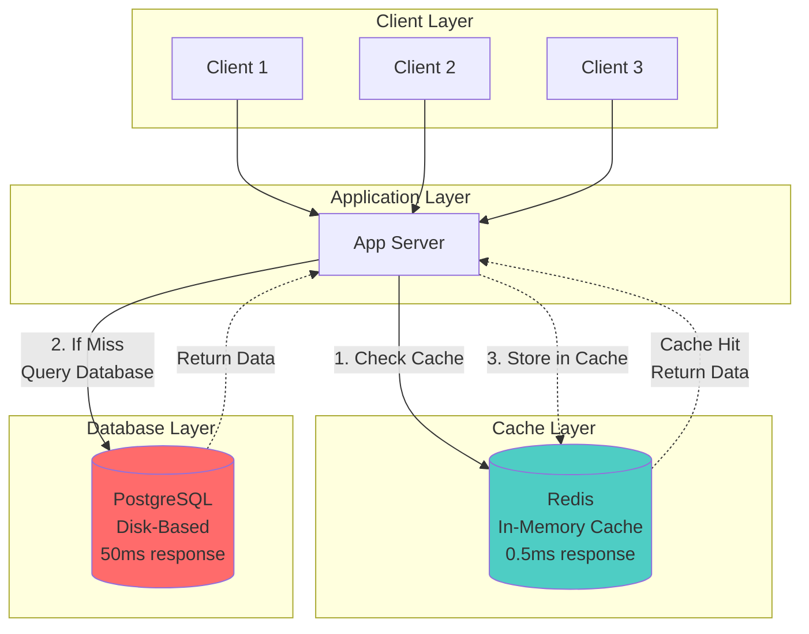
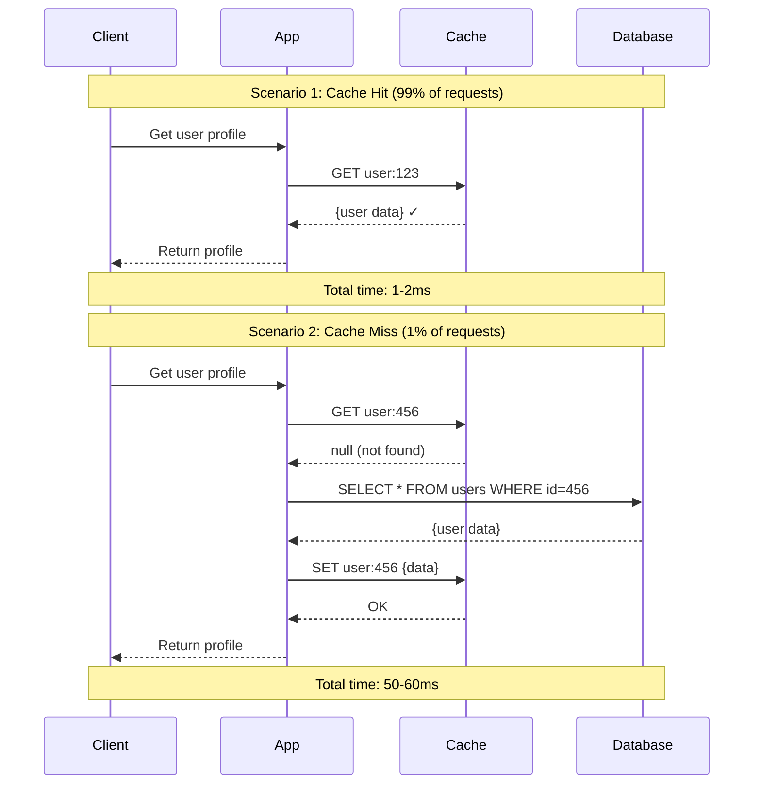

# Caching Fundamentals

**Difficulty**: 🟢 Beginner
**Reading Time**: 10 minutes
**Practical Application**: Essential for any app with > 1,000 users

## 🎯 Problem Statement

```javascript
// Without cache
async function getUserProfile(userId) {
  const user = await db.query('SELECT * FROM users WHERE id = ?', [userId]);
  return user; // Takes 50ms every time
}

// 10,000 requests/sec = 10,000 database queries/sec → Database overloaded!

// With cache
async function getUserProfile(userId) {
  const cached = await cache.get(`user:${userId}`);
  if (cached) return cached; // Takes 0.5ms

  const user = await db.query('SELECT * FROM users WHERE id = ?', [userId]);
  await cache.set(`user:${userId}`, user, 3600); // Cache for 1 hour
  return user;
}

// 10,000 requests/sec → 100 database queries/sec (99% cache hit rate)
// Database load reduced by 99%!
```

## 🌍 Real-World Context

**Performance Impact**:
- Database query: 20-100ms
- Cache (Redis/Memcached): 0.3-1ms
- **Speed improvement: 50-300×**

**Real Companies**:
- **Facebook**: 95% of reads served from cache
- **Twitter**: Massive Redis cluster (1000s of instances)
- **Pinterest**: 88% cache hit rate → Saves millions in DB costs

## 🏗️ Architecture

### Cache Layer



### Request Flow



## 💻 Implementation

### Basic Cache Implementation

```javascript
const Redis = require('ioredis');
const redis = new Redis({
  host: 'localhost',
  port: 6379
});

class CacheService {
  constructor() {
    this.redis = redis;
    this.defaultTTL = 3600; // 1 hour in seconds
  }

  // Get from cache
  async get(key) {
    const data = await this.redis.get(key);

    if (!data) {
      return null; // Cache miss
    }

    try {
      return JSON.parse(data); // Deserialize
    } catch (error) {
      console.error('Cache parse error:', error);
      return null;
    }
  }

  // Set to cache with TTL
  async set(key, value, ttl = this.defaultTTL) {
    const serialized = JSON.stringify(value);
    await this.redis.setex(key, ttl, serialized);
  }

  // Delete from cache
  async delete(key) {
    await this.redis.del(key);
  }

  // Delete multiple keys
  async deletePattern(pattern) {
    const keys = await this.redis.keys(pattern);
    if (keys.length > 0) {
      await this.redis.del(...keys);
    }
  }

  // Check if key exists
  async exists(key) {
    return await this.redis.exists(key) === 1;
  }
}

// Usage
const cache = new CacheService();

// User service with caching
class UserService {
  async getUser(userId) {
    const cacheKey = `user:${userId}`;

    // Try cache first
    const cached = await cache.get(cacheKey);
    if (cached) {
      console.log('Cache hit');
      return cached;
    }

    // Cache miss - query database
    console.log('Cache miss - querying database');
    const user = await db.query(
      'SELECT * FROM users WHERE id = $1',
      [userId]
    );

    if (user) {
      // Store in cache for 1 hour
      await cache.set(cacheKey, user, 3600);
    }

    return user;
  }

  async updateUser(userId, updates) {
    // Update database
    const user = await db.query(
      'UPDATE users SET name = $1, email = $2 WHERE id = $3 RETURNING *',
      [updates.name, updates.email, userId]
    );

    // Invalidate cache
    await cache.delete(`user:${userId}`);

    return user;
  }

  async deleteUser(userId) {
    // Delete from database
    await db.query('DELETE FROM users WHERE id = $1', [userId]);

    // Invalidate cache
    await cache.delete(`user:${userId}`);
  }
}
```

### Cache-Aside Pattern (Lazy Loading)

```javascript
class CacheAsidePattern {
  async getData(key, fetchFunction, ttl = 3600) {
    // Step 1: Try to get from cache
    const cached = await cache.get(key);
    if (cached) {
      return cached; // Cache hit
    }

    // Step 2: Cache miss - fetch from source
    const data = await fetchFunction();

    // Step 3: Store in cache
    if (data) {
      await cache.set(key, data, ttl);
    }

    return data;
  }

  async getUserProfile(userId) {
    return await this.getData(
      `user:${userId}`,
      () => db.query('SELECT * FROM users WHERE id = $1', [userId]),
      3600 // Cache for 1 hour
    );
  }

  async getUserPosts(userId) {
    return await this.getData(
      `user:${userId}:posts`,
      () => db.query('SELECT * FROM posts WHERE user_id = $1', [userId]),
      600 // Cache for 10 minutes (more dynamic data)
    );
  }
}
```

### Cache with Metrics

```javascript
class CacheWithMetrics {
  constructor() {
    this.hits = 0;
    this.misses = 0;
    this.errors = 0;
  }

  async get(key) {
    try {
      const data = await cache.get(key);

      if (data) {
        this.hits++;
        return data;
      } else {
        this.misses++;
        return null;
      }
    } catch (error) {
      this.errors++;
      console.error('Cache error:', error);
      return null; // Fail gracefully
    }
  }

  getHitRate() {
    const total = this.hits + this.misses;
    if (total === 0) return 0;
    return (this.hits / total * 100).toFixed(2) + '%';
  }

  getStats() {
    return {
      hits: this.hits,
      misses: this.misses,
      errors: this.errors,
      hitRate: this.getHitRate()
    };
  }

  resetStats() {
    this.hits = 0;
    this.misses = 0;
    this.errors = 0;
  }
}

// Monitoring endpoint
app.get('/cache/stats', (req, res) => {
  res.json(cacheWithMetrics.getStats());
});
```

## 🎯 What to Cache?

### ✅ Good Candidates for Caching

```javascript
// 1. User profiles (read-heavy, rarely change)
cache.set(`user:${userId}`, user, 3600);

// 2. Product catalogs (read millions of times)
cache.set(`product:${productId}`, product, 7200);

// 3. API responses (expensive to compute)
cache.set(`api:search:${query}`, results, 300);

// 4. Session data (fast access needed)
cache.set(`session:${sessionId}`, session, 1800);

// 5. Configuration (almost never changes)
cache.set('app:config', config, 86400);

// 6. Computed aggregations
cache.set(`stats:daily:${date}`, stats, 3600);

// 7. Third-party API responses (rate-limited)
cache.set(`github:user:${username}`, githubData, 600);
```

### ❌ Bad Candidates for Caching

```javascript
// 1. Highly dynamic data (changes every request)
// ❌ Current stock price
// ❌ Real-time bidding data

// 2. User-specific sensitive data with complex permissions
// ❌ Bank account balance (requires real-time accuracy)
// ❌ Medical records (compliance issues)

// 3. Very large objects (> 1MB)
// ❌ Full video files
// ❌ Large binary data

// 4. Data that's already fast to fetch
// ❌ Simple in-memory lookups
// ❌ Constant values

// 5. Frequently updated data
// ❌ Live chat messages
// ❌ Real-time game state
```

## ⏰ Time-To-Live (TTL) Guidelines

```javascript
const TTL = {
  // Very stable data
  CONFIG: 86400,        // 24 hours
  STATIC_CONTENT: 3600, // 1 hour

  // User data
  USER_PROFILE: 3600,   // 1 hour
  USER_SETTINGS: 1800,  // 30 minutes

  // Dynamic content
  PRODUCT_LIST: 600,    // 10 minutes
  SEARCH_RESULTS: 300,  // 5 minutes
  TRENDING: 60,         // 1 minute

  // Session data
  SESSION: 1800,        // 30 minutes
  AUTH_TOKEN: 900,      // 15 minutes

  // API rate limiting
  RATE_LIMIT: 60        // 1 minute
};

// Usage
await cache.set(`user:${userId}`, user, TTL.USER_PROFILE);
await cache.set(`search:${query}`, results, TTL.SEARCH_RESULTS);
```

## 📊 Cache Performance Metrics

### Key Metrics to Track

```javascript
class CacheMonitoring {
  async getMetrics() {
    // 1. Hit Rate (most important)
    const hitRate = this.calculateHitRate();
    // Target: > 80% for most applications

    // 2. Memory Usage
    const memoryUsage = await redis.info('memory');

    // 3. Eviction Rate
    const evictions = await redis.info('stats');

    // 4. Latency
    const avgLatency = await this.measureLatency();

    // 5. Key Count
    const keyCount = await redis.dbsize();

    return {
      hitRate,
      memoryUsage,
      evictions,
      avgLatency,
      keyCount
    };
  }

  calculateHitRate() {
    // Formula: hits / (hits + misses) * 100
    const total = this.hits + this.misses;
    return total > 0 ? (this.hits / total * 100) : 0;
  }

  async measureLatency() {
    const samples = 100;
    const latencies = [];

    for (let i = 0; i < samples; i++) {
      const start = Date.now();
      await cache.get('test:key');
      latencies.push(Date.now() - start);
    }

    return latencies.reduce((a, b) => a + b) / samples;
  }
}
```

### Alerting Thresholds

```javascript
const ALERTS = {
  HIT_RATE_LOW: 70,        // Alert if < 70%
  MEMORY_USAGE_HIGH: 80,   // Alert if > 80%
  LATENCY_HIGH: 5,         // Alert if > 5ms
  EVICTION_RATE_HIGH: 100  // Alert if > 100/sec
};

setInterval(async () => {
  const metrics = await cacheMonitoring.getMetrics();

  if (metrics.hitRate < ALERTS.HIT_RATE_LOW) {
    alert(`Cache hit rate low: ${metrics.hitRate}%`);
  }

  if (metrics.avgLatency > ALERTS.LATENCY_HIGH) {
    alert(`Cache latency high: ${metrics.avgLatency}ms`);
  }
}, 60000); // Check every minute
```

## ⚠️ Common Pitfalls

### 1. Not Handling Cache Failures

```javascript
// ❌ BAD: App crashes if cache is down
async function getUser(userId) {
  const user = await cache.get(`user:${userId}`); // Throws error if Redis is down
  if (!user) {
    return await db.query('SELECT * FROM users WHERE id = $1', [userId]);
  }
  return user;
}

// ✅ GOOD: Graceful degradation
async function getUser(userId) {
  try {
    const cached = await cache.get(`user:${userId}`);
    if (cached) return cached;
  } catch (error) {
    console.error('Cache error, falling back to database:', error);
    // Continue to database query
  }

  // Query database
  const user = await db.query('SELECT * FROM users WHERE id = $1', [userId]);

  // Try to cache (but don't fail if cache is down)
  try {
    await cache.set(`user:${userId}`, user, 3600);
  } catch (error) {
    console.error('Failed to cache user:', error);
  }

  return user;
}
```

### 2. Cache Stampede

```javascript
// ❌ BAD: Multiple requests fetch same data simultaneously
async function getPopularItem(itemId) {
  const cached = await cache.get(`item:${itemId}`);
  if (cached) return cached;

  // If 1000 requests come at once, all will hit database!
  const item = await db.query('SELECT * FROM items WHERE id = $1', [itemId]);
  await cache.set(`item:${itemId}`, item, 3600);
  return item;
}

// ✅ GOOD: Use locking or probabil istic early expiration
const fetchLocks = new Map();

async function getPopularItem(itemId) {
  const cached = await cache.get(`item:${itemId}`);
  if (cached) return cached;

  const lockKey = `lock:item:${itemId}`;

  // Check if another request is already fetching
  if (fetchLocks.has(lockKey)) {
    // Wait for the other request to finish
    return await fetchLocks.get(lockKey);
  }

  // Create promise for this fetch
  const fetchPromise = (async () => {
    const item = await db.query('SELECT * FROM items WHERE id = $1', [itemId]);
    await cache.set(`item:${itemId}`, item, 3600);
    fetchLocks.delete(lockKey);
    return item;
  })();

  fetchLocks.set(lockKey, fetchPromise);
  return await fetchPromise;
}
```

### 3. Not Invalidating on Updates

```javascript
// ❌ BAD: Stale data in cache
async function updateUser(userId, updates) {
  await db.query('UPDATE users SET name = $1 WHERE id = $2', [updates.name, userId]);
  // Cache still has old data!
}

// ✅ GOOD: Invalidate cache on update
async function updateUser(userId, updates) {
  await db.query('UPDATE users SET name = $1 WHERE id = $2', [updates.name, userId]);

  // Invalidate cache
  await cache.delete(`user:${userId}`);

  // Or update cache with new data
  const user = await db.query('SELECT * FROM users WHERE id = $1', [userId]);
  await cache.set(`user:${userId}`, user, 3600);
}
```

## 🎓 Key Takeaways

1. ✅ **Cache reads, not writes** - Cache data that's read frequently
2. ✅ **Set appropriate TTLs** - Balance freshness vs performance
3. ✅ **Fail gracefully** - App should work if cache is down
4. ✅ **Invalidate on updates** - Keep cache consistent with database
5. ✅ **Monitor hit rate** - Target > 80% for most apps
6. ✅ **Cache at multiple layers** - Application, database, CDN

## 🔗 Next Steps

- [Cache-Aside Pattern](./02-cache-aside.md) - Most common caching strategy
- [Cache Invalidation](./05-cache-invalidation.md) - Keeping cache fresh
- [Distributed Caching with Redis](./06-redis-distributed.md) - Scale across servers

## 📚 Further Reading

- Redis Documentation: https://redis.io/documentation
- Memcached: https://memcached.org/
- AWS ElastiCache: https://aws.amazon.com/elasticache/
