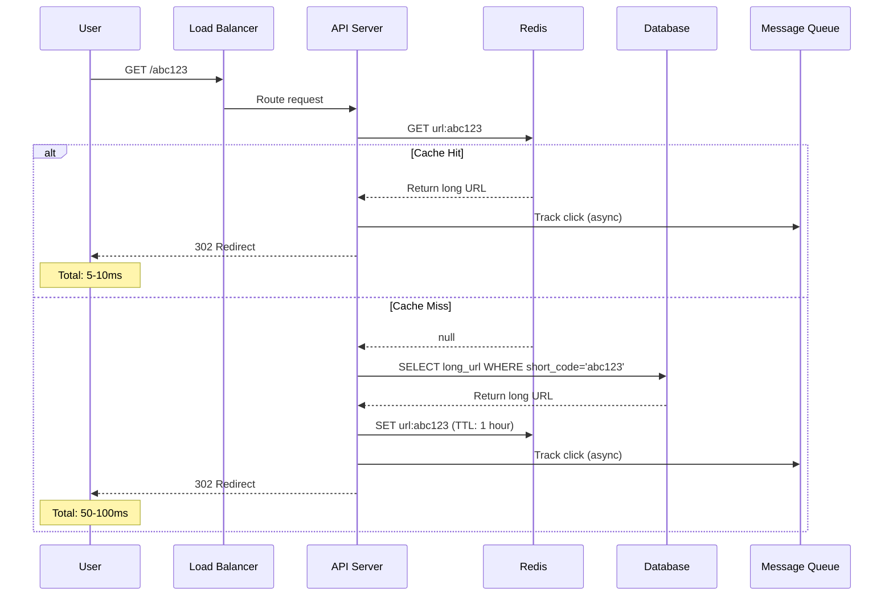

# Design a URL Shortener (like bit.ly)

**Difficulty**: 🟢 Beginner
**Time**: 45 minutes
**Companies**: Amazon, Google, Microsoft, Meta (most common interview question)

## 1. Problem Statement

Design a URL shortening service that:
- Takes a long URL and generates a short URL
- Redirects short URLs to original long URLs
- Tracks analytics (clicks, referrers, etc.)

**Examples**:
```
Input:  https://www.example.com/very/long/url/with/many/parameters?foo=bar&baz=qux
Output: https://short.ly/abc123

Input:  https://short.ly/abc123
Output: Redirect to original URL
```

## 2. Requirements

### Functional Requirements
1. ✅ Generate short URL from long URL
2. ✅ Redirect short URL to original URL
3. ✅ Custom short URLs (optional)
4. ✅ URL expiration (optional)
5. ✅ Click analytics

### Non-Functional Requirements
1. ✅ **High availability** (99.99% uptime)
2. ✅ **Low latency** (< 100ms redirects)
3. ✅ **Scalable** (1M new URLs/day)
4. ✅ **Durable** (URLs never lost)
5. ✅ **Short URLs** (< 10 characters)

### Out of Scope
- ❌ User authentication
- ❌ URL preview
- ❌ QR code generation

## 3. Capacity Estimation

### Traffic Estimates
```
Write (new URLs): 1,000,000 per day = 12 URLs/sec
Read (redirects): 100:1 read/write ratio = 1,200 redirects/sec

Peak traffic (3× average): 3,600 redirects/sec
```

### Storage Estimates
```
1M new URLs per day
URL lifetime: 10 years
Total URLs: 1M × 365 × 10 = 3.65 billion URLs

Storage per URL: ~500 bytes (URL + metadata)
Total storage: 3.65B × 500 bytes = 1.825 TB
```

### Bandwidth Estimates
```
Write: 12 URLs/sec × 500 bytes = 6 KB/sec
Read: 1,200 redirects/sec × 500 bytes = 600 KB/sec

Total: ~600 KB/sec (negligible)
```

### Cache Estimates
```
80/20 rule: 20% of URLs generate 80% of traffic
Cache top 20% of daily URLs: 200,000 URLs
Cache size: 200,000 × 500 bytes = 100 MB

Easily fits in memory!
```

## 4. System APIs

### Create Short URL

```javascript
POST /api/shorten

Request:
{
  "longUrl": "https://www.example.com/very/long/url",
  "customAlias": "my-link",      // Optional
  "expiresAt": "2025-12-31"      // Optional
}

Response:
{
  "shortUrl": "https://short.ly/abc123",
  "longUrl": "https://www.example.com/very/long/url",
  "createdAt": "2025-01-15T10:30:00Z",
  "expiresAt": null
}
```

### Redirect Short URL

```javascript
GET /:shortCode

Response: 302 Redirect to long URL
Location: https://www.example.com/very/long/url
```

### Get Analytics

```javascript
GET /api/analytics/:shortCode

Response:
{
  "shortUrl": "https://short.ly/abc123",
  "longUrl": "https://www.example.com/very/long/url",
  "totalClicks": 1523,
  "clicksByDate": {
    "2025-01-15": 234,
    "2025-01-16": 456
  },
  "clicksByCountry": {
    "US": 800,
    "UK": 300
  }
}
```

## 5. Database Schema

### URLs Table

```sql
CREATE TABLE urls (
  id BIGSERIAL PRIMARY KEY,
  short_code VARCHAR(10) UNIQUE NOT NULL,
  long_url TEXT NOT NULL,
  created_at TIMESTAMP DEFAULT NOW(),
  expires_at TIMESTAMP,
  clicks BIGINT DEFAULT 0,

  INDEX idx_short_code (short_code),
  INDEX idx_created_at (created_at),
  INDEX idx_expires_at (expires_at)
);
```

### Analytics Table (for detailed tracking)

```sql
CREATE TABLE clicks (
  id BIGSERIAL PRIMARY KEY,
  short_code VARCHAR(10) NOT NULL,
  clicked_at TIMESTAMP DEFAULT NOW(),
  ip_address INET,
  user_agent TEXT,
  referrer TEXT,
  country VARCHAR(2),

  INDEX idx_short_code (short_code),
  INDEX idx_clicked_at (clicked_at)
);
```

## 6. Architecture

### High-Level Design

```mermaid
graph TB
    subgraph "Clients"
        C1[Browser]
        C2[Mobile App]
        C3[API Client]
    end

    subgraph "Load Balancer"
        LB[Load Balancer<br/>Nginx/HAProxy]
    end

    subgraph "Application Layer"
        API1[API Server 1]
        API2[API Server 2]
        API3[API Server 3]
    end

    subgraph "Cache Layer"
        Redis[(Redis Cache<br/>Hot URLs)]
    end

    subgraph "Database Layer"
        Master[(Primary DB<br/>Writes)]
        Replica1[(Read Replica 1)]
        Replica2[(Read Replica 2)]
    end

    subgraph "Analytics"
        Queue[Message Queue]
        Worker[Analytics Worker]
        Analytics[(Analytics DB<br/>ClickHouse)]
    end

    C1 --> LB
    C2 --> LB
    C3 --> LB

    LB --> API1
    LB --> API2
    LB --> API3

    API1 --> Redis
    API2 --> Redis
    API3 --> Redis

    API1 -.->|Write| Master
    API1 -.->|Read| Replica1

    API2 -.->|Write| Master
    API2 -.->|Read| Replica2

    API3 -.->|Write| Master
    API3 -.->|Read| Replica1

    Master -.->|Replicate| Replica1
    Master -.->|Replicate| Replica2

    API1 -.->|Track click| Queue
    Queue --> Worker
    Worker --> Analytics

    style Redis fill:#4ecdc4
    style Master fill:#ff6b6b
    style Replica1 fill:#95e1d3
    style Replica2 fill:#95e1d3
```

### Redirect Flow



## 7. Implementation

### URL Shortening Algorithm

```javascript
class URLShortener {
  constructor() {
    // Base62 encoding: [a-zA-Z0-9]
    this.charset = 'abcdefghijklmnopqrstuvwxyzABCDEFGHIJKLMNOPQRSTUVWXYZ0123456789';
    this.base = this.charset.length; // 62
  }

  // Method 1: Counter-based (simple, predictable)
  encodeId(id) {
    if (id === 0) return this.charset[0];

    let shortCode = '';
    while (id > 0) {
      shortCode = this.charset[id % this.base] + shortCode;
      id = Math.floor(id / this.base);
    }

    return shortCode;
  }

  decodeShortCode(shortCode) {
    let id = 0;
    for (let i = 0; i < shortCode.length; i++) {
      id = id * this.base + this.charset.indexOf(shortCode[i]);
    }
    return id;
  }

  // Method 2: Hash-based (random, no collisions with check)
  async generateShortCode(longUrl) {
    // Generate MD5 hash
    const hash = crypto.createHash('md5').update(longUrl).digest('hex');

    // Take first 7 characters (collision check needed)
    let shortCode = hash.substring(0, 7);

    // Check for collision
    let attempt = 0;
    while (await this.shortCodeExists(shortCode)) {
      // Use different portion of hash
      shortCode = hash.substring(attempt, attempt + 7);
      attempt++;

      if (attempt > 20) {
        // Fallback to random
        shortCode = this.generateRandom(7);
        break;
      }
    }

    return shortCode;
  }

  generateRandom(length) {
    let result = '';
    for (let i = 0; i < length; i++) {
      result += this.charset[Math.floor(Math.random() * this.base)];
    }
    return result;
  }

  async shortCodeExists(shortCode) {
    // Check in database
    const exists = await db.query(
      'SELECT 1 FROM urls WHERE short_code = $1',
      [shortCode]
    );
    return exists.length > 0;
  }
}
```

### Create Short URL Service

```javascript
class ShortenService {
  async createShortUrl(longUrl, customAlias = null, expiresAt = null) {
    // Validate URL
    if (!this.isValidUrl(longUrl)) {
      throw new Error('Invalid URL');
    }

    let shortCode;

    if (customAlias) {
      // Check if custom alias is available
      if (await this.shortCodeExists(customAlias)) {
        throw new Error('Custom alias already taken');
      }
      shortCode = customAlias;
    } else {
      // Generate unique short code
      shortCode = await this.generateUniqueShortCode(longUrl);
    }

    // Save to database
    const url = await db.query(`
      INSERT INTO urls (short_code, long_url, expires_at)
      VALUES ($1, $2, $3)
      RETURNING *
    `, [shortCode, longUrl, expiresAt]);

    return {
      shortUrl: `${process.env.BASE_URL}/${shortCode}`,
      longUrl: longUrl,
      createdAt: url.created_at,
      expiresAt: url.expires_at
    };
  }

  async generateUniqueShortCode(longUrl) {
    // Check if URL already shortened
    const existing = await db.query(
      'SELECT short_code FROM urls WHERE long_url = $1',
      [longUrl]
    );

    if (existing.length > 0) {
      return existing[0].short_code;
    }

    // Generate new short code
    const shortener = new URLShortener();
    return await shortener.generateShortCode(longUrl);
  }

  isValidUrl(url) {
    try {
      new URL(url);
      return true;
    } catch {
      return false;
    }
  }
}
```

### Redirect Service with Caching

```javascript
class RedirectService {
  constructor() {
    this.cache = redis;
  }

  async redirect(shortCode) {
    // Try cache first
    const cached = await this.cache.get(`url:${shortCode}`);
    if (cached) {
      // Track click asynchronously
      this.trackClick(shortCode);
      return JSON.parse(cached);
    }

    // Cache miss - query database
    const url = await db.query(
      `SELECT long_url, expires_at
       FROM urls
       WHERE short_code = $1`,
      [shortCode]
    );

    if (!url.length) {
      throw new Error('URL not found');
    }

    const { long_url, expires_at } = url[0];

    // Check expiration
    if (expires_at && new Date(expires_at) < new Date()) {
      throw new Error('URL expired');
    }

    // Cache for 1 hour
    await this.cache.setex(
      `url:${shortCode}`,
      3600,
      JSON.stringify({ longUrl: long_url })
    );

    // Track click asynchronously
    this.trackClick(shortCode);

    return { longUrl: long_url };
  }

  async trackClick(shortCode) {
    // Queue click event (non-blocking)
    await clickQueue.add('track-click', {
      shortCode,
      timestamp: Date.now()
    });

    // Also increment counter in Redis (fast)
    await this.cache.incr(`clicks:${shortCode}`);
  }
}
```

### Click Analytics Worker

```javascript
class ClickAnalyticsWorker {
  constructor() {
    this.worker = new Worker('track-click', this.processClick.bind(this));
  }

  async processClick(job) {
    const { shortCode, timestamp, ip, userAgent, referrer } = job.data;

    // Batch writes for performance
    await db.query(`
      INSERT INTO clicks (short_code, clicked_at, ip_address, user_agent, referrer)
      VALUES ($1, $2, $3, $4, $5)
    `, [shortCode, new Date(timestamp), ip, userAgent, referrer]);

    // Update total clicks counter
    await db.query(
      'UPDATE urls SET clicks = clicks + 1 WHERE short_code = $1',
      [shortCode]
    );
  }
}
```

## 8. Deep Dives

### 8.1 Short Code Generation Strategies

#### Strategy 1: Counter-based (Auto-increment ID)

```javascript
// Pros: Simple, no collisions, short codes
// Cons: Predictable, sequential

// ID 1 → 'b'
// ID 62 → 'ba'
// ID 3844 → 'baa'

async function createUrl(longUrl) {
  // Insert and get auto-increment ID
  const result = await db.query(
    'INSERT INTO urls (long_url) VALUES ($1) RETURNING id',
    [longUrl]
  );

  const id = result[0].id;
  const shortCode = encodeId(id);

  // Update with short code
  await db.query(
    'UPDATE urls SET short_code = $1 WHERE id = $2',
    [shortCode, id]
  );

  return shortCode;
}
```

#### Strategy 2: Hash-based (MD5/SHA256)

```javascript
// Pros: Deterministic, same URL → same short code
// Cons: Need collision handling, longer codes

function generateShortCode(longUrl) {
  const hash = crypto.createHash('md5').update(longUrl).digest('base64');
  return hash.substring(0, 7).replace(/[+/=]/g, '');
}
```

#### Strategy 3: Random Generation

```javascript
// Pros: Unpredictable, distributed
// Cons: Need collision checking

function generateRandom() {
  return crypto.randomBytes(6).toString('base64').replace(/[+/=]/g, '').substring(0, 7);
}
```

### 8.2 Caching Strategy

```javascript
// Multi-layer caching
class CachingStrategy {
  async getLongUrl(shortCode) {
    // L1: In-memory cache (app server)
    const l1 = this.inMemoryCache.get(shortCode);
    if (l1) return l1;

    // L2: Redis (distributed cache)
    const l2 = await redis.get(`url:${shortCode}`);
    if (l2) {
      this.inMemoryCache.set(shortCode, l2);
      return l2;
    }

    // L3: Database
    const url = await db.query(
      'SELECT long_url FROM urls WHERE short_code = $1',
      [shortCode]
    );

    if (url.length) {
      const longUrl = url[0].long_url;

      // Populate caches
      await redis.setex(`url:${shortCode}`, 3600, longUrl);
      this.inMemoryCache.set(shortCode, longUrl);

      return longUrl;
    }

    return null;
  }
}
```

### 8.3 Analytics at Scale

```javascript
// Real-time analytics with time-series database
class AnalyticsService {
  async trackClick(shortCode, metadata) {
    // Write to fast queue
    await clickQueue.publish({
      shortCode,
      timestamp: Date.now(),
      ...metadata
    });
  }

  // Batch processor (runs every 10 seconds)
  async processBatch() {
    const clicks = await clickQueue.getBatch(1000);

    // Batch insert to ClickHouse (time-series DB)
    await clickhouse.insert('clicks', clicks);

    // Update hot counters in Redis
    const counters = {};
    for (const click of clicks) {
      counters[click.shortCode] = (counters[click.shortCode] || 0) + 1;
    }

    for (const [shortCode, count] of Object.entries(counters)) {
      await redis.incrby(`clicks:${shortCode}`, count);
    }
  }

  async getAnalytics(shortCode, startDate, endDate) {
    // Query time-series DB
    return await clickhouse.query(`
      SELECT
        toDate(clicked_at) as date,
        count() as clicks,
        uniq(ip_address) as unique_visitors
      FROM clicks
      WHERE short_code = '${shortCode}'
        AND clicked_at BETWEEN '${startDate}' AND '${endDate}'
      GROUP BY date
      ORDER BY date
    `);
  }
}
```

## 9. Trade-offs & Decisions

### Decision 1: Counter vs Hash-based Short Codes

| Aspect | Counter | Hash |
|--------|---------|------|
| Uniqueness | Guaranteed | Need collision check |
| Length | Shorter | Longer |
| Predictability | Predictable | Random |
| Same URL | Different codes | Same code |
| Distributed | Needs coordination | Independent |

**Choice**: Counter-based with distributed ID generator (like Twitter Snowflake)

### Decision 2: SQL vs NoSQL

| Aspect | SQL (PostgreSQL) | NoSQL (MongoDB) |
|--------|------------------|-----------------|
| ACID | ✅ Strong | ⚠️ Eventual |
| Scalability | Vertical + Sharding | Horizontal |
| Queries | Complex SQL | Limited |
| Consistency | Strong | Eventual |

**Choice**: PostgreSQL with read replicas (ACID guarantees, simpler)

### Decision 3: Sync vs Async Analytics

```javascript
// ❌ Synchronous: Slow redirects
app.get('/:code', async (req, res) => {
  const url = await getUrl(req.params.code);
  await trackClick(req.params.code); // Blocks!
  res.redirect(url);
});

// ✅ Asynchronous: Fast redirects
app.get('/:code', async (req, res) => {
  const url = await getUrl(req.params.code);
  trackClickAsync(req.params.code); // Non-blocking!
  res.redirect(url);
});
```

**Choice**: Async analytics with message queue

## 10. Scaling

### Horizontal Scaling

```
1 server → 10 servers → 100 servers
- Stateless API servers
- Shared cache (Redis cluster)
- Database sharding by short_code
```

### Database Sharding

```javascript
// Shard by first character of short_code
function getShardId(shortCode) {
  const char = shortCode[0];
  return char.charCodeAt(0) % NUM_SHARDS;
}

// 10 shards, each handles 1/10 of traffic
```

### CDN for Static Content

```
User → CDN (edge location) → Origin Servers
- Serve redirects from edge
- Cache redirect rules
```

## 🎓 Key Takeaways

1. ✅ **Base62 encoding** - Compact short codes
2. ✅ **Cache heavily** - 99% cache hit rate possible
3. ✅ **Async analytics** - Don't slow down redirects
4. ✅ **Read replicas** - Scale reads independently
5. ✅ **Idempotency** - Same URL can generate same short code
6. ✅ **TTL on cache** - Handle URL updates

## 📚 Further Reading

- Base62 Encoding: https://en.wikipedia.org/wiki/Base62
- Twitter Snowflake ID: https://blog.twitter.com/engineering/en_us/a/2010/announcing-snowflake
- ClickHouse for Analytics: https://clickhouse.com/docs
