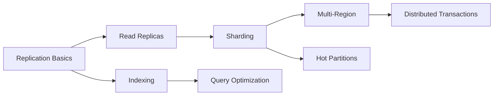

# Database & Data Layer

> Master the foundation of scalable systems: how to store, retrieve, and manage data at scale

## 📋 Overview

The database layer is the backbone of any application. At scale (millions of users), you need to think beyond a single database instance. This section covers practical patterns and implementations used in production systems.

## 📚 Articles

### Fundamentals (🟢 Beginner)
1. [Database Replication Basics](./01-replication-basics.md) - Master-slave, async vs sync replication
2. [Read Replicas Explained](./02-read-replicas.md) - Scaling reads, lag handling, use cases
3. [Database Sharding Strategies](./03-sharding-strategies.md) - Horizontal partitioning at scale
4. [Indexing for Performance](./04-indexing-strategies.md) - B-tree, Hash, Composite indexes
5. [Connection Pooling](./05-connection-pooling.md) - Why and how to pool database connections

### Intermediate Topics (🟡 Intermediate)
6. [Partitioning vs Sharding](./06-partitioning-vs-sharding.md) - Understanding the difference
7. [Multi-Region Databases](./07-multi-region-setup.md) - Global distribution strategies
8. [Database Failover Mechanisms](./08-failover-mechanisms.md) - Automatic failover, split-brain
9. [Write-Heavy vs Read-Heavy](./09-workload-patterns.md) - Optimizing for different patterns
10. [Hot Partition Problem](./10-hot-partition.md) - Identifying and solving hot spots

### Advanced Topics (🔴 Advanced)
11. [Distributed Transactions](./11-distributed-transactions.md) - 2PC, Saga pattern
12. [Change Data Capture (CDC)](./12-change-data-capture.md) - Real-time data sync
13. [Database Migration at Scale](./13-migration-strategies.md) - Zero-downtime migrations
14. [Polyglot Persistence](./14-polyglot-persistence.md) - Using multiple database types
15. [Time-Series Data Optimization](./15-time-series-optimization.md) - Handling time-series data

## 🎯 Quick Reference

### When to Use What?

| Scenario | Solution | Article |
|----------|----------|---------|
| Too many reads | Read replicas | [#02](./02-read-replicas.md) |
| Database too large | Sharding | [#03](./03-sharding-strategies.md) |
| Slow queries | Indexing | [#04](./04-indexing-strategies.md) |
| Connection limits | Connection pooling | [#05](./05-connection-pooling.md) |
| Global users | Multi-region | [#07](./07-multi-region-setup.md) |
| Master failure | Failover | [#08](./failover-mechanisms.md) |

## 🚀 Learning Path

Start with replication basics and work your way through based on your needs!
