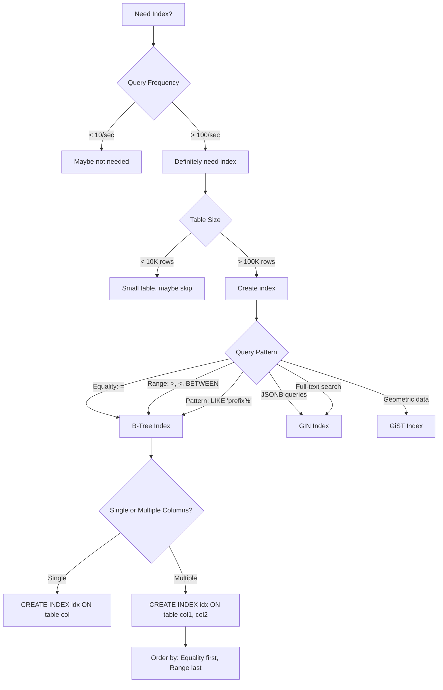

# Indexing for Performance

**Difficulty**: 🟢 Beginner
**Reading Time**: 12 minutes
**Practical Application**: Every query > 50ms should be reviewed for indexing

## 🎯 Problem Statement

```sql
-- Table: users (10 million rows)
SELECT * FROM users WHERE email = 'alice@example.com';
-- Query time: 8 seconds ⚠️

-- After adding index
CREATE INDEX idx_users_email ON users(email);
-- Same query: 12 milliseconds ✅
```

**Without indexes**: Database scans ALL rows (full table scan)
**With indexes**: Database jumps directly to matching rows

## 🌍 Real-World Context

**When you need this**:
- Table > 10,000 rows
- Query time > 50ms
- High query volume (1000+ queries/sec)

**Impact**:
- Query speed: 100-1000× faster
- CPU usage: 90% reduction
- User experience: instant vs. slow

## 🏗️ How Indexes Work

### B-Tree Index (Most Common)

```mermaid
graph TB
    subgraph "B-Tree Index Structure"
        Root[Root Node<br/>40 | 80]

        Node1[10 | 20 | 30]
        Node2[50 | 60 | 70]
        Node3[90 | 100]

        L1[1-9]
        L2[10-19]
        L3[20-29]
        L4[30-39]

        L5[40-49]
        L6[50-59]
        L7[60-69]
        L8[70-79]

        L9[80-89]
        L10[90-99]
        L11[100+]
    end

    Root -->|< 40| Node1
    Root -->|40-80| Node2
    Root -->|> 80| Node3

    Node1 --> L1
    Node1 --> L2
    Node1 --> L3
    Node1 --> L4

    Node2 --> L5
    Node2 --> L6
    Node2 --> L7
    Node2 --> L8

    Node3 --> L9
    Node3 --> L10
    Node3 --> L11

    style Root fill:#ff6b6b
    style Node1 fill:#4ecdc4
    style Node2 fill:#4ecdc4
    style Node3 fill:#4ecdc4
```

**Search for `email = 'alice@example.com'`**:
1. Start at root node
2. Navigate tree (3-4 jumps)
3. Find matching rows
4. **Time complexity: O(log n)** vs O(n) for full scan

## 💻 Implementation

### Basic Indexing

```javascript
class DatabaseIndexing {
  // Create indexes for common queries
  async setupIndexes() {
    // Single column index
    await db.execute(`
      CREATE INDEX idx_users_email
      ON users(email)
    `);

    // Speeds up: WHERE email = ?
    await db.execute(`
      CREATE INDEX idx_users_created_at
      ON users(created_at)
    `);

    // Speeds up: WHERE created_at > ?
    // Also: ORDER BY created_at
  }

  // Query with index
  async getUserByEmail(email) {
    // Uses idx_users_email - FAST!
    return await db.execute(
      'SELECT * FROM users WHERE email = $1',
      [email]
    );
  }

  // Query without index (slow)
  async getUsersByCountry(country) {
    // Full table scan - SLOW!
    return await db.execute(
      'SELECT * FROM users WHERE country = $1',
      [country]
    );
  }
}
```

### Composite Indexes (Multiple Columns)

```javascript
class CompositeIndexing {
  async setupIndexes() {
    // Composite index: (status, created_at)
    await db.execute(`
      CREATE INDEX idx_orders_status_created
      ON orders(status, created_at)
    `);

    // This index helps queries:
    // 1. WHERE status = ?
    // 2. WHERE status = ? AND created_at > ?
    // 3. WHERE status = ? ORDER BY created_at

    // But NOT:
    // WHERE created_at > ? (wrong column order)
  }

  async getRecentPendingOrders() {
    // Uses idx_orders_status_created - FAST!
    return await db.execute(`
      SELECT * FROM orders
      WHERE status = 'pending'
      AND created_at > NOW() - INTERVAL '1 day'
      ORDER BY created_at DESC
    `);
  }

  async getRecentOrders() {
    // Does NOT use idx_orders_status_created
    // Index starts with 'status', but query doesn't filter on it
    return await db.execute(`
      SELECT * FROM orders
      WHERE created_at > NOW() - INTERVAL '1 day'
    `);
  }
}
```

**Composite Index Rule**: **Left-to-right matching**

```sql
-- Index: (status, created_at, user_id)

✅ Uses index: WHERE status = 'pending'
✅ Uses index: WHERE status = 'pending' AND created_at > '2025-01-01'
✅ Uses index: WHERE status = 'pending' AND created_at > '2025-01-01' AND user_id = 123

❌ NO index: WHERE created_at > '2025-01-01'
❌ NO index: WHERE user_id = 123
```

### Unique Indexes

```javascript
// Ensure email uniqueness + fast lookups
await db.execute(`
  CREATE UNIQUE INDEX idx_users_email_unique
  ON users(email)
`);

// Now this query is FAST + guarantees uniqueness
await db.execute(`
  INSERT INTO users (email, name)
  VALUES ($1, $2)
`, ['alice@example.com', 'Alice']);

// Duplicate email throws error
await db.execute(`
  INSERT INTO users (email, name)
  VALUES ($1, $2)
`, ['alice@example.com', 'Bob']); // ERROR: duplicate key value
```

### Partial Indexes (Filtered Indexes)

```javascript
// Index only active users
await db.execute(`
  CREATE INDEX idx_active_users_email
  ON users(email)
  WHERE status = 'active'
`);

// Smaller index, faster queries for active users
// ✅ Uses index
await db.execute(`
  SELECT * FROM users
  WHERE email = $1 AND status = 'active'
`, ['alice@example.com']);

// ❌ Does NOT use index (status != 'active')
await db.execute(`
  SELECT * FROM users
  WHERE email = $1 AND status = 'deleted'
`, ['bob@example.com']);
```

### Covering Indexes (Index-Only Scans)

```javascript
// Include extra columns in index
await db.execute(`
  CREATE INDEX idx_users_email_covering
  ON users(email)
  INCLUDE (name, created_at)
`);

// Query satisfied entirely by index (no table lookup needed!)
await db.execute(`
  SELECT name, created_at
  FROM users
  WHERE email = $1
`, ['alice@example.com']);

// PostgreSQL can answer this query by reading ONLY the index
// → Faster because index is smaller than table
```

## 📊 Index Types

### 1. B-Tree Index (Default)

```sql
CREATE INDEX idx_users_email ON users(email);
```

**Best for**:
- ✅ Equality: `WHERE email = 'alice@example.com'`
- ✅ Range: `WHERE created_at > '2025-01-01'`
- ✅ Sorting: `ORDER BY created_at`
- ✅ Pattern: `WHERE name LIKE 'Alice%'` (prefix only)

**Not good for**:
- ❌ `WHERE name LIKE '%Alice%'` (contains)

### 2. Hash Index

```sql
CREATE INDEX idx_users_email_hash ON users USING HASH (email);
```

**Best for**:
- ✅ Equality only: `WHERE email = 'alice@example.com'`

**Not good for**:
- ❌ Range queries
- ❌ Sorting
- ❌ Pattern matching

**Use case**: Exact match lookups on large tables

### 3. GIN Index (Generalized Inverted Index)

```sql
-- For JSONB columns
CREATE INDEX idx_users_metadata ON users USING GIN (metadata);

-- For array columns
CREATE INDEX idx_posts_tags ON posts USING GIN (tags);

-- For full-text search
CREATE INDEX idx_posts_search ON posts USING GIN (to_tsvector('english', content));
```

**Best for**:
- ✅ JSONB queries: `WHERE metadata @> '{"country": "US"}'`
- ✅ Array contains: `WHERE tags @> ARRAY['sql', 'database']`
- ✅ Full-text search: `WHERE to_tsvector(content) @@ to_tsquery('database')`

### 4. GiST Index (Generalized Search Tree)

```sql
-- For geometric data
CREATE INDEX idx_locations_point ON locations USING GIST (location);

-- For range types
CREATE INDEX idx_bookings_period ON bookings USING GIST (period);
```

**Best for**:
- ✅ Geometric queries (nearby locations)
- ✅ Range overlaps

## ⚠️ Common Pitfalls

### 1. Over-Indexing

```javascript
// ❌ BAD: Too many indexes
await db.execute('CREATE INDEX idx1 ON users(email)');
await db.execute('CREATE INDEX idx2 ON users(name)');
await db.execute('CREATE INDEX idx3 ON users(created_at)');
await db.execute('CREATE INDEX idx4 ON users(country)');
await db.execute('CREATE INDEX idx5 ON users(status)');
await db.execute('CREATE INDEX idx6 ON users(age)');

// Problem:
// - Every INSERT/UPDATE must update 6+ indexes
// - Slows down writes significantly
// - Uses lots of storage

// ✅ BETTER: Index only frequently queried columns
await db.execute('CREATE INDEX idx_users_email ON users(email)');
await db.execute('CREATE INDEX idx_users_status_created ON users(status, created_at)');

// 2 indexes instead of 6, covers 80% of queries
```

### 2. Wrong Column Order in Composite Index

```javascript
// Query pattern: WHERE status = ? AND created_at > ?

// ❌ BAD: Wrong order
await db.execute(`
  CREATE INDEX idx_orders_wrong
  ON orders(created_at, status)
`);

// Query can't use this index effectively
await db.execute(`
  SELECT * FROM orders
  WHERE status = 'pending'
  AND created_at > NOW() - INTERVAL '1 day'
`);

// ✅ GOOD: Correct order (equality first, range second)
await db.execute(`
  CREATE INDEX idx_orders_correct
  ON orders(status, created_at)
`);
```

**Rule**: Equality columns first, range columns last

### 3. Not Monitoring Index Usage

```javascript
class IndexMonitoring {
  async checkUnusedIndexes() {
    // PostgreSQL: Find unused indexes
    const unusedIndexes = await db.execute(`
      SELECT
        schemaname,
        tablename,
        indexname,
        idx_scan,
        pg_size_pretty(pg_relation_size(indexrelid)) AS size
      FROM pg_stat_user_indexes
      WHERE idx_scan = 0
      AND indexrelname NOT LIKE 'pk_%'
      ORDER BY pg_relation_size(indexrelid) DESC
    `);

    console.log('Unused indexes (consider removing):');
    console.table(unusedIndexes);

    return unusedIndexes;
  }

  async checkSlowQueries() {
    // Enable query logging
    await db.execute('SET log_min_duration_statement = 100'); // Log queries > 100ms

    // Analyze slow queries
    const slowQueries = await db.execute(`
      SELECT
        query,
        calls,
        total_time,
        mean_time,
        max_time
      FROM pg_stat_statements
      WHERE mean_time > 100
      ORDER BY total_time DESC
      LIMIT 20
    `);

    console.log('Slow queries needing indexes:');
    console.table(slowQueries);
  }

  async analyzeQuery(query) {
    // Get query execution plan
    const plan = await db.execute(`EXPLAIN ANALYZE ${query}`);

    console.log('Query plan:');
    console.log(plan);

    // Look for "Seq Scan" (full table scan) → Need index!
    // Look for "Index Scan" → Index being used ✅
  }
}
```

### 4. Index Bloat

```javascript
class IndexMaintenance {
  async reindexTable(tableName) {
    // Rebuild indexes to remove bloat
    await db.execute(`REINDEX TABLE ${tableName}`);

    // Or rebuild specific index
    await db.execute(`REINDEX INDEX idx_users_email`);
  }

  async checkIndexBloat() {
    const bloat = await db.execute(`
      SELECT
        tablename,
        indexname,
        pg_size_pretty(pg_relation_size(indexrelid)) AS index_size,
        idx_scan,
        idx_tup_read,
        idx_tup_fetch
      FROM pg_stat_user_indexes
      ORDER BY pg_relation_size(indexrelid) DESC
    `);

    console.log('Index sizes:');
    console.table(bloat);
  }

  // Run periodic maintenance
  async scheduledMaintenance() {
    setInterval(async () => {
      // Vacuum analyzes tables and updates statistics
      await db.execute('VACUUM ANALYZE');

      console.log('Database maintenance completed');
    }, 24 * 60 * 60 * 1000); // Daily
  }
}
```

## 🏢 Real-World Example: E-Commerce Orders

```javascript
class OrderIndexing {
  async setupIndexes() {
    // 1. Lookup order by ID (primary key - automatic index)
    // PRIMARY KEY creates clustered index automatically

    // 2. User's order history
    await db.execute(`
      CREATE INDEX idx_orders_user_created
      ON orders(user_id, created_at DESC)
    `);

    // Speeds up: Get user's recent orders
    // SELECT * FROM orders WHERE user_id = ? ORDER BY created_at DESC

    // 3. Admin dashboard: pending orders
    await db.execute(`
      CREATE INDEX idx_orders_status_created
      ON orders(status, created_at DESC)
    `);

    // Speeds up: Get recent pending orders
    // SELECT * FROM orders WHERE status = 'pending' ORDER BY created_at DESC

    // 4. Track order by tracking number
    await db.execute(`
      CREATE UNIQUE INDEX idx_orders_tracking
      ON orders(tracking_number)
      WHERE tracking_number IS NOT NULL
    `);

    // Speeds up: SELECT * FROM orders WHERE tracking_number = ?
    // Unique constraint ensures no duplicate tracking numbers

    // 5. Analytics: orders by date range
    await db.execute(`
      CREATE INDEX idx_orders_created_btree
      ON orders(created_at)
    `);

    // Speeds up: SELECT * FROM orders WHERE created_at BETWEEN ? AND ?
  }

  async getUserOrders(userId, page = 1, limit = 20) {
    // Uses idx_orders_user_created - FAST!
    return await db.execute(`
      SELECT * FROM orders
      WHERE user_id = $1
      ORDER BY created_at DESC
      LIMIT $2 OFFSET $3
    `, [userId, limit, (page - 1) * limit]);
  }

  async getPendingOrders() {
    // Uses idx_orders_status_created - FAST!
    return await db.execute(`
      SELECT * FROM orders
      WHERE status = 'pending'
      ORDER BY created_at DESC
      LIMIT 100
    `);
  }

  async trackOrder(trackingNumber) {
    // Uses idx_orders_tracking - FAST!
    return await db.execute(`
      SELECT * FROM orders
      WHERE tracking_number = $1
    `, [trackingNumber]);
  }
}
```

## 📈 Index Decision Tree



## 🎓 Best Practices

### 1. Index Naming Convention

```sql
-- Pattern: idx_{table}_{columns}_{type}

CREATE INDEX idx_users_email ON users(email);
CREATE INDEX idx_orders_user_created ON orders(user_id, created_at);
CREATE INDEX idx_posts_tags_gin ON posts USING GIN (tags);
CREATE UNIQUE INDEX idx_users_email_unique ON users(email);
```

### 2. Analyze Before Creating

```sql
-- Before creating index
EXPLAIN ANALYZE
SELECT * FROM users WHERE email = 'alice@example.com';

-- Look for:
-- Seq Scan → Need index
-- Index Scan → Already using index
```

### 3. Monitor Performance

```javascript
// Track index hit ratio
const stats = await db.execute(`
  SELECT
    sum(idx_blks_hit) / nullif(sum(idx_blks_hit + idx_blks_read), 0) AS index_hit_ratio
  FROM pg_statio_user_indexes
`);

// Should be > 0.95 (95%)
console.log(`Index hit ratio: ${stats[0].index_hit_ratio}`);
```

### 4. Periodic Maintenance

```javascript
// Weekly maintenance
async weeklyMaintenance() {
  // Update table statistics
  await db.execute('ANALYZE');

  // Remove index bloat
  await db.execute('REINDEX DATABASE mydb');

  // Vacuum dead tuples
  await db.execute('VACUUM');
}
```

## 📊 Index Trade-offs

| Aspect | No Index | With Index |
|--------|----------|------------|
| SELECT speed | Slow (full scan) | Fast (O(log n)) |
| INSERT speed | Fast | Slower (update index) |
| UPDATE speed | Fast | Slower (update index) |
| DELETE speed | Fast | Slower (update index) |
| Storage | Less | More (index space) |
| Maintenance | None | Periodic reindex |

**Rule of thumb**: Index columns used in WHERE, JOIN, ORDER BY

## 🎓 Key Takeaways

1. ✅ **Index frequently queried columns** - WHERE, JOIN, ORDER BY clauses
2. ✅ **Composite index order matters** - Equality first, range last
3. ✅ **Monitor index usage** - Remove unused indexes
4. ✅ **Don't over-index** - Slows down writes, wastes storage
5. ✅ **Use EXPLAIN ANALYZE** - Verify indexes are being used
6. ✅ **Maintain indexes** - Reindex periodically to remove bloat

## 🔗 Next Steps

- [Connection Pooling](./05-connection-pooling.md) - Manage database connections
- [Query Optimization](./06-performance/02-query-optimization.md) - Advanced query tuning
- [Database Monitoring](./10-monitoring/03-database-monitoring.md) - Track performance

## 📚 Further Reading

- PostgreSQL Indexes: https://www.postgresql.org/docs/current/indexes.html
- MySQL Indexes: https://dev.mysql.com/doc/refman/8.0/en/optimization-indexes.html
- Use The Index Luke: https://use-the-index-luke.com/
