# Read Replicas Explained

**Difficulty**: 🟢 Beginner
**Reading Time**: 12 minutes
**Practical Application**: When read queries outnumber writes 10:1

## 🎯 Problem Statement

Your application has:
- 90% read queries (SELECT)
- 10% write queries (INSERT/UPDATE/DELETE)
- Single database getting overwhelmed
- Read queries getting slower

**Why this happens**:
```
100,000 requests/sec = 90,000 reads + 10,000 writes
All hitting ONE database → CPU at 100%, queries queuing
```

**Solution**: Read Replicas - dedicated databases for read queries only

## 🌍 Real-World Context

**When you need this**:
- Read/Write ratio > 5:1 (reads dominate)
- Traffic: 50,000+ read queries per minute
- Examples: Social feeds, news sites, analytics dashboards

**Real Companies**:
- **Pinterest**: 95% reads (browsing pins) → 20+ read replicas
- **Reddit**: Comment threads, post browsing → Multiple read replicas per shard
- **GitHub**: Code browsing, file viewing → Read replicas + caching

## 🏗️ Architecture

### Basic Read Replica Setup


### Traffic Flow


## 💻 Implementation

### Smart Database Router

```javascript
class SmartDatabaseRouter {
  constructor(config) {
    this.primary = new DatabaseConnection(config.primaryUrl);

    // Multiple read replicas
    this.replicas = config.replicaUrls.map(url =>
      new DatabaseConnection(url)
    );

    this.replicaIndex = 0;
    this.replicaHealthStatus = new Map();

    // Start health checks
    this.startHealthChecks();
  }

  // WRITES: Always go to primary
  async executeWrite(query, params) {
    const startTime = Date.now();

    try {
      const result = await this.primary.execute(query, params);

      // Log slow queries
      const duration = Date.now() - startTime;
      if (duration > 1000) {
        console.warn(`Slow write query: ${duration}ms`, { query });
      }

      return result;
    } catch (error) {
      // Log and re-throw
      console.error('Primary write failed:', error);
      throw error;
    }
  }

  // READS: Route to healthy replica
  async executeRead(query, params, options = {}) {
    const { preferPrimary = false, maxLagMs = 5000 } = options;

    // Option 1: Force read from primary (for critical reads)
    if (preferPrimary) {
      return await this.primary.execute(query, params);
    }

    // Option 2: Get healthy replica with acceptable lag
    const replica = this.selectHealthyReplica(maxLagMs);

    if (!replica) {
      console.warn('No healthy replicas, falling back to primary');
      return await this.primary.execute(query, params);
    }

    try {
      return await replica.execute(query, params);
    } catch (error) {
      // Mark replica as unhealthy
      this.markReplicaUnhealthy(replica);

      // Fallback to primary
      console.warn('Replica failed, falling back to primary');
      return await this.primary.execute(query, params);
    }
  }

  // Round-robin with health checks
  selectHealthyReplica(maxLagMs) {
    let attempts = 0;

    while (attempts < this.replicas.length) {
      const replica = this.replicas[this.replicaIndex];
      this.replicaIndex = (this.replicaIndex + 1) % this.replicas.length;

      // Check if replica is healthy
      const health = this.replicaHealthStatus.get(replica);

      if (health?.healthy && health?.lagMs < maxLagMs) {
        return replica;
      }

      attempts++;
    }

    return null; // No healthy replica found
  }

  markReplicaUnhealthy(replica) {
    this.replicaHealthStatus.set(replica, {
      healthy: false,
      lagMs: Infinity,
      lastCheck: Date.now()
    });
  }

  // Health check every 10 seconds
  startHealthChecks() {
    setInterval(async () => {
      await Promise.all(
        this.replicas.map(replica => this.checkReplicaHealth(replica))
      );
    }, 10000);
  }

  async checkReplicaHealth(replica) {
    try {
      // Check connection
      await replica.execute('SELECT 1');

      // Check replication lag
      const lagResult = await replica.execute(`
        SELECT EXTRACT(EPOCH FROM (NOW() - pg_last_xact_replay_timestamp())) * 1000 AS lag_ms
      `);

      const lagMs = lagResult[0]?.lag_ms || 0;

      this.replicaHealthStatus.set(replica, {
        healthy: true,
        lagMs: lagMs,
        lastCheck: Date.now()
      });
    } catch (error) {
      this.markReplicaUnhealthy(replica);
    }
  }

  // Get replication status for monitoring
  getReplicationStatus() {
    return Array.from(this.replicaHealthStatus.entries()).map(
      ([replica, health]) => ({
        replica: replica.url,
        healthy: health.healthy,
        lagMs: health.lagMs,
        lastCheck: health.lastCheck
      })
    );
  }
}

// Usage in application
const db = new SmartDatabaseRouter({
  primaryUrl: 'postgres://primary-db.example.com',
  replicaUrls: [
    'postgres://replica-1.example.com',
    'postgres://replica-2.example.com',
    'postgres://replica-3.example.com'
  ]
});

// Write operations
await db.executeWrite(
  'INSERT INTO users (name, email) VALUES ($1, $2)',
  ['Alice', 'alice@example.com']
);

// Read operations (goes to replica)
const users = await db.executeRead(
  'SELECT * FROM users WHERE age > $1',
  [18]
);

// Critical read (force primary)
const userBalance = await db.executeRead(
  'SELECT balance FROM accounts WHERE user_id = $1',
  [userId],
  { preferPrimary: true } // Read from primary for accuracy
);
```

## 🔄 Handling Replication Lag

### The Problem

```mermaid
sequenceDiagram
    participant User
    participant App
    participant Primary
    participant Replica

    User->>App: Update Profile Name
    App->>Primary: UPDATE users SET name='Bob'
    Primary-->>App: Success ✓

    Note over App: Redirect to profile page

    User->>App: View Profile
    App->>Replica: SELECT * FROM users
    Note over Replica: Replication lag: 2 seconds<br/>Still has old data
    Replica-->>App: name = 'Alice' (OLD!)
    App-->>User: Shows OLD name 😞
```



### Solution 1: Read-After-Write from Primary

```javascript
class UserService {
  async updateProfile(userId, updates) {
    // Write to primary
    await db.executeWrite(
      'UPDATE users SET name = $1 WHERE id = $2',
      [updates.name, userId]
    );

    // Read back from primary (guaranteed latest)
    return await db.executeRead(
      'SELECT * FROM users WHERE id = $1',
      [userId],
      { preferPrimary: true }
    );
  }

  async getProfile(userId, viewerUserId) {
    // If viewing YOUR OWN profile, read from primary
    if (userId === viewerUserId) {
      return await db.executeRead(
        'SELECT * FROM users WHERE id = $1',
        [userId],
        { preferPrimary: true }
      );
    }

    // If viewing SOMEONE ELSE'S profile, replica is fine
    return await db.executeRead(
      'SELECT * FROM users WHERE id = $1',
      [userId]
    );
  }
}
```

### Solution 2: Sticky Session / User-Specific Routing

```javascript
class SessionAwareDatabaseRouter {
  constructor() {
    // Track recent writes per user
    this.recentWrites = new Map(); // userId -> timestamp
  }

  async executeRead(query, params, userId) {
    const lastWrite = this.recentWrites.get(userId);

    // If user wrote in last 5 seconds, read from primary
    if (lastWrite && Date.now() - lastWrite < 5000) {
      return await this.primary.execute(query, params);
    }

    // Otherwise use replica
    return await this.selectReplica().execute(query, params);
  }

  async executeWrite(query, params, userId) {
    const result = await this.primary.execute(query, params);

    // Mark user as having recent write
    this.recentWrites.set(userId, Date.now());

    // Clean up old entries (prevent memory leak)
    this.cleanupOldWrites();

    return result;
  }

  cleanupOldWrites() {
    const now = Date.now();
    for (const [userId, timestamp] of this.recentWrites.entries()) {
      if (now - timestamp > 10000) {
        this.recentWrites.delete(userId);
      }
    }
  }
}
```

### Solution 3: Version Number / Timestamp Checking

```javascript
class VersionedDatabaseRouter {
  async updateWithVersion(table, id, updates) {
    const version = Date.now();

    // Write with version
    await db.executeWrite(
      `UPDATE ${table} SET data = $1, version = $2 WHERE id = $3`,
      [updates, version, id]
    );

    return version;
  }

  async readWithVersionCheck(table, id, minimumVersion) {
    let attempts = 0;
    const maxAttempts = 3;

    while (attempts < maxAttempts) {
      const data = await db.executeRead(
        `SELECT * FROM ${table} WHERE id = $1`,
        [id]
      );

      // Check if replica has caught up
      if (data.version >= minimumVersion) {
        return data;
      }

      // Wait and retry
      await sleep(100 * Math.pow(2, attempts)); // Exponential backoff
      attempts++;
    }

    // Fallback to primary
    return await db.executeRead(
      `SELECT * FROM ${table} WHERE id = $1`,
      [id],
      { preferPrimary: true }
    );
  }
}

// Usage
const version = await db.updateWithVersion('users', userId, { name: 'Bob' });
const user = await db.readWithVersionCheck('users', userId, version);
```

## 📊 Scaling Read Capacity

### Adding More Replicas


**Formula**: Read Capacity ≈ Number of Replicas × Single DB Capacity

**Example**:
- 1 DB handles 10,000 queries/sec
- 5 replicas → ~50,000 queries/sec
- 10 replicas → ~100,000 queries/sec

### Load Balancing Strategies

```javascript
class LoadBalancingRouter {
  // 1. Round Robin (Simple, balanced)
  roundRobin() {
    const replica = this.replicas[this.index];
    this.index = (this.index + 1) % this.replicas.length;
    return replica;
  }

  // 2. Least Connections (Best for varying query times)
  leastConnections() {
    return this.replicas.reduce((best, current) =>
      current.activeConnections < best.activeConnections ? current : best
    );
  }

  // 3. Weighted Round Robin (Different server capacities)
  weightedRoundRobin() {
    // replica-1: weight 3, replica-2: weight 2, replica-3: weight 1
    // Distributes: 50%, 33%, 17%

    const totalWeight = this.replicas.reduce((sum, r) => sum + r.weight, 0);
    let random = Math.random() * totalWeight;

    for (const replica of this.replicas) {
      random -= replica.weight;
      if (random <= 0) return replica;
    }

    return this.replicas[0];
  }

  // 4. Latency-Based (Route to fastest replica)
  async latencyBased() {
    const latencies = await Promise.all(
      this.replicas.map(r => this.measureLatency(r))
    );

    const fastestIndex = latencies.indexOf(Math.min(...latencies));
    return this.replicas[fastestIndex];
  }

  async measureLatency(replica) {
    const start = Date.now();
    await replica.execute('SELECT 1');
    return Date.now() - start;
  }
}
```

## ⚠️ Common Pitfalls

### 1. Not Monitoring Lag

```javascript
// Bad: Assume replicas are always healthy
const data = await replica.execute(query);

// Good: Monitor and alert on lag
setInterval(async () => {
  const status = db.getReplicationStatus();

  status.forEach(replica => {
    if (replica.lagMs > 5000) {
      alert.send({
        severity: 'warning',
        message: `Replica lag: ${replica.lagMs}ms`,
        replica: replica.url
      });
    }
  });
}, 30000); // Check every 30 seconds
```

### 2. Reading Money/Financial Data from Replicas

```javascript
// DANGEROUS: Balance might be stale
const balance = await db.executeRead(
  'SELECT balance FROM accounts WHERE user_id = $1',
  [userId]
);

if (balance >= purchaseAmount) {
  // WRONG: Balance might have changed!
  await processPurchase(userId, purchaseAmount);
}

// CORRECT: Always read critical data from primary
const balance = await db.executeRead(
  'SELECT balance FROM accounts WHERE user_id = $1',
  [userId],
  { preferPrimary: true }
);
```

### 3. Cascading Replica Lag

```javascript
// Monitor for "thundering herd" on primary
class FailoverProtection {
  async executeRead(query, params) {
    // Try replica
    try {
      return await this.replica.execute(query, params);
    } catch (error) {
      // Circuit breaker: If too many replicas failing
      if (this.primaryOverloaded()) {
        throw new Error('All databases overloaded');
      }

      return await this.primary.execute(query, params);
    }
  }

  primaryOverloaded() {
    const failoverRate = this.getFailoverRate();
    return failoverRate > 0.5; // 50% of queries failing over
  }
}
```

## 🏢 Real-World Example: Social Media Feed

```javascript
class FeedService {
  async getUserFeed(userId, page = 1) {
    const limit = 20;
    const offset = (page - 1) * limit;

    // Feed reads are OK with slight lag
    const posts = await db.executeRead(
      `SELECT p.*, u.name, u.avatar
       FROM posts p
       JOIN users u ON p.user_id = u.id
       WHERE p.user_id IN (
         SELECT following_id FROM follows WHERE follower_id = $1
       )
       ORDER BY p.created_at DESC
       LIMIT $2 OFFSET $3`,
      [userId, limit, offset],
      { maxLagMs: 10000 } // OK with 10 sec lag
    );

    return posts;
  }

  async createPost(userId, content) {
    // Write to primary
    const post = await db.executeWrite(
      `INSERT INTO posts (user_id, content, created_at)
       VALUES ($1, $2, NOW())
       RETURNING *`,
      [userId, content]
    );

    // Immediately read back from primary to show user
    const fullPost = await db.executeRead(
      `SELECT p.*, u.name, u.avatar
       FROM posts p
       JOIN users u ON p.user_id = u.id
       WHERE p.id = $1`,
      [post.id],
      { preferPrimary: true } // Must show user their new post
    );

    // Async: Fanout to followers' feeds (uses replicas later)
    this.fanoutToFollowers(userId, post.id);

    return fullPost;
  }
}
```

## 📈 When to Add More Replicas

**Signs you need more replicas**:
1. ✅ Replica CPU > 70% consistently
2. ✅ Query latency increasing (p95 > 100ms)
3. ✅ Connection pool exhausted
4. ✅ Read queries queuing

**Cost-Benefit Analysis**:
```
Replica Cost: $200/month
Handles: 10,000 additional queries/sec

Current: 80,000 queries/sec on 8 replicas (10,000 each)
Need to scale to: 100,000 queries/sec
Add: 2 more replicas

Cost: $400/month
Benefit: Handle 20% more traffic
```

## 🎓 Key Takeaways

1. ✅ **Read replicas scale read capacity linearly** - N replicas ≈ N× capacity
2. ✅ **Separate read and write connections** - Never write to replicas
3. ✅ **Handle replication lag** - Read from primary when accuracy matters
4. ✅ **Monitor replica health** - Lag, connections, errors
5. ✅ **Load balance intelligently** - Round-robin, least connections, weighted
6. ✅ **Plan for failover** - What if all replicas are down?

## 🔗 Next Steps

- [Database Sharding Strategies](./03-sharding-strategies.md) - Scale writes
- [Connection Pooling](./05-connection-pooling.md) - Manage connections efficiently
- [Multi-Region Databases](./07-multi-region-setup.md) - Global read replicas

## 📚 Further Reading

- AWS RDS Read Replicas: https://docs.aws.amazon.com/AmazonRDS/latest/UserGuide/USER_ReadRepl.html
- PostgreSQL Streaming Replication: https://www.postgresql.org/docs/current/warm-standby.html
- MySQL Replication: https://dev.mysql.com/doc/refman/8.0/en/replication.html
