# Database Replication Basics

**Difficulty**: 🟢 Beginner
**Reading Time**: 10 minutes
**Practical Application**: Essential for any app with 10,000+ concurrent users

## 🎯 Problem Statement

Your application runs on a single database. What happens when:
- The database server crashes? → Your app goes down
- Too many read requests? → Database gets overwhelmed
- Need to backup? → Performance degrades during backup
- Hardware failure? → Data loss

**Solution**: Database Replication

## 🌍 Real-World Context

**When you need this**:
- Traffic: 10,000+ concurrent users
- Uptime requirement: 99.9% or higher
- Read-heavy workload (social feeds, e-commerce product catalogs)
- Disaster recovery requirements

**Real examples**:
- **Instagram**: Millions of photo reads per second → Uses PostgreSQL with replicas
- **Shopify**: Product catalog reads → MySQL with read replicas
- **Twitter**: Timeline reads → Cassandra multi-datacenter replication

## 🏗️ Architecture

### Master-Slave Replication (Primary-Replica)


### How It Works

1. **Write Operation**:
   ```
   User → App → Master DB → Write to disk
                         → Send to Replication Log
                         → Stream to Slaves
   ```

2. **Read Operation**:
   ```
   User → App → Load Balancer → Select Slave
                              → Read from Slave
                              → Return data
   ```

## 💻 Implementation

### Pseudocode: Database Router

```javascript
class DatabaseRouter {
  constructor() {
    this.master = connectToDatabase('master-db.example.com');
    this.slaves = [
      connectToDatabase('slave-1.example.com'),
      connectToDatabase('slave-2.example.com'),
      connectToDatabase('slave-3.example.com')
    ];
    this.currentSlaveIndex = 0;
  }

  // All writes go to master
  async write(query, params) {
    try {
      const result = await this.master.execute(query, params);
      return result;
    } catch (error) {
      // Log error, potentially failover
      throw new Error('Master write failed: ' + error.message);
    }
  }

  // Reads are distributed across slaves (Round-robin)
  async read(query, params) {
    // Get next slave in rotation
    const slave = this.getNextSlave();

    try {
      const result = await slave.execute(query, params);
      return result;
    } catch (error) {
      // If slave fails, try another or fallback to master
      return this.readFallbackToMaster(query, params);
    }
  }

  getNextSlave() {
    const slave = this.slaves[this.currentSlaveIndex];
    this.currentSlaveIndex = (this.currentSlaveIndex + 1) % this.slaves.length;
    return slave;
  }

  async readFallbackToMaster(query, params) {
    console.warn('Slave read failed, falling back to master');
    return await this.master.execute(query, params);
  }
}

// Usage in application
const db = new DatabaseRouter();

// Write operations
await db.write('INSERT INTO users (name, email) VALUES (?, ?)',
               ['Alice', 'alice@example.com']);

// Read operations (automatically load balanced)
const users = await db.read('SELECT * FROM users WHERE age > ?', [18]);
```

### Real Implementation: PostgreSQL

```bash
# Master Configuration (postgresql.conf)
wal_level = replica
max_wal_senders = 3
wal_keep_segments = 64

# Slave Configuration
hot_standby = on
primary_conninfo = 'host=master-db.example.com port=5432 user=replicator'
```

```sql
-- On Master: Create replication user
CREATE USER replicator REPLICATION LOGIN ENCRYPTED PASSWORD 'secret';

-- Verify replication status
SELECT client_addr, state, sync_state
FROM pg_stat_replication;
```

## 🔄 Replication Types

### 1. Asynchronous Replication (Most Common)

```mermaid
sequenceDiagram
    participant Client
    participant Master
    participant Slave

    Client->>Master: Write Request
    Master->>Master: Write to Disk
    Master-->>Client: ✓ Success (immediate)
    Master--)Slave: Replicate (async)
    Slave->>Slave: Apply Changes
```



**Characteristics**:
- ✅ Fast writes (doesn't wait for slaves)
- ✅ Master stays responsive
- ❌ Potential data loss if master crashes
- ❌ Replication lag (slaves might be behind)

**Use Case**: Social media feeds, product catalogs, read-heavy apps

### 2. Synchronous Replication


**Characteristics**:
- ✅ Zero data loss
- ✅ Slaves always up-to-date
- ❌ Slower writes (waits for slave)
- ❌ Master blocks if slave is down

**Use Case**: Financial transactions, critical data, compliance requirements

### 3. Semi-Synchronous Replication (Best of Both)

```mermaid
sequenceDiagram
    participant Client
    participant Master
    participant Slave1
    participant Slave2

    Client->>Master: Write Request
    Master->>Master: Write to Disk
    par Wait for at least 1 slave
        Master->>Slave1: Replicate
        Master->>Slave2: Replicate
    end
    Slave1-->>Master: ✓ Acknowledged
    Master-->>Client: ✓ Success (after 1 ack)
    Slave2->>Slave2: Still applying...
```



**Characteristics**:
- ✅ Better durability (at least 1 slave has data)
- ✅ Faster than full sync
- ⚖️ Balanced performance vs safety

**Use Case**: E-commerce, user data, most production systems

## ⚠️ Common Pitfalls

### 1. Replication Lag

**Problem**: Slave is behind master by seconds/minutes

```javascript
// User updates profile
await db.write('UPDATE users SET name = ? WHERE id = ?', ['Bob', 123]);

// Immediately try to read (might get old data!)
const user = await db.read('SELECT * FROM users WHERE id = ?', [123]);
console.log(user.name); // Might still be "Alice" due to lag!
```

**Solution**: Read from master for critical reads

```javascript
class DatabaseRouter {
  async readFromMaster(query, params) {
    return await this.master.execute(query, params);
  }
}

// After write, read from master
await db.write('UPDATE users SET name = ? WHERE id = ?', ['Bob', 123]);
const user = await db.readFromMaster('SELECT * FROM users WHERE id = ?', [123]);
```

### 2. Not Handling Slave Failures

```javascript
// Bad: No error handling
async read(query) {
  return await this.slaves[0].execute(query);
}

// Good: Fallback mechanism
async read(query, params) {
  for (let i = 0; i < this.slaves.length; i++) {
    try {
      return await this.slaves[i].execute(query, params);
    } catch (error) {
      continue; // Try next slave
    }
  }
  // All slaves failed, use master
  return await this.master.execute(query, params);
}
```

### 3. Forgetting to Monitor Replication

```javascript
// Health check endpoint
app.get('/health/replication', async (req, res) => {
  const replicationStatus = await db.master.execute(`
    SELECT
      client_addr,
      state,
      sync_state,
      replay_lag
    FROM pg_stat_replication
  `);

  const allHealthy = replicationStatus.every(
    slave => slave.state === 'streaming' && slave.replay_lag < 1000
  );

  if (!allHealthy) {
    return res.status(500).json({ status: 'unhealthy', replicationStatus });
  }

  res.json({ status: 'healthy', replicationStatus });
});
```

## 📊 Trade-offs

| Aspect | Single Database | Async Replication | Sync Replication |
|--------|----------------|-------------------|------------------|
| Write Speed | Fast | Fast | Slow |
| Read Capacity | Limited | High (N replicas) | High |
| Data Durability | Low | Medium | High |
| Complexity | Low | Medium | Medium |
| Cost | Low | Medium-High | Medium-High |
| Consistency | Strong | Eventual | Strong |

## 🏢 Real-World Examples

### Example 1: E-Commerce Product Catalog

```javascript
// Products are read 1000x more than written
class ProductService {
  async createProduct(data) {
    // Write to master
    return await db.write(
      'INSERT INTO products (name, price, stock) VALUES (?, ?, ?)',
      [data.name, data.price, data.stock]
    );
  }

  async getProduct(productId) {
    // Read from slave (eventual consistency is OK)
    return await db.read(
      'SELECT * FROM products WHERE id = ?',
      [productId]
    );
  }

  async updateStock(productId, newStock) {
    // Write to master
    await db.write(
      'UPDATE products SET stock = ? WHERE id = ?',
      [newStock, productId]
    );

    // Critical: Read from master to show accurate stock
    return await db.readFromMaster(
      'SELECT stock FROM products WHERE id = ?',
      [productId]
    );
  }
}
```

### Example 2: Social Media User Profiles

```javascript
class UserService {
  async updateProfile(userId, data) {
    // Write to master
    await db.write(
      'UPDATE users SET bio = ?, avatar = ? WHERE id = ?',
      [data.bio, data.avatar, userId]
    );

    // Invalidate cache
    await cache.delete(`user:${userId}`);
  }

  async getProfile(userId, requesterUserId) {
    // If viewing your own profile, read from master
    if (userId === requesterUserId) {
      return await db.readFromMaster(
        'SELECT * FROM users WHERE id = ?',
        [userId]
      );
    }

    // Viewing someone else's profile, slave is fine
    return await db.read(
      'SELECT * FROM users WHERE id = ?',
      [userId]
    );
  }
}
```

## 🔧 Setup Guide: PostgreSQL Replication

### Step 1: Configure Master

```bash
# Edit postgresql.conf
wal_level = replica
max_wal_senders = 3
wal_keep_size = 64MB
```

### Step 2: Create Replication User

```sql
CREATE USER replicator REPLICATION LOGIN ENCRYPTED PASSWORD 'strong_password';
```

### Step 3: Configure Slave

```bash
# Take base backup from master
pg_basebackup -h master-host -D /var/lib/postgresql/data -U replicator -P

# Create recovery.conf
standby_mode = 'on'
primary_conninfo = 'host=master-host port=5432 user=replicator password=strong_password'
```

### Step 4: Start Slave & Verify

```sql
-- On master
SELECT * FROM pg_stat_replication;

-- Should show connected slave
```

## 📈 Monitoring Metrics

**Critical metrics to track**:

1. **Replication Lag**: Time difference between master and slave
   ```sql
   SELECT NOW() - pg_last_xact_replay_timestamp() AS replication_lag;
   ```

2. **Slave Status**: Is replication active?
   ```sql
   SELECT pg_is_in_recovery(); -- Should return true on slave
   ```

3. **Connection Count**: Ensure slaves are connected
   ```sql
   SELECT count(*) FROM pg_stat_replication;
   ```

## 🎓 Key Takeaways

1. ✅ **Replication improves read capacity** - N slaves = N× read capacity
2. ✅ **Choose async for performance** - Use sync only when durability is critical
3. ✅ **Always handle replication lag** - Read from master after writes when needed
4. ✅ **Monitor replication health** - Lag and connection status
5. ✅ **Plan for failover** - What happens if master dies?

## 🔗 Next Steps

- [Read Replicas Explained](./02-read-replicas.md) - Deep dive into scaling reads
- [Database Failover Mechanisms](./08-failover-mechanisms.md) - Handle master failures
- [Multi-Region Databases](./07-multi-region-setup.md) - Global replication

## 📚 Further Reading

- PostgreSQL Replication: https://www.postgresql.org/docs/current/high-availability.html
- MySQL Replication: https://dev.mysql.com/doc/refman/8.0/en/replication.html
- AWS RDS Read Replicas: https://docs.aws.amazon.com/AmazonRDS/latest/UserGuide/USER_ReadRepl.html
