# Circuit Breaker Pattern

**Difficulty**: 🟡 Intermediate
**Reading Time**: 15 minutes
**Practical Application**: Essential for any system calling external services

## 🎯 Problem Statement

```javascript
// ❌ PROBLEM: No circuit breaker
async function getUserData(userId) {
  // External service is down or slow
  const response = await externalAPI.getUser(userId);
  // Waits 30 seconds... times out... retries...
  // Meanwhile, requests pile up, threads exhausted, entire app crashes
  return response;
}

// Cascading failure:
// External API down → Your app slows down → Your app crashes
// User experience: Everything is broken
```

```javascript
// ✅ SOLUTION: Circuit breaker
const breaker = new CircuitBreaker(externalAPI.getUser, {
  timeout: 3000,      // Fail fast after 3s
  errorThreshold: 50, // Open after 50% errors
  resetTimeout: 30000 // Try again after 30s
});

async function getUserData(userId) {
  try {
    return await breaker.execute(userId);
  } catch (error) {
    // Circuit is open, fail fast
    return getCachedUserData(userId); // Fallback
  }
}

// Result: Fast failures, app stays responsive, automatic recovery
```

## 🌍 Real-World Context

**When you need this**:
- Calling external APIs (payment gateways, shipping APIs)
- Microservices communication
- Database queries (prevent overload)
- Third-party integrations

**Real Companies**:
- **Netflix**: Hystrix library (original circuit breaker)
- **AWS**: Built into API Gateway, Lambda
- **Stripe**: Payment API circuit breakers
- **Uber**: Service-to-service communication

**Impact**:
- **Without**: One service failure → entire system down
- **With**: Isolated failures, fast recovery, better UX

## 🏗️ Architecture

### Circuit Breaker States


### Request Flow

```mermaid
sequenceDiagram
    participant Client
    participant CircuitBreaker
    participant ExternalAPI

    Note over CircuitBreaker: State: CLOSED

    Client->>CircuitBreaker: Request
    CircuitBreaker->>ExternalAPI: Forward request
    ExternalAPI-->>CircuitBreaker: Success ✓
    CircuitBreaker-->>Client: Success ✓

    Note over CircuitBreaker: 5 failures in a row...

    Client->>CircuitBreaker: Request
    CircuitBreaker->>ExternalAPI: Forward request
    ExternalAPI--xCircuitBreaker: Error ✗

    Note over CircuitBreaker: State: OPEN

    Client->>CircuitBreaker: Request
    CircuitBreaker--xClient: Fail fast (no API call)
    Note over Client: Returns cached/fallback data

    Note over CircuitBreaker: Wait 30 seconds...
    Note over CircuitBreaker: State: HALF_OPEN

    Client->>CircuitBreaker: Request
    CircuitBreaker->>ExternalAPI: Test call
    ExternalAPI-->>CircuitBreaker: Success ✓

    Note over CircuitBreaker: State: CLOSED (recovered)
```



## 💻 Implementation

### Basic Circuit Breaker

```javascript
class CircuitBreaker {
  constructor(fn, options = {}) {
    this.fn = fn;
    this.state = 'CLOSED'; // CLOSED, OPEN, HALF_OPEN
    this.failureCount = 0;
    this.successCount = 0;
    this.nextAttempt = Date.now();

    // Configuration
    this.failureThreshold = options.failureThreshold || 5;
    this.successThreshold = options.successThreshold || 2;
    this.timeout = options.timeout || 3000;
    this.resetTimeout = options.resetTimeout || 60000;
  }

  async execute(...args) {
    // Check if circuit is open
    if (this.state === 'OPEN') {
      // Check if it's time to try again
      if (Date.now() < this.nextAttempt) {
        throw new Error('Circuit breaker is OPEN');
      }

      // Try half-open
      this.state = 'HALF_OPEN';
    }

    try {
      // Execute with timeout
      const result = await this.executeWithTimeout(this.fn, args);

      // Success!
      this.onSuccess();
      return result;
    } catch (error) {
      // Failure
      this.onFailure();
      throw error;
    }
  }

  async executeWithTimeout(fn, args) {
    return Promise.race([
      fn(...args),
      new Promise((_, reject) =>
        setTimeout(() => reject(new Error('Timeout')), this.timeout)
      )
    ]);
  }

  onSuccess() {
    this.failureCount = 0;

    if (this.state === 'HALF_OPEN') {
      this.successCount++;

      // Enough successes, close circuit
      if (this.successCount >= this.successThreshold) {
        this.state = 'CLOSED';
        this.successCount = 0;
      }
    }
  }

  onFailure() {
    this.failureCount++;
    this.successCount = 0;

    // Too many failures, open circuit
    if (this.failureCount >= this.failureThreshold) {
      this.state = 'OPEN';
      this.nextAttempt = Date.now() + this.resetTimeout;
    }
  }

  getState() {
    return {
      state: this.state,
      failureCount: this.failureCount,
      successCount: this.successCount,
      nextAttempt: new Date(this.nextAttempt)
    };
  }
}

// Usage
const paymentBreaker = new CircuitBreaker(
  paymentAPI.charge,
  {
    failureThreshold: 5,
    successThreshold: 2,
    timeout: 3000,
    resetTimeout: 60000
  }
);

async function processPayment(amount, userId) {
  try {
    const result = await paymentBreaker.execute(amount, userId);
    return result;
  } catch (error) {
    if (error.message === 'Circuit breaker is OPEN') {
      // Payment service is down, queue for later
      await paymentQueue.add({ amount, userId });
      return { status: 'queued', message: 'Payment will be processed shortly' };
    }
    throw error;
  }
}
```

### Production-Grade Circuit Breaker

```javascript
const EventEmitter = require('events');

class AdvancedCircuitBreaker extends EventEmitter {
  constructor(fn, options = {}) {
    super();
    this.fn = fn;
    this.name = options.name || fn.name || 'anonymous';
    this.state = 'CLOSED';

    // Sliding window for error rate calculation
    this.window = [];
    this.windowSize = options.windowSize || 100;

    // Thresholds
    this.errorThresholdPercentage = options.errorThresholdPercentage || 50;
    this.volumeThreshold = options.volumeThreshold || 10;
    this.timeout = options.timeout || 3000;
    this.resetTimeout = options.resetTimeout || 60000;

    // Metrics
    this.metrics = {
      totalCalls: 0,
      successfulCalls: 0,
      failedCalls: 0,
      rejectedCalls: 0
    };

    // Fallback function
    this.fallback = options.fallback || null;
  }

  async execute(...args) {
    // Circuit is OPEN
    if (this.state === 'OPEN') {
      if (Date.now() < this.nextAttempt) {
        this.metrics.rejectedCalls++;
        this.emit('reject', { name: this.name, state: this.state });

        // Execute fallback if available
        if (this.fallback) {
          return await this.fallback(...args);
        }

        throw new Error(`Circuit breaker [${this.name}] is OPEN`);
      }

      // Transition to HALF_OPEN
      this.transitionTo('HALF_OPEN');
    }

    // Execute function
    const startTime = Date.now();

    try {
      const result = await this.executeWithTimeout(this.fn, args);

      // Record success
      this.recordSuccess(Date.now() - startTime);
      return result;
    } catch (error) {
      // Record failure
      this.recordFailure(Date.now() - startTime, error);

      // Execute fallback
      if (this.fallback) {
        return await this.fallback(...args);
      }

      throw error;
    }
  }

  async executeWithTimeout(fn, args) {
    return Promise.race([
      fn(...args),
      new Promise((_, reject) =>
        setTimeout(() => reject(new Error('Timeout')), this.timeout)
      )
    ]);
  }

  recordSuccess(duration) {
    this.metrics.totalCalls++;
    this.metrics.successfulCalls++;

    // Add to sliding window
    this.window.push({ success: true, timestamp: Date.now(), duration });
    if (this.window.length > this.windowSize) {
      this.window.shift();
    }

    // Emit event
    this.emit('success', {
      name: this.name,
      duration,
      state: this.state
    });

    // State transitions
    if (this.state === 'HALF_OPEN') {
      // Enough successes in half-open, close circuit
      const recentSuccesses = this.window.filter(
        r => r.success && Date.now() - r.timestamp < 10000
      ).length;

      if (recentSuccesses >= 3) {
        this.transitionTo('CLOSED');
      }
    }
  }

  recordFailure(duration, error) {
    this.metrics.totalCalls++;
    this.metrics.failedCalls++;

    // Add to sliding window
    this.window.push({ success: false, timestamp: Date.now(), duration, error: error.message });
    if (this.window.length > this.windowSize) {
      this.window.shift();
    }

    // Emit event
    this.emit('failure', {
      name: this.name,
      duration,
      error: error.message,
      state: this.state
    });

    // Calculate error rate
    const errorRate = this.calculateErrorRate();

    // Open circuit if error rate too high
    if (errorRate > this.errorThresholdPercentage && this.window.length >= this.volumeThreshold) {
      this.transitionTo('OPEN');
    }
  }

  calculateErrorRate() {
    if (this.window.length === 0) return 0;

    const failures = this.window.filter(r => !r.success).length;
    return (failures / this.window.length) * 100;
  }

  transitionTo(newState) {
    const oldState = this.state;
    this.state = newState;

    if (newState === 'OPEN') {
      this.nextAttempt = Date.now() + this.resetTimeout;
    }

    if (newState === 'CLOSED') {
      this.window = [];
    }

    this.emit('stateChange', {
      name: this.name,
      from: oldState,
      to: newState,
      timestamp: Date.now()
    });

    console.log(`Circuit breaker [${this.name}]: ${oldState} → ${newState}`);
  }

  getMetrics() {
    return {
      name: this.name,
      state: this.state,
      errorRate: this.calculateErrorRate().toFixed(2) + '%',
      ...this.metrics,
      window: this.window.slice(-10) // Last 10 calls
    };
  }

  reset() {
    this.window = [];
    this.transitionTo('CLOSED');
    this.metrics = {
      totalCalls: 0,
      successfulCalls: 0,
      failedCalls: 0,
      rejectedCalls: 0
    };
  }
}

// Usage with fallback
const userServiceBreaker = new AdvancedCircuitBreaker(
  userService.getUser,
  {
    name: 'UserService',
    errorThresholdPercentage: 50,
    volumeThreshold: 10,
    timeout: 3000,
    resetTimeout: 60000,
    fallback: async (userId) => {
      // Return cached user data
      return await cache.get(`user:${userId}`) || { id: userId, name: 'Unknown' };
    }
  }
);

// Monitor state changes
userServiceBreaker.on('stateChange', ({ name, from, to }) => {
  console.log(`[${name}] Circuit breaker: ${from} → ${to}`);

  // Alert on OPEN
  if (to === 'OPEN') {
    alerting.send({
      severity: 'error',
      message: `Circuit breaker [${name}] is OPEN`,
      service: name
    });
  }

  // Celebrate recovery
  if (to === 'CLOSED' && from === 'HALF_OPEN') {
    alerting.send({
      severity: 'info',
      message: `Circuit breaker [${name}] recovered`,
      service: name
    });
  }
});

// Usage
async function getUser(userId) {
  return await userServiceBreaker.execute(userId);
}
```

## 🎯 Real-World Examples

### Example 1: Payment Gateway

```javascript
class PaymentService {
  constructor() {
    this.stripeBreaker = new AdvancedCircuitBreaker(
      stripe.charges.create,
      {
        name: 'Stripe',
        timeout: 5000,
        errorThresholdPercentage: 30,
        resetTimeout: 120000, // 2 minutes
        fallback: async (charge) => {
          // Queue payment for later processing
          await paymentQueue.add('process-payment', charge);
          return { status: 'queued', id: generateTempId() };
        }
      }
    );
  }

  async charge(amount, customerId, metadata) {
    try {
      return await this.stripeBreaker.execute({
        amount,
        customer: customerId,
        currency: 'usd',
        metadata
      });
    } catch (error) {
      // Circuit is open, payment queued via fallback
      console.error('Payment failed, queued for retry');
      throw error;
    }
  }
}
```

### Example 2: Microservices Communication

```javascript
class OrderService {
  constructor() {
    // Circuit breakers for each dependency
    this.breakers = {
      inventory: new AdvancedCircuitBreaker(
        inventoryService.checkStock,
        {
          name: 'Inventory',
          timeout: 2000,
          fallback: async () => ({ available: true }) // Assume available
        }
      ),

      payment: new AdvancedCircuitBreaker(
        paymentService.charge,
        {
          name: 'Payment',
          timeout: 5000,
          fallback: async (charge) => {
            await paymentQueue.add(charge);
            return { status: 'queued' };
          }
        }
      ),

      shipping: new AdvancedCircuitBreaker(
        shippingService.createShipment,
        {
          name: 'Shipping',
          timeout: 3000,
          fallback: async (order) => {
            await shippingQueue.add(order);
            return { status: 'queued' };
          }
        }
      )
    };
  }

  async createOrder(orderData) {
    try {
      // Check inventory (with fallback)
      const stock = await this.breakers.inventory.execute(
        orderData.productId,
        orderData.quantity
      );

      if (!stock.available) {
        throw new Error('Out of stock');
      }

      // Charge payment (with fallback to queue)
      const payment = await this.breakers.payment.execute({
        amount: orderData.total,
        customerId: orderData.customerId
      });

      // Create shipment (with fallback to queue)
      const shipment = await this.breakers.shipping.execute({
        orderId: orderData.id,
        address: orderData.shippingAddress
      });

      return {
        success: true,
        payment,
        shipment
      };
    } catch (error) {
      console.error('Order creation failed:', error);
      throw error;
    }
  }

  // Health check endpoint
  getHealthStatus() {
    return Object.entries(this.breakers).map(([name, breaker]) => ({
      service: name,
      ...breaker.getMetrics()
    }));
  }
}
```

### Example 3: Database Queries

```javascript
class DatabaseCircuitBreaker {
  constructor() {
    this.breaker = new AdvancedCircuitBreaker(
      db.query,
      {
        name: 'Database',
        timeout: 5000,
        errorThresholdPercentage: 50,
        volumeThreshold: 20,
        fallback: async (query, params) => {
          // Try read replica or cache
          if (query.startsWith('SELECT')) {
            return await this.tryReadReplica(query, params);
          }
          throw new Error('Database unavailable for writes');
        }
      }
    );
  }

  async query(query, params) {
    return await this.breaker.execute(query, params);
  }

  async tryReadReplica(query, params) {
    // Try read replicas in order
    const replicas = [readReplica1, readReplica2, readReplica3];

    for (const replica of replicas) {
      try {
        return await replica.query(query, params);
      } catch (error) {
        continue;
      }
    }

    throw new Error('All database instances unavailable');
  }
}
```

## 📊 Monitoring & Metrics

```javascript
class CircuitBreakerMonitoring {
  constructor() {
    this.breakers = new Map();
  }

  register(breaker) {
    this.breakers.set(breaker.name, breaker);

    // Monitor state changes
    breaker.on('stateChange', (event) => {
      this.logStateChange(event);
      this.updateMetrics(event);
      this.sendAlerts(event);
    });

    // Monitor failures
    breaker.on('failure', (event) => {
      this.logFailure(event);
    });
  }

  logStateChange(event) {
    console.log(`[${event.name}] ${event.from} → ${event.to}`);
  }

  updateMetrics(event) {
    // Send to monitoring system (Prometheus, Datadog, etc.)
    metrics.gauge(`circuit_breaker.state`, event.to === 'OPEN' ? 1 : 0, {
      service: event.name
    });
  }

  sendAlerts(event) {
    if (event.to === 'OPEN') {
      alerting.send({
        severity: 'error',
        title: `Circuit breaker OPEN: ${event.name}`,
        message: `Service ${event.name} is experiencing failures`,
        timestamp: event.timestamp
      });
    }
  }

  logFailure(event) {
    console.error(`[${event.name}] Failure:`, event.error);

    // Track error rates
    metrics.increment('circuit_breaker.failures', {
      service: event.name,
      error: event.error
    });
  }

  // Dashboard endpoint
  getDashboard() {
    return Array.from(this.breakers.values()).map(breaker => breaker.getMetrics());
  }
}

// Express endpoint
app.get('/health/circuit-breakers', (req, res) => {
  res.json(monitoring.getDashboard());
});
```

## ⚠️ Common Pitfalls

### 1. Too Aggressive Thresholds

```javascript
// ❌ BAD: Opens too quickly
new CircuitBreaker(fn, {
  failureThreshold: 1, // Opens after 1 failure!
  resetTimeout: 300000 // Waits 5 minutes!
});

// ✅ GOOD: Reasonable thresholds
new CircuitBreaker(fn, {
  errorThresholdPercentage: 50, // 50% error rate
  volumeThreshold: 10,          // Need at least 10 requests
  resetTimeout: 60000           // Retry after 1 minute
});
```

### 2. No Fallback

```javascript
// ❌ BAD: No fallback, users see errors
async function getUser(userId) {
  return await breaker.execute(userId);
  // Throws error when circuit is open
}

// ✅ GOOD: Graceful degradation
async function getUser(userId) {
  try {
    return await breaker.execute(userId);
  } catch (error) {
    // Return cached data
    const cached = await cache.get(`user:${userId}`);
    if (cached) return cached;

    // Return minimal data
    return { id: userId, name: 'Unknown', limited: true };
  }
}
```

### 3. Not Monitoring State

```javascript
// ❌ BAD: Silent failures
const breaker = new CircuitBreaker(fn);

// ✅ GOOD: Monitor and alert
const breaker = new CircuitBreaker(fn);

breaker.on('stateChange', ({ name, to }) => {
  if (to === 'OPEN') {
    logger.error(`Circuit breaker ${name} is OPEN`);
    alerting.notify(`Service ${name} is down`);
  }
});
```

## 🎓 Key Takeaways

1. ✅ **Prevent cascading failures** - One service down ≠ entire system down
2. ✅ **Fail fast** - Don't wait for timeout, return immediately
3. ✅ **Self-healing** - Automatically test and recover
4. ✅ **Provide fallbacks** - Cached data, queued requests, default values
5. ✅ **Monitor state** - Alert when circuits open
6. ✅ **Tune thresholds** - Based on actual traffic patterns

## 🔗 Next Steps

- [Retry Pattern](./02-retry-pattern.md) - Exponential backoff for transient failures
- [Bulkhead Pattern](./04-bulkhead.md) - Isolate failures to pools
- [Timeout Pattern](./03-timeout-pattern.md) - Fail fast on slow services

## 📚 Further Reading

- Netflix Hystrix: https://github.com/Netflix/Hystrix/wiki
- Martin Fowler on Circuit Breaker: https://martinfowler.com/bliki/CircuitBreaker.html
- Resilience4j (Java): https://resilience4j.readme.io/
- Opossum (Node.js): https://nodeshift.dev/opossum/
