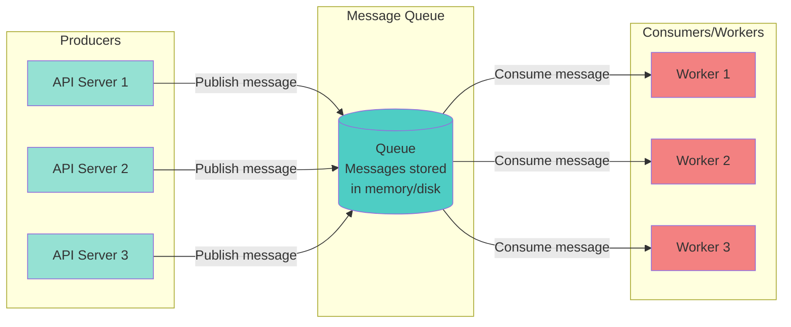
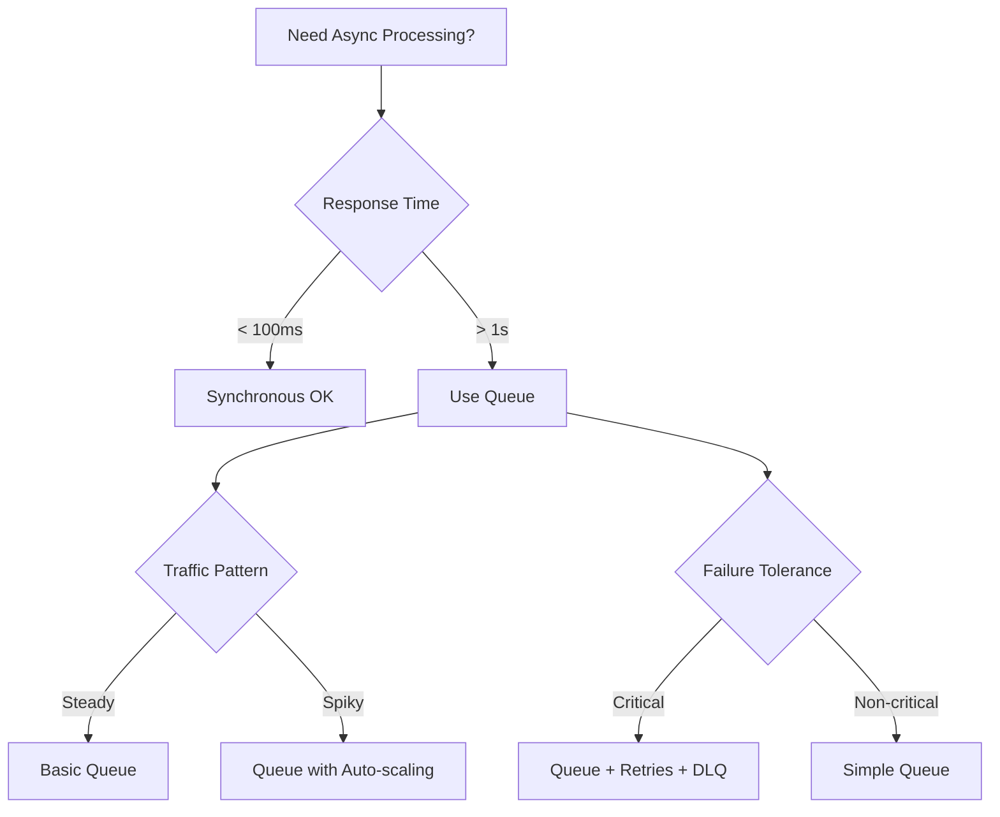

# Message Queue Basics

**Difficulty**: 🟢 Beginner
**Reading Time**: 12 minutes
**Practical Application**: Essential for any app needing async processing

## 🎯 Problem Statement

```javascript
// ❌ PROBLEM: Synchronous processing
app.post('/signup', async (req, res) => {
  // 1. Create user (50ms)
  const user = await db.createUser(req.body);

  // 2. Send welcome email (2000ms) ⏳
  await emailService.sendWelcome(user.email);

  // 3. Create analytics event (500ms)
  await analytics.track('user_signup', user);

  // 4. Send to CRM (1000ms)
  await crm.createContact(user);

  res.json({ success: true }); // Takes 3.5 seconds! 😞
});

// User waits 3.5 seconds for response
// If email service is down, entire request fails
// Can't handle traffic spikes
```

```javascript
// ✅ SOLUTION: Asynchronous with message queue
app.post('/signup', async (req, res) => {
  // 1. Create user (50ms)
  const user = await db.createUser(req.body);

  // 2. Queue background tasks (5ms)
  await queue.publish('user.signup', {
    userId: user.id,
    email: user.email
  });

  res.json({ success: true }); // Takes 55ms! ✅
});

// Background worker processes tasks asynchronously
worker.on('user.signup', async (data) => {
  await emailService.sendWelcome(data.email);
  await analytics.track('user_signup', data);
  await crm.createContact(data);
});

// Fast response to user
// Resilient to service failures
// Can scale workers independently
```

## 🌍 Real-World Context

**When you need this**:
- Slow operations (> 1 second)
- External API calls
- Email/SMS sending
- Image/video processing
- Reporting/analytics
- Traffic spikes (flash sales, viral posts)

**Real Companies**:
- **Uber**: Order processing via queues (RabbitMQ/Kafka)
- **Instagram**: Photo processing queues (resize, filters)
- **Shopify**: Order processing, inventory updates
- **Slack**: Message delivery queues

## 🏗️ Architecture

### Basic Queue System



### Message Flow

```mermaid
sequenceDiagram
    participant Client
    participant API
    participant Queue
    participant Worker
    participant EmailService

    Client->>API: POST /signup
    API->>API: Create user in DB
    API->>Queue: Publish "send_welcome_email"
    Queue-->>API: Message queued ✓
    API-->>Client: 200 OK (fast!)

    Note over Queue,Worker: Asynchronous processing

    Worker->>Queue: Poll for messages
    Queue-->>Worker: "send_welcome_email" message
    Worker->>EmailService: Send email
    EmailService-->>Worker: Email sent ✓
    Worker->>Queue: Acknowledge message
    Queue->>Queue: Delete message
```



## 💻 Implementation

### Basic Queue with BullMQ (Redis-based)

```javascript
const { Queue, Worker } = require('bullmq');
const Redis = require('ioredis');

const connection = new Redis({
  host: 'localhost',
  port: 6379
});

// Create queue
const emailQueue = new Queue('emails', { connection });

// Producer: Add job to queue
class UserController {
  async signup(req, res) {
    try {
      // Create user
      const user = await db.createUser(req.body);

      // Queue welcome email (async)
      await emailQueue.add('send-welcome', {
        userId: user.id,
        email: user.email,
        name: user.name
      }, {
        attempts: 3,              // Retry 3 times if failed
        backoff: {
          type: 'exponential',
          delay: 2000             // 2s, 4s, 8s
        },
        removeOnComplete: 100,    // Keep last 100 completed jobs
        removeOnFail: 500         // Keep last 500 failed jobs
      });

      // Quick response
      res.json({
        success: true,
        userId: user.id
      });
    } catch (error) {
      res.status(500).json({ error: error.message });
    }
  }
}

// Consumer: Process jobs from queue
const emailWorker = new Worker('emails', async (job) => {
  console.log(`Processing job ${job.id}: ${job.name}`);

  switch (job.name) {
    case 'send-welcome':
      await sendWelcomeEmail(job.data);
      break;

    case 'send-reset-password':
      await sendResetPasswordEmail(job.data);
      break;

    default:
      throw new Error(`Unknown job type: ${job.name}`);
  }
}, { connection });

async function sendWelcomeEmail(data) {
  console.log(`Sending welcome email to ${data.email}`);

  try {
    await emailService.send({
      to: data.email,
      subject: 'Welcome!',
      body: `Hello ${data.name}, welcome to our app!`
    });

    console.log(`Welcome email sent to ${data.email}`);
  } catch (error) {
    console.error(`Failed to send email: ${error.message}`);
    throw error; // Will trigger retry
  }
}

// Event listeners
emailWorker.on('completed', (job) => {
  console.log(`Job ${job.id} completed`);
});

emailWorker.on('failed', (job, err) => {
  console.error(`Job ${job.id} failed:`, err.message);
});
```

### Multiple Queues for Different Priorities

```javascript
// High priority queue (urgent emails)
const urgentQueue = new Queue('emails-urgent', {
  connection,
  defaultJobOptions: {
    priority: 1  // Higher priority
  }
});

// Normal priority queue
const normalQueue = new Queue('emails-normal', {
  connection,
  defaultJobOptions: {
    priority: 10
  }
});

// Low priority queue (newsletters)
const lowPriorityQueue = new Queue('emails-low', {
  connection,
  defaultJobOptions: {
    priority: 100
  }
});

// Route to appropriate queue
async function queueEmail(type, data) {
  switch (type) {
    case 'password-reset':
    case 'verification':
      return urgentQueue.add(type, data);

    case 'welcome':
    case 'notification':
      return normalQueue.add(type, data);

    case 'newsletter':
    case 'marketing':
      return lowPriorityQueue.add(type, data);
  }
}
```

### Batch Processing

```javascript
class BatchProcessor {
  constructor() {
    this.queue = new Queue('batch-processing', { connection });
    this.worker = new Worker('batch-processing', this.processJob, {
      connection,
      concurrency: 5  // Process 5 jobs concurrently
    });
  }

  async processJob(job) {
    const { items } = job.data;

    // Process in chunks of 100
    const chunkSize = 100;
    for (let i = 0; i < items.length; i += chunkSize) {
      const chunk = items.slice(i, i + chunkSize);

      await Promise.all(
        chunk.map(item => this.processItem(item))
      );

      // Update progress
      const progress = Math.round((i / items.length) * 100);
      await job.updateProgress(progress);
    }
  }

  async processItem(item) {
    // Process individual item
    console.log(`Processing ${item.id}`);
  }

  async addBatchJob(items) {
    return await this.queue.add('process-batch', {
      items,
      totalCount: items.length
    });
  }
}

// Usage
const processor = new BatchProcessor();
await processor.addBatchJob(largeArrayOfItems);
```

## 🎯 Queue Guarantees

### 1. At-Least-Once Delivery

```javascript
// Worker acknowledges AFTER processing
const worker = new Worker('tasks', async (job) => {
  try {
    await processTask(job.data);
    // Auto-ack on success
  } catch (error) {
    // If error thrown, job stays in queue
    // Will be retried
    throw error;
  }
}, { connection });

// Guarantees: Message processed at least once
// Caveat: Might process twice if worker crashes after processing but before ack
```

### 2. Exactly-Once Processing (Idempotency)

```javascript
// Make operations idempotent
const processedJobs = new Set();

const worker = new Worker('tasks', async (job) => {
  const jobId = job.id;

  // Check if already processed
  if (processedJobs.has(jobId)) {
    console.log(`Job ${jobId} already processed, skipping`);
    return;
  }

  // Process
  await processTask(job.data);

  // Mark as processed
  processedJobs.add(jobId);

  // In production: Use database or Redis
  await redis.setex(`processed:${jobId}`, 86400, '1');
}, { connection });

// Or use database transactions
async function processPayment(job) {
  const { orderId, amount } = job.data;

  // Use database constraint to ensure exactly-once
  try {
    await db.query(`
      INSERT INTO payments (order_id, amount, job_id, status)
      VALUES ($1, $2, $3, 'completed')
    `, [orderId, amount, job.id]);
    // UNIQUE constraint on job_id prevents duplicates
  } catch (error) {
    if (error.code === '23505') { // Duplicate key
      console.log('Payment already processed');
      return;
    }
    throw error;
  }
}
```

### 3. Message Ordering (FIFO)

```javascript
// Use same key for related messages
await queue.add('process-order', orderData, {
  jobId: `order:${orderId}`,  // Same orderId = same order
  priority: 1
});

// Messages with same key processed in order
// Different keys can be processed concurrently
```

## ⚠️ Common Pitfalls

### 1. Not Handling Failures

```javascript
// ❌ BAD: No retry logic
const worker = new Worker('tasks', async (job) => {
  await externalAPI.call(job.data); // Fails if API is down
});

// ✅ GOOD: Retry with exponential backoff
const worker = new Worker('tasks', async (job) => {
  await externalAPI.call(job.data);
}, {
  connection,
  attempts: 5,
  backoff: {
    type: 'exponential',
    delay: 1000  // 1s, 2s, 4s, 8s, 16s
  }
});

// Also handle permanent failures
worker.on('failed', async (job, err) => {
  if (job.attemptsMade >= job.opts.attempts) {
    // Move to dead letter queue
    await deadLetterQueue.add('failed-task', {
      originalJob: job.data,
      error: err.message,
      attempts: job.attemptsMade
    });
  }
});
```

### 2. Memory Leaks in Workers

```javascript
// ❌ BAD: Memory leak
const cache = {};
const worker = new Worker('tasks', async (job) => {
  // Cache grows forever!
  cache[job.id] = job.data;
  await process(job.data);
});

// ✅ GOOD: Limit cache size or use TTL
const LRU = require('lru-cache');
const cache = new LRU({ max: 1000 });

const worker = new Worker('tasks', async (job) => {
  cache.set(job.id, job.data);
  await process(job.data);
});
```

### 3. Not Monitoring Queue Depth

```javascript
class QueueMonitoring {
  constructor(queue) {
    this.queue = queue;

    // Check queue depth every minute
    setInterval(() => this.checkHealth(), 60000);
  }

  async checkHealth() {
    const counts = await this.queue.getJobCounts();

    console.log('Queue status:', {
      waiting: counts.waiting,
      active: counts.active,
      completed: counts.completed,
      failed: counts.failed,
      delayed: counts.delayed
    });

    // Alert if too many waiting jobs
    if (counts.waiting > 10000) {
      alert.send({
        severity: 'warning',
        message: `Queue backlog: ${counts.waiting} jobs waiting`,
        queue: this.queue.name
      });
    }

    // Alert if high failure rate
    const failureRate = counts.failed / (counts.completed + counts.failed);
    if (failureRate > 0.1) { // > 10% failures
      alert.send({
        severity: 'error',
        message: `High failure rate: ${(failureRate * 100).toFixed(2)}%`,
        queue: this.queue.name
      });
    }
  }

  async getMetrics() {
    const counts = await this.queue.getJobCounts();
    const waitingJobs = await this.queue.getWaiting();

    // Calculate average wait time
    const now = Date.now();
    const avgWaitTime = waitingJobs.reduce((sum, job) => {
      return sum + (now - job.timestamp);
    }, 0) / waitingJobs.length || 0;

    return {
      ...counts,
      avgWaitTime: Math.round(avgWaitTime / 1000) + 's',
      throughput: this.calculateThroughput()
    };
  }

  calculateThroughput() {
    // Jobs processed per minute
    // Implementation depends on your metrics store
  }
}
```

## 🏢 Real-World Example: E-Commerce Order Processing

```javascript
class OrderProcessing {
  constructor() {
    this.orderQueue = new Queue('orders', { connection });

    this.worker = new Worker('orders', this.processOrder.bind(this), {
      connection,
      concurrency: 10,  // Process 10 orders concurrently
      limiter: {
        max: 100,        // Max 100 jobs
        duration: 60000  // Per 60 seconds (rate limiting)
      }
    });
  }

  async createOrder(orderData) {
    // Save order to database
    const order = await db.createOrder(orderData);

    // Queue for async processing
    await this.orderQueue.add('process-order', {
      orderId: order.id,
      userId: orderData.userId,
      items: orderData.items,
      total: orderData.total
    }, {
      priority: order.isPriority ? 1 : 10,
      attempts: 3
    });

    return order;
  }

  async processOrder(job) {
    const { orderId, userId, items, total } = job.data;

    console.log(`Processing order ${orderId}`);

    // Step 1: Charge payment (20%)
    await job.updateProgress(20);
    await this.chargePayment(userId, total);

    // Step 2: Update inventory (40%)
    await job.updateProgress(40);
    await this.updateInventory(items);

    // Step 3: Send to fulfillment (60%)
    await job.updateProgress(60);
    await this.sendToFulfillment(orderId);

    // Step 4: Send confirmation email (80%)
    await job.updateProgress(80);
    await this.sendConfirmationEmail(userId, orderId);

    // Step 5: Update analytics (100%)
    await job.updateProgress(100);
    await this.trackOrderEvent(orderId);

    console.log(`Order ${orderId} processed successfully`);
  }

  async chargePayment(userId, amount) {
    // Call payment gateway
    await paymentGateway.charge(userId, amount);
  }

  async updateInventory(items) {
    // Update stock levels
    for (const item of items) {
      await db.query(
        'UPDATE products SET stock = stock - $1 WHERE id = $2',
        [item.quantity, item.productId]
      );
    }
  }

  async sendToFulfillment(orderId) {
    // Call warehouse API
    await warehouseAPI.createShipment(orderId);
  }

  async sendConfirmationEmail(userId, orderId) {
    const user = await db.getUser(userId);
    await emailService.send({
      to: user.email,
      subject: 'Order Confirmed',
      template: 'order-confirmation',
      data: { orderId }
    });
  }

  async trackOrderEvent(orderId) {
    await analytics.track('order_completed', { orderId });
  }
}

// Usage
const orderProcessing = new OrderProcessing();

app.post('/orders', async (req, res) => {
  const order = await orderProcessing.createOrder(req.body);

  res.json({
    success: true,
    orderId: order.id,
    message: 'Order is being processed'
  });
});
```

## 📊 When to Use Message Queues



## 🎓 Key Takeaways

1. ✅ **Queues decouple services** - Producers and consumers independent
2. ✅ **Handle traffic spikes** - Queue buffers requests
3. ✅ **Improve reliability** - Retry failed jobs automatically
4. ✅ **Scale independently** - Add more workers as needed
5. ✅ **Make operations idempotent** - Handle duplicate processing
6. ✅ **Monitor queue depth** - Alert on backlog

## 🔗 Next Steps

- [Dead Letter Queues](./05-dead-letter-queue.md) - Handle failed messages
- [Pub/Sub Pattern](./06-pub-sub.md) - Event-driven architecture
- [Retry Strategies](./09-retry-strategies.md) - Exponential backoff

## 📚 Further Reading

- BullMQ Documentation: https://docs.bullmq.io/
- RabbitMQ Tutorials: https://www.rabbitmq.com/getstarted.html
- AWS SQS: https://docs.aws.amazon.com/sqs/
- Apache Kafka: https://kafka.apache.org/documentation/
