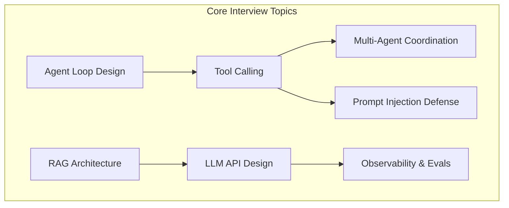
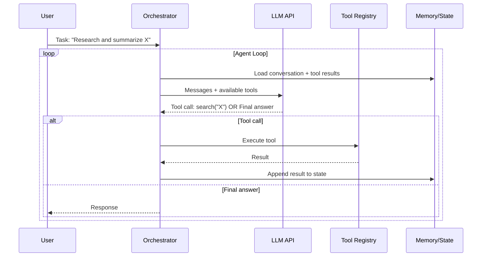
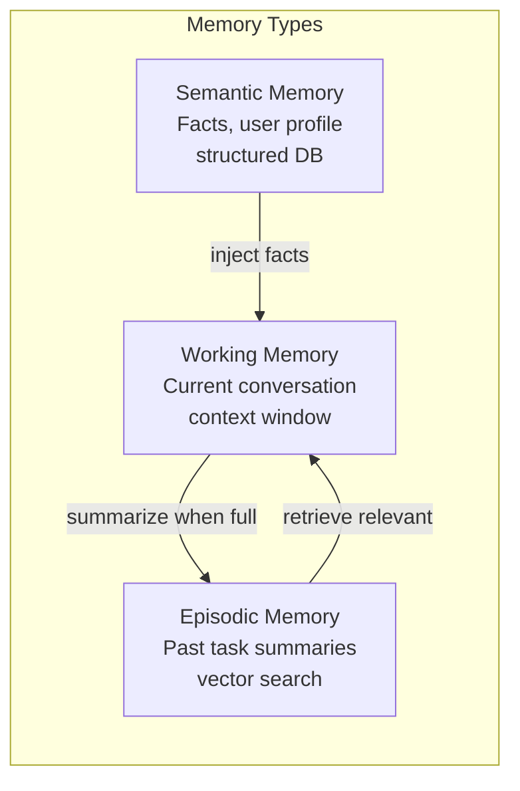

# AI Agents Interview Section Implementation Plan

> **For agentic workers:** REQUIRED SUB-SKILL: Use superpowers:subagent-driven-development (recommended) or superpowers:executing-plans to implement this plan task-by-task. Steps use checkbox (`- [ ]`) syntax for tracking.

**Goal:** Create a comprehensive AI Agents & LLM Systems interview preparation section in `12-interview-prep/system-design/ai-and-agents/` with 8 interview Q&A articles covering agent loop design, tool calling, multi-agent coordination, RAG, LLM API design, observability, and prompt injection defense.

**Architecture:** Each article follows the standard interview prep format: problem statement, clarifying questions, high-level architecture (Mermaid diagram), key components deep-dive, trade-offs table, real-world examples, and common pitfalls. Articles live in a new `ai-and-agents/` subdirectory and are wired into the existing `12-interview-prep` navigation.

**Tech Stack:** Markdown with Mermaid diagrams, Nextra 4 `_meta.js` navigation config

---

## File Map

| File | Action |
|------|--------|
| `content/12-interview-prep/system-design/ai-and-agents/_meta.js` | Create |
| `content/12-interview-prep/system-design/ai-and-agents/overview.md` | Create |
| `content/12-interview-prep/system-design/ai-and-agents/agent-loop-design.md` | Create |
| `content/12-interview-prep/system-design/ai-and-agents/tool-calling-patterns.md` | Create |
| `content/12-interview-prep/system-design/ai-and-agents/multi-agent-coordination.md` | Create |
| `content/12-interview-prep/system-design/ai-and-agents/rag-architecture.md` | Create |
| `content/12-interview-prep/system-design/ai-and-agents/llm-api-design.md` | Create |
| `content/12-interview-prep/system-design/ai-and-agents/agent-observability.md` | Create |
| `content/12-interview-prep/system-design/ai-and-agents/prompt-injection-defense.md` | Create |
| `content/12-interview-prep/system-design/_meta.js` | Modify — add `ai-and-agents` |
| `content/12-interview-prep/index.md` | Modify — add AI Agents section link |

---

### Task 1: Create the `ai-and-agents` directory and `_meta.js`

**Files:**
- Create: `content/12-interview-prep/system-design/ai-and-agents/_meta.js`

- [ ] **Step 1: Read the current `12-interview-prep/system-design/_meta.js`**

Understand the current navigation structure before adding to it.

- [ ] **Step 2: Create the `_meta.js` for the new section**

```js
// content/12-interview-prep/system-design/ai-and-agents/_meta.js
export default {
  overview: "Overview",
  "agent-loop-design": "Agent Loop Design",
  "tool-calling-patterns": "Tool Calling & Function Schemas",
  "multi-agent-coordination": "Multi-Agent Coordination",
  "rag-architecture": "RAG Architecture",
  "llm-api-design": "Designing APIs on LLMs",
  "agent-observability": "Agent Observability & Evals",
  "prompt-injection-defense": "Prompt Injection Defense"
}
```

- [ ] **Step 3: Add `ai-and-agents` to `12-interview-prep/system-design/_meta.js`**

Read the file, then add `"ai-and-agents": "🤖 AI Agents & LLM Systems"` — add it after `scale-and-reliability` (or as a logical last entry before any separator).

- [ ] **Step 4: Commit**

```bash
git add docs-site/content/12-interview-prep/system-design/ai-and-agents/_meta.js
git add docs-site/content/12-interview-prep/system-design/_meta.js
git commit -m "feat(interview-prep): Scaffold AI Agents section navigation"
```

---

### Task 2: Create `overview.md` for the AI Agents section

**Files:**
- Create: `content/12-interview-prep/system-design/ai-and-agents/overview.md`

- [ ] **Step 1: Create the overview file**

```markdown
---
title: "AI Agents & LLM Systems — Interview Questions"
description: "System design interview questions for AI agent architectures, RAG systems, tool-calling APIs, and LLM-powered applications"
---

# AI Agents & LLM Systems

> Interview questions covering the design and operation of AI agent systems, RAG pipelines, tool-calling frameworks, and production LLM APIs.

## Why This Matters in Interviews

As LLM-powered products become mainstream, system design rounds increasingly include questions about:
- How do you design a reliable agent that calls tools and handles failures?
- How do you build a RAG system that scales to millions of documents?
- How do you rate-limit and cache calls to expensive LLM APIs?
- How do you detect prompt injection attacks in a customer-facing chatbot?



## Questions in This Section

| Question | Key Concepts | Difficulty |
|----------|-------------|------------|
| [Agent Loop Design](agent-loop-design) | Perception-action loop, state, retries | 🟡 Intermediate |
| [Tool Calling & Function Schemas](tool-calling-patterns) | Function calling, schema validation, safety | 🟡 Intermediate |
| [Multi-Agent Coordination](multi-agent-coordination) | Orchestrator/worker, state sharing, fan-out | 🔴 Advanced |
| [RAG Architecture](rag-architecture) | Vector search, chunking, retrieval, reranking | 🟡 Intermediate |
| [Designing APIs on LLMs](llm-api-design) | Rate limiting, caching, fallbacks, cost control | 🔴 Advanced |
| [Agent Observability & Evals](agent-observability) | Tracing, prompt versioning, LLM-as-judge | 🔴 Advanced |
| [Prompt Injection Defense](prompt-injection-defense) | Attack vectors, mitigations, sandboxing | 🔴 Advanced |

## Interview Strategy for AI/LLM Questions

1. **Clarify the reliability requirement** — is this a user-facing chatbot (low tolerance for failure) or a background processing pipeline (can retry)?
2. **Acknowledge non-determinism** — LLMs are not deterministic; design for retries, validation, and fallbacks from the start
3. **Discuss cost** — LLM API calls are expensive; show you know about caching, batching, and model tiering
4. **Know the CAP trade-off for agents** — between latency (synchronous tool calls) and throughput (parallel tool calls)
5. **Mention observability** — production AI needs evals and tracing, not just logs
```

- [ ] **Step 2: Commit**

```bash
git add docs-site/content/12-interview-prep/system-design/ai-and-agents/overview.md
git commit -m "feat(interview-prep): Add AI Agents overview page"
```

---

### Task 3: Create `agent-loop-design.md`

**Files:**
- Create: `content/12-interview-prep/system-design/ai-and-agents/agent-loop-design.md`

- [ ] **Step 1: Create the file**

The article must cover: problem statement, clarifying questions the interviewer expects, high-level architecture with Mermaid diagram, key components, trade-offs, real examples (AutoGPT, Claude Code, GitHub Copilot Workspace), common pitfalls.

```markdown
---
title: "Design an AI Agent Loop"
description: "System design interview: how to design a reliable perception-action loop for an AI agent"
---

# Design an AI Agent Loop

> **Interview question:** "Design a system where an AI agent can autonomously complete multi-step tasks — it can read files, call APIs, and write code."

## Clarifying Questions

Before diving in, ask the interviewer:
- What's the latency budget? (< 1s per step? Or async batch OK?)
- How many concurrent agents? (1 user, 1 agent? Or thousands of parallel agents?)
- What tools does the agent have? (web search, code execution, database queries?)
- How do we handle tool failures? (retry? fallback? abort?)
- Is there a human in the loop? (approval gates, or fully autonomous?)

## High-Level Architecture



## Core Components

### 1. Orchestrator
The central loop controller. Responsibilities:
- Maintain conversation state across turns
- Route LLM output to tool executor or output handler
- Enforce max-steps limit (prevent infinite loops)
- Handle retries on LLM API failures

**Key design choice:** Stateless vs stateful orchestrator
- **Stateless** (state in DB/Redis): scales horizontally, survives crashes. Preferred for production.
- **Stateful** (in-process): simpler, lower latency. OK for single-user dev tools.

### 2. Tool Registry
Catalog of callable tools with:
- Name + description (given to LLM for selection)
- Input/output JSON schema
- Rate limit + timeout per tool
- Safety classification (read-only vs write vs destructive)

### 3. State / Memory


### 4. Safety Layer
- **Max steps**: hard limit (e.g., 20 turns) to prevent infinite loops
- **Tool allowlist**: per-agent scope (agent A can only read, not write)
- **Output validation**: verify tool call schema before execution
- **Human approval gate**: for destructive tools (delete, send email, deploy)

## Trade-offs

| Approach | Latency | Reliability | Complexity |
|----------|---------|-------------|------------|
| Sequential tool calls | Low | High (easy to debug) | Low |
| Parallel tool calls | Very low | Medium (partial failures) | High |
| Hierarchical agents | Medium | High (sub-agents isolated) | Very High |
| Single large context | Low | Low (context overflow) | Low |

## Key Numbers to Know
- GPT-4o context: **128K tokens** (~96K words)
- Claude 3.5 context: **200K tokens**
- Typical tool call latency: **200ms–2s**
- LLM API p99 latency: **5–30s** (budget for timeouts)

## Real-World Examples
- **Claude Code**: stateless orchestrator, tools are bash/editor/grep, state in conversation history
- **GitHub Copilot Workspace**: multi-step with human approval gates before code execution
- **AutoGPT**: early pioneering design; showed value but also the infinite-loop failure mode

## Common Pitfalls

1. **No max-steps limit** → agent loops forever, burns API budget
2. **Trusting LLM tool schemas without validation** → malformed calls crash tool executor
3. **Storing full conversation in DB** → conversation grows unbounded, context overflows
4. **No timeout on tool calls** → agent blocks waiting for a hung subprocess
5. **Destructive tools without confirmation** → agent deletes production data
```

- [ ] **Step 2: Commit**

```bash
git add docs-site/content/12-interview-prep/system-design/ai-and-agents/agent-loop-design.md
git commit -m "feat(interview-prep): Add agent loop design interview article"
```

---

### Task 4: Create `tool-calling-patterns.md`

**Files:**
- Create: `content/12-interview-prep/system-design/ai-and-agents/tool-calling-patterns.md`

- [ ] **Step 1: Create the file**

Cover: function calling spec, tool schema design, parallel vs sequential, safety, schema validation, error handling.

Include a Mermaid diagram showing the function calling flow (User → LLM → tool call JSON → executor → result → LLM → answer), a trade-offs table (parallel vs sequential tool calls), and a schema example. Cover real examples (OpenAI function calling, Anthropic tool use, LangChain tools) and pitfalls (over-broad schemas, missing error handling, injection via tool results).

- [ ] **Step 2: Commit**

```bash
git add docs-site/content/12-interview-prep/system-design/ai-and-agents/tool-calling-patterns.md
git commit -m "feat(interview-prep): Add tool calling patterns interview article"
```

---

### Task 5: Create `multi-agent-coordination.md`

**Files:**
- Create: `content/12-interview-prep/system-design/ai-and-agents/multi-agent-coordination.md`

- [ ] **Step 1: Create the file**

Cover: orchestrator/worker pattern, state sharing approaches (shared DB vs message queue vs shared context), fan-out/fan-in, conflict resolution, sub-agent isolation.

Include:
- Mermaid diagram showing orchestrator spawning sub-agents and collecting results
- Comparison table: single-agent vs multi-agent vs hierarchical
- State sharing options: Redis pub/sub, message queue, shared DB
- Real examples: AutoGPT, CrewAI, multi-agent Claude Code
- Pitfalls: agent deadlock, state corruption, unbounded fan-out

- [ ] **Step 2: Commit**

```bash
git add docs-site/content/12-interview-prep/system-design/ai-and-agents/multi-agent-coordination.md
git commit -m "feat(interview-prep): Add multi-agent coordination interview article"
```

---

### Task 6: Create `rag-architecture.md`

**Files:**
- Create: `content/12-interview-prep/system-design/ai-and-agents/rag-architecture.md`

- [ ] **Step 1: Create the file**

Cover: ingestion pipeline (chunk, embed, store), retrieval pipeline (embed query, ANN search, rerank), context injection, evaluation.

Include:
- Mermaid diagram of full RAG pipeline: Document → Chunker → Embedder → Vector DB → Retriever → Reranker → LLM
- Table comparing chunking strategies (fixed-size, semantic, document-level)
- Table comparing vector DBs (Pinecone, Weaviate, pgvector, Chroma)
- Key numbers: embedding dimensions (1536 for OpenAI), ANN latency (~5ms), typical chunk size (512 tokens)
- Pitfalls: chunks too large (dilutes relevance), no reranking (retrieves wrong chunks), stale embeddings after doc update

- [ ] **Step 2: Commit**

```bash
git add docs-site/content/12-interview-prep/system-design/ai-and-agents/rag-architecture.md
git commit -m "feat(interview-prep): Add RAG architecture interview article"
```

---

### Task 7: Create `llm-api-design.md`

**Files:**
- Create: `content/12-interview-prep/system-design/ai-and-agents/llm-api-design.md`

- [ ] **Step 1: Create the file**

Cover: designing an API layer on top of LLMs for production. Rate limiting (per user, per model tier), caching (semantic caching with embedding similarity), fallback chains (GPT-4 → GPT-3.5 → cached response), cost control, streaming responses.

Include:
- Mermaid diagram: Client → API Gateway → Rate Limiter → Semantic Cache → LLM Router → Model APIs
- Cost comparison table (GPT-4o vs GPT-3.5 vs Claude Haiku per 1M tokens)
- Semantic cache design (embed request → cosine similarity → return if > 0.95)
- Fallback chain pattern
- Pitfalls: no caching (costs spiral), per-IP rate limiting (easily bypassed), no timeout (hangs), synchronous streaming breaks load balancers

- [ ] **Step 2: Commit**

```bash
git add docs-site/content/12-interview-prep/system-design/ai-and-agents/llm-api-design.md
git commit -m "feat(interview-prep): Add LLM API design interview article"
```

---

### Task 8: Create `agent-observability.md`

**Files:**
- Create: `content/12-interview-prep/system-design/ai-and-agents/agent-observability.md`

- [ ] **Step 1: Create the file**

Cover: tracing agent runs (span per tool call), prompt versioning, LLM-as-judge evals, cost tracking, latency dashboards.

Include:
- Mermaid diagram: Agent Run → Trace (spans for each tool call + LLM call) → Observability Platform
- Table: traditional observability vs LLM observability (what's different)
- Eval approaches: human eval, LLM-as-judge, rule-based, golden datasets
- Real tools: LangSmith, Helicone, Weights & Biases, OpenTelemetry + Jaeger
- Pitfalls: logging full prompts (PII risk), no cost attribution per feature, ignoring latency percentiles

- [ ] **Step 2: Commit**

```bash
git add docs-site/content/12-interview-prep/system-design/ai-and-agents/agent-observability.md
git commit -m "feat(interview-prep): Add agent observability interview article"
```

---

### Task 9: Create `prompt-injection-defense.md`

**Files:**
- Create: `content/12-interview-prep/system-design/ai-and-agents/prompt-injection-defense.md`

- [ ] **Step 1: Create the file**

Cover: direct injection (user manipulates system prompt), indirect injection (malicious content in tool results/retrieved docs), defenses.

Include:
- Mermaid diagram showing attack vectors: User input → Direct injection; Tool result → Indirect injection; Retrieved document → RAG injection
- Attack examples (actual injection strings, sanitized)
- Defense table: input validation, sandboxed tool execution, output validation, privilege separation, human-in-the-loop for sensitive actions
- Real incidents: Bing Chat hijack, LLM email exfiltration demos
- Pitfalls: trusting user-controlled system prompt, injecting untrusted web content directly into context, no output validation before executing agent decisions

- [ ] **Step 2: Commit**

```bash
git add docs-site/content/12-interview-prep/system-design/ai-and-agents/prompt-injection-defense.md
git commit -m "feat(interview-prep): Add prompt injection defense interview article"
```

---

### Task 10: Update `12-interview-prep/index.md` to include AI Agents section

**Files:**
- Modify: `content/12-interview-prep/index.md`

- [ ] **Step 1: Read the current index.md**

Understand the current structure of the interview prep landing page.

- [ ] **Step 2: Add AI Agents to the navigation table**

Find the "Quick Navigation by Topic" table and add a row:
```markdown
| AI/LLM Agent questions | [AI Agents & LLM Systems](./system-design/ai-and-agents/) | [13-agent-workflows](/13-agent-workflows) |
```

Also add a bullet under the "Sections" heading pointing to the new section.

- [ ] **Step 3: Final commit**

```bash
git add docs-site/content/12-interview-prep/index.md
git commit -m "feat(interview-prep): Wire AI Agents section into interview prep index"
```
