# Diagrams Batch 1 Implementation Plan

> **For agentic workers:** REQUIRED SUB-SKILL: Use superpowers:subagent-driven-development (recommended) or superpowers:executing-plans to implement this plan task-by-task. Steps use checkbox (`- [ ]`) syntax for tracking.

**Goal:** Add Mermaid diagrams to all content files in sections 01–06 and `problems-at-scale` that currently lack diagrams. These are primarily `overview.md` and `index.md` files.

**Architecture:** Each file gets a contextually appropriate Mermaid diagram — architecture diagrams for index/overview pages (showing the section's topic map), and flow/sequence diagrams for specific concept overviews. The diagram explains what the section contains and how its parts relate.

**Tech Stack:** Markdown, Mermaid (supported natively by Nextra 4)

---

## Files to Update (Batch 1)

### Sections 01–06 Overview & Index Files
- `content/01-databases/index.md`
- `content/01-databases/concepts/overview.md`
- `content/01-databases/failures/overview.md`
- `content/01-databases/hands-on/overview.md`
- `content/01-databases/hands-on/database-archival-poc.md`
- `content/02-caching/index.md`
- `content/02-caching/concepts/overview.md`
- `content/02-caching/failures/overview.md`
- `content/02-caching/hands-on/overview.md`
- `content/03-redis/index.md`
- `content/03-redis/concepts/overview.md`
- `content/03-redis/failures/overview.md`
- `content/03-redis/hands-on/overview.md`
- `content/04-messaging/index.md`
- `content/04-messaging/concepts/overview.md`
- `content/04-messaging/failures/overview.md`
- `content/04-messaging/hands-on/overview.md`
- `content/05-distributed-systems/index.md`
- `content/05-distributed-systems/concepts/overview.md`
- `content/05-distributed-systems/failures/overview.md`
- `content/06-scalability/index.md`
- `content/06-scalability/concepts/overview.md`
- `content/06-scalability/failures/overview.md`
- `content/06-scalability/hands-on/overview.md`

### Problems at Scale Files
- `content/problems-at-scale/index.md`
- `content/problems-at-scale/availability/overview.md`
- `content/problems-at-scale/concurrency/overview.md`
- `content/problems-at-scale/consistency/overview.md`
- `content/problems-at-scale/cost-optimization/overview.md`
- `content/problems-at-scale/data-integrity/overview.md`
- `content/problems-at-scale/performance/overview.md`
- `content/problems-at-scale/scalability/overview.md`

---

### Task 1: Add diagrams to `01-databases` overview files

**Files:**
- Modify: `content/01-databases/index.md`
- Modify: `content/01-databases/concepts/overview.md`
- Modify: `content/01-databases/failures/overview.md`
- Modify: `content/01-databases/hands-on/overview.md`

- [ ] **Step 1: Read each file to understand current content**

Read all four files before making any edits.

- [ ] **Step 2: Add diagram to `01-databases/index.md`**

After the intro paragraph, add a section map diagram:

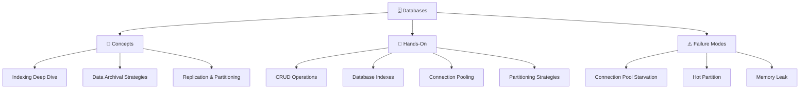

- [ ] **Step 3: Add diagram to `01-databases/concepts/overview.md`**

Add a concept map showing how database concepts relate:

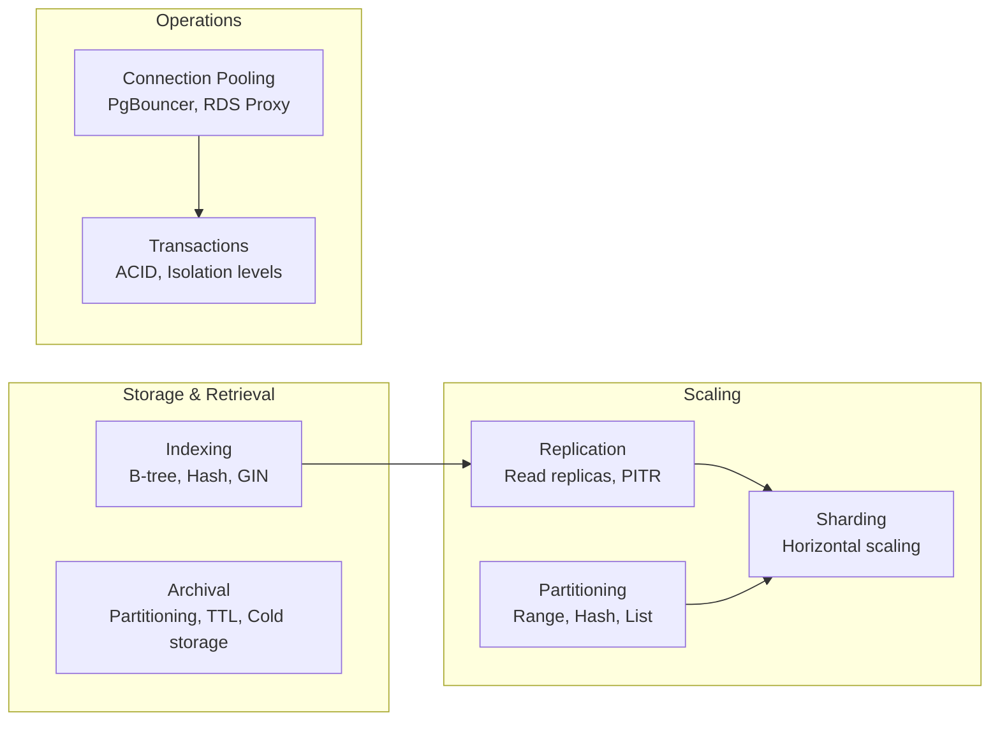

- [ ] **Step 4: Add diagram to `01-databases/failures/overview.md`**

Add a failure mode categorization diagram:

```mermaid
graph TD
    subgraph "Resource Exhaustion"
        CPS[Connection Pool Starvation\n"Too many clients" error]
        ML[Memory Leak\nQuery results not released]
    end
    subgraph "Distribution Problems"
        HP[Hot Partition\nAll writes to one shard]
        SR[Stale Reads\nReplica lag]
    end

    CPS -->|fix| F1[Increase pool size\nAdd PgBouncer]
    ML -->|fix| F2[Audit long-running\nqueries]
    HP -->|fix| F3[Better partition key\nConsistent hashing]
    SR -->|fix| F4[Route reads to primary\nfor consistency]
```

- [ ] **Step 5: Add diagram to `01-databases/hands-on/overview.md`**

Add a learning path diagram showing POC progression:

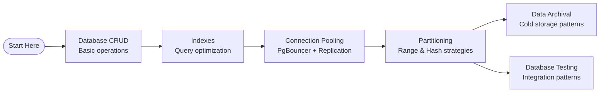

- [ ] **Step 6: Commit**

```bash
git add docs-site/content/01-databases/
git commit -m "feat(diagrams): Add Mermaid diagrams to 01-databases overview files"
```

---

### Task 2: Add diagrams to `02-caching` and `03-redis` overview files

**Files:**
- Modify: `content/02-caching/index.md`
- Modify: `content/02-caching/concepts/overview.md`
- Modify: `content/02-caching/failures/overview.md`
- Modify: `content/02-caching/hands-on/overview.md`
- Modify: `content/03-redis/index.md`
- Modify: `content/03-redis/concepts/overview.md`
- Modify: `content/03-redis/failures/overview.md`
- Modify: `content/03-redis/hands-on/overview.md`

- [ ] **Step 1: Read all files**

- [ ] **Step 2: Add diagram to `02-caching/index.md`**

Show caching layer in system architecture:

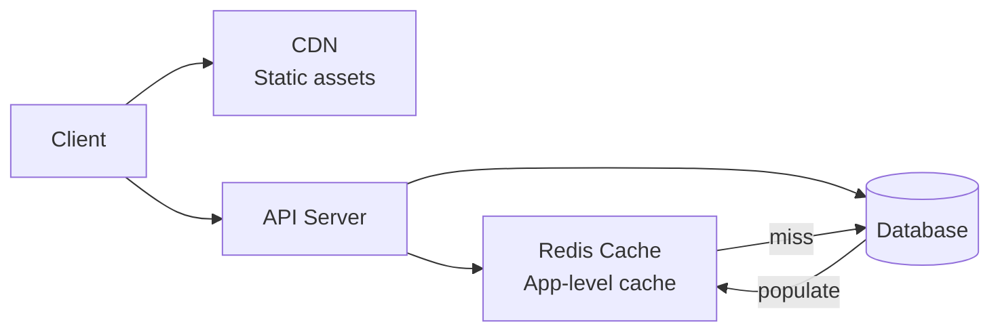

- [ ] **Step 3: Add diagram to `02-caching/concepts/overview.md`**

Show caching strategy decision tree:

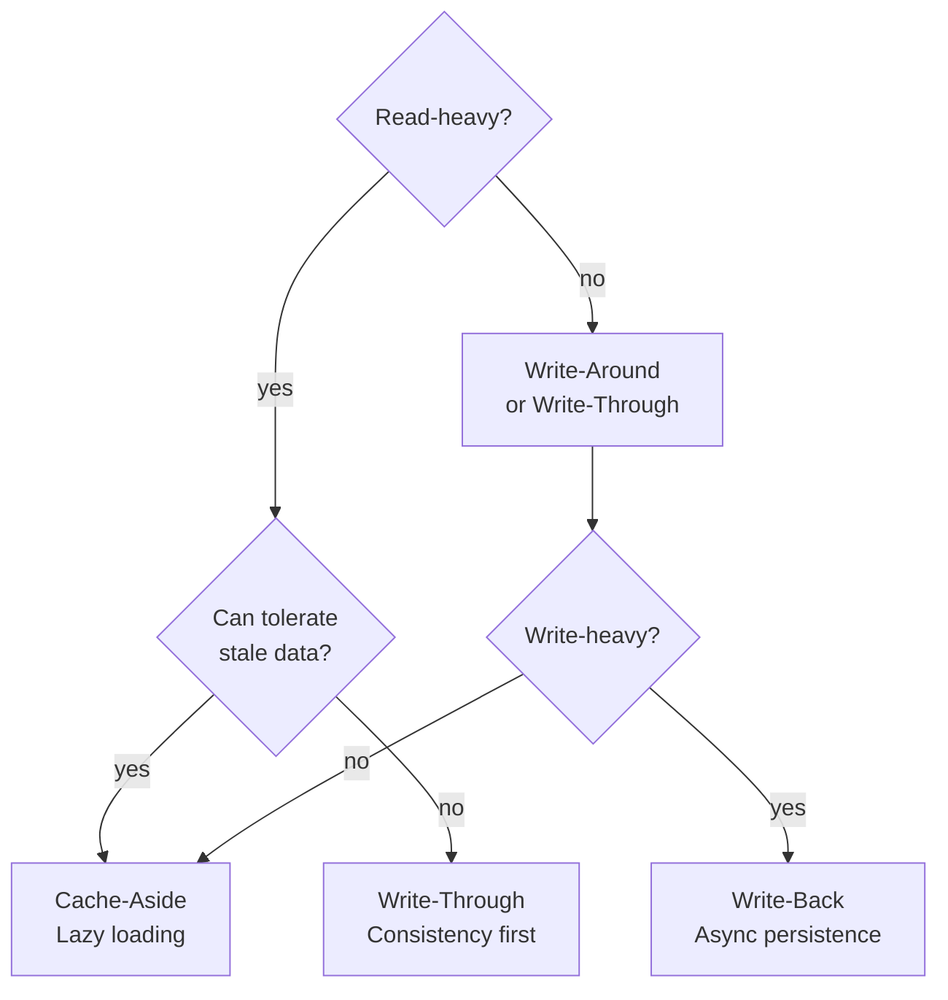

- [ ] **Step 4: Add diagram to `02-caching/failures/overview.md`**

Show cache failure modes:

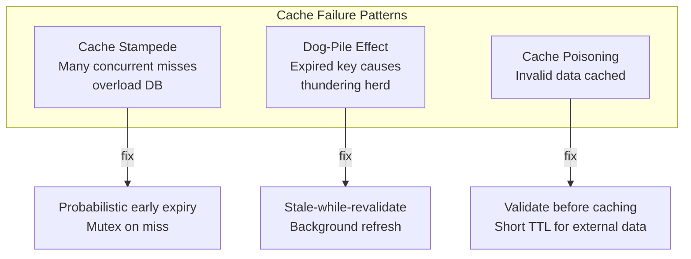

- [ ] **Step 5: Add diagrams to `03-redis` overview files**

For `03-redis/index.md`, show Redis data structure landscape:
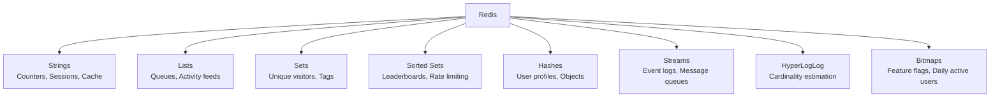

For `03-redis/concepts/overview.md`, show Redis conceptual areas.
For `03-redis/failures/overview.md`, show Redis failure modes (OOM, key eviction, replica lag).
For `03-redis/hands-on/overview.md`, show POC learning path.

- [ ] **Step 6: Commit**

```bash
git add docs-site/content/02-caching/ docs-site/content/03-redis/
git commit -m "feat(diagrams): Add Mermaid diagrams to 02-caching and 03-redis overview files"
```

---

### Task 3: Add diagrams to `04-messaging` and `05-distributed-systems` overview files

**Files:**
- Modify: `content/04-messaging/index.md`
- Modify: `content/04-messaging/concepts/overview.md`
- Modify: `content/04-messaging/failures/overview.md`
- Modify: `content/04-messaging/hands-on/overview.md`
- Modify: `content/05-distributed-systems/index.md`
- Modify: `content/05-distributed-systems/concepts/overview.md`
- Modify: `content/05-distributed-systems/failures/overview.md`

- [ ] **Step 1: Read all files**

- [ ] **Step 2: Add diagrams to `04-messaging` files**

For `04-messaging/index.md`, show message passing architecture:
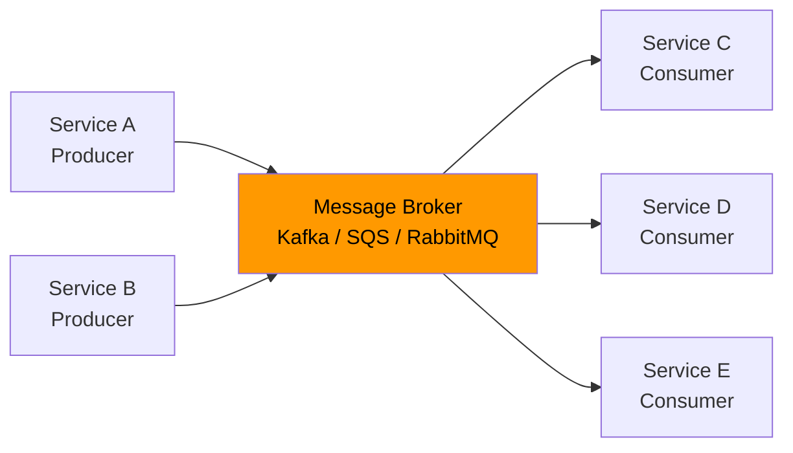

For `04-messaging/concepts/overview.md`, show messaging pattern spectrum from point-to-point to event streaming.

For `04-messaging/failures/overview.md`, show failure modes: duplicate messages, out-of-order, message loss.

For `04-messaging/hands-on/overview.md`, show Kafka learning progression.

- [ ] **Step 3: Add diagrams to `05-distributed-systems` files**

For `05-distributed-systems/index.md`, show CAP theorem triangle:
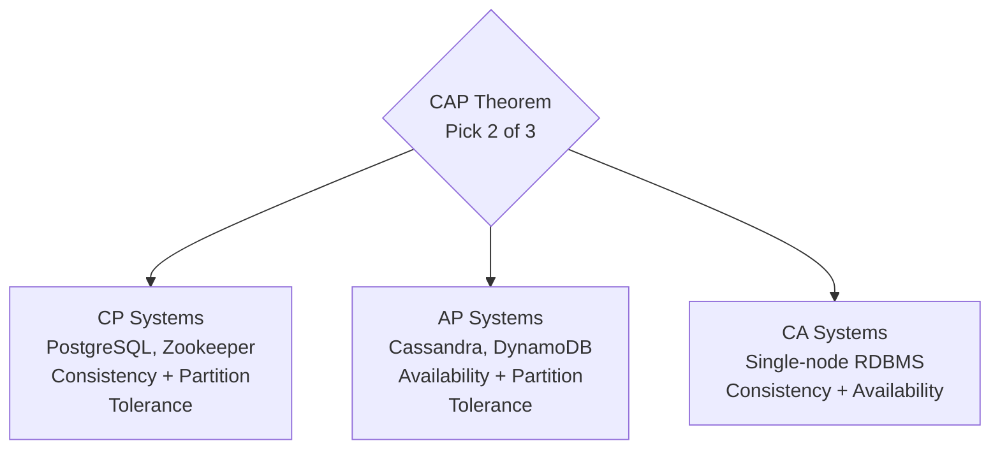

For `05-distributed-systems/concepts/overview.md`, show consensus and distributed system topics.
For `05-distributed-systems/failures/overview.md`, show common distributed failure modes.

- [ ] **Step 4: Commit**

```bash
git add docs-site/content/04-messaging/ docs-site/content/05-distributed-systems/
git commit -m "feat(diagrams): Add Mermaid diagrams to 04-messaging and 05-distributed-systems overview files"
```

---

### Task 4: Add diagrams to `06-scalability` overview files

**Files:**
- Modify: `content/06-scalability/index.md`
- Modify: `content/06-scalability/concepts/overview.md`
- Modify: `content/06-scalability/failures/overview.md`
- Modify: `content/06-scalability/hands-on/overview.md`

- [ ] **Step 1: Read all files**

- [ ] **Step 2: Add diagram to `06-scalability/index.md`**

Show scalability dimensions:
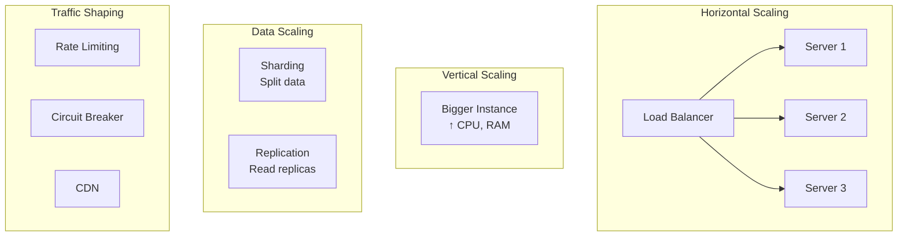

- [ ] **Step 3: Add diagrams to remaining 06-scalability overview files**

For `06-scalability/concepts/overview.md`, show concept relationships.
For `06-scalability/failures/overview.md`, show scaling failure patterns (thundering herd, hotspot, resource exhaustion).
For `06-scalability/hands-on/overview.md`, show POC progression.

- [ ] **Step 4: Commit**

```bash
git add docs-site/content/06-scalability/
git commit -m "feat(diagrams): Add Mermaid diagrams to 06-scalability overview files"
```

---

### Task 5: Add diagrams to `problems-at-scale` overview files

**Files:**
- Modify: `content/problems-at-scale/index.md`
- Modify: `content/problems-at-scale/availability/overview.md`
- Modify: `content/problems-at-scale/concurrency/overview.md`
- Modify: `content/problems-at-scale/consistency/overview.md`
- Modify: `content/problems-at-scale/cost-optimization/overview.md`
- Modify: `content/problems-at-scale/data-integrity/overview.md`
- Modify: `content/problems-at-scale/performance/overview.md`
- Modify: `content/problems-at-scale/scalability/overview.md`

- [ ] **Step 1: Read all files**

- [ ] **Step 2: Add diagram to `problems-at-scale/index.md`**

Show problem taxonomy:
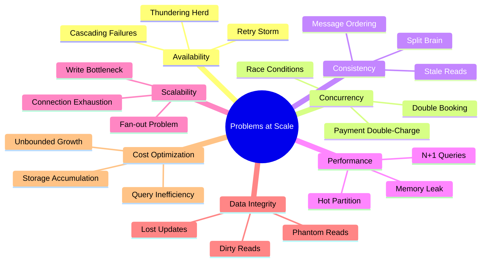

- [ ] **Step 3: Add diagrams to each category overview**

For each category overview, add a diagram showing:
- The specific problems in that category
- A brief flow showing how the problem occurs and its fix

Example for `availability/overview.md`:
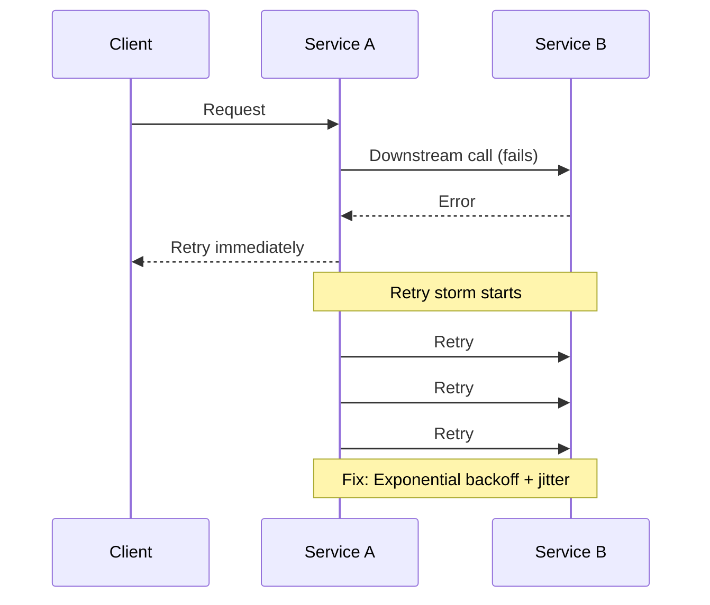

- [ ] **Step 4: Commit**

```bash
git add docs-site/content/problems-at-scale/
git commit -m "feat(diagrams): Add Mermaid diagrams to problems-at-scale overview files"
```

---

### Task 6: Add diagram to `01-databases/hands-on/database-archival-poc.md`

**Files:**
- Modify: `content/01-databases/hands-on/database-archival-poc.md`

- [ ] **Step 1: Read the file**

- [ ] **Step 2: Add appropriate diagram**

Add an archival pipeline diagram showing: Hot DB → Archive job → Cold storage (S3 / archive table) → Query router.

- [ ] **Step 3: Commit**

```bash
git add docs-site/content/01-databases/hands-on/database-archival-poc.md
git commit -m "feat(diagrams): Add archival pipeline diagram to database-archival-poc.md"
```
