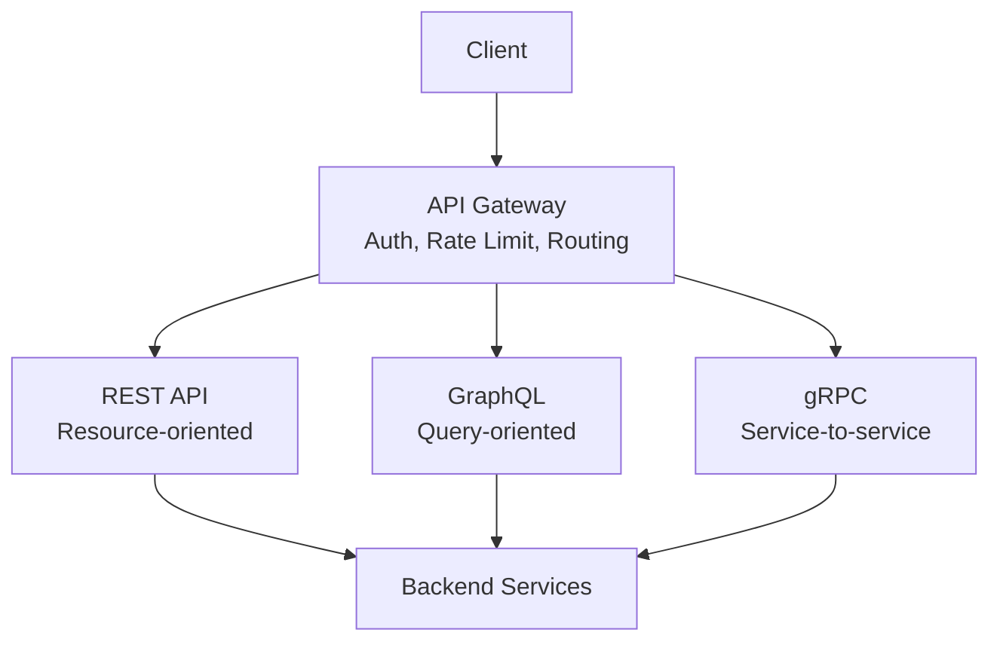
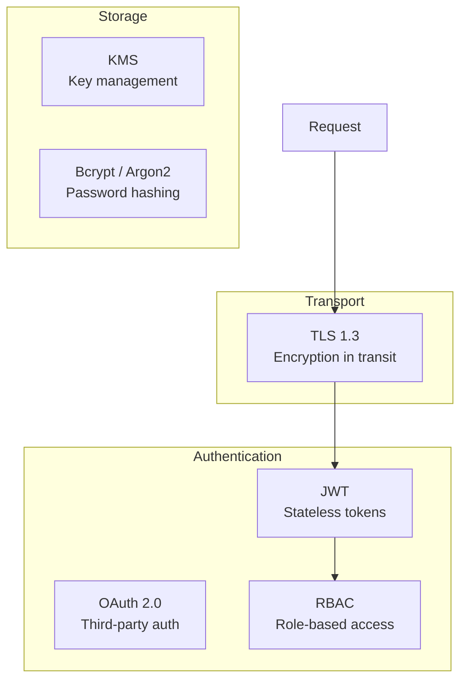
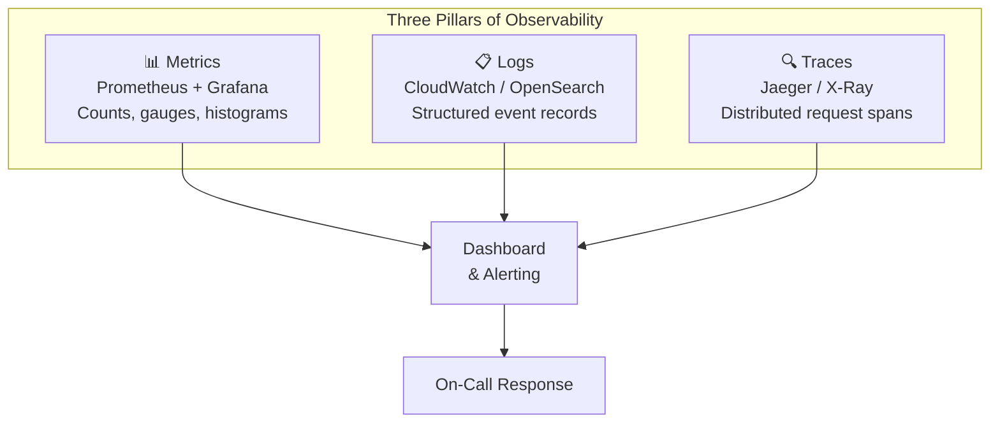
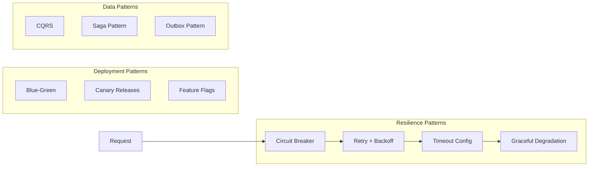
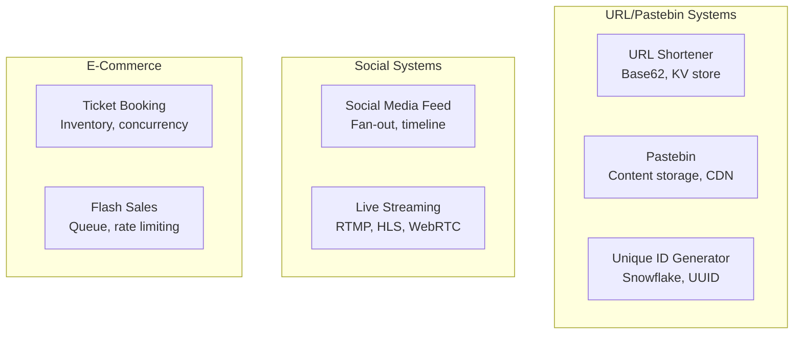
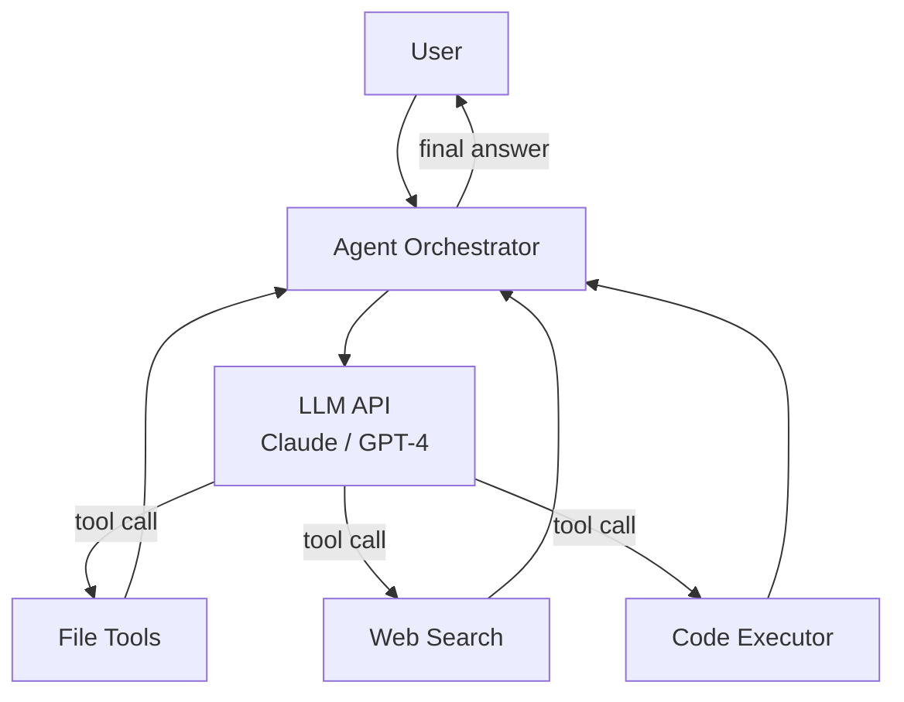
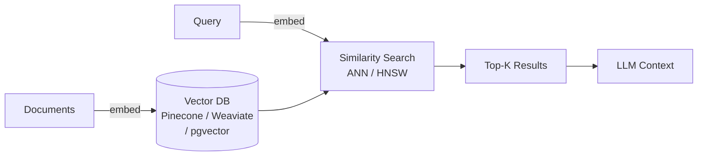
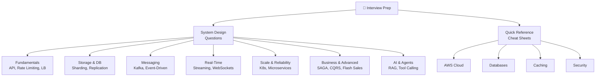
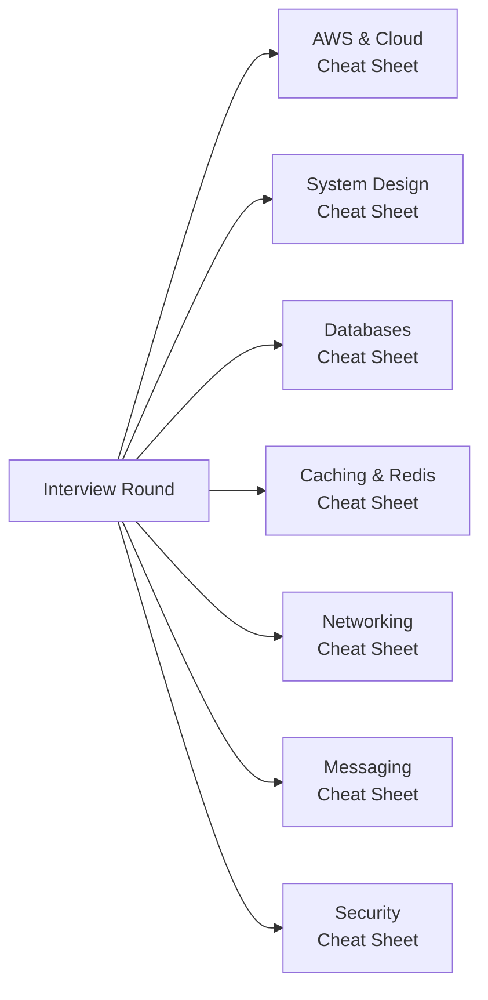
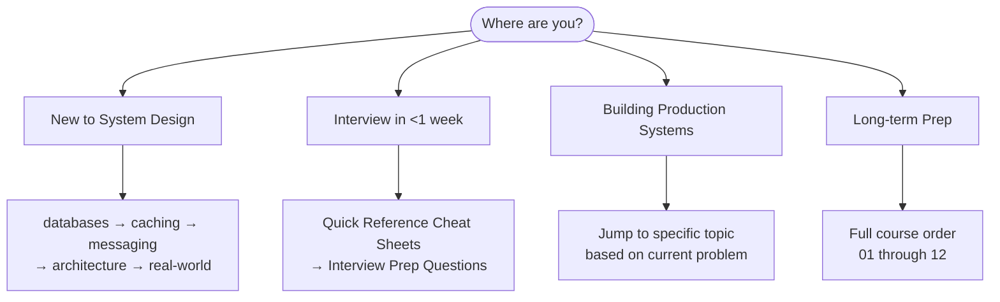

# Diagrams Batch 2 Implementation Plan

> **For agentic workers:** REQUIRED SUB-SKILL: Use superpowers:subagent-driven-development (recommended) or superpowers:executing-plans to implement this plan task-by-task. Steps use checkbox (`- [ ]`) syntax for tracking.

**Goal:** Add Mermaid diagrams to all content files in sections 07–15, `12-interview-prep`, `cheat-sheets`, `interview-prep` (legacy), `13-agent-workflows`, and `system-design` that currently lack diagrams.

**Architecture:** Same approach as Batch 1 — each overview/index file gets a contextually relevant Mermaid diagram showing either a section map or a key concept diagram. The diagram must be accurate to the section's content.

**Tech Stack:** Markdown, Mermaid (supported natively by Nextra 4)

---

## Files to Update (Batch 2)

### Sections 07–15 Overview & Index Files
- `content/07-api-design/index.md`
- `content/07-api-design/concepts/overview.md`
- `content/07-api-design/failures/overview.md`
- `content/07-api-design/hands-on/overview.md`
- `content/08-security/index.md`
- `content/08-security/concepts/overview.md`
- `content/08-security/hands-on/overview.md`
- `content/09-observability/index.md`
- `content/09-observability/concepts/overview.md`
- `content/09-observability/failures/overview.md`
- `content/09-observability/hands-on/overview.md`
- `content/10-architecture/index.md`
- `content/10-architecture/concepts/overview.md`
- `content/10-architecture/failures/overview.md`
- `content/10-architecture/hands-on/overview.md`
- `content/11-real-world/index.md`
- `content/13-agent-workflows/index.md`
- `content/13-agent-workflows/concepts/overview.md`
- `content/13-agent-workflows/hands-on/overview.md`
- `content/13-agent-workflows/case-studies/overview.md`
- `content/13-agent-workflows/concepts/llm-judge-alignment-poc.md`
- `content/14-algorithms/index.md`
- `content/14-algorithms/distributed/overview.md`
- `content/14-algorithms/hands-on/overview.md`
- `content/14-algorithms/interview-patterns/overview.md`
- `content/15-vector-databases/index.md`
- `content/15-vector-databases/concepts/overview.md`

### 12-Interview-Prep Overview Files
- `content/12-interview-prep/index.md`
- `content/12-interview-prep/quick-reference/overview.md`
- `content/12-interview-prep/quick-reference/aws-cloud/overview.md`
- `content/12-interview-prep/quick-reference/caching/overview.md`
- `content/12-interview-prep/quick-reference/databases/overview.md`
- `content/12-interview-prep/quick-reference/security/overview.md`
- `content/12-interview-prep/system-design/overview.md`
- `content/12-interview-prep/system-design/business-and-advanced/overview.md`
- `content/12-interview-prep/system-design/fundamentals/overview.md`
- `content/12-interview-prep/system-design/messaging-and-streaming/overview.md`
- `content/12-interview-prep/system-design/real-time-systems/overview.md`
- `content/12-interview-prep/system-design/scale-and-reliability/overview.md`
- `content/12-interview-prep/system-design/storage-and-databases/overview.md`

### Other Files
- `content/cheat-sheets/index.md`
- `content/00-start-here/index.md`
- `content/interview-prep/system-design/overview.md`
- `content/system-design/case-studies/overview.md`

---

### Task 1: Add diagrams to `07-api-design` and `08-security` overview files

**Files:**
- Modify: `content/07-api-design/index.md`
- Modify: `content/07-api-design/concepts/overview.md`
- Modify: `content/07-api-design/failures/overview.md`
- Modify: `content/07-api-design/hands-on/overview.md`
- Modify: `content/08-security/index.md`
- Modify: `content/08-security/concepts/overview.md`
- Modify: `content/08-security/hands-on/overview.md`

- [ ] **Step 1: Read all files**

- [ ] **Step 2: Add diagram to `07-api-design/index.md`**



- [ ] **Step 3: Add diagrams to `07-api-design` sub-overviews**

For `concepts/overview.md`, show API concept relationships (idempotency, rate limiting, versioning, REST vs GraphQL vs gRPC).
For `failures/overview.md`, show API failure modes (rate limit exceeded, timeout cascade, bad versioning).
For `hands-on/overview.md`, show POC progression.

- [ ] **Step 4: Add diagram to `08-security/index.md`**



- [ ] **Step 5: Add diagrams to `08-security` sub-overviews**

For `concepts/overview.md`, show auth and encryption concept map.
For `hands-on/overview.md`, show security POC progression (JWT → OAuth → RBAC).

- [ ] **Step 6: Commit**

```bash
git add docs-site/content/07-api-design/ docs-site/content/08-security/
git commit -m "feat(diagrams): Add Mermaid diagrams to 07-api-design and 08-security overview files"
```

---

### Task 2: Add diagrams to `09-observability` and `10-architecture` overview files

**Files:**
- Modify: `content/09-observability/index.md`
- Modify: `content/09-observability/concepts/overview.md`
- Modify: `content/09-observability/failures/overview.md`
- Modify: `content/09-observability/hands-on/overview.md`
- Modify: `content/10-architecture/index.md`
- Modify: `content/10-architecture/concepts/overview.md`
- Modify: `content/10-architecture/failures/overview.md`
- Modify: `content/10-architecture/hands-on/overview.md`

- [ ] **Step 1: Read all files**

- [ ] **Step 2: Add diagram to `09-observability/index.md`**

Show the three pillars of observability:


- [ ] **Step 3: Add diagrams to `09-observability` sub-overviews**

For `concepts/overview.md`, show SLO/SLA/SLI relationship and connection pool management.
For `failures/overview.md`, show observability failure patterns (thread pool exhaustion, alert fatigue).
For `hands-on/overview.md`, show POC progression (health checks → tracing → SLO dashboard → load testing).

- [ ] **Step 4: Add diagram to `10-architecture/index.md`**



- [ ] **Step 5: Add diagrams to `10-architecture` sub-overviews**

For `concepts/overview.md`, show microservices communication patterns.
For `failures/overview.md`, show architecture failure modes (timeout domino, split brain, thundering herd).
For `hands-on/overview.md`, show POC progression.

- [ ] **Step 6: Commit**

```bash
git add docs-site/content/09-observability/ docs-site/content/10-architecture/
git commit -m "feat(diagrams): Add Mermaid diagrams to 09-observability and 10-architecture overview files"
```

---

### Task 3: Add diagrams to `11-real-world`, `13-agent-workflows`, `14-algorithms`, `15-vector-databases`

**Files:**
- Modify: `content/11-real-world/index.md`
- Modify: `content/13-agent-workflows/index.md`
- Modify: `content/13-agent-workflows/concepts/overview.md`
- Modify: `content/13-agent-workflows/hands-on/overview.md`
- Modify: `content/13-agent-workflows/case-studies/overview.md`
- Modify: `content/13-agent-workflows/concepts/llm-judge-alignment-poc.md`
- Modify: `content/14-algorithms/index.md`
- Modify: `content/14-algorithms/distributed/overview.md`
- Modify: `content/14-algorithms/hands-on/overview.md`
- Modify: `content/14-algorithms/interview-patterns/overview.md`
- Modify: `content/15-vector-databases/index.md`
- Modify: `content/15-vector-databases/concepts/overview.md`

- [ ] **Step 1: Read all files**

- [ ] **Step 2: Add diagram to `11-real-world/index.md`**

Show real-world system complexity landscape:


- [ ] **Step 3: Add diagram to `13-agent-workflows/index.md`**



- [ ] **Step 4: Add diagrams to `13-agent-workflows` sub-overviews**

For `concepts/overview.md`, show agent concept map (what-is-an-agent, tool registry, routing, evaluation).
For `hands-on/overview.md`, show agent POC progression.
For `case-studies/overview.md`, show real-world agent use cases.
For `llm-judge-alignment-poc.md`, add a diagram showing LLM-as-judge evaluation pipeline.

- [ ] **Step 5: Add diagrams to `14-algorithms` files**

For `14-algorithms/index.md`, show algorithm categories relevant to system design.
For `distributed/overview.md`, show distributed algorithms (consistent hashing, Raft, Paxos, Bloom filter).
For `hands-on/overview.md`, show algorithm POC progression.
For `interview-patterns/overview.md`, show common interview algorithm patterns.

- [ ] **Step 6: Add diagrams to `15-vector-databases` files**

For `15-vector-databases/index.md`, show vector DB architecture:


For `15-vector-databases/concepts/overview.md`, show ANN algorithms and index types.

- [ ] **Step 7: Commit**

```bash
git add docs-site/content/11-real-world/ \
        docs-site/content/13-agent-workflows/ \
        docs-site/content/14-algorithms/ \
        docs-site/content/15-vector-databases/
git commit -m "feat(diagrams): Add Mermaid diagrams to 11-15 section overview files"
```

---

### Task 4: Add diagrams to `12-interview-prep` overview files

**Files:**
- Modify: `content/12-interview-prep/index.md`
- Modify: `content/12-interview-prep/quick-reference/overview.md`
- Modify: `content/12-interview-prep/quick-reference/aws-cloud/overview.md`
- Modify: `content/12-interview-prep/quick-reference/caching/overview.md`
- Modify: `content/12-interview-prep/quick-reference/databases/overview.md`
- Modify: `content/12-interview-prep/quick-reference/security/overview.md`
- Modify: `content/12-interview-prep/system-design/overview.md`
- Modify: `content/12-interview-prep/system-design/business-and-advanced/overview.md`
- Modify: `content/12-interview-prep/system-design/fundamentals/overview.md`
- Modify: `content/12-interview-prep/system-design/messaging-and-streaming/overview.md`
- Modify: `content/12-interview-prep/system-design/real-time-systems/overview.md`
- Modify: `content/12-interview-prep/system-design/scale-and-reliability/overview.md`
- Modify: `content/12-interview-prep/system-design/storage-and-databases/overview.md`

- [ ] **Step 1: Read all files**

- [ ] **Step 2: Add diagram to `12-interview-prep/index.md`**

Show interview prep navigation map:


- [ ] **Step 3: Add diagrams to each quick-reference overview**

For `quick-reference/overview.md`, show available reference sheets.
For `quick-reference/aws-cloud/overview.md`, show AWS service categories.
For `quick-reference/caching/overview.md`, show caching concept map.
For `quick-reference/databases/overview.md`, show database concept map.
For `quick-reference/security/overview.md`, show security topic map.

- [ ] **Step 4: Add diagrams to each system-design category overview**

For each of: fundamentals, storage-and-databases, messaging-and-streaming, real-time-systems, scale-and-reliability, business-and-advanced — add a diagram showing the questions in that category and how they relate.

For `system-design/overview.md`, add a comprehensive map of all question categories.

- [ ] **Step 5: Commit**

```bash
git add docs-site/content/12-interview-prep/
git commit -m "feat(diagrams): Add Mermaid diagrams to 12-interview-prep overview files"
```

---

### Task 5: Add diagrams to `cheat-sheets/index.md`, `00-start-here/index.md`, and legacy files

**Files:**
- Modify: `content/cheat-sheets/index.md`
- Modify: `content/00-start-here/index.md`
- Modify: `content/interview-prep/system-design/overview.md`
- Modify: `content/system-design/case-studies/overview.md`

- [ ] **Step 1: Read all files**

- [ ] **Step 2: Add diagram to `cheat-sheets/index.md`**

Show how cheat sheets map to interview topics:


- [ ] **Step 3: Add diagram to `00-start-here/index.md`**

Show the learning path options:


- [ ] **Step 4: Add diagrams to legacy `interview-prep/` and `system-design/` files**

For each file, read first, then add appropriate diagram if missing.

- [ ] **Step 5: Final commit**

```bash
git add docs-site/content/cheat-sheets/index.md \
        docs-site/content/00-start-here/ \
        docs-site/content/interview-prep/ \
        docs-site/content/system-design/
git commit -m "feat(diagrams): Add Mermaid diagrams to cheat-sheets, start-here, and legacy section files"
```
