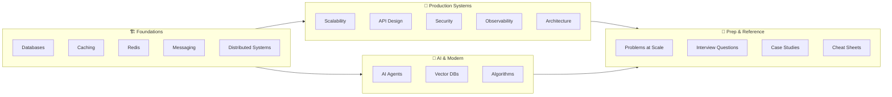

# Knowledge Base Navigation Redesign — Implementation Plan

> **For agentic workers:** REQUIRED SUB-SKILL: Use superpowers:subagent-driven-development (recommended) or superpowers:executing-plans to implement this plan task-by-task. Steps use checkbox (`- [ ]`) syntax for tracking.

**Goal:** Transform the docs-site from a confusing hidden-nav structure to a clean 4-pillar sidebar with consistent topic index pages and AI Agents as the flagship section.

**Architecture:** All changes are to `_meta.js` navigation files and topic `index.md` content files. No article content, URLs, or theme infrastructure changes. The standard pattern is: every topic index page gets a "Navigate by Role" table + "Topic Map" table cross-linking concepts/hands-on/failures/interview questions.

**Tech Stack:** Nextra 4, Next.js App Router, Markdown, `_meta.js` navigation files. Working dir: `docs-site/`. Build: `npm run build`. Dev: `npm run dev` (port 3000).

**Spec:** `docs/superpowers/specs/2026-03-25-knowledge-base-redesign.md`

**Parallelization strategy:** Tasks 1–4 are sequential (blockers). Tasks 5–13 (topic index pages) are fully independent and should be dispatched as parallel agents using worktrees.

---

## File Map

| File | Change |
|------|--------|
| `docs-site/content/_meta.js` | 4-pillar separators, remove all `display: 'hidden'` |
| `docs-site/theme.config.jsx` | Fix banner href: `/get-started` → `/system-design/get-started` |
| `docs-site/content/12-interview-prep/system-design/ai-and-agents/index.md` | Replace stub with full `overview.md` content |
| `docs-site/content/12-interview-prep/system-design/ai-and-agents/overview.md` | Delete |
| `docs-site/content/12-interview-prep/system-design/ai-and-agents/_meta.js` | Remove `overview` key |
| `docs-site/content/12-interview-prep/system-design/ai-and-agents/CONTEXT.md` | Remove stale `overview` row |
| `docs-site/content/index.mdx` | Full rewrite — persona table + knowledge map |
| `docs-site/content/13-agent-workflows/_meta.js` | Rename title, add `interview` entry |
| `docs-site/content/13-agent-workflows/index.md` | Add 3-stage progression table + topic map |
| `docs-site/content/13-agent-workflows/interview/_meta.js` | Create — interview sub-section nav |
| `docs-site/content/13-agent-workflows/interview/index.md` | Create — cross-reference to existing questions |
| `docs-site/content/02-caching/index.md` | Add Navigate by Role + Topic Map |
| `docs-site/content/03-redis/index.md` | Add Navigate by Role + Topic Map |
| `docs-site/content/04-messaging/index.md` | Add Navigate by Role + Topic Map |
| `docs-site/content/05-distributed-systems/index.md` | Add Navigate by Role + Topic Map |
| `docs-site/content/06-scalability/index.md` | Add Navigate by Role + Topic Map |
| `docs-site/content/07-api-design/index.md` | Add Navigate by Role + Topic Map |
| `docs-site/content/08-security/index.md` | Add Navigate by Role + Topic Map |
| `docs-site/content/09-observability/index.md` | Add Navigate by Role + Topic Map |
| `docs-site/content/10-architecture/index.md` | Add Navigate by Role + Topic Map |
| `docs-site/content/12-interview-prep/index.md` | Add Navigate by Role section |
| `docs-site/content/14-algorithms/index.md` | Add Navigate by Role + Topic Map |
| `docs-site/content/15-vector-databases/index.md` | Add Navigate by Role + Topic Map |
| `docs-site/content/problems-at-scale/index.md` | Add Navigate by Role + Topic Map |
| `docs-site/content/00-start-here/index.md` | Remove persona-routing Mermaid (superseded by home page) |

---

## Task 1: Root `_meta.js` — 4-Pillar Structure

**Files:**
- Modify: `docs-site/content/_meta.js`

This is the most impactful single change. Remove all `display: 'hidden'` entries and replace with 4 grouped pillars using Nextra 4 separators. Do this first and verify in dev server before anything else.

- [ ] **Step 1: Replace entire `_meta.js` content**

```js
export default {
  // ── Standalone pages ─────────────────────────────────────────────────────
  index: {
    title: 'Home',
    type: 'page',
  },
  'get-started': {
    title: '🚀 Get Started',
    type: 'page',
  },

  // ── Pillar 1: Foundations ─────────────────────────────────────────────────
  '_sep_foundations': {
    type: 'separator',
    title: '🏗️ Foundations',
  },
  '01-databases': {
    title: '🗄️ Databases',
  },
  '02-caching': {
    title: '⚡ Caching',
  },
  '03-redis': {
    title: '🔴 Redis',
  },
  '04-messaging': {
    title: '📬 Messaging & Events',
  },
  '05-distributed-systems': {
    title: '⚖️ Distributed Systems',
  },

  // ── Pillar 2: Production Systems ──────────────────────────────────────────
  '_sep_production': {
    type: 'separator',
    title: '🚀 Production Systems',
  },
  '06-scalability': {
    title: '📈 Scalability',
  },
  '07-api-design': {
    title: '🌐 API Design',
  },
  '08-security': {
    title: '🔒 Security',
  },
  '09-observability': {
    title: '📡 Observability',
  },
  '10-architecture': {
    title: '🏗️ Architecture & Patterns',
  },

  // ── Pillar 3: AI & Modern Systems ─────────────────────────────────────────
  '_sep_ai': {
    type: 'separator',
    title: '🤖 AI & Modern Systems',
  },
  '13-agent-workflows': {
    title: '🤖 AI Agents',
  },
  '15-vector-databases': {
    title: '🧠 Vector Databases',
  },
  '14-algorithms': {
    title: '🧮 Algorithms',
  },

  // ── Pillar 4: Prep & Reference ────────────────────────────────────────────
  '_sep_prep': {
    type: 'separator',
    title: '🎯 Prep & Reference',
  },
  'problems-at-scale': {
    title: '🔥 Problems at Scale',
  },
  '12-interview-prep': {
    title: '🎯 Interview Questions',
  },
  '11-real-world': {
    title: '🏢 Real-World Case Studies',
  },
  'cheat-sheets': {
    title: '⚡ Cheat Sheets',
  },

  // ── Hidden legacy sections ────────────────────────────────────────────────
  // NOTE: '00-start-here' is intentionally omitted from the sidebar.
  // Its content (learning-paths.md) is linked from the home page.
  // The route /00-start-here/learning-paths still works — it just has no sidebar entry.
  'interview-prep': {
    title: '🎯 Interview Prep (legacy)',
    display: 'hidden',
  },
  'system-design': {
    title: '🏗️ System Design (legacy)',
    display: 'hidden',
  },
}
```

- [ ] **Step 2: Start dev server and verify sidebar renders**

```bash
cd docs-site && npm run dev
```

Open `http://localhost:3000/system-design` and confirm:
- 4 pillar separator labels appear in sidebar
- All 15 topic sections are visible (not hidden)
- No 404 clicking on any top-level topic

Stop dev server after verification.

- [ ] **Step 3: Commit**

```bash
cd docs-site && git add content/_meta.js
git commit -m "feat(nav): 4-pillar sidebar — expose all 15 topic sections"
```

---

## Task 2: Quick Fixes

**Files:**
- Modify: `docs-site/theme.config.jsx` (line 116)
- Modify: `docs-site/content/12-interview-prep/system-design/ai-and-agents/index.md`
- Modify: `docs-site/content/12-interview-prep/system-design/ai-and-agents/_meta.js`
- Modify: `docs-site/content/12-interview-prep/system-design/ai-and-agents/CONTEXT.md`
- Delete: `docs-site/content/12-interview-prep/system-design/ai-and-agents/overview.md`

- [ ] **Step 1: Fix banner broken link in theme.config.jsx**

Find line 116 (the banner `<a href="/get-started"`) and change to:

```jsx
<a href="/system-design/get-started" style={{ textDecoration: 'none' }}>
```

Verify with:
```bash
grep -n 'href="/get-started"' docs-site/theme.config.jsx
# Should return no results after fix
grep -n 'href="/system-design/get-started"' docs-site/theme.config.jsx
# Should return 1 result
```

- [ ] **Step 2: Read `overview.md` content to use as replacement for `index.md`**

```bash
cat docs-site/content/12-interview-prep/system-design/ai-and-agents/overview.md
```

- [ ] **Step 3: Promote `overview.md` body into `index.md`**

This is a two-part operation — do NOT copy `overview.md` verbatim:

**Part A — Keep existing `index.md` frontmatter unchanged:**
```yaml
---
title: "AI Agents & LLM Systems — Interview Questions"
description: "System design interview questions covering AI agent architectures, RAG systems, tool-calling APIs, and LLM-powered applications"
---
```

**Part B — Replace everything after the frontmatter closing `---` with the body of `overview.md`** (i.e., all content after line 4 of `overview.md`, starting from the `# AI Agents & LLM Systems — Interview Overview` heading).

The result: `index.md` keeps its original frontmatter title/description, gets the full body content from `overview.md`. No MDX `import` statement. No link to `/overview`. Plain markdown only.

- [ ] **Step 4: Delete `overview.md`**

```bash
rm docs-site/content/12-interview-prep/system-design/ai-and-agents/overview.md
```

- [ ] **Step 5: Remove `overview` key from `_meta.js`**

Read `docs-site/content/12-interview-prep/system-design/ai-and-agents/_meta.js` and remove the line `overview: "Overview"`. The `index` key must remain as the first entry.

- [ ] **Step 6: Update CONTEXT.md to remove stale `overview` row**

Read `docs-site/content/12-interview-prep/system-design/ai-and-agents/CONTEXT.md` and remove the row referencing `overview.md`.

- [ ] **Step 7: Verify**

```bash
ls docs-site/content/12-interview-prep/system-design/ai-and-agents/
# overview.md should NOT appear
grep -r "overview" docs-site/content/12-interview-prep/system-design/ai-and-agents/_meta.js
# Should return no results
```

- [ ] **Step 8: Commit**

```bash
git add docs-site/theme.config.jsx
git add docs-site/content/12-interview-prep/system-design/ai-and-agents/
git commit -m "fix: banner basePath link + promote ai-and-agents overview into index"
```

---

## Task 3: Home Page Rewrite

**Files:**
- Modify: `docs-site/content/index.mdx`

Replace the current generic home page with a persona-driven entry point. All links must use **relative paths** (not absolute `/01-databases/...`) to avoid basePath issues.

- [ ] **Step 1: Replace entire `index.mdx` content**

```mdx
---
title: System Design Knowledge Base
---

# System Design Knowledge Base

A production-grade learning resource for engineers — from first principles to staff-level system design. ~700 articles, 450+ hands-on POCs, 43 interview questions.

## Who Are You?

| I am... | My goal | Start here |
|---------|---------|-----------|
| 🟢 Junior engineer | Learn system design from scratch | [Learning Paths →](./00-start-here/learning-paths) |
| 🟡 Mid-level engineer | Fill knowledge gaps, go deeper | [Pick a topic →](./01-databases) |
| 🔴 Senior / Tech Lead | Master distributed systems | [Foundations →](./01-databases) |
| 🎯 Interview in < 2 weeks | Fast-track FAANG prep | [Interview Questions →](./12-interview-prep) |
| 🤖 Building AI systems | Agents, RAG, LLM architecture | [AI Agents — Start here →](./13-agent-workflows) |

---

## 🔥 Start with AI Agents

The most in-demand skill in system design right now. 70 articles covering the full stack — from building your first agent to production multi-agent systems.

| → | [Build your first agent](./13-agent-workflows/concepts/from-zero-to-production-agent) | [Design multi-agent systems](./13-agent-workflows/concepts/multi-agent-systems) | [AI interview questions](./13-agent-workflows/interview) |
|---|---|---|---|

---

## Knowledge Map



---

## What's Inside

| Pillar | Topics | Articles | POCs |
|--------|--------|----------|------|
| 🏗️ Foundations | Databases, Caching, Redis, Messaging, Distributed Systems | ~170 | ~90 |
| 🚀 Production Systems | Scalability, API Design, Security, Observability, Architecture | ~150 | ~45 |
| 🤖 AI & Modern | AI Agents, Vector Databases, Algorithms | ~160 | ~25 |
| 🎯 Prep & Reference | Problems at Scale, Interview Qs, Case Studies, Cheat Sheets | ~220 | — |

## Difficulty Levels

- 🟢 **Beginner** — No assumed knowledge
- 🟡 **Intermediate** — 2–5 years experience
- 🔴 **Advanced** — 5–8 years experience
- ⚫ **Senior/Architect** — Staff-level, 8+ years
```

- [ ] **Step 2: Verify no absolute paths in new home page**

```bash
# Check HTML href attributes
grep -n 'href="/' docs-site/content/index.mdx
# Should return no results

# Check markdown link syntax — catches [text](/path) patterns
grep -n '](' docs-site/content/index.mdx | grep -v 'http' | grep '](/'
# Should return no results — all links should be relative (./path) not absolute (/path)
```

- [ ] **Step 3: Commit**

```bash
git add docs-site/content/index.mdx
git commit -m "feat(home): persona-driven entry page with knowledge map"
```

---

## Task 4: AI Agents Flagship Section

**Files:**
- Modify: `docs-site/content/13-agent-workflows/_meta.js`
- Modify: `docs-site/content/13-agent-workflows/index.md`
- Create: `docs-site/content/13-agent-workflows/interview/_meta.js`
- Create: `docs-site/content/13-agent-workflows/interview/index.md`

- [ ] **Step 1: Update `13-agent-workflows/_meta.js`**

```js
export default {
  index: "🤖 AI Agents",
  concepts: "📖 Concepts",
  "hands-on": "🔬 Hands-On",
  interview: "🎯 Interview Q&A",
  platforms: "🛠️ Platforms",
  failures: "⚠️ Failure Modes",
  "case-studies": "📋 Case Studies",
}
```

- [ ] **Step 2: Add 3-stage progression table to `13-agent-workflows/index.md`**

Read the existing file first, then insert the following block **immediately after the opening `# AI Agent Workflows` heading** (before the sequence diagram):

```markdown
## Your Learning Path

Start at Stage 1 and work forward. Each stage builds on the previous.

| Stage | What You'll Build | Key Articles | Est. Time |
|-------|------------------|--------------|-----------|
| 🟢 Stage 1 — Build Your First Agent | A working tool-calling agent with memory | [From Zero to Production Agent](./concepts/from-zero-to-production-agent), [What is an AI Agent?](./concepts/what-is-an-agent), [ReAct Pattern](./concepts/react-pattern), [Tool Use](./concepts/tool-use-function-calling) + [Hands-On basics](./hands-on) | 2–3 hrs |
| 🟡 Stage 2 — Scale It | Multi-agent system with observability and cost control | [Multi-Agent Systems](./concepts/multi-agent-systems), [RAG Deep Dive](./concepts/rag-deep-dive), [Agent Observability](./concepts/agent-observability), [Cost Control](./concepts/cost-control-agents) + [Platforms](./platforms) | 8–10 hrs |
| 🔴 Stage 3 — Interview Ready | Answer any LLM system design question with confidence | [Interview Q&A](./interview) + [Case Studies](./case-studies) | 3–4 hrs |

---
```

Also update the existing "Section Map" table to add the new interview row:

```markdown
| [🎯 Interview Q&A](./interview) | AI agent system design interview questions: agent loop, RAG, multi-agent, prompt injection | 🟡 → 🔴 |
```

- [ ] **Step 3: Create `interview/_meta.js`**

```js
export default {
  index: "🎯 AI Agent Interview Questions",
}
```

- [ ] **Step 4: Create `interview/index.md`**

```markdown
---
title: "AI Agents & LLM Systems — Interview Questions"
description: "System design interview questions for AI agents, RAG, tool calling, multi-agent systems, and prompt injection defense."
---

# AI Agents & LLM Systems — Interview Q&A

7 real interview questions covering the full LLM system design stack. These questions appear at FAANG and AI-first companies for senior engineer and above roles.

> These questions live in the [Interview Prep section](../../12-interview-prep/system-design/ai-and-agents) and are linked here for context within your learning path. Complete at least Stage 2 of the [AI Agents learning path](../index) before tackling these.

## Questions at a Glance

| # | Question | Link | Difficulty |
|---|----------|------|-----------|
| 1 | Design a system where an AI agent autonomously completes multi-step tasks | [Agent Loop Design](../../12-interview-prep/system-design/ai-and-agents/agent-loop-design) | 🔴 Advanced |
| 2 | Design the tool-calling layer for an AI agent | [Tool Calling Patterns](../../12-interview-prep/system-design/ai-and-agents/tool-calling-patterns) | 🟡 Intermediate |
| 3 | Design multiple AI agents coordinating on a research task | [Multi-Agent Coordination](../../12-interview-prep/system-design/ai-and-agents/multi-agent-coordination) | 🔴 Advanced |
| 4 | Design a Q&A system over a 10M-document knowledge base | [RAG Architecture](../../12-interview-prep/system-design/ai-and-agents/rag-architecture) | 🟡 Intermediate |
| 5 | Design an API layer for 1M daily LLM-powered users | [Designing APIs on LLMs](../../12-interview-prep/system-design/ai-and-agents/llm-api-design) | 🟡 Intermediate |
| 6 | How do you monitor and evaluate an AI agent in production? | [Agent Observability & Evals](../../12-interview-prep/system-design/ai-and-agents/agent-observability) | 🟡 Intermediate |
| 7 | Your agent reads user emails and takes actions — prevent prompt injection | [Prompt Injection Defense](../../12-interview-prep/system-design/ai-and-agents/prompt-injection-defense) | 🔴 Advanced |

## Key Numbers to Memorize

| Item | Value |
|------|-------|
| GPT-4o context window | 128K tokens |
| Claude 3.5/3.7 context window | 200K tokens |
| LLM API p99 latency | 5–30s |
| Typical tool call latency | 200ms–2s |
| ANN vector search (HNSW) | ~5ms |
| Cosine similarity threshold for semantic cache hit | 0.95 |
| GPT-4o cost (2025) | ~$5/M input tokens |

## Recommended Study Order

1. [Agent Loop Design](../../12-interview-prep/system-design/ai-and-agents/agent-loop-design) — foundational
2. [RAG Architecture](../../12-interview-prep/system-design/ai-and-agents/rag-architecture) — most common today
3. [LLM API Design](../../12-interview-prep/system-design/ai-and-agents/llm-api-design) — for platform/infra roles
4. [Tool Calling Patterns](../../12-interview-prep/system-design/ai-and-agents/tool-calling-patterns) — agent safety depth
5. [Multi-Agent Coordination](../../12-interview-prep/system-design/ai-and-agents/multi-agent-coordination) — senior/staff
6. [Agent Observability](../../12-interview-prep/system-design/ai-and-agents/agent-observability) — SRE focus
7. [Prompt Injection Defense](../../12-interview-prep/system-design/ai-and-agents/prompt-injection-defense) — security focus

→ [Browse full AI/LLM interview section](../../12-interview-prep/system-design/ai-and-agents)
```

- [ ] **Step 5: Verify links in `interview/index.md` are correct**

```bash
grep -o '\./[^)]*\|\.\.\/[^)]*' docs-site/content/13-agent-workflows/interview/index.md
# Review each path — all ../../12-interview-prep/... paths should resolve correctly
```

- [ ] **Step 6: Commit**

```bash
git add docs-site/content/13-agent-workflows/
git commit -m "feat(ai-agents): 3-stage learning path + interview Q&A sub-section"
```

---

## Tasks 5–13: Topic Index Pages (Parallel — Use Separate Agents)

**These 9 tasks are fully independent. Dispatch as parallel agents using `superpowers:dispatching-parallel-agents` with isolated worktrees.**

Each task follows the same pattern:
1. Read existing `index.md` for the topic
2. Read existing `_meta.js` to know sub-sections
3. Read `concepts/_meta.js` and `hands-on/_meta.js` to get article slugs
4. Check `12-interview-prep` for matching interview questions
5. Add "Navigate by Role" table + "Topic Map" table to the existing `index.md` (after the existing Mermaid diagram, before "Where to Start" if it exists)
6. Commit

**Template to follow for each topic (see `01-databases/index.md` as the gold standard):**

```markdown
## Navigate by Role

| I am... | Start here | Goal |
|---------|-----------|------|
| 🟢 Junior | [First concept article] | [goal] |
| 🟡 Mid-level | [Intermediate article] | [goal] |
| 🔴 Senior / TL | [Advanced article or failures] | [goal] |
| 🏆 Interview prepping | [Matching interview question link] | Ace the system design round |

## Topic Map

| Topic | 📖 Concept | 🔬 Hands-On | ⚠️ Failures | 🎯 Interview |
|-------|-----------|------------|------------|-------------|
| [subtopic] | [link] | [link] | [link] | [link or —] |
```

**Rules for Topic Map:**
- Only include columns that have content
- Use relative paths: `./concepts/article-slug`, `./hands-on/article-slug`, `./failures/article-slug`
- For Interview links, check `../../12-interview-prep/system-design/*/article-slug` paths
- If no interview question exists for a row, use `—`
- Do NOT add rows for articles that don't exist yet

---

### Task 5: `02-caching/index.md`

Read these files before writing:
- `docs-site/content/02-caching/index.md`
- `docs-site/content/02-caching/_meta.js`
- `docs-site/content/02-caching/concepts/_meta.js`
- `docs-site/content/02-caching/hands-on/_meta.js`
- `docs-site/content/02-caching/failures/_meta.js`

Key concepts to map: caching fundamentals, cache strategies (write-through/behind/aside), cache eviction, CDN, cache invalidation, distributed caching.
Interview section: `12-interview-prep/quick-reference/caching/`

- [ ] Read existing files
- [ ] Add "Navigate by Role" + "Topic Map" tables after existing Mermaid diagram
- [ ] Commit: `git commit -m "feat(nav): add topic map to caching index"`

---

### Task 6: `03-redis/index.md`

Read these files before writing:
- `docs-site/content/03-redis/index.md`
- `docs-site/content/03-redis/_meta.js`
- `docs-site/content/03-redis/concepts/_meta.js`
- `docs-site/content/03-redis/hands-on/_meta.js`
- `docs-site/content/03-redis/failures/_meta.js`

Key concepts to map: Redis data structures, pub/sub, Redis as cache, distributed locks, job queues, rate limiting with Redis, Redis Cluster.
Interview section: `12-interview-prep/quick-reference/caching/`

- [ ] Read existing files
- [ ] Add "Navigate by Role" + "Topic Map" tables
- [ ] Commit: `git commit -m "feat(nav): add topic map to redis index"`

---

### Task 7: `04-messaging/index.md`

Read these files before writing:
- `docs-site/content/04-messaging/index.md`
- `docs-site/content/04-messaging/_meta.js`
- `docs-site/content/04-messaging/concepts/_meta.js`
- `docs-site/content/04-messaging/hands-on/_meta.js`
- `docs-site/content/04-messaging/failures/_meta.js`

Key concepts to map: message queue basics, Kafka vs RabbitMQ, pub/sub patterns, event sourcing, dead letter queues, consumer groups.
Interview section: `12-interview-prep/system-design/messaging-and-streaming/`

- [ ] Read existing files
- [ ] Add "Navigate by Role" + "Topic Map" tables
- [ ] Commit: `git commit -m "feat(nav): add topic map to messaging index"`

---

### Task 8: `05-distributed-systems/index.md`

Read these files before writing:
- `docs-site/content/05-distributed-systems/index.md`
- `docs-site/content/05-distributed-systems/_meta.js`
- `docs-site/content/05-distributed-systems/concepts/_meta.js`
- `docs-site/content/05-distributed-systems/failures/_meta.js`

Key concepts: CAP theorem, ACID vs BASE, consensus (Raft/Paxos), distributed transactions, vector clocks, two-phase commit.
Interview section: `12-interview-prep/system-design/scale-and-reliability/`

- [ ] Read existing files
- [ ] Add "Navigate by Role" + "Topic Map" tables (no Hands-On column — section has no hands-on)
- [ ] Commit: `git commit -m "feat(nav): add topic map to distributed-systems index"`

---

### Task 9: `06-scalability/index.md`

Read these files before writing:
- `docs-site/content/06-scalability/index.md`
- `docs-site/content/06-scalability/_meta.js`
- `docs-site/content/06-scalability/concepts/_meta.js`
- `docs-site/content/06-scalability/hands-on/_meta.js`
- `docs-site/content/06-scalability/failures/_meta.js`

Key concepts: horizontal vs vertical scaling, consistent hashing, rate limiting algorithms, load balancing, auto-scaling, high availability.
Interview section: `12-interview-prep/system-design/scale-and-reliability/`

- [ ] Read existing files
- [ ] Add "Navigate by Role" + "Topic Map" tables
- [ ] Commit: `git commit -m "feat(nav): add topic map to scalability index"`

---

### Task 10: `07-api-design/index.md`

Read these files before writing:
- `docs-site/content/07-api-design/index.md`
- `docs-site/content/07-api-design/_meta.js`
- `docs-site/content/07-api-design/concepts/_meta.js`
- `docs-site/content/07-api-design/hands-on/_meta.js`
- `docs-site/content/07-api-design/failures/_meta.js`

Key concepts: REST vs GraphQL vs gRPC, idempotency, API versioning, rate limiting, pagination, webhooks.
Interview section: `12-interview-prep/system-design/fundamentals/`

- [ ] Read existing files
- [ ] Add "Navigate by Role" + "Topic Map" tables
- [ ] Commit: `git commit -m "feat(nav): add topic map to api-design index"`

---

### Task 11: `08-security/index.md`

Read these files before writing:
- `docs-site/content/08-security/index.md`
- `docs-site/content/08-security/_meta.js`
- `docs-site/content/08-security/concepts/_meta.js`
- `docs-site/content/08-security/hands-on/_meta.js`

Key concepts: encryption (RSA/AES), hashing, JWT/OAuth, TLS, zero trust, secrets management.
Interview section: `12-interview-prep/quick-reference/security/`

- [ ] Read existing files
- [ ] Add "Navigate by Role" + "Topic Map" tables (no Failures column)
- [ ] Commit: `git commit -m "feat(nav): add topic map to security index"`

---

### Task 12: `09-observability/index.md`

Read these files before writing:
- `docs-site/content/09-observability/index.md`
- `docs-site/content/09-observability/_meta.js`
- `docs-site/content/09-observability/concepts/_meta.js`
- `docs-site/content/09-observability/hands-on/_meta.js`
- `docs-site/content/09-observability/failures/_meta.js`

Key concepts: metrics/logs/traces (three pillars), Prometheus, Grafana, OpenTelemetry, distributed tracing, alerting, SLOs.
Interview section: `12-interview-prep/system-design/scale-and-reliability/`

- [ ] Read existing files
- [ ] Add "Navigate by Role" + "Topic Map" tables
- [ ] Commit: `git commit -m "feat(nav): add topic map to observability index"`

---

### Task 13: `10-architecture/index.md`

Read these files before writing:
- `docs-site/content/10-architecture/index.md`
- `docs-site/content/10-architecture/_meta.js`
- `docs-site/content/10-architecture/concepts/_meta.js`
- `docs-site/content/10-architecture/hands-on/_meta.js`
- `docs-site/content/10-architecture/failures/_meta.js`

Key concepts: microservices, circuit breaker, saga pattern, CQRS, event sourcing, service mesh, API gateway.
Interview section: `12-interview-prep/system-design/business-and-advanced/`

- [ ] Read existing files
- [ ] Add "Navigate by Role" + "Topic Map" tables
- [ ] Commit: `git commit -m "feat(nav): add topic map to architecture index"`

---

## Task 14: Remaining Index Pages

**Files:**
- `docs-site/content/14-algorithms/index.md`
- `docs-site/content/15-vector-databases/index.md`
- `docs-site/content/12-interview-prep/index.md`
- `docs-site/content/problems-at-scale/index.md`
- `docs-site/content/00-start-here/index.md`

These can also be parallelized but are grouped here for simplicity.

### 14a: `14-algorithms/index.md`
Read: `14-algorithms/_meta.js`, `14-algorithms/concepts/_meta.js`, `14-algorithms/interview-patterns/_meta.js`, `14-algorithms/distributed/_meta.js`
Add Navigate by Role + Topic Map (columns: Concept | Interview Pattern | Distributed | Hands-On).
Commit: `feat(nav): add topic map to algorithms index`

### 14b: `15-vector-databases/index.md`
Read: `15-vector-databases/_meta.js`, `15-vector-databases/concepts/_meta.js`
Add Navigate by Role + Topic Map.
Interview link: `../../13-agent-workflows/interview` (RAG architecture question)
Commit: `feat(nav): add topic map to vector-databases index`

### 14c: `12-interview-prep/index.md`
The existing index already has good structure. Add only a "Navigate by Role" table at the top (before the existing "Quick Navigation by Level" table) that includes a row for AI Agents:

```markdown
## Navigate by Role

| I am... | Start here | Goal |
|---------|-----------|------|
| 🟢 Junior | [Fundamentals](./system-design/fundamentals) | Core concepts: API, caching, rate limiting |
| 🟡 Mid-level | [Storage & DBs](./system-design/storage-and-databases), [Messaging](./system-design/messaging-and-streaming) | Medium-scale systems |
| 🔴 Senior / TL | [Scale & Reliability](./system-design/scale-and-reliability), [Business & Advanced](./system-design/business-and-advanced) | High-scale, multi-region |
| 🤖 Building AI | [AI Agents & LLM Systems](./system-design/ai-and-agents) | Agent loop, RAG, multi-agent coordination |
| 🏆 Staff/Architect | [Real-Time Systems](./system-design/real-time-systems) | Full system mastery |
```
Commit: `feat(nav): add navigate-by-role to interview-prep index`

### 14d: `problems-at-scale/index.md`
Read: `problems-at-scale/_meta.js` and each category `_meta.js`
Add Navigate by Role table (Juniors → concurrency basics, Seniors → cascading failures) + Topic Map with columns: Category | Problem | Related Concept | Fix Pattern
Commit: `feat(nav): add topic map to problems-at-scale index`

### 14e: `00-start-here/index.md`
Read the existing file. Remove the existing persona-routing Mermaid diagram (it is superseded by the new home page). Replace with a simple intro paragraph referencing the home page for persona routing, and `learning-paths.md` for structured study plans. Keep `back-of-envelope.md` reference.
Commit: `feat(nav): simplify start-here index, defer routing to home page`

---

## Task 15: Final Verification

- [ ] **Step 1: Full build**

```bash
cd docs-site && npm run build
```

Expected: build completes with 0 errors. Pagefind indexing runs via `postbuild`.

- [ ] **Step 2: Check for 404-prone patterns**

```bash
# 1. No absolute HTML href paths in content files
grep -r 'href="/' docs-site/content/ --include="*.md" --include="*.mdx" | grep -v 'http' | grep -v '/system-design/'
# Review any results — may indicate broken links

# 2. No absolute markdown links [text](/path) in content files
grep -rn '](' docs-site/content/ --include="*.md" --include="*.mdx" | grep -v 'http' | grep '](\/'
# Review results — all internal links should be relative (./path) not absolute (/path)

# 3. Verify overview.md is gone
ls docs-site/content/12-interview-prep/system-design/ai-and-agents/overview.md 2>&1
# Expected: "No such file or directory"

# 4. Verify no MDX import remains in ai-and-agents index
grep 'import' docs-site/content/12-interview-prep/system-design/ai-and-agents/index.md
# Should return no results

# 5. Verify interview/ sub-section was created
ls docs-site/content/13-agent-workflows/interview/
# Expected: _meta.js and index.md

# 6. Verify separator keys appear in _meta.js
grep '_sep_' docs-site/content/_meta.js
# Expected: 4 results (_sep_foundations, _sep_production, _sep_ai, _sep_prep)
```

- [ ] **Step 3: Start production server and do a smoke test**

```bash
cd docs-site && npm start -- -p 3001
```

Navigate to `http://localhost:3001/system-design` and verify:
- Sidebar shows 4 pillar separators with all 15 topics visible
- Home page shows persona table and knowledge map diagram
- AI Agents section shows 3-stage learning path
- `13-agent-workflows/interview` shows the Q&A page
- No duplicate "Overview" entry under AI Agents & LLM Systems in interview prep sidebar

- [ ] **Step 4: Restart PM2**

```bash
pm2 restart system-design
pm2 logs system-design --lines 20
```

- [ ] **Step 5: Final commit if any fixes needed**

```bash
git add -p  # review changes
git commit -m "fix(nav): final verification fixes"
```

---

## Parallel Execution Guide

For Tasks 5–14, use `superpowers:dispatching-parallel-agents`. Suggested batches:

**Batch A** (Foundations — 4 agents in parallel):
- Agent 1: Task 5 (caching)
- Agent 2: Task 6 (redis)
- Agent 3: Task 7 (messaging)
- Agent 4: Task 8 (distributed-systems)

**Batch B** (Production Systems — 5 agents in parallel):
- Agent 1: Task 9 (scalability)
- Agent 2: Task 10 (api-design)
- Agent 3: Task 11 (security)
- Agent 4: Task 12 (observability)
- Agent 5: Task 13 (architecture)

**Batch C** (Remaining — 3 agents in parallel):
- Agent 1: Task 14a + 14b (algorithms + vector-databases)
- Agent 2: Task 14c + 14d (interview-prep + problems-at-scale)
- Agent 3: Task 14e (00-start-here)

Each agent should work in an isolated git worktree to avoid conflicts. All changes are to different files so merging is clean.
