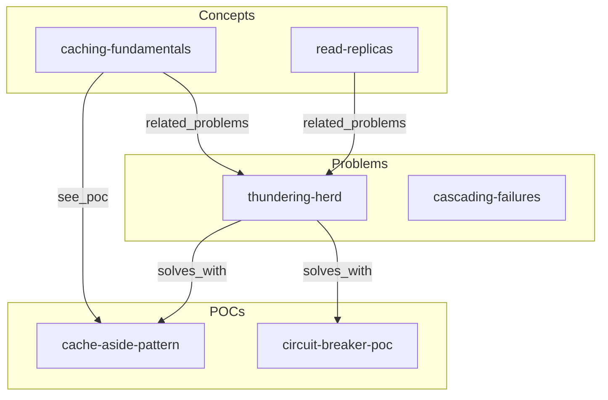

# Knowledge Graph + 3-Layer Context System — Design Spec

**Date**: 2026-03-16
**Project**: System Design Course (`docs-site/pages/`)
**Scope**: All 252 markdown files
**Status**: Approved for implementation

---

## 1. Objective

Transform the system design knowledge base from a collection of isolated articles into a **traversable knowledge graph** where every concept, problem, solution, POC, and case study is linked to every other related node. Apply the **3-layer context management architecture** so that both AI agents and human readers can navigate the entire 252-file corpus efficiently — loading only what is relevant for a given task.

**Core principle**: Every file is a node. Every relationship is a typed edge. The graph is always consistent. Navigation is deterministic.

---

## 2. Background

### Current State
- **252 markdown files** across 3 sections:
  - `system-design/` — 57 theory articles (concepts, patterns, case studies)
  - `interview-prep/` — 163 files (34 interview Qs, 103 POCs, 26 topic files across security-encryption/aws-cloud/database-storage/caching-cdn + root index)
  - `problems-at-scale/` — 32 failure scenario articles
- Files are organized in folders but have **no cross-linking** between sections
- No machine-readable relationship metadata
- No routing layer for AI context management
- An AI or human starting at one file has no path to related content

### 3-Layer Architecture (reference: `nao-server/docs/3-layer-approach/`)
- **Layer 1 (Map/Router)**: Single root file always loaded first. Contains folder structure, routing table, traversal patterns.
- **Layer 2 (Room/Domain Context)**: Per-folder `CONTEXT.md`, under 100 lines, routing only — no duplicated content.
- **Layer 3 (Workspace/Output)**: The actual article files — self-describing nodes with typed relationship frontmatter.

---

## 3. Architecture

### File Structure

```
docs-site/pages/
├── KNOWLEDGE-MAP.md                    ← Layer 1: master router
│
├── system-design/
│   ├── CONTEXT.md                      ← Layer 2: theory domain router
│   ├── databases/CONTEXT.md
│   ├── caching/CONTEXT.md
│   ├── queues/CONTEXT.md
│   ├── patterns/CONTEXT.md
│   ├── scalability/CONTEXT.md
│   ├── api-design/CONTEXT.md
│   ├── load-balancing/CONTEXT.md
│   ├── monitoring/CONTEXT.md
│   ├── performance/CONTEXT.md
│   ├── consistency/CONTEXT.md
│   ├── security/CONTEXT.md
│   ├── case-studies/CONTEXT.md
│   └── [57 articles — all get frontmatter]
│
├── interview-prep/
│   ├── CONTEXT.md                      ← Layer 2: interview domain router
│   ├── system-design/CONTEXT.md
│   ├── practice-pocs/CONTEXT.md
│   ├── security-encryption/CONTEXT.md
│   ├── aws-cloud/CONTEXT.md
│   ├── database-storage/CONTEXT.md
│   ├── caching-cdn/CONTEXT.md
│   └── [163 files — all get frontmatter]
│
├── problems-at-scale/
│   ├── CONTEXT.md                      ← Layer 2: failure scenarios router
│   ├── concurrency/CONTEXT.md
│   ├── availability/CONTEXT.md
│   ├── consistency/CONTEXT.md
│   ├── performance/CONTEXT.md
│   ├── scalability/CONTEXT.md
│   ├── data-integrity/CONTEXT.md
│   ├── cost-optimization/CONTEXT.md
│   └── [32 articles — all get frontmatter]
│
└── KNOWLEDGE-GRAPH.md                  ← Auto-generated mermaid graph (by /sync-graph)

.claude/
├── skills/
│   ├── sync-graph/SKILL.md             ← /sync-graph command
│   ├── new-article/SKILL.md            ← /new-article <layer> <path> <title>
│   ├── lint-graph/SKILL.md             ← /lint-graph command
│   └── gap-analysis/SKILL.md          ← /gap-analysis command
└── scripts/
    ├── sync-links.mjs                  ← core sync engine
    ├── lint-graph.mjs                  ← validation engine
    └── scaffold-article.mjs            ← article scaffolder
```

---

## 4. Layer 3: Frontmatter Schema

Every `.md` article file gets a YAML frontmatter block. This makes each file a **self-describing node** in the knowledge graph.

### Schema

```yaml
---
title: "Human-readable title"
layer: concept                  # concept | problem | solution | poc | case-study | interview-q
section: system-design/caching  # relative path from docs-site/pages/
difficulty: intermediate        # beginner | intermediate | advanced

prerequisites:                  # must understand these first (concept or solution nodes)
  - system-design/caching/caching-fundamentals

solves_with:                    # solutions/POCs that address this (problem nodes point here)
  - interview-prep/practice-pocs/cache-aside-pattern

related_problems:               # sibling failure scenarios or related problems
  - problems-at-scale/availability/thundering-herd

case_studies:                   # real company implementations of this concept
  - system-design/case-studies/youtube
  - interview-prep/system-design/video-streaming-platform

see_poc:                        # hands-on implementations to practice this
  - interview-prep/practice-pocs/redis-key-value-cache

linked_from: []                 # DO NOT EDIT — auto-populated by /sync-graph
tags: [redis, caching, availability]
---
```

> **Path format**: All edge values (in `prerequisites`, `solves_with`, `related_problems`, `case_studies`, `see_poc`) are paths relative to `docs-site/pages/`, without leading slash, without `.md` extension. Example: `system-design/caching/caching-fundamentals`.

### Layer Type Definitions

| Layer Type | Description | Primary Outgoing Edges |
|------------|-------------|----------------------|
| `concept` | Foundational theory article | `see_poc`, `case_studies`, `related_problems` |
| `problem` | Real-world failure scenario | `solves_with`, `prerequisites`, `related_problems` |
| `solution` | Pattern or technique article | `prerequisites`, `see_poc`, `case_studies` |
| `poc` | Hands-on implementation | `prerequisites`, `related_problems` |
| `case-study` | Real company system design | `prerequisites`, `see_poc` |
| `interview-q` | Interview question article | `prerequisites`, `see_poc`, `case_studies` |

### Edge Type Semantics

| Edge Field | Direction | Meaning |
|------------|-----------|---------|
| `prerequisites` | → concept/solution | "You need to understand X before this" |
| `solves_with` | → poc/solution | "This problem is addressed by X" |
| `related_problems` | → problem | "This often co-occurs with X" |
| `case_studies` | → case-study | "See how company X implements this" |
| `see_poc` | → poc | "Practice this with hands-on code at X" |
| `linked_from` | ← any | "These nodes reference this file" (auto) |

---

## 5. Layer 1: KNOWLEDGE-MAP.md

The master router. Loaded first in every AI session. Never exceeds 200 lines.

### Contents

1. **Course overview** — what this knowledge base is, the 80/20 philosophy
2. **Node type legend** — the 6 layer types and what each contains
3. **Section map** — what lives where (3 major sections, subsections)
4. **Routing table** — maps task type → which CONTEXT.md to load → which files to read
5. **Traversal patterns** — 3 canonical navigation paths through the graph
6. **Graph entry points** — best starting nodes for different learning goals

### Routing Table (in the file)

| Task | Load First | Then |
|------|-----------|------|
| Learn a concept from scratch | `system-design/CONTEXT.md` | Follow `prerequisites` chain |
| Debug / understand a real failure | `problems-at-scale/CONTEXT.md` | Follow `solves_with` to solutions |
| Prepare for a system design interview | `interview-prep/CONTEXT.md` | Follow `prerequisites` + `see_poc` |
| Get hands-on code for a concept | `interview-prep/practice-pocs/CONTEXT.md` | Follow `prerequisites` back to theory |
| Understand how a real company solved this | `system-design/case-studies/CONTEXT.md` | Follow `prerequisites` to concepts |
| Find a solution pattern to implement | `system-design/patterns/CONTEXT.md` | Follow `prerequisites` to concepts, `see_poc` to implementations |
| Find everything that links to a file | Read that file's `linked_from` field | — |

### Traversal Patterns (in the file)

```
Learn → Practice → See failure:
  concept (prerequisites) → poc (see_poc) → problem (related_problems)

Debug backwards:
  problem (solves_with) → poc/solution (prerequisites) → concept

Interview prep path:
  interview-q (prerequisites) → concepts → (see_poc) → pocs → (case_studies) → case-study
```

---

## 6. Layer 2: CONTEXT.md Files

One per major folder and subfolder. Under 100 lines each. Routing only — no content.

### Structure Template

```markdown
# {Section}/ — Layer 2 Router

One-sentence purpose of this section.

## Subfolder Purposes

| Folder | Contains | Node Types |
|--------|----------|-----------|
| databases/ | ... | concept |

## Routing Table

| Task / Question | Go to | Key files |
|-----------------|-------|-----------|
| [specific question] | [subfolder or file] | [filename] |

## Naming Conventions
[if section-specific conventions exist]
```

### CONTEXT.md Files to Create (28 total)

> **Nextra visibility**: All CONTEXT.md files must be added to their folder's `_meta.js` with `display: "hidden"` to prevent them from appearing as public web pages. Agent A is responsible for this alongside creating each file.

- `system-design/CONTEXT.md`
- `system-design/databases/CONTEXT.md`
- `system-design/caching/CONTEXT.md`
- `system-design/queues/CONTEXT.md`
- `system-design/patterns/CONTEXT.md`
- `system-design/scalability/CONTEXT.md`
- `system-design/api-design/CONTEXT.md`
- `system-design/load-balancing/CONTEXT.md`
- `system-design/monitoring/CONTEXT.md`
- `system-design/performance/CONTEXT.md`
- `system-design/consistency/CONTEXT.md`
- `system-design/security/CONTEXT.md`
- `system-design/case-studies/CONTEXT.md`
- `interview-prep/CONTEXT.md`
- `interview-prep/system-design/CONTEXT.md`
- `interview-prep/practice-pocs/CONTEXT.md`
- `interview-prep/security-encryption/CONTEXT.md`
- `interview-prep/aws-cloud/CONTEXT.md`
- `interview-prep/database-storage/CONTEXT.md`
- `interview-prep/caching-cdn/CONTEXT.md`
- `problems-at-scale/CONTEXT.md`
- `problems-at-scale/concurrency/CONTEXT.md`
- `problems-at-scale/availability/CONTEXT.md`
- `problems-at-scale/consistency/CONTEXT.md`
- `problems-at-scale/performance/CONTEXT.md`
- `problems-at-scale/scalability/CONTEXT.md`
- `problems-at-scale/data-integrity/CONTEXT.md`
- `problems-at-scale/cost-optimization/CONTEXT.md`

---

## 7. .claude/ Automation

### `/sync-graph` — Core Skill

**Purpose**: Rebuild all `linked_from` arrays and regenerate `KNOWLEDGE-GRAPH.md`.

**Algorithm** (`sync-links.mjs`):
1. Walk all `.md` files under `docs-site/pages/` using glob `**/{system-design,interview-prep,problems-at-scale}/**/*.md`. Explicitly skip: `CONTEXT.md`, `KNOWLEDGE-MAP.md`, `KNOWLEDGE-GRAPH.md`, `README.md`, `index.md`, `index.mdx`, and any file not directly under a named article folder (e.g. files inside `database-archival-poc/` subdirectory).
2. Parse YAML frontmatter from each file
3. Build adjacency map: for every forward edge (`prerequisites`, `solves_with`, `related_problems`, `case_studies`, `see_poc`), record the reverse edge
4. For each file, compute its `linked_from` as the union of all reverse edges pointing to it
5. Write updated frontmatter back to each file (only `linked_from` field changes)
6. Regenerate `KNOWLEDGE-GRAPH.md` with mermaid diagram grouped by layer type
7. Print gap report to stdout

**Trigger**: Manual — user runs `/sync-graph`

**Output**:
- Updated `linked_from` in all 252 files
- Regenerated `KNOWLEDGE-GRAPH.md`
- Gap report printed to terminal

### `/new-article` — Scaffolding Skill

**Usage**: `/new-article <layer-type> <section-path> <title>`

**Example**: `/new-article concept system-design/databases "Write-Ahead Logging"`

**What it does**:
1. Determines correct frontmatter template from `layer-type`
2. Creates the `.md` file at `docs-site/pages/<section-path>/<slugified-title>.md`
3. Adds to the section's `_meta.js`
4. Reminds user to fill relationship fields then run `/sync-graph`

### `/lint-graph` — Validation Skill

**Checks**:
- Every path in every frontmatter field resolves to a real `.md` file
- No broken references from renames or deletes
- `linked_from` arrays are consistent with forward links
- Reports orphaned nodes (no links in or out)

**Exit code**: 1 if broken links found (suitable for CI/pre-commit)

### `/gap-analysis` — Gap Report Skill

**Reports**:
- Concepts with empty `see_poc` — no hands-on practice exists
- Problems with empty `solves_with` — no solution documented
- POCs with empty `prerequisites` — floating, not anchored to theory
- Case studies not referenced by any theory article
- Topics with fewer than 3 articles (thin coverage)
- Suggested next articles to write based on gap density

---

## 8. KNOWLEDGE-GRAPH.md (Auto-Generated)

Regenerated by `/sync-graph`. Contains:

1. **Stats header** — total nodes by type, total edges by type, last sync timestamp
2. **Mermaid subgraphs** — one diagram per section (concept/problem/poc/case-study), max 40 nodes each to stay renderable in-browser
3. **Navigation index tables** — full markdown tables for each traversal pattern covering all 252 nodes
4. **Orphan report** — files with no connections

> **Scale note**: A single mermaid diagram for all 252 nodes is not renderable in-browser. `/sync-graph` generates 4 focused subgraph diagrams plus full coverage via markdown tables. The success criterion "renders correctly" means all 4 diagrams load without error and the markdown tables are complete.
>
> **Subgraph placement for all 6 layer types**: Diagram 1 — `concept` + `solution` nodes (both are theory-level, group together). Diagram 2 — `problem` nodes. Diagram 3 — `poc` + `interview-q` nodes (both are practice-level, group together). Diagram 4 — `case-study` nodes. Each diagram shows only edges between its included node types plus cross-diagram edges are shown in the markdown navigation index tables.

### Mermaid Structure (per section — example: Problems ↔ Solutions)



---

## 9. Multi-Agent Execution Plan

Six agents run in parallel after the implementation plan is created:

| Agent | Scope | Files |
|-------|-------|-------|
| A | Layer 1 + all Layer 2 CONTEXT.md files | 1 + 28 files |
| B | Frontmatter for `system-design/` articles | 57 files |
| C | Frontmatter for `problems-at-scale/` articles | 32 files |
| D | Frontmatter for `interview-prep/system-design/` (34) + `security-encryption/` (6) + `aws-cloud/` (6) + `database-storage/` (7) + `caching-cdn/` (6) + `interview-prep/index.md` (1) | 60 files |
| E | Frontmatter for `interview-prep/practice-pocs/` | 103 files |
| F | `.claude/` skills + scripts + `KNOWLEDGE-GRAPH.md` template | New files |

After all agents complete: run `/sync-graph` to wire all `linked_from` fields and generate the graph.

---

## 10. Success Criteria

- [ ] All 252 files have valid YAML frontmatter with correct `layer` type
- [ ] Every concept article links to at least 1 POC (`see_poc`)
- [ ] Every problem article links to at least 1 solution (`solves_with`)
- [ ] `/sync-graph` runs without errors and populates all `linked_from` fields
- [ ] `KNOWLEDGE-GRAPH.md` renders correctly — all 4 mermaid subgraphs load without error, navigation index tables cover all 252 nodes
- [ ] `/lint-graph` passes with 0 broken references
- [ ] `KNOWLEDGE-MAP.md` routing table covers all 7 task types
- [ ] All 28 `CONTEXT.md` files exist and are under 100 lines
- [ ] `/gap-analysis` produces a prioritized list of missing content

---

## 11. Out of Scope

- Auto-generating article content (only structure/metadata)
- Modifying existing article body content
- Adding new articles (gap-analysis will surface what to write)
- Deploying or publishing the docs site
- Real-time hook on every file edit (deferred to future iteration)
