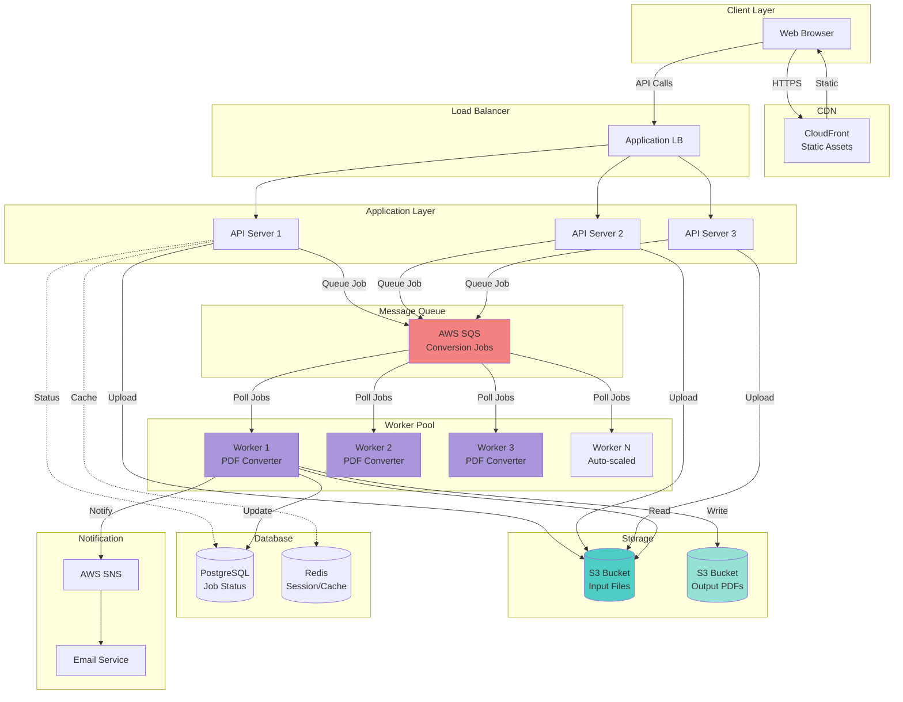

# Design PDF Converter System (like iLovePDF)

**Interview Question**: *"Design a system where users can upload documents (Word, Excel, images), convert them to PDF, and download the result. Support multiple file uploads and merge functionality."*

**Difficulty**: 🟡 Intermediate
**Asked by**: HDFC, Multiple Companies
**Time**: 45 minutes
**Type**: Real-world system design

---

## 🎯 Quick Answer (2 minutes)

**Core Components**:
1. **Upload API** → Store files in S3
2. **Message Queue** → Async job processing
3. **Worker Pool** → Convert files to PDF
4. **Notification Service** → Email/notify user when ready
5. **Download API** → Serve converted PDF

**Key Design Decisions**:
- **Async processing** (conversion takes time)
- **S3 for storage** (scalable, cheap)
- **Queue for jobs** (handle spikes, retries)
- **Workers scale horizontally** (based on queue depth)

---

## 📚 Detailed System Design

### 1. Requirements Clarification

#### Functional Requirements
✅ Upload one or multiple files (Word, Excel, PowerPoint, images)
✅ Convert to PDF
✅ Merge multiple PDFs into one
✅ Download converted PDF
✅ Email notification when ready (optional)
✅ Progress tracking

#### Non-Functional Requirements
✅ **Scale**: 10,000 conversions/day, peak: 100/minute
✅ **Availability**: 99.9% uptime
✅ **Latency**: Upload < 5s, Conversion < 30s for typical file
✅ **File size**: Max 100MB per file
✅ **Retention**: Files stored for 24 hours

#### Out of Scope
❌ User authentication
❌ Payment processing
❌ OCR (text extraction from images)
❌ Advanced PDF editing

---

### 2. Capacity Estimation

```
Conversions per day: 10,000
Average file size: 5MB
Peak load: 100 conversions/minute = 1.67/sec

Storage:
- Input files: 10,000 × 5MB = 50GB/day
- Output PDFs: 10,000 × 3MB = 30GB/day
- Total: 80GB/day × 7 days retention = 560GB

Bandwidth:
- Upload: 10,000 × 5MB / 86400s = 0.58 MB/s
- Download: 10,000 × 3MB / 86400s = 0.35 MB/s
- Peak: 100 × 5MB / 60s = 8.3 MB/s

Workers needed:
- Conversion time: ~10s average
- Peak load: 100/min
- Workers: 100 jobs/min × 10s/job / 60s = ~17 workers
- With buffer: 25-30 workers
```

---

### 3. High-Level Architecture



---

### 4. API Design

```javascript
// Upload API
POST /api/upload
Request:
{
  "files": [
    { "name": "document1.docx", "size": 1024000 },
    { "name": "document2.xlsx", "size": 512000 }
  ],
  "operation": "convert_to_pdf",  // or "merge_pdfs"
  "email": "user@example.com"     // optional
}

Response:
{
  "jobId": "job-abc-123",
  "uploadUrls": [
    {
      "fileName": "document1.docx",
      "presignedUrl": "https://s3.../document1.docx?signature=..."
    },
    {
      "fileName": "document2.xlsx",
      "presignedUrl": "https://s3.../document2.xlsx?signature=..."
    }
  ],
  "expiresIn": 300  // 5 minutes
}

// Check Status API
GET /api/jobs/:jobId

Response:
{
  "jobId": "job-abc-123",
  "status": "processing",  // queued, processing, completed, failed
  "progress": 65,
  "filesProcessed": 1,
  "totalFiles": 2,
  "createdAt": "2025-01-15T10:00:00Z",
  "completedAt": null,
  "downloadUrl": null
}

// Download API
GET /api/download/:jobId

Response: 302 Redirect to S3 presigned URL
Location: https://s3.../output-job-abc-123.pdf?signature=...
```

---

### 5. Database Schema

```sql
-- Jobs table
CREATE TABLE jobs (
  id UUID PRIMARY KEY DEFAULT gen_random_uuid(),
  status VARCHAR(20) NOT NULL,  -- queued, processing, completed, failed
  operation VARCHAR(50) NOT NULL,  -- convert_to_pdf, merge_pdfs
  email VARCHAR(255),
  total_files INT NOT NULL,
  files_processed INT DEFAULT 0,
  progress INT DEFAULT 0,
  input_s3_keys TEXT[],  -- Array of S3 keys
  output_s3_key TEXT,
  error_message TEXT,
  created_at TIMESTAMP DEFAULT NOW(),
  started_at TIMESTAMP,
  completed_at TIMESTAMP,
  expires_at TIMESTAMP DEFAULT NOW() + INTERVAL '24 hours',

  INDEX idx_status (status),
  INDEX idx_created_at (created_at),
  INDEX idx_expires_at (expires_at)
);

-- File uploads table
CREATE TABLE file_uploads (
  id UUID PRIMARY KEY DEFAULT gen_random_uuid(),
  job_id UUID REFERENCES jobs(id),
  file_name VARCHAR(255) NOT NULL,
  file_size BIGINT NOT NULL,
  mime_type VARCHAR(100),
  s3_key TEXT NOT NULL,
  uploaded_at TIMESTAMP DEFAULT NOW(),
  converted_at TIMESTAMP,

  INDEX idx_job_id (job_id)
);
```

---

### 6. Implementation

#### Upload Service

```javascript
const AWS = require('aws-sdk');
const s3 = new AWS.S3();
const sqs = new AWS.SQS();

class UploadService {
  async createJob(files, operation, email = null) {
    // 1. Create job record
    const job = await db.query(`
      INSERT INTO jobs (operation, email, total_files, status)
      VALUES ($1, $2, $3, 'queued')
      RETURNING *
    `, [operation, email, files.length]);

    const jobId = job.id;

    // 2. Generate presigned URLs for upload
    const uploadUrls = await Promise.all(
      files.map(async (file) => {
        const s3Key = `uploads/${jobId}/${file.name}`;

        // Create presigned URL (valid for 5 minutes)
        const presignedUrl = await s3.getSignedUrlPromise('putObject', {
          Bucket: process.env.S3_INPUT_BUCKET,
          Key: s3Key,
          Expires: 300,
          ContentType: file.mimeType,
          ContentLength: file.size
        });

        // Save file record
        await db.query(`
          INSERT INTO file_uploads (job_id, file_name, file_size, mime_type, s3_key)
          VALUES ($1, $2, $3, $4, $5)
        `, [jobId, file.name, file.size, file.mimeType, s3Key]);

        return {
          fileName: file.name,
          presignedUrl,
          s3Key
        };
      })
    );

    return {
      jobId,
      uploadUrls,
      expiresIn: 300
    };
  }

  async confirmUpload(jobId) {
    // Client calls this after uploading all files

    // 1. Verify all files uploaded
    const job = await db.query('SELECT * FROM jobs WHERE id = $1', [jobId]);
    const uploads = await db.query(
      'SELECT * FROM file_uploads WHERE job_id = $1',
      [jobId]
    );

    const allUploaded = await Promise.all(
      uploads.map(async (upload) => {
        try {
          await s3.headObject({
            Bucket: process.env.S3_INPUT_BUCKET,
            Key: upload.s3_key
          }).promise();
          return true;
        } catch {
          return false;
        }
      })
    );

    if (!allUploaded.every(Boolean)) {
      throw new Error('Not all files uploaded');
    }

    // 2. Queue conversion job
    await this.queueConversionJob(jobId);

    return { success: true };
  }

  async queueConversionJob(jobId) {
    // Send message to SQS
    await sqs.sendMessage({
      QueueUrl: process.env.SQS_QUEUE_URL,
      MessageBody: JSON.stringify({
        jobId,
        timestamp: Date.now()
      }),
      DelaySeconds: 0
    }).promise();

    // Update job status
    await db.query(
      'UPDATE jobs SET status = $1 WHERE id = $2',
      ['queued', jobId]
    );
  }
}
```

#### Worker Service

```javascript
const { exec } = require('child_process');
const util = require('util');
const execPromise = util.promisify(exec);

class ConversionWorker {
  async start() {
    console.log('Worker started');

    while (true) {
      try {
        // Poll SQS for jobs
        const messages = await sqs.receiveMessage({
          QueueUrl: process.env.SQS_QUEUE_URL,
          MaxNumberOfMessages: 1,
          WaitTimeSeconds: 20,  // Long polling
          VisibilityTimeout: 300  // 5 minutes to process
        }).promise();

        if (!messages.Messages || messages.Messages.length === 0) {
          continue;
        }

        const message = messages.Messages[0];
        const { jobId } = JSON.parse(message.Body);

        try {
          // Process job
          await this.processJob(jobId);

          // Delete message from queue
          await sqs.deleteMessage({
            QueueUrl: process.env.SQS_QUEUE_URL,
            ReceiptHandle: message.ReceiptHandle
          }).promise();
        } catch (error) {
          console.error(`Job ${jobId} failed:`, error);

          // Update job status
          await db.query(
            'UPDATE jobs SET status = $1, error_message = $2 WHERE id = $3',
            ['failed', error.message, jobId]
          );

          // Delete message (don't retry indefinitely)
          await sqs.deleteMessage({
            QueueUrl: process.env.SQS_QUEUE_URL,
            ReceiptHandle: message.ReceiptHandle
          }).promise();
        }
      } catch (error) {
        console.error('Worker error:', error);
        await sleep(5000);  // Wait before retrying
      }
    }
  }

  async processJob(jobId) {
    console.log(`Processing job ${jobId}`);

    // 1. Update status
    await db.query(
      'UPDATE jobs SET status = $1, started_at = NOW() WHERE id = $2',
      ['processing', jobId]
    );

    // 2. Get job details
    const job = await db.query('SELECT * FROM jobs WHERE id = $1', [jobId]);
    const files = await db.query(
      'SELECT * FROM file_uploads WHERE job_id = $1',
      [jobId]
    );

    // 3. Download files from S3
    const localFiles = await Promise.all(
      files.map(async (file) => {
        const localPath = `/tmp/${jobId}-${file.file_name}`;

        const s3Object = await s3.getObject({
          Bucket: process.env.S3_INPUT_BUCKET,
          Key: file.s3_key
        }).promise();

        await fs.writeFile(localPath, s3Object.Body);

        return { ...file, localPath };
      })
    );

    // 4. Convert to PDF
    const pdfFiles = await Promise.all(
      localFiles.map(async (file, index) => {
        const pdfPath = `/tmp/${jobId}-${index}.pdf`;

        await this.convertToPDF(file.localPath, pdfPath, file.mime_type);

        // Update progress
        const progress = Math.round(((index + 1) / localFiles.length) * 70);
        await db.query(
          'UPDATE jobs SET progress = $1, files_processed = $2 WHERE id = $3',
          [progress, index + 1, jobId]
        );

        return pdfPath;
      })
    );

    // 5. Merge PDFs if multiple files
    let finalPDF;
    if (pdfFiles.length > 1) {
      finalPDF = `/tmp/${jobId}-merged.pdf`;
      await this.mergePDFs(pdfFiles, finalPDF);

      await db.query(
        'UPDATE jobs SET progress = 90 WHERE id = $1',
        [jobId]
      );
    } else {
      finalPDF = pdfFiles[0];
    }

    // 6. Upload result to S3
    const outputKey = `outputs/${jobId}/result.pdf`;
    const fileBuffer = await fs.readFile(finalPDF);

    await s3.putObject({
      Bucket: process.env.S3_OUTPUT_BUCKET,
      Key: outputKey,
      Body: fileBuffer,
      ContentType: 'application/pdf'
    }).promise();

    // 7. Generate download URL (valid for 24 hours)
    const downloadUrl = await s3.getSignedUrlPromise('getObject', {
      Bucket: process.env.S3_OUTPUT_BUCKET,
      Key: outputKey,
      Expires: 86400  // 24 hours
    });

    // 8. Update job as completed
    await db.query(`
      UPDATE jobs
      SET status = 'completed',
          progress = 100,
          output_s3_key = $1,
          completed_at = NOW()
      WHERE id = $2
    `, [outputKey, jobId]);

    // 9. Send notification if email provided
    if (job.email) {
      await this.sendNotification(job.email, jobId, downloadUrl);
    }

    // 10. Cleanup temp files
    await Promise.all([
      ...localFiles.map(f => fs.unlink(f.localPath)),
      ...pdfFiles.map(f => fs.unlink(f)),
      finalPDF !== pdfFiles[0] ? fs.unlink(finalPDF) : Promise.resolve()
    ]);

    console.log(`Job ${jobId} completed`);
  }

  async convertToPDF(inputPath, outputPath, mimeType) {
    // Use LibreOffice for office documents
    if (mimeType.includes('word') || mimeType.includes('excel') || mimeType.includes('powerpoint')) {
      await execPromise(
        `libreoffice --headless --convert-to pdf --outdir /tmp "${inputPath}"`
      );

      // LibreOffice outputs to same directory with .pdf extension
      const generatedPDF = inputPath.replace(/\.[^.]+$/, '.pdf');
      await fs.rename(generatedPDF, outputPath);
    }
    // Use ImageMagick for images
    else if (mimeType.includes('image')) {
      await execPromise(
        `convert "${inputPath}" "${outputPath}"`
      );
    }
    else {
      throw new Error(`Unsupported file type: ${mimeType}`);
    }
  }

  async mergePDFs(pdfPaths, outputPath) {
    // Use pdftk or pdfunite
    const inputFiles = pdfPaths.join(' ');
    await execPromise(
      `pdfunite ${inputFiles} "${outputPath}"`
    );
  }

  async sendNotification(email, jobId, downloadUrl) {
    await sns.publish({
      TopicArn: process.env.SNS_TOPIC_ARN,
      Message: JSON.stringify({
        email,
        subject: 'Your PDF is ready!',
        body: `Your PDF conversion is complete. Download: ${downloadUrl}`,
        jobId
      })
    }).promise();
  }
}
```

---

### 7. Scaling Strategy

#### Horizontal Scaling

```javascript
// Auto-scaling based on queue depth
class AutoScaling {
  async checkAndScale() {
    // Get queue metrics
    const metrics = await sqs.getQueueAttributes({
      QueueUrl: process.env.SQS_QUEUE_URL,
      AttributeNames: ['ApproximateNumberOfMessages', 'ApproximateNumberOfMessagesNotVisible']
    }).promise();

    const queueDepth = parseInt(metrics.Attributes.ApproximateNumberOfMessages);
    const inProgress = parseInt(metrics.Attributes.ApproximateNumberOfMessagesNotVisible);

    // Scale up if queue depth > 50
    if (queueDepth > 50) {
      await this.scaleUp();
    }
    // Scale down if queue depth < 5
    else if (queueDepth < 5 && inProgress < 10) {
      await this.scaleDown();
    }
  }

  async scaleUp() {
    // Increase ECS task count or EC2 instances
    await ecs.updateService({
      service: 'pdf-converter-workers',
      desiredCount: currentCount + 5
    }).promise();
  }

  async scaleDown() {
    // Decrease worker count
    await ecs.updateService({
      service: 'pdf-converter-workers',
      desiredCount: Math.max(currentCount - 2, 5)  // Minimum 5 workers
    }).promise();
  }
}
```

---

### 8. Error Handling

```javascript
class ErrorHandling {
  // Malicious file detection
  async validateFile(s3Key) {
    const file = await s3.getObject({
      Bucket: process.env.S3_INPUT_BUCKET,
      Key: s3Key
    }).promise();

    // 1. Check file size
    if (file.ContentLength > 100 * 1024 * 1024) {  // 100MB
      throw new Error('File too large');
    }

    // 2. Virus scan (using ClamAV)
    const scanResult = await this.virusScan(file.Body);
    if (scanResult.infected) {
      throw new Error('Malicious file detected');
    }

    // 3. Validate file type
    const actualType = await this.detectFileType(file.Body);
    const allowedTypes = ['application/pdf', 'image/*', 'application/vnd.ms-*'];

    if (!allowedTypes.some(t => actualType.match(t))) {
      throw new Error('Invalid file type');
    }

    return true;
  }

  // Dead Letter Queue for failed jobs
  async handleFailedJob(jobId, error) {
    // Move to DLQ for manual inspection
    await sqs.sendMessage({
      QueueUrl: process.env.DLQ_URL,
      MessageBody: JSON.stringify({
        jobId,
        error: error.message,
        timestamp: Date.now()
      })
    }).promise();

    // Alert ops team
    await sns.publish({
      TopicArn: process.env.ALERT_TOPIC,
      Subject: 'PDF Conversion Failed',
      Message: `Job ${jobId} failed: ${error.message}`
    }).promise();
  }
}
```

---

## 🎓 Interview Discussion Points

### Trade-offs

| Decision | Pro | Con | Choice |
|----------|-----|-----|--------|
| Sync vs Async | Simple, immediate result | Blocks user, limited scale | **Async** (better UX + scale) |
| S3 vs Database | Cheap, scalable | Network latency | **S3** (files are large) |
| SQS vs Kafka | Simple, managed | Less features | **SQS** (sufficient for use case) |
| Polling vs Webhook | Simple | More network calls | **Polling** (standard pattern) |

### Scaling Considerations

- **Workers**: Auto-scale based on queue depth (CloudWatch alarms)
- **S3**: Infinite scale, no action needed
- **Database**: Read replicas for job status queries
- **API**: Stateless, scale horizontally behind ALB

### Cost Optimization

- **S3 Lifecycle**: Delete files after 24 hours
- **Spot instances**: Use for workers (cheaper, interruptible OK)
- **Reserved instances**: For baseline worker count
- **S3 Intelligent Tiering**: For long-term storage

---

## 🎯 Key Takeaways

1. ✅ **Async processing** - Don't block user
2. ✅ **Queue for reliability** - Handles spikes, retries
3. ✅ **S3 for files** - Scalable, cheap storage
4. ✅ **Workers scale horizontally** - Based on load
5. ✅ **Validate files** - Security (virus scan, type check)
6. ✅ **Monitor queue depth** - Key scaling metric

---

## 🔗 Related Questions

- [Design Rate Limiting](./02-rate-limiting.md)
- [Design Flash Sale System](./03-flash-sales.md)
- [Message Queue Patterns](../../07-messaging/02-kafka-failures.md)
- [S3 Best Practices](../../02-aws-cloud/03-s3-tps.md)
